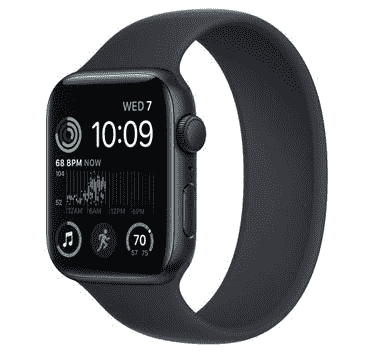

# Apple Watch 耐克版已经没有了，下面是你需要知道的

> 原文：<https://www.xda-developers.com/apple-watch-nike-no-more/>

苹果手表是市面上最好的健身追踪器之一。这个微小的设备包含许多救生功能，包括车祸检测、心电图、跌倒检测等等。更不用说它与公司其他设备的紧密集成了。上周，在其*遥远的*活动期间，库比蒂诺公司推出了[苹果手表系列 8](http://xda-developers.com/apple-watch-series-8) 以及 [iPhone 14](http://xda-developers.com/apple-iphone-14) 系列。有趣的是，Apple Watch Nike Edition 不再是一个可用的选项。以下是你需要了解的今年苹果手表系列的变化。

## 什么是 Apple Watch 耐克版？

自 Apple Watch Series 2 以来，该公司一直在每年发布的产品中包含耐克版。对于那些不熟悉它们的人来说，这些模型提供了专属的表盘和品牌表带。此外，真正的 Apple Watch 背面也会有耐克的标志。因此，除了外观方面，这些手表没有提供任何额外的功能。

既然该公司已经停止生产耐克品牌的苹果手表，它已经在硬件和软件部门做了一些调整。首先，watchOS 9 可以解锁所有手表型号上的 Nike faces。因此，即使你有一块旧的非耐克 Apple Watch，你现在也可以使用这些独家的手表表面。此外，当用户访问苹果在线商店的相应标签时，该公司会将他们重定向到 Nike bands 部分。通过这种方式，Nike Edition 的粉丝可以购买品牌表带，并将其与他们的普通手表和 Nike watch 表盘配对。

这一举措是有意义的——因为它让苹果省去了单独的雕刻和包装过程。有一个单独的线不是很实用或明智，唯一的区别是背面刻有耐克标志。该公司还停止了 Apple Watch 钛版，因为 Ultra 型号现在提供这种构建材料。

watchOS 9 不仅解锁了 Nike 的专属手表表盘。它还引入了低功耗模式和指南针回溯功能——这是苹果在 *Far Out* 活动中宣布的。该软件版本目前作为 beta 测试人员的发布候选(RC)版本提供。公众将在今天晚些时候收到他们兼容手表的最终版本。

*   <picture></picture>

    Apple Watch SE 2

    Apple Watch SE 2 遗漏了一些功能，比如心电图和 AOD，以保持其低廉的价格。

你使用耐克品牌的 Apple Watch 表带吗？为什么或为什么不？请在下面的评论区告诉我们。