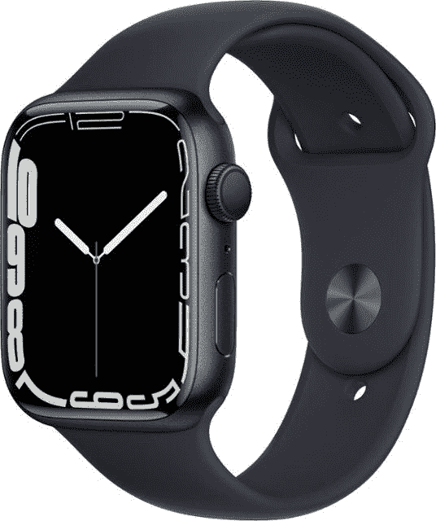
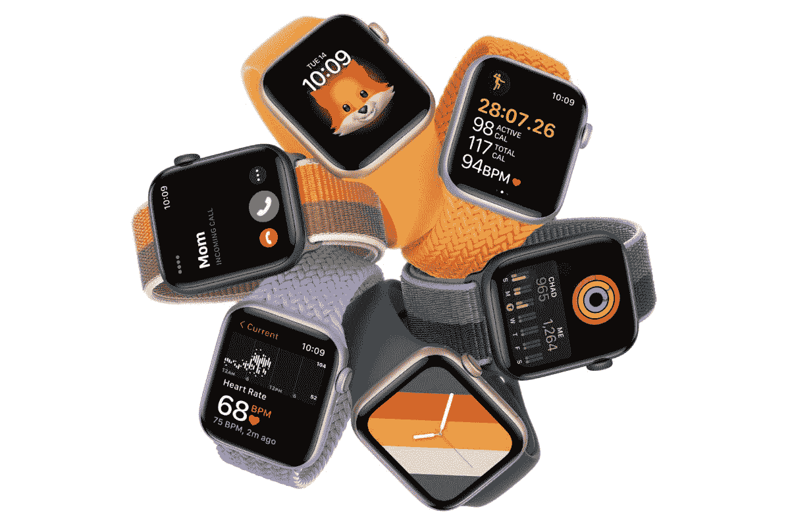

# 购买救命的 Apple Watch Series 7，节省 120 美元

> 原文：<https://www.xda-developers.com/apple-watch-prime-day-deals-2022/>

# 购买救命的 Apple Watch Series 7，节省 120 美元

在这个限时优惠期间，你可以在最新的 Apple Watch Series 7 上节省 120 美元。SE 模型也是打折的。

[亚马逊优惠日](https://www.xda-developers.com/amazon-prime-day/)已经到来，部分 Apple Watch 型号的交易也已经开始。虽然现在不是新年，但是制定关注健康的计划永远不会晚。Apple Watch 是一款很棒的设备，几乎肯定会激励你——通常是通过它的被动积极通知。但是，嘿-它工作了！正如你可能知道的，苹果产品并不经常看到明显的折扣。因此，如果你一直在考虑购买这款[优秀的健身追踪器](https://www.xda-developers.com/apple-watch-series-7-fitness/)和伴侣，现在是这么做的最佳时机。购买最新的[苹果手表系列 7](https://www.xda-developers.com/apple-watch-series-7-first-impressions/) ，你可以节省 120 美元。如果您预算紧张，SE 型号也有优惠！

## 苹果手表系列 7

与前代产品相比，这款手表的显示屏更大，边框更薄。它的电池充电速度更快，是该公司迄今为止发布的最坚固的型号。它包括心电图和血氧应用程序，可以进行相应的测量，并可以自动通知您可能患有的某些心脏相关疾病。不仅如此！这款手表还支持离线音乐播放——即使你的 iPhone 不在身边。当然，它还会向您展示围绕您的活动环的相关统计数据。

 <picture></picture> 

Apple Watch Series 7

##### 苹果手表系列 7

任何铝制 Apple Watch Series 7 都可以节省 120 美元。这包括 41 毫米和 45 毫米型号，仅 GPS 和蜂窝配置。他们的折扣通常不超过 70 美元。

## 苹果手表 SE

与 7 系列相比，SE 型号的尺寸略小。你可以在 40 毫米和 44 毫米之间选择，而不是 41 毫米和 45 毫米。此外，它没有心电图和血氧应用程序，始终显示，以及更薄的边框。尽管如此，对于那些并不真正需要上述福利或预算紧张的人来说，这是一个很好的选择。

 <picture></picture> 

Apple Watch SE

##### 苹果手表 SE

根据您选择的尺寸和配置，购买铝制 Apple Watch SE 可以节省高达 22%的费用。

* * *

Apple Watch Series 7 和 SE 都运行最新的 watchOS 8。这两款手表也将在今年晚些时候接收 watchOS 9。考虑到它们都是新款，买任何一款都是安全的——取决于你想要什么和你愿意放弃的本杰明。

*你会买哪款 Apple Watch，为什么？请在下面的评论区告诉我们。*