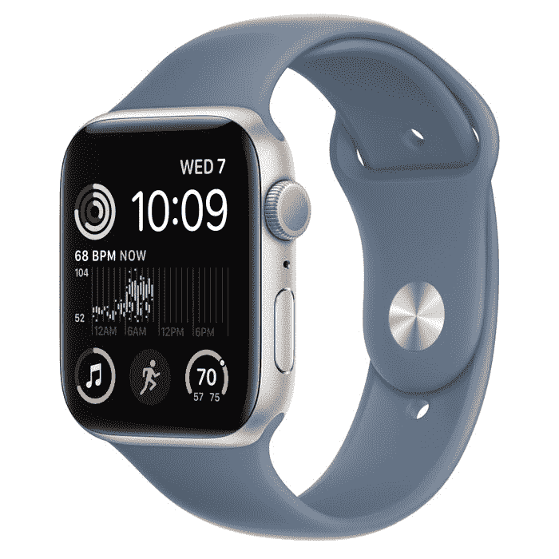

# 苹果宣布 Apple Watch SE 2 具有碰撞检测和更快的芯片

> 原文：<https://www.xda-developers.com/apple-watch-se-2-launch/>

苹果公司已经发布了 Apple Watch SE 2(正式名称为 Apple Watch SE)，这是一款更加面向预算的 Apple Watch。新型号具有从[苹果手表系列 8](https://www.xda-developers.com/apple-watch-series-8/) 借鉴的新功能，包括碰撞检测。这使得手表能够检测到你是否遭遇了潜在的车祸，并代表你联系紧急服务，包括分享你的位置。

除此之外，Apple Watch SE 2 还包括了你已经从其他 Apple Watch 设备中了解到的核心健康追踪功能。这包括低心率和高心率通知、紧急呼救和跌倒检测。Apple Pay 和睡眠跟踪等功能也是可用的。它也是防水的，所以你仍然可以在水下使用。此外，手机型号还支持国际漫游，这是苹果公司今天宣布的一项功能。

此外，Apple Watch SE 2 使用与 Series 8 型号相同的处理器，承诺比最初的 Apple Watch SE 快 20%。对于不需要大屏幕或 Apple Watch Series 8 提供的所有高级健康功能的人来说，这应该是一个很好的选择。这种模式仍然有好处，比如新的温度传感器可以帮助女性跟踪周期。

然而，显示屏并没有太大的变化，大小和以前差不多，也就是说比 Apple Watch Series 3 大 30%。

苹果还吹嘘 Apple Watch SE 2 的可持续性。表壳由 100%再生铝制成，背板经过重新设计，采用了与表壳相匹配的尼龙复合材料。苹果还改进了生产流程，减少了 80%的碳足迹。

Apple Watch SE 2 今天可以预购，它有三种颜色可供选择——银色、午夜和星光。40 毫米 GPS 型号的起价为 249 美元(44 毫米型号为 279 美元)，蜂窝型号为 299 美元(44 毫米型号为 329 美元)。价格实际上比最初的 SE 型号低 30 美元。发货将于 9 月 16 日，下周末开始。

 <picture></picture> 

Apple Watch SE 2

Apple Watch SE 2 配备了更快的处理器和碰撞检测等新功能，而且比 priginal 型号更便宜。