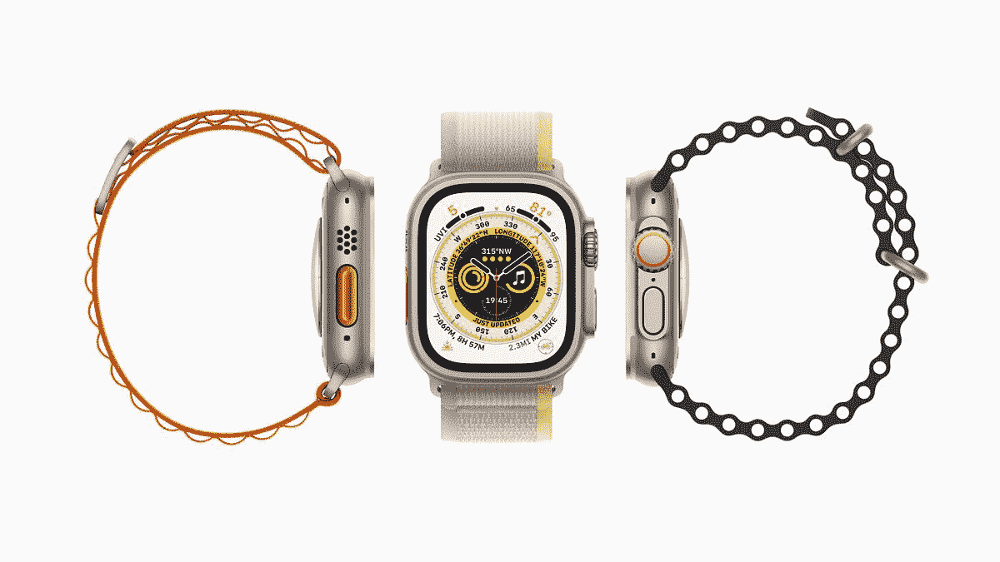

# Apple Watch Series 8 和 Apple Watch Ultra 的维修成本可能会很高

> 原文：<https://www.xda-developers.com/apple-watch-series-8-and-apple-watch-ultra-repair-costs/>

随着 [Apple Watch Series 8](https://www.xda-developers.com/apple-watch-series-8/) 的预购开始，许多人很可能会争论是坚持传统模式还是全力以赴购买 Apple Watch Ultra。799 美元的价格标签，这是一个相当大的投资，但如果它能像苹果公司声称的那样运行，这应该是一个明智的决定。无论你是要带着 Apple Watch Ultra 去深海潜水，还是去攀登最高峰，手表都有可能在某个时候损坏，看起来对 Ultra 的维修可能会非常昂贵。

*MacRumors* 的人在苹果支持网站上做了一些调查，发现了一些 Apple Watch Series 8 和 Apple Watch Ultra 的维修价格。先说 Apple Watch Series 8，因为它的维修费用似乎略低于 Apple Watch Ultra。如果你要更换 Apple Watch Series 8 的电池，它可以是任何型号，你会看到 79 美元的电池更换费。值得庆幸的是，更换 Apple Watch Ultra 的电池并不会花费太多，只要 99 美元。

现在，谈到物理损坏，价格会因型号而异，标准的 41 毫米和 45 毫米型号的服务费为 299 美元。带蜂窝功能的 Series 8 售价略高，为 349 美元，不锈钢和爱马仕型号为 399 美元。Apple Watch Ultra 的价格将略高于不锈钢和爱马仕设备，为 499 美元。请记住，所有这些物理维修的数字都只是估计值，苹果公司将在检查后确定最终的服务费。

当涉及到维修时，苹果确实提供了一些额外的服务计划。对于其 Apple Watch 设备，它提供 Apple Care Plus，这确实需要额外费用，但只要电池容量低于原始容量的 80%，就可以更换电池。该服务计划还包括物理损坏，Apple Watch Series 8 的每次维修费用为 69 美元至 79 美元，Apple Watch Ultra 的费用为 79 美元。总而言之，如果你打算粗暴对待你的设备，投资一个服务计划可能是个好主意。

如前所述，Apple Watch Series 8 和 Apple Watch Ultra 的[预购](https://www.xda-developers.com/best-apple-watch-ultra-deals/)将于明天开始。你可以点击下面的链接从亚马逊或百思买预购 Apple Watch Ultra。

 <picture></picture> 

Apple Watch Ultra

##### 苹果手表 Ultra

迄今为止最好的 Apple Watch。

* * *

**来源** : [苹果](https://support.apple.com/watch/repair)

**通过** : [MacRumors](https://www.macrumors.com/2022/09/08/apple-watch-ultra-repair-prices/?utm_source=feedly&utm_medium=webfeeds)