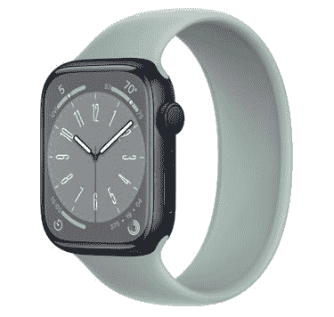

# Apple Watch Series 8 提供睡眠追踪吗？

> 原文：<https://www.xda-developers.com/apple-watch-series-8-sleep-tracking/>

苹果通过 watchOS 7 为 Apple Watch 系列增加了睡眠跟踪功能。该功能首次出现在 Apple Watch Series 6 中，但苹果在 watchOS 7 更新中将其扩展到了几款旧款机型。由于全新的 Apple Watch Series 8 配备了 watchOS 9，它提供了旧款机型上的所有睡眠跟踪功能。此外，watchOS 9 引入了睡眠阶段，为用户提供关于其睡眠模式的详细信息。

## 在 Apple Watch Series 8 上使用 watchOS 9 进行睡眠跟踪

你可以使用 Apple Watch Series 8 上的睡眠应用程序来跟踪你的睡眠。该应用程序可以让你创建放松和就寝时间表，以帮助你达到睡眠目标。当你戴着 Apple Watch 睡觉时，它还会自动跟踪你的睡眠。一旦你醒来，你可以在睡眠应用程序上查看你昨晚睡了多长时间。此外，您可以查看过去两周的睡眠趋势。Apple Watch Series 8 上的 Sleep 应用程序还提供了睡眠聚焦功能，可以限制你睡觉前的分心，并确保你不会因为不及时的通知而醒来。

 <picture></picture> 

Apple Watch Series 8

Apple Watch Series 8 提供了旧款机型所拥有的所有睡眠跟踪功能，由于 watchOS 9 的更新，还提供了更详细的睡眠洞察。

除了这些功能，Apple Watch Series 8 上的 watchOS 9 还可以提高睡眠洞察力。该功能使用手表的加速度计和心率传感器来检测你何时处于快速眼动、核心或深度睡眠状态。然后它会在睡眠应用程序中显示睡眠阶段数据。你还可以在 iPhone 上的健康应用程序中查看更多细节，如睡眠时间和睡眠时间，以及心率和呼吸频率等其他指标。

新的睡眠阶段功能使用先进的机器学习模型来检测你何时处于快速眼动、核心或深度睡眠状态。正如苹果解释的那样，*“机器学习模型是根据临床黄金标准多导睡眠图进行训练和验证的，针对可穿戴设备进行了有史以来最大和最多样化的人群研究。”*随着 watchOS 9 的更新，这项新功能将很快在旧款 Apple Watch 机型上提供。

*你打算买一块新的苹果手表吗？查看我们对符合您预算的[最佳 Apple Watch](https://www.xda-developers.com/best-apple-watch/) 和[Apple Watch Series 8](https://www.xda-developers.com/best-apple-watch-series-8-deals/)的一些优惠，以节省您的购买成本。*