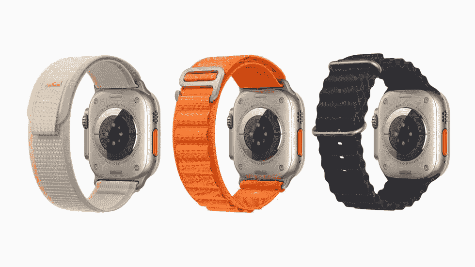

# Apple Watch Ultra:所有独家专业运动员功能

> 原文：<https://www.xda-developers.com/apple-watch-ultra-exclusive-features/>

苹果公司于 2022 年末发布了 [Apple Watch Ultra](https://www.xda-developers.com/apple-watch-ultra-review/) 和 [Apple Watch Series 8](https://www.xda-developers.com/best-apple-watch-series-8-deals/) 。这些受欢迎的新成员加入了日益壮大的[苹果手表家族](https://www.xda-developers.com/best-apple-watch/)，迎合了两种完全不同的人群——极限运动员和普通用户。Ultra variant 采用了独特的坚固设计，配有更大的平板显示器，而 Series 8 则坚持了我们多年来一直看到的熟悉机身。那么 Apple Watch Ultra 还提供了哪些独家功能呢？我们打开行李吧！

## Apple Watch Ultra 有哪些配置？

从基础开始，Apple Watch Ultra 与 Series 8 不同，它提供了单一的配置。这意味着您不能在不同的构建材料之间进行选择，例如铝和不锈钢、蜂窝兼容性或饰面。取而代之的是，你得到的是一款具有蜂窝功能的天然钛金属 Apple Watch Ultra。Apple Watch Ultra 唯一可定制的方面是它的表带。你可以选择不同的颜色和构造，这些都是为不同种类的极限运动设计的:越野环路、高山环路和海洋环路。

 <picture></picture> 

Apple Watch Ultra

从 Trail Loop 开始，这款 Apple Watch Ultra band 非常适合寻求轻便舒适的户外冒险者。它很薄，灵活，易于调节。同时，海洋乐队是为那些经常潜水或游泳的人设计的。它由轻质橡胶制成，包括一个钛扣，可在水下安全佩戴。最后，还有阿尔卑斯山环，这是由纺织织物层建造的，迎合耐力运动员的需求。三款 Apple Watch Ultra bands 都有三种不同的颜色可供选择。

## Apple Watch Ultra 的显示屏是什么样的？

说到极限运动，Apple Watch Ultra 采用了平板显示器，而不是典型的圆形显示器，这使得它更难刮擦或破裂。在这个部门，用户还可以获得更大的 49 毫米屏幕，从 45 毫米升级而来。此外，亮度峰值为 2，000 尼特，是 Series 8 的两倍，并且您可以获得一个独家的 Wayfinder 表盘。这种独家产品支持各种复杂功能，并包含全新的夜间模式，在弱光环境下更容易观看。

## Apple Watch Ultra 支持什么技术？

就这种耐用的可穿戴设备所包含的技术而言，一些关键的不同之处让它大放异彩。其中包括精密双频(L1 和 L5) GPS。Series 8 仅支持 L1 GPS 频率，因此不如 Ultra 版本精确。

否则，用户会获得大量与游泳相关的独家信息。例如，Apple Watch Ultra 的防水深度可达 100 米，比 50 米的防水深度有所提升，最大潜水深度可达 40 米。它还可以显示水的温度，可以测量你的深度，并支持 Oceanic Plus 应用程序，这基本上是一个戴在手腕上的潜水计算机。

谈到电池寿命，Apple Watch Ultra 的设计是一次充电可以持续更长时间。因此，您可以获得最长 36 小时的电池续航时间，是 Series 8 的两倍。你还可以得到一个 86 分贝的警报器，以吸引 600 英尺半径范围内人们的注意。最后，该公司已经包括了一个新的行动按钮，你可以重新映射，以执行你选择的任务或快捷方式。

##### 苹果手表 Ultra

Apple Watch Ultra 是苹果制造的最高端智能手表。它并不适合每个人，但如果你长时间在户外，是一个认真的运动员，或者只是想要终极保护，这是值得选择的手表。

Apple Watch Ultra 真正将这种可穿戴设备提升到了一个新的水平。极限运动员终于有了一个来自库比蒂诺公司的有效且有能力的选择。如果你认为 Apple Watch Ultra 太过夸张，你可以一直满足于低端选项，如 [Apple Watch Series 8](https://www.xda-developers.com/best-apple-watch-series-8-deals/) 或 [Apple Watch SE 2](https://www.xda-developers.com/best-apple-watch-se-2-deals/) ，它们包括你期望在智能手表上找到的所有必要功能。