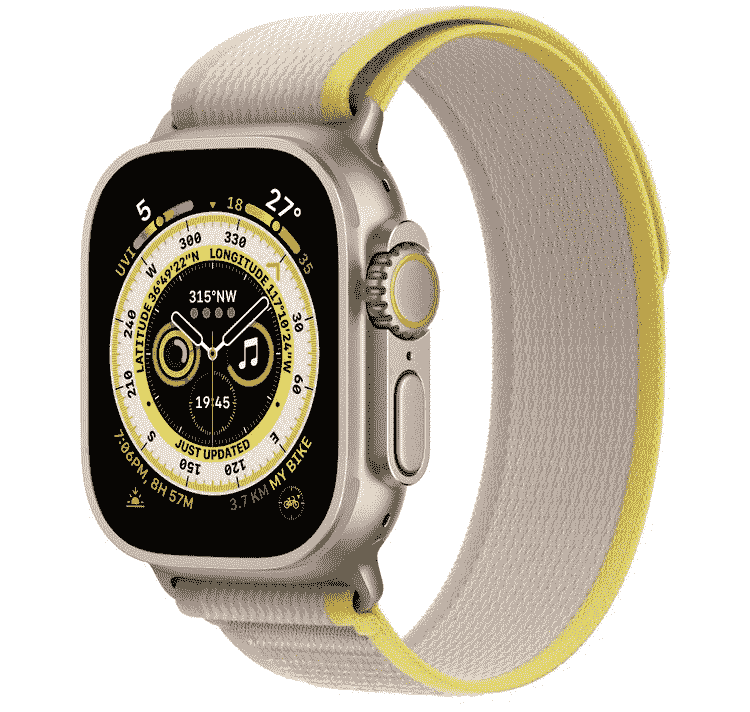

# Apple Watch Ultra 宣布推出新的加固设计、操作按钮和大量新功能

> 原文：<https://www.xda-developers.com/apple-watch-ultra-launch/>

苹果发布手表已经有很长一段时间了，该公司刚刚在其“Far Out”活动上宣布了 [Apple Watch Series 8](https://www.xda-developers.com/apple-watch-series-8/) 。然而，该公司也被传言将在某个时候推出“Ultra”或“Pro”变体，那个时候终于来了。Apple Watch Ultra 刚刚宣布，它采用了新的坚固设计，采用了蓝宝石玻璃，这是 Apple Watch 上最亮的显示屏，还有一个额外的“动作”按钮。它是为“探索、冒险和耐力”而建造的。

 <picture></picture> 

Apple Watch Ultra

##### 苹果手表 Ultra

Apple Watch Ultra 是目前功能最丰富的 Apple Watch，你可以从美国电话电报公司和百思买预购。

Apple Watch Ultra 的厚度为 49 毫米，是为最喜欢冒险的人重新设计的。由于其 2000 尼特的屏幕，它在最严酷的阳光下更容易阅读，数字表冠更大，专为戴手套使用而设计，还有第二个扬声器用于音频。有蜂窝功能，Apple Watch 中最大的电池，一次充电可长达 60 小时，可以通过旋转表冠启用夜间模式，等等。苹果正在全力以赴开发 Apple Watch Ultra，这一点也体现了出来。

*“受来自世界各地的探险家和运动员的启发，我们创造了一种全新的 Apple Watch，专为新的极端环境而设计——这是迄今为止最坚固耐用、功能最强大的 Apple Watch，”*苹果首席运营官杰夫·威廉姆斯(Jeff Williams)说。*“Apple Watch Ultra 是一款多功能工具，它让用户能够通过冒险、耐力和探索来拓展自己的边界。”*

如果你要去跑步，那么 Apple Watch Ultra 也有改进。它配备了双频 GPS(所以，L1 和 L5)更准确的全球定位系统。该公司表示，这是所有智能手表中最精确的 GPS。也可以按下动作按钮来检测健身程序的开始。有一个 86 分贝的警报器用于呼救，支持在寒冷的山区或沙漠中使用，一个重新设计的指南针应用程序支持回溯你的脚步，等等。Apple Watch Ultra 基本上拥有你能想到的智能手表的所有功能。

 <picture></picture> 

Apple Watch Ultra

Apple Watch Ultra 配备了 watchOS 9，包括新的高级跑步指标来衡量性能，如步幅、地面接触时间、垂直摆动和跑步动力。转动数字表冠将显示一个额外的视图，包括纬度、经度、海拔和倾斜度，以及一个显示指南针航路点和原路返回的定向视图。

今天开放预购，价格为 799 美元，该设备将于 9 月 23 日开始发货。有三个波段可用-阿尔卑斯山环，小径环，海洋波段。