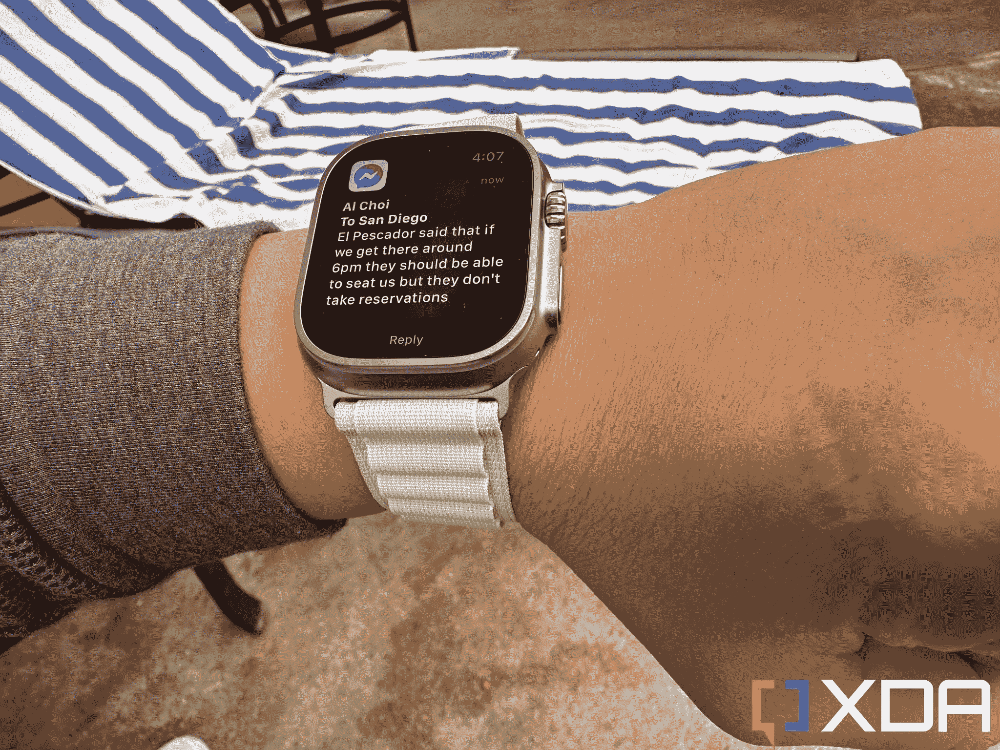

# Apple Watch Ultra:Apple Watch 有史以来最好的屏幕和电池寿命

> 原文：<https://www.xda-developers.com/apple-watch-ultra-review/>

苹果的新手表 Ultra 是一款最大的可穿戴设备，具有新的功能，旨在让登山运动员、深海潜水员、耐力运动运动员以及一般不会整天呆在笔记本电脑屏幕前的人的生活更轻松。我不是这些东西中的任何一个，但即使作为一个半活跃的都市人，我也能看到 Apple Watch Ultra 的吸引力——它有一个更大、更亮的屏幕，即使从远处或在最强烈的阳光下也更容易阅读；它的构造就像一辆坦克，所以当我的手腕不小心撞到桌子边缘和车门时，我不会紧张；而且电池寿命要长得多——足以让我在周末旅行时带上它，而不需要带充电器。

这些功能的价值是标准苹果手表价格的两倍吗？苹果手表 Ultra 的起价是 799 美元。只有你能打那个电话。

苹果的新手表 Ultra 是一款最大的可穿戴设备，具有新的功能，旨在让登山运动员、深海潜水员、耐力运动运动员以及一般不会整天呆在笔记本电脑屏幕前的人的生活更轻松。我不是这些人，但即使作为一个半活跃的都市人，我也能看到 Apple Watch Ultra 的吸引力。它有一个更大、更亮的屏幕，即使从远处或者在最强烈的阳光下也更容易阅读；它的构造就像一辆坦克，所以当我的手腕不小心撞到桌子边缘和车门时，我不会紧张；而且电池寿命要长得多——足以让我在周末旅行时带上它，而不需要带充电器。

这些功能值得*将价格*——Apple Watch Ultra 起价 799 美元——提高一倍于标准 Apple Watch 的价格吗？只有你能打那个电话。

## Apple Watch Ultra:价格和可用性

Apple Watch Ultra 只有一种尺寸，49 毫米，价格只有 799 美元。它现在在苹果在线商店和第三方零售商如亚马逊、百思买和无数其他在线商店出售。

##### 苹果手表 Ultra

Apple Watch Ultra 是苹果有史以来最大、功能最强的智能手表。虽然它是为极限运动运动员和户外冒险家设计的，但对于想要一款屏幕更大、电池续航时间更长的智能手表的临时用户来说，它仍然是一个绝佳的选择。

**Brand**

Apple

**Operating System**

watchOS

**SIM Support**

eSIM

**Case Material**

Titanium

**Sizes**

49mm

**Colors**

Silver

**Display**

1.9-inch AMOLED, Sapphire crystal glass face

**CPU**

Apple S8

**Battery**

542mAh

**Health sensors**

Compass, altimeter, optical heart rate sensor, accelerometer, gyroscope, temperature

**Price**

$799

**Dimensions**

49x44x14.4mm

**Weight**

61g

***关于这篇评测:*** *这篇评测是使用 XDA 购买的 Apple Watch Ultra 两周之后写的。苹果在这篇文章中没有投入。*

## 设计和硬件:一个大的新按钮等等

*   更大的 49 毫米钛金属表壳，配有由凸缘保护的平板屏幕
*   电池可持续使用 2-3 天
*   双频 GPS 和三个麦克风

Apple Watch Ultra 是一款又大又笨重的智能手表，49 毫米的外壳即使对于我的普通大小的手腕来说也显得有点大，对于我女朋友更瘦的手腕来说更是大得吓人。外壳的主框架由一体式钛制成，感觉优质而坚固，两侧抬高以包裹屏幕，这是以前的苹果手表所没有的。这也是因为屏幕完全是平的，而不是像标准的 Apple Watch 屏幕那样稍微向下弯曲。

Apple Watch Ultra 是否太大？我被撕裂了。这款手表实际上比我预期的要轻，只有 61 克，但它 14.4 毫米的厚度确实意味着它可以在穿/脱夹克或长袖衬衫时碍事。事实上，在一场篮球比赛中，我因为在手腕上戴着这么笨重的设备而受到了对手的责骂(他的手臂在试图防守时不小心擦伤了我手表的半锋利边缘)。我以前戴过苹果手表打篮球，从来没有遇到过这个问题。

典型的 Apple Watch 可旋转表冠和侧按钮仍然在右侧，但两者都受到一个突出的外壳的保护。这解决了我对以前的苹果手表的一个抱怨:当我做俯卧撑时，我的手腕后部有时会不小心压到表冠或按钮。这种情况不会再发生了——至少对于这些特定的按钮。

但在外壳的左侧有一个新按钮，一个巨大的橙色按钮，称为“操作按钮”，当我试图访问数字表冠时，我总是不小心按下它。我想这是因为我习惯把拇指放在手表的左侧，作为我食指可以产生力量的支点。这是我必须改掉的习惯。

动作按钮做它所建议的:一个按键立即启动一个特定的活动。默认情况下，它会开始跟踪锻炼，但它可以定制为启动手电筒、秒表或“快捷方式”(稍后会有更多内容)。这个按钮应该便于运动员在活动中使用。例如，铁人三项运动员可以使用该按钮切换到锻炼的下一站。跑步者可以使用该按钮来标记他们的跑步片段。潜水员可以按下一个物理按钮，而不是触摸屏。

对于我们这些不是竞技运动员的人来说，动作按钮启动快捷方式的能力很方便。Shortcuts 是一个 iOS 应用程序，它会执行它所暗示的内容，并立即启动特定的操作。这可能是给联系人发短信，开始语音备忘录，或者智能家居自动化。我主要用它来启动 Shazam，以快速识别附近播放的音乐。

长按动作按钮三秒钟也会启动紧急菜单；持续按住 5 秒钟以触发警报器(由于外壳侧面的大型扬声器，警报器发出的声音响亮而清晰)。这后一个特征在需要的时候可能是救命稻草。

LTPO·有机发光二极管的显示屏绝对华丽，泵出充满活力的色彩，达到 2000 尼特的峰值亮度，比 Apple Watch Series 8 屏幕亮两倍)。401 x 502 的分辨率仍然具有足够的像素密度，在 Ultra 显示器上显示得更大的文本仍然足够清晰。较大的文本允许我在驾驶时把手放在方向盘上或骑自行车时阅读导航说明或收到的松弛信息。对于其他智能手表，我通常需要用手将手表靠近面部来阅读文本。

Apple Watch Ultra 的陶瓷背面装有常见的传感器:电子心脏传感器、血氧传感器、环境光传感器和陀螺仪。系列 8 和 Ultra 中的新功能是高 g 加速度计(用于检测车祸)和皮肤温度传感器。Ultra 还有一个额外的水温传感器，这是任何其他 Apple Watch 都没有的。

这些传感器可以做很多事情，包括帮助潜水员跟踪水深、温度和水下距离。WR100 等级意味着手表可以在水下 328 英尺(100 米)的地方工作。我在开始时已经提到过，我不够积极或冒险，无法利用所有的新功能，但它们确实可以通过我的测试非常准确地跟踪我的步数、海拔、骑行时间和距离、心率和睡眠。我将在性能部分详细阐述这一点。

更大的电池和更新的芯片也使 Ultra 拥有迄今为止所有 Apple Watch 中最好的电池寿命。

为手表提供动力的是新的 S8 芯片，它有助于 UI 快速移动。即使有十几个应用程序在后台打开，我也可以跳回到我打开的第一个应用程序，并立即启动它。不需要像许多 WearOS 或三星手表那样等待一秒(或三秒)就能启动应用程序。

更大的电池和更新的芯片也使 Ultra 拥有迄今为止所有 Apple Watch 中最好的电池寿命。苹果公司宣传电池寿命为 36 小时，但我已经能够在一次充电后达到 48 小时以上。我周末去圣地亚哥旅行时带了 Ultra，没有带充电器。我周五午饭后开始了我的旅行，到周日晚上晚餐时间，手表仍有 18%的电池寿命。平心而论，我在那个周末没有做任何练习，所以我并没有真正推动手表的能力。尽管如此，对于智能手表来说，周末休闲旅行不需要带充电器是很棒的，也是相当令人印象深刻的。

手表的表耳与典型的苹果手表相同，因此任何现有的[苹果手表表带](https://www.xda-developers.com/best-apple-watch-bands/)都可以与 Ultra 配合使用。Ultra 本身有三个特定的波段:阿尔卑斯山环(这是我正在测试的一个)，小径环，或海洋波段。Alpine loop 很有趣:它由柔软的织物制成，带有单独的缝入环，金属夹放入其中。我发现这比非 Ultra 手表附带的典型乙烯基 Apple Watch 表带更适合我的手腕。

## 软件和功能:适合喜欢冒险和运动的人

*   WatchOS 9 带来了更多健康和健身功能
*   新的回溯功能对徒步旅行甚至漫游新城市非常有用
*   与其他苹果产品配合良好

Apple Watch Ultra 运行 [WatchOS 9](https://www.xda-developers.com/watchos-9/) ，带来了进一步的健康和安全功能，包括药物跟踪、车祸检测和一个新的指南针应用程序。后者包括一个新的回溯功能，创建一个虚拟的面包屑，映射您的确切步骤和坐标。因此，如果你在徒步旅行中迷路了，你总是可以原路返回到出发点。我经常独自旅行，喜欢在一个没有确切目的地的城市里闲逛，所以如果我迷路了，我可以看到回溯派上用场。

为了利用新的指南针应用程序，苹果设计了一款名为“Wayfinder”的手表超独家表盘，显示指南针，两侧有八个复杂功能。如果转动表冠，表盘会变成深红色，以提高黑暗环境下的可见度。

### 健身和健康跟踪

Apple Watch Ultra 和以前的 Apple Watch 一样，可以自动检测一些锻炼，包括散步和骑自行车。但是，对于健身课程，您仍然需要手动选择锻炼类型。我发现 Apple Watch Ultra 始终能识别我的自行车骑行，而[的谷歌 Pixel Watch](https://www.xda-developers.com/google-pixel-watch-review/) 却不能。我可以在苹果健康应用程序中检查我骑行的距离和我的心脏有多努力。

温度传感器现在只是用来帮助跟踪排卵周期。它不像其他智能手表那样试图检测发烧等一般健康问题。由于显而易见的原因，我没有测试过汽车碰撞检测，它使用高 g 力加速度计来感应极端的加速度或减速度。

现有的 Apple Watch 健康功能，如进行 EKG(心电图)的能力，仍然非常好。然而，睡眠跟踪是偶然的。一部分是软件；Apple Watch 并不总是能检测到我的睡眠，即使我整晚都戴着它，水平躺着，显然睡着了。苹果手表 7 的情况也是如此，所以这不是一个新问题。但 Ultra 作为睡眠追踪器更不切实际，因为它太笨重了。当我在睡眠中调整我的身体时，它妨碍了我。

### 作为普通智能手表

在其他地方，Apple Watch Ultra 作为一款普通的智能手表做得很好，当然，它与苹果产品配合得很好。我将要列出的这些功能并不新鲜，但它们让使用 Apple Watch 成为一种愉快的体验。我喜欢在手腕上记录语音备忘录的功能，这种备忘录可以在我的 MacBook、iPhone 或 iPad 上显示。更重要的是，Apple Watch(不仅仅是 Ultra，所有的都是)在接收和回复短信方面非常棒，包括 Slack 消息。我一天可能会收到 100 多条信息，能够通过语音听写或文本输入来阅读和回复，直接让我不用掏出手机。

## 一般性能:将手表用作电话时

*   这是一种无需电话就能沟通的捷径
*   低功耗模式为已经很好的电池寿命增加了更多的耐久性
*   电话在两端听起来都很棒

Apple Watch Ultra 具有出色的制造质量——几天前我将手表从站立高度摔落在混凝土地面上，它没有留下划痕或痕迹——更长的电池寿命，以及与整个苹果生态系统配合良好的优秀软件，提供了一种精致优雅的日常体验。我喜欢在开车时能够接收和回复信息，甚至接听电话，而不需要把手从方向盘上拿开。三个麦克风和苹果的软件算法在隔离我的声音方面做得很好。电话那头的那一方说，即使我开着车，把车窗放下，手表离我的脸只有 18 英寸，她也能清楚地听到我的声音。由于有扩音器，我也能清楚地听到对方的声音。

另一个值得称赞的小触摸是触觉，它精确、牢固，明显优于 Pixel Watch 或 [Galaxy Watch 5 Pro 的](https://www.xda-developers.com/samsung-galaxy-watch-5-pro-review/)触觉。每当我开车和导航时，Apple Watch Ultra 都会给我的手腕一个强烈的脉冲，让我知道我必须转弯或离开高速公路。

我之前已经提到过，Apple Watch 的电池寿命很长，但也有一种低功耗模式，当打开时，电池寿命可以达到 60 小时。低功耗模式确实会更频繁地关闭屏幕，并停止主动检查你的心率，但 Apple Watch Ultra 仍然保持功能。

## 你应该买 Apple Watch Ultra 吗？

**你应该买 Apple Watch Ultra 如果:**

*   你想要一块更坚固耐用的 Apple Watch
*   你想要一款智能手表，可以处理水下深处或高山上的情况
*   你是一名 iPhone 用户，想要一款全能智能手表
*   价格不是问题

**你不应该买 Apple Watch Ultra 如果:**

*   你已经拥有 Apple Watch 6、7 或 8，并且对性能没有任何抱怨
*   你不喜欢又大又笨重的手表
*   你不会想花 799 美元买一块智能手表

我不是 Apple Watch Ultra 的真正目标受众，所以这篇评论是从一个普通用户的角度来看的。对我来说，Apple Watch Ultra 就是 Apple Watch 7 或 8，它有更大、更好的屏幕、更长的电池寿命和更坚固的结构。光是这些东西就让 Apple Watch Ultra 成为有史以来最好的 Apple Watch，我想戴 Apple Watch Ultra 胜过 Apple Watch 8。

但是我不需要自己掏钱买 Ultra 我工作的公司有。我会自掏腰包花双倍的价格去买苹果手表 8 的 Ultra 吗？我不会，因为我不能利用所有的好处。大多数人如果正在寻找新的 Apple Watch，最好购买 Apple Watch 8。Apple Watch 8 也有很多优惠活动，所以对大多数消费者来说，这是一个更容易的切入点。

*Apple Watch Ultra 是有史以来最好的 Apple Watch。*

但如果你经常在水下，在森林里徒步旅行，参加越野跑或爬山，Apple Watch Ultra 应该很有吸引力。当然，Garmin 或 Polar 等品牌也有令人惊叹的智能手表，但 Apple Watch Ultra 比其他品牌有更强的品牌认知度、软件支持和硬件生态系统。

##### 苹果手表 Ultra

Apple Watch Ultra 是有史以来最好的 Apple Watch，但它很贵，大多数消费者实际上不会利用它的新功能。