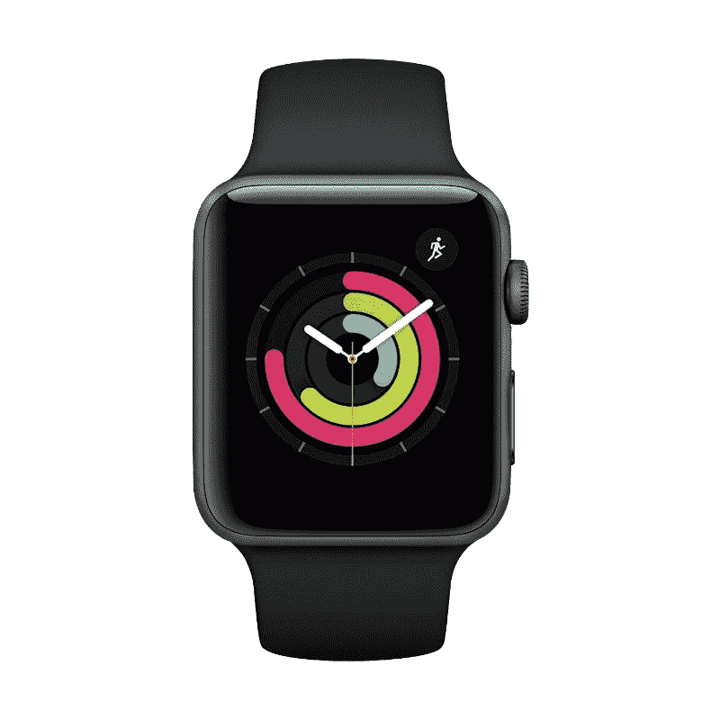

# 在百思买的苹果大减价期间，苹果手表便宜多了

> 原文：<https://www.xda-developers.com/apple-watches-best-buy-apple-sale-2022/>

BestBuy 刚刚开始了它的大型苹果销售，虽然你可以以更低的价格买到新的 [iPhone](https://www.xda-developers.com/best-buy-apple-shopping-event-iphone/) 或 [AirPods](https://www.xda-developers.com/best-buy-apple-shopping-event-airpods/) ，但事实证明你也可以以更低的价格买到苹果手表。也有一些全面的大折扣，所以如果你想买一堆新的苹果产品，现在是最好的时机。不过，你得赶快行动，因为这些优惠活动只在整个周末有效！这些是你目前能买到的一些[最好的苹果手表交易](https://www.xda-developers.com/best-apple-watch/)。

 <picture></picture> 

Titanium Apple Watch Series 7

##### 苹果手表系列 7

Apple Watch Series 7 41mm 是最新 Apple Watch 的基础款，绝对不会错，尤其是 329.99 美元。

 <picture></picture> 

Apple Watch Series 7

##### 苹果手表系列 7

想再大一点吗？取而代之的是 45 毫米的 Apple Watch Series 7——在一个更大的外壳中拥有同样出色的功能！更棒的是，你可以花 359.99 美元买到这个。

 <picture></picture> 

Apple Watch SE 40mm

如果你希望节省一些现金，并且不需要所有的花里胡哨，那么 249.99 美元的 Apple Watch SE 可能是你更好的选择。

 <picture></picture> 

Apple Watch SE 40mm

如果你希望节省一些现金，不需要所有的花里胡哨，而是想要一个稍微大一点的外形，那么 279.99 美元的 Apple Watch SE 44mm 毫米可能是你更好的选择。

 <picture></picture> 

Apple Watch Series 3 38mm

##### 苹果手表系列 3

如果你只是想要一款基本款的 Apple Watch，那么 Apple Watch Series 3 绝对不会错。它很旧，但也更小，而且便宜很多，只要 169 美元。

 <picture></picture> 

Apple Watch Series 3 38mm

##### 苹果手表系列 3

如果你只是想要一款基本款的 Apple Watch，那么 Apple Watch Series 3 绝对不会错。它是旧的，但是它也便宜 199 美元。

如果你不确定该买哪个，那么 [Apple Watch Series 7](https://www.xda-developers.com/apple-watch-7/) 无疑是你今天能买到的最好的 Apple Watch。Series 7 屏幕比上一代产品大 20%，看起来非常棒。随着 WatchOS 9 的到来，玩苹果新的基于手表的操作系统将是一种有趣的方式。这款智能手表还提供您期望的健康和健身功能，如心率跟踪和血氧水平。然而，Series 7 的许多功能都可以通过手表 SE 实现，这是我们的超值之选。你不会得到一个永远在线的显示器，血氧监测支持，以及手表 SE 的心电图硬件，而且 Series 7 也比手表 SE 更快，支持更快的充电。

如果你买不起或不想花太多钱买智能手表，Apple Watch Series 3 是你最好的选择。如果你想知道 Series 4 和 Series 5，这两款智能手表都已经被苹果停产了。你可能会在这里或那里发现一些奇怪的清单，但该公司并没有正式出售它们。手表 SE 其实就是那两代的换代产品。

3 系本来是 2017 年 9 月推出的，所以也算比较老了。然而，对于 iPhone 用户来说，由于其适中的价格，它是最划算的智能手表。对于 Series 3，您可以获得许多与 Series 7 和 Watch SE 相同的功能，如 50 米深的防水性、能够检测不规则节律的心率传感器、Ion-x 玻璃显示屏和 GPS。它还支持 Apple Pay 以及 18 小时的电池寿命。

如果你最终得到了一只苹果手表，请在评论中告诉我们。