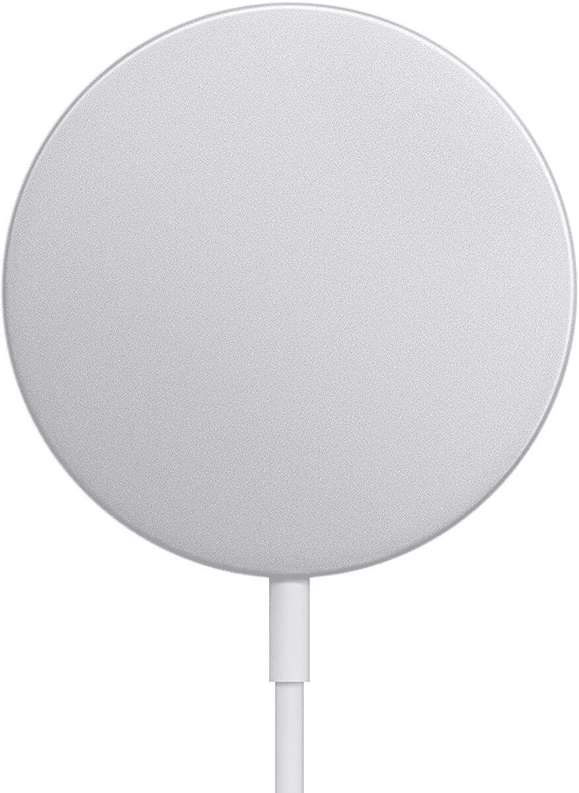
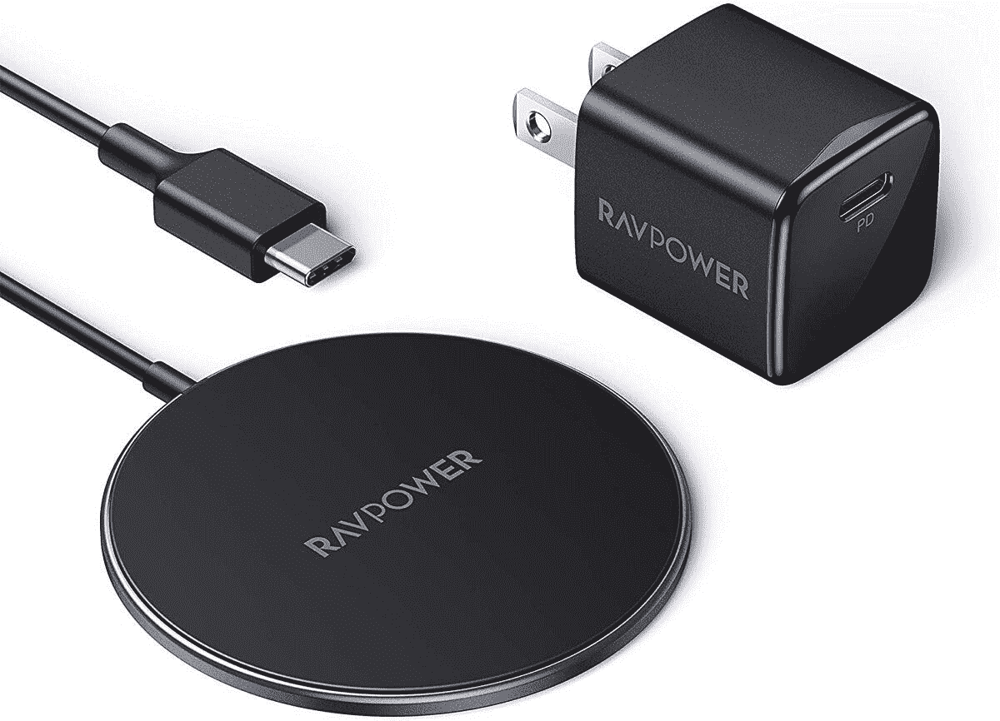

# MagSafe 充电器交易:苹果官方充电器比以往任何时候都便宜

> 原文：<https://www.xda-developers.com/apples-official-magsafe-charger-is-on-sale-for-its-lowest-price-ever/>

# 苹果官方 MagSafe 充电器以有史以来的最低价格发售

苹果的第一方 MagSafe 充电器比通常价格低了 4 美元。还有一个第三方选项，价格更低。

苹果在 iPhone 12 系列的同时推出了新的 [MagSafe](https://www.xda-developers.com/tag/magsafe/) 充电系统，作为老化的 Lightning 连接器的替代品。这是一个标准的无线充电板，但增加了磁铁，以保持与手机的牢固连接——即使在垂直放置时。苹果的第三方 MagSafe 充电器现在在亚马逊上已经降到了 29.85 美元，这是有记录以来的最低价格，RAVPower 的第三方选项也以更低的价格出售。

MagSafe 官方充电器首次发布时为 39 美元，但最近，这款充电器的售价约为 34 美元。这使得目前的销售实际上是 4 美元的折扣，但这也是我们见过的适配器的最低价格。MagSafe 最适合 iPhone 12，但也兼容其他支持无线充电的 iPhone(11 系列、XS/XR/X、8 系列、iPhone SE 第二代等。).mag safe[也兼容一些 Android 设备](https://www.xda-developers.com/apple-iphone-12-magsafe-wireless-charger-android-devices/)，但是充电速度会受到限制。

 <picture></picture> 

Apple MagSafe Charger

##### 苹果 MagSafe 充电器

这款无线充电器专为 iPhones 设计。然而，你需要将它与 USB Type-C 墙壁适配器(单独出售)配对，以获得最快的 20W 速度。

 <picture></picture> 

RAVPower Magnetic Wireless Charger

##### RAVPower 磁性无线充电器

RAVPower 的 MagSafe 充电器可以达到与苹果官方充电器相同的速度，但配有 20W 电源适配器。双赢。

苹果交易的唯一问题是，达到最快速度所需的 20W USB Type-C 墙壁适配器不包括在 MagSafe 的包装盒中。如果你还没有兼容的墙上适配器，上面链接的 RAVPower 替代品可能是一个更好的选择——它可以达到与苹果官方充电器相同的速度，并配有墙上适配器。3 英尺版本目前仅售 17.38 美元，还有一个扩展的 5 英尺版本。