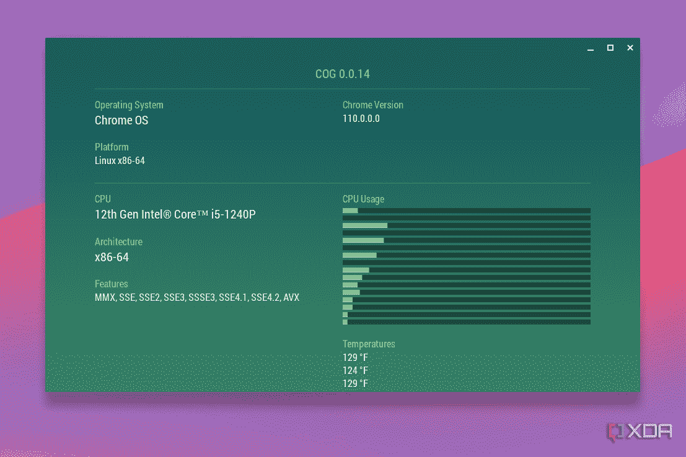

# 你应该在 Chromebook 上使用的 5 款应用

> 原文：<https://www.xda-developers.com/apps-should-use-chromebook/>

无论你是刚刚购买了一台新的 Chromebook 来远离 Windows 笔记本电脑，还是只是 ChromeOS 的粉丝，我们都有一条建议:你不必一直使用谷歌 Chrome。

ChromeOS 实际上是许多伟大应用的家园，这些应用可以增强 Chromebook 的日常使用，包括 [Android 应用](https://www.xda-developers.com/android-apps-chrome-os/)，Linux 应用和渐进式网络应用。然而，我认为有五个应用程序可以影响你的 Chromebook 体验，其中一些我几乎每天都在使用。

## 1.Cog-系统信息查看器

作为一个以评论笔记本电脑为生的人，我喜欢深入了解 Chromebook 的细节以及它的运行情况。我喜欢看到我的 CPU 是如何使用的，它的温度，以及电池是如何放电的。我甚至喜欢查看显示信息，显示刷新率等等。

查看所有这些的一个好方法是 Cog-系统信息查看器。这是一个传统的 Chrome Web 应用，轻量级且高效。它以一种容易理解的方式从你的 Chromebook 中提取系统 API，比如 CPU 使用图表，这让我想起了 Windows 上的任务管理器。它不像其他应用程序那样深入，但它会以一种清晰的方式向你展示你需要的一切。

[下载 Cog-系统信息查看器](https://chrome.google.com/webstore/detail/cog-system-info-viewer/difcjdggkffcfgcfconafogflmmaadco?hl=en)

## 2.瘸子

Chromebooks 的伟大之处在于，你可以在 ChromeOS 上运行 Linux 图形用户界面(GUI)应用程序。我最喜欢的 Chromebooks 的 Linux GPU 应用程序之一是 GIMP，这是一个类似于 Photoshop 的图像处理程序，你可以编辑图像，创建设计等等。最棒的是，它是免费的。

安装这个应用程序需要你首先在 Chromebook 上启用 Linux 功能，然后在企鹅终端输入命令，但是一旦启动并运行，你会爱上它的。我经常用它来提高我在 XDA 评论中使用的照片的质量。如果你想安装 GIMP，使用下面的终端指令。

```
sudo apt install gimp
```

## 3.速写本

我的收藏中有很多很棒的 Chromebook，但我最喜欢的是三星 Galaxy Chromebook，因为它有令人印象深刻的 4K 分辨率有机发光二极管显示屏，非常适合绘图。现在，我算不上什么艺术家，但我喜欢偶尔涂鸦。我相信有很多人想在像联想 Chromebook Duet 5 这样的[伟大的 ChromeOS 平板电脑](https://www.xda-developers.com/best-chrome-os-tablets/)上这样做，Sketchbook 是一个伟大的 Android 应用程序，可以满足这种涂鸦的冲动。该应用程序有许多类型的画笔，结合正确的手写笔，感觉就像在纸上画草图。

## 4.Chrome 远程桌面

尽管我大部分时间都在使用 Chromebook，但我仍然喜欢使用 Windows。虽然存在 Parallels Desktop for ChromeOS，但没有真正的(免费)解决方案可以在 Chromebook 上运行 Windows，但我发现最好的方法是将远程桌面集成到我的众多 PC 中的一台。Chrome Remote Desktop 应用程序让这一切变得简单。

[设置 Chrome 远程桌面](http://www.xda-developers.com/how-remote-desktop-chromebook/)非常简单。当你连接到一个坚固的网络时，它可以顺利工作，甚至可以调整你的远程会话以适应你的 Chromebooks 的屏幕。要开始使用这个 web 应用程序，您只需访问下面的链接，并按照屏幕上的步骤进行操作。

## 5.发光融合

这最后一个应用程序标价 30 美元，但如果你是一个有 YouTube 频道的创造性 Chromebook 用户，它绝对值得一试。我说的是 LumaFusion，一个针对 ChromeOS 优化的视频编辑器。

我最近把它下载到我的 Chromebook 上时，我对它非常满意。该界面针对所有 Chromebooks 进行了优化，感觉就像 MacBook 上的 iMovie 或 Windows 上的 Wondershare Filmora。该应用程序还具有高级功能，如添加效果和标题、分割剪辑等。查看上面视频中应用程序的现场演示，并通过下面的链接下载。

虽然我可以推荐更多的应用程序，比如用于游戏的 Steam(尽管你必须将 Chromebook 切换到测试频道)，用于跟踪重要笔记的 Evernote，甚至是像 Microsoft Edge 这样的替代浏览器，但这些都是你应该在你的设备上运行的顶级应用程序。该平台已经发展成为不仅仅是一个网络浏览器，如果你需要在 Chromebook 上完成一项特定的任务，很可能有一个应用程序适合你。