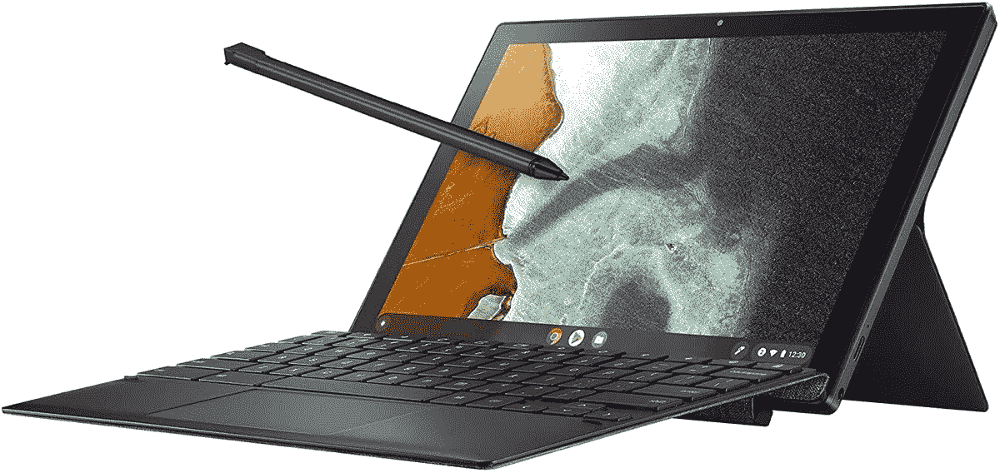

# 立即购买华硕 CM3 Chromebook 平板电脑，仅需 270 美元(优惠 100 美元)

> 原文：<https://www.xda-developers.com/asus-chromebook-cm3-deal-decmeber-2021/>

华硕销售了很多 Chromebooks，但大多数都是传统的笔记本电脑或二合一机型。CM3 首先是一款平板电脑，内置支架和可拆卸键盘，就像微软 Surface Pro 和其他专注于生产力的平板电脑一样。现在你可以以 269.99 美元的价格获得华硕 Chromebook CM3，比通常的价格优惠 100 美元。

这款 Chromebook 拥有 10.5 英寸的触摸屏显示器，64GB 的内部存储，4GB 的 RAM，以及支持一切的联发科 8183 芯片组。有一个集成的支架，可以纵向或横向支撑平板电脑，使其成为从打印文件到纵向视频通话聊天的完美选择。包括可拆卸的键盘盖，以及停靠在平板电脑内部的 UBI 触控笔。这是一个不到 300 美元的令人印象深刻的包装，即使屏幕周围的边框比 iPad Air 或其他高端平板电脑更大。

 <picture></picture> 

Asus Chromebook CM3

##### 华硕 Chromebook Flip CM3

这款平板电脑运行 Chrome OS，内置手写笔。

联发科 8183 肯定是一个预算芯片组，所以如果你想同时在内存中保留 20 个 Chrome 标签(特别是当搭配 4GB RAM 时)，这可能不是最佳选择，但它非常适合轻型生产力和媒体流。你还可以通过 Play Store 访问大多数 Android 应用和游戏。谷歌表示，华硕 Chromebook CM3 最早将在 2028 年 6 月之前继续获得 Chrome OS 升级，因此这款平板电脑应该在未来几年保持安全和更新。

如果这不是你的 Chrome OS 设备，看看我们的[最佳 Chrome book](https://www.xda-developers.com/best-chromebooks/)综述。我们收集了所有价格范围内的一些顶级选项，包括普通笔记本电脑、2 合 1 敞篷机型等。我们也有一个更全面的[最佳笔记本电脑](https://www.xda-developers.com/best-laptops/)的汇总，有来自戴尔、惠普、联想、微软和其他制造商的选项。