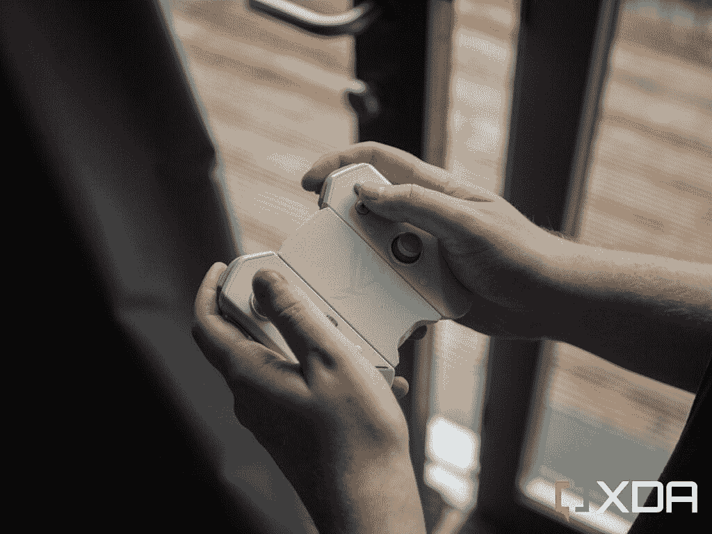

# 华硕 Kunai 3 游戏手柄评论:在 ROG 手机上玩游戏的绝佳配件

> 原文：<https://www.xda-developers.com/asus-kunai-3-gamepad-review/>

Android 上有如此多的[优秀游戏，随着我们的智能手机如今成为计算引擎，你永远不会在玩什么的选择上卡住。从 Play Store 上的游戏到](https://www.xda-developers.com/best-android-games/) [AetherSX2](https://www.xda-developers.com/aethersx2-playstation-emulator/) 等模拟器，你既可以玩新游戏，也可以玩经典游戏。然而，挑剔的触摸控制使得你的手机不一定是玩游戏最*舒适的*。你可以为手机购买[控制器，尽管这让它变得更简单，华硕 Kunai 3 游戏手柄就是这样一个控制器。](https://www.xda-developers.com/best-android-game-controllers/)

华硕 Kunai 3 游戏手柄与华硕 ROG 手机 6 Pro 一起推出白色[，尽管控制器本身已经推出很长时间了。如果你有一部 ROG 手机，你可以买一个外壳，让你可以把手机插在控制器的两端，有点像任天堂 Switch。如果你不这样做，控制器仍然可以完全脱离手机使用，并通过蓝牙工作。虽然我看到一些人说它可以在 PC 上工作，但我无法让它工作。](https://www.xda-developers.com/asus-rog-phone-6-pro-review/)

长话短说，当你有华硕 ROG 手机配合使用时，华硕 Kunai 3 游戏手柄非常好用。当你可以通过将控制器连接到手机外壳来使用控制器时，这就是它的最佳状态。否则，即使 Kunai 3 非常好，如果你有另一部手机，你也可以获得其他更好的控制器。无线使用就不一样了，你还需要用东西支撑你的手机。

 <picture></picture> 

Asus Kunai 3 Gamepad

##### 华硕 Kunai 3 游戏手柄

如果你有一部 ROG 手机，华硕 Kunai 3 游戏手柄是一个很好的控制器，不过要确保你买的型号正确。

## 

## 华硕 Kunai 3 游戏手柄:规格

| 

规格

 | 

华硕 Kunai 3 游戏手柄

 |
| --- | --- |
| **尺寸&重量** | 

*   154.8 x 110.3 x 66.8 毫米
*   198.8 克

 |
| **输入** | 

*   两个带可点击按钮的模拟拇指棒(L3/R3)
*   一个机械键盘
*   ABXY 面按钮
*   两个触发器(L2/R2)
*   两个保险杠(L1/R1)
*   M1 和 M2 宏键
*   菜单和选项按钮(在某些游戏中标记为开始和选择)

 |
| **端口** | 

*   用于华硕手机连接的 USB-C 插头
*   移动模式下的 USB-C

 |
| **兼容性** | 

*   通过蓝牙 4.2 版与大多数安卓手机连接(6 小时电池)
*   与华硕 ROG 手机的 USB-C 连接

 |

***关于本次回顾:**本人于 2022 年 6 月 17 日收到华硕寄来的华硕 ROG Phone 6 Pro，旁边是华硕 Kunai 3 游戏手柄。我的同事 Aamir Siddiqui 也收到了华硕的设备，但没有收到 Kunai 3 游戏手柄。虽然该公司为我们提供了审查单位，但它没有对这一审查的内容提出任何意见。*

* * *

## 华硕 Kunai 3 游戏手柄:外观和感觉

华硕 Kunai 3 游戏手柄真的很轻，而且是塑料材质的。这感觉有点廉价(尤其是在“移动模式”下——也就是你在上面看到的方式)，但这并不总是一件坏事。它不会给你的手机增加太多重量(反正华硕 ROG 手机 6 Pro 有点笨重)，如果你担心，它还配有一个便携包，你可以把它带在身边。

华硕 Kunai 3 游戏手柄长时间使用非常舒适

控制器本身对任何使用过任天堂 Switch 的人来说都是熟悉的，按钮是咔嗒声和触觉的。长时间使用它们很舒服，华硕 Kunai 3 游戏手柄在这个阶段陪我飞行了几个小时。它在 AetherSX2 这样的游戏中工作，所以我一直在玩游戏，比如《辛普森一家》*、Hit & Run* ,多亏了这个控制器。我的单位也没有任何死区或漂移。

我使用 Gamepad Tester 应用程序测试了操纵杆的灵敏度。(注:我没有画出 X 轴和 Y 轴的完整圆)。

实际上，控制器没有太多其他功能。如果你在华硕 ROG 手机上使用它，那么请记住，它将覆盖耳机插孔，所以你将无法在播放时使用有线音频。由于侧面的 USB-C 端口，您*可以在播放时*充电，也可以同时插入[华硕 AeroActive Cooler 6](https://www.xda-developers.com/asus-aeroactive-cooler-6-review) 。

基本上，我用这个控制器的最好体验是通过我的手机使用扬声器，因为这是我唯一可以不受音频延迟影响的方式。华硕 ROG 手机 6 Pro 有前置扬声器，所以在这方面不是问题。同样，在我的公寓里大声演奏对我来说通常不是问题，但如果是为了你，那就不值得了。

* * *

## 华硕 Kunai 3 游戏手柄:游戏体验

Kunai 3 与华硕手机的集成令人难以置信

华硕 Kunai 3 游戏手柄上的游戏体验会因你使用的设备不同而有很大差异。如果使用华硕 ROG 手机，它将成为你有过的最好的移动游戏体验之一。但是，如果你不是，那么它可能会相当糟糕。它与华硕手机的集成令人难以置信，将您的手机变成任天堂 Switch 的能力以及这有多酷是无法低估的。但是，如果您必须在移动模式下使用控制器，那么这可能不值得。

事情是这样的，控制器是完整的控制器，在设备外部使用(即控制器不连接到电话)，通常有某种附件，至少可以支撑住你的电话。鉴于这显然是首先为该公司自己的手机设计的产品，其他设备是事后才想到的，这里的情况并非如此。你需要把你的手机支撑在什么东西上才能在玩的时候看着它，这意味着它对大多数人来说不是特别便携。

同样，请记住，在最受欢迎的 Android 游戏中，如使命召唤:移动和 PUBG 移动，你将无法使用这种控制器。这是因为这两款游戏都禁用了控制器输入，因为开发者认为它们让游戏对没有额外外设的用户不公平。你最好的办法是将控制器输入映射到显示器上的触摸，但这比它的价值要麻烦得多，而且几乎不可能，除非你使用的是带这种控制器的华硕手机。

你将会在模拟器上玩得很开心

那也是另一回事。其他手机上没有这种控制器的专用应用程序，甚至蓝牙上的配对过程也有点麻烦。你需要将滑块滑动到蓝牙模式(顺便说一句，*真的*很难判断它是否在蓝牙模式中)，点击 home 键一次，然后按住 3-5 秒钟，然后放开。然后它会进入配对模式。以这种方式将其与我的手机配对需要多次尝试，但最终成功了，尽管没有办法设置任何自定义绑定或输入。甚至使用 Play Store 上的 Armoury Crate 应用程序也没有任何作用。

从好的方面来看，任何支持标准控制器输入的东西都将支持 Kunai 3 的按钮，因为它只是发送任何应用程序都可以读取的标准按键事件。你会有一个很棒的模拟器，AetherSX2 也工作，虽然你需要去控制器设置，“端口 1”，并选择“自动映射”。如果你有一部 ROG 手机，那么所有这些都是没有实际意义的，因为你可以通过手机修改所有适用的设置。

所有这些都是说，如果你有一部不是华硕 ROG 手机的手机，你应该看看替代品，如[雷蛇岸信介 v2](https://www.xda-developers.com/razer-kishi-v2-review/) 代替。这不仅可以与任何 Android 设备上的应用程序配合使用，还可以连接到几乎任何 Android 手机上，并以类似于华硕在这里所做的方式包装它。

* * *

## 该不该买华硕 Kunai 3 游戏手柄？

华硕 Kunai 3 游戏手柄的问题是，它是一个超级好的控制器，但它只有在与一个特定的手机一起使用时才那么好。如果你将它与其他设备一起使用，它会立即失去很多吸引力，我真的不认为有任何理由让它超过 Razer Kishi v2。然而，如果你有一个华硕 ROG 手机，那么我认为这可能是市场上最好的控制器。它与华硕的软件无缝集成，不仅如此，它是为 ROG 手机打造的。我很想看到它甚至可以用在个人电脑上，但就我所见，这是不可能的。我插上电源，我的电脑识别出它是 Kunai 2(出于某种原因？)，然后就不行了。

简而言之，如果你有一部华硕 ROG 手机，那么这个控制器是你玩游戏的必备之物。我仍然会先拿起主动冷却器*(只是因为它也有控制按钮)，但这是一个接近的第二。当模拟游戏和玩其他游戏时，它是我游戏设置的一个奇妙的补充，当我只想放松一下时，它在我的旅行中一直很好地服务我。没有有线音频很糟糕，但这是我对它在 ROG 手机上使用的最大批评。其他一切都非常完美。*

 *买这个外围设备会花掉你不少钱，因为它的价格大约在 200 美元左右。这是一个高昂的代价，但它也是 ROG 手机的明星产品。如果你有另一个制造商的另一个设备，我会认真思考为什么你想要*这个*精确控制器，而不是选择市场上任何其他价格更低的设备。

 <picture></picture> 

Asus Kunai 3 Gamepad

##### 华硕 Kunai 3 游戏手柄

如果你有一部 ROG 手机，华硕 Kunai 3 游戏手柄是一个很好的控制器，不过要确保你买的型号正确。*