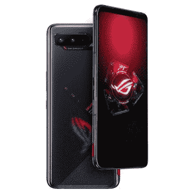

# 华硕 ROG 手机 5 游戏手机终于抵达美国

> 原文：<https://www.xda-developers.com/asus-rog-phone-5-gaming-phone-buy-united-states/>

今年早些时候，华硕发布了 ROG 手机 5，但在中国和欧洲以外的许多国家都无法购买。这款手机最近在印度上市，现在华硕终于以 999.99 美元的高价将它带到了美国。

ROG Phone 5 是目前最强大的安卓手机之一，拥有骁龙 888 芯片组，前置立体声扬声器，6.78 英寸 144Hz AMOLED 大屏幕，高达 16GB 的 RAM 和 256GB 的存储空间，6,000mAh 电池，虚拟 AirTrigger 按钮等等。今年的许多其他设备都使用相同的骁龙 888 芯片组，如 Galaxy S21 和华硕自己的 [ZenFone 8](https://www.xda-developers.com/asus-zenfone-8-review/) ，但 ROG Phone 5 仍然可以凭借其丰富的内存、软件调整和更好的冷却来挤出略好的性能。

目前，华硕只在美国销售入门级的 ROG 手机 5——专业版和旗舰版要到今年第三季度才会上市。从华硕的网上商店购买带有 256GB 存储空间和 16GB 内存的基本型号需要 999.99 美元。它被宣传为兼容 GSM 网络，如美国电话电报公司和 T-Mobile(对不起，威瑞森用户)，华硕[最近更新了手机](https://www.xda-developers.com/asus-rog-phone-5-first-update/)，支持 T-Mobile 的 VoLTE。您可以在下面链接的产品页面上找到支持的频段的完整列表。

 <picture></picture> 

ASUS ROG Phone 5

##### 华硕 ROG 手机 5

华硕最新游戏手机的基本型号现已在美国上市。售价 999.99 美元。

ROG Phone 5 已经是一款利基产品，对任何对智能手机游戏比对任天堂 Switch 更感兴趣的人都有吸引力，但 1000 美元的价格标签可能仍然会吓跑一些潜在的买家——特别是当同样的处理器和显卡可以在 700 美元的手机中找到时。遗憾的是，AeroActive Cooler 5 附件似乎不包括在购买范围内，所以你必须额外支付 69.99 美元(在发布时折扣为 62.99 美元)。ROG Kunai 3 游戏手柄也是单独购买的，价格为 149.99 美元(目前打折至 134.99 美元)，但你可以与 ROG 手机 5 一起捆绑购买[，价格为 1039.99 美元(仅比手机本身贵 40 美元！)](https://store.asus.com/us/item/202105AM250000006/ASUS-ROG-Phone-5-and-Gamepad-Bundle)

**[华硕 ROG 手机 5 论坛](https://forum.xda-developers.com/f/asus-rog-phone-5.12119/)**