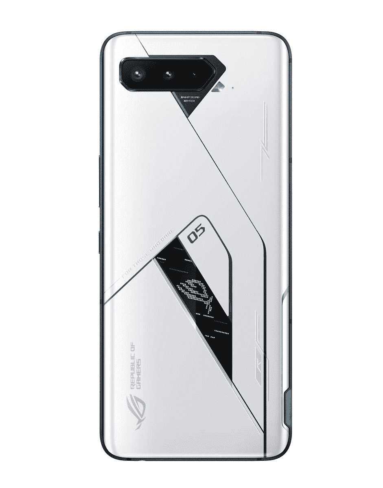

# 华硕昂贵的 ROG 手机 5 旗舰版将于 12 月 26 日在印度首次销售

> 原文：<https://www.xda-developers.com/asus-rog-phone-5-ultimate-india-sale/>

# 华硕昂贵的 ROG 手机 5 旗舰版将于 12 月 26 日在印度首次销售

华硕 ROG 手机 5 旗舰版将于 12 月 26 日在印度上市。将从 Flipkart 面向₹79,999.推出

ROG 手机 5 旗舰版是今年早些时候作为 ROG 手机 5 系列的一部分推出的。这款限量版机型采用了特殊的哑光白色表面，配备了高达 18GB 的内存，背面配有单色“PMOLED ROG 视觉”显示屏。在发布时，华硕表示终极版将于今年晚些时候上市。现在，这家台湾公司已经分享了该设备在印度市场的可用性和定价。

华硕 ROG 手机 5 旗舰版将于 12 月 26 日在印度[上市](https://rog.asus.com/phones/rog-phone-5-ultimate-model/)。这款手机有 18GB/512GB 两种型号，将在₹79,999.的 flipkart 发售 ROG Phone 5 Ultimate 装在一个特殊的盒子里，里面有一堆 ROG 商品。由于是限量版，数量可能会有限。

除了一些外观上的变化和内存量，ROG 手机 5 旗舰版与 ROG 手机 5 和 ROG 手机 5 专业版相同，采用 6.78 英寸 AMOLED 144Hz 显示屏，骁龙 888 SoC，三个后置摄像头，以及 6000 毫安时电池，支持 65 瓦快速充电。

 <picture></picture> 

ASUS ROG Phone 5 Ultimate

##### 华硕 ROG 手机 5 旗舰版

华硕 ROG 手机 5 旗舰版提供终极游戏手机体验，配备 6.78 英寸 AMOLED 144Hz 显示屏，骁龙 888 等。

**[华硕 ROG 手机 5 拥有你想要的游戏手机的一切](https://www.xda-developers.com/asus-rog-phone-5-review/)**

除了 ROG Phone 5 Ultimate，华硕还将一系列配件带到印度，包括 AeroActive Cooler 5、ROG Kunai 3 游戏手柄和 ROG Cetra II Core 耳机。这三款设备现在都在 Flipkart 上出售，价格如下:

## 华硕 ROG 手机 5 旗舰版:规格

| 

规格

 | 

ROG 手机 5 旗舰版

 |
| --- | --- |
| **尺寸和重量** | 

*   172.8 x 77.2 x 10.29 毫米
*   238 克

 |
| **显示** | 

*   6.78 英寸 FHD+ AMOLED 显示屏
*   2448 x 1080 像素
*   395 便士
*   最高 144 赫兹刷新率:支持 60 赫兹、120 赫兹、144 赫兹刷新率，设置为自动时可变
*   20.4:9 宽高比
*   HDR10+
*   800 尼特峰值亮度
*   始终显示
*   111% DCI-sRGB P3:150.89%
*   对比度:1，000，000:1
*   触摸采样率:300 赫兹

 |
| **SoC** | 

*   高通骁龙 888
    *   1 个 Kryo 680 Prime 内核@ 2.84GHz
    *   3 个 Kryo 680 性能内核@ 2.4GHz
    *   4 个 Kryo 680 高效内核@ 1.8GHz

 |
| **RAM 和存储器** |  |
| **电池&充电** | 

*   采用 MMT 设计的双 3000 毫安时电池，总容量为 6000 毫安时
*   65W 超充快充
*   高通快充 5.0 支持

 |
| **后置摄像头** | 

*   **主:** 64MP 索尼 IMX686，f/1.8，1/1.7 寸，0.8 米，EIS，4 合 1 像素宁滨
*   **次要:** 13MP，超广角镜头，f/2.4，125 FoV，EIS
*   **第三级:** 5MP，微距镜头，f/2.0，EIS

 |
| **前置摄像头** | 

*   2400 万像素、f/2.4、0.9 米、4 合 1 像素宁滨

 |
| **端口** | 

*   侧面的 USB 3.1 Type-C
*   底部的 USB 2.0 Type-C
*   3.5 毫米耳机插孔

 |
| **连通性** | 

*   蓝牙 5.2
*   国家足球联盟
*   Wi-Fi 6E
*   5G
*   双频(L1+L5) GNSS、Globass、Galileo、北斗、QZSS、NavIC

 |
| **安全** | 

*   显示指纹扫描仪

 |
| **软件** | 

*   基于 Android 11 的 ZenUI + ROG UI

 |