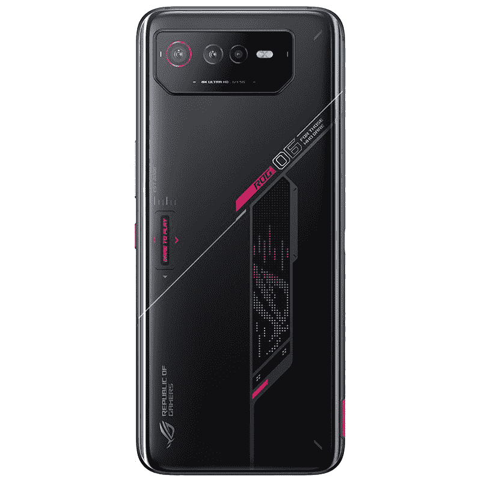
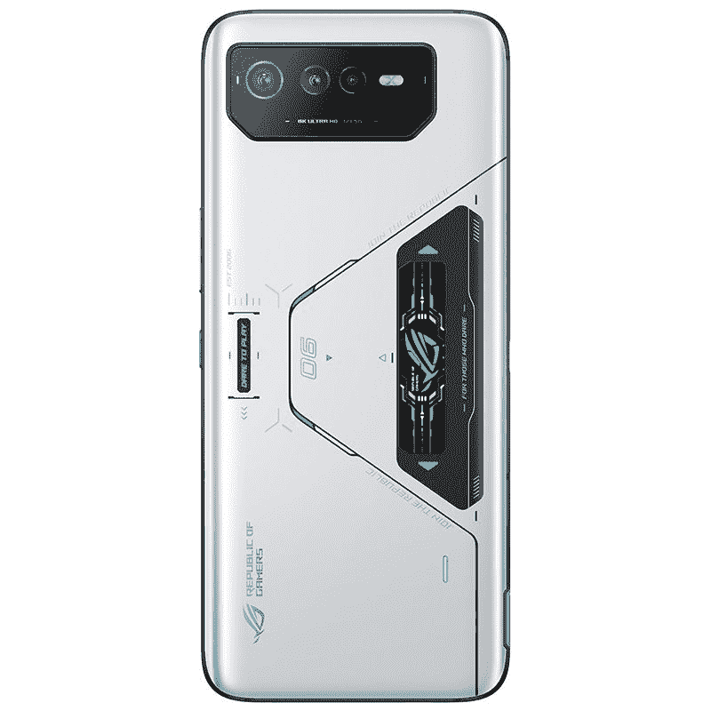

# 在美国，华硕 ROG 手机 6 和 ROG 手机 6 Pro 的预购已经开始

> 原文：<https://www.xda-developers.com/asus-rog-phone-6-and-rog-phone-6-pro-pre-order-us/>

# 在美国，华硕 ROG 手机 6 和 ROG 手机 6 Pro 的预购已经开始

如果你一直在寻找一款高端 Android 游戏智能手机，华硕 ROG 手机 6 和 ROG 手机 6 Pro 在美国的预购现已开始。

尽管华硕不是智能手机领域最具主导性的力量，但它确实发布了一些有趣的产品。ROG 6 系列早在 7 月份就已经发布，但从未登陆美国市场。幸运的是，该公司已经提供了这款手机的预购服务，并将于 10 月 20 日正式零售。

ROG 6 系列有两款智能手机，ROG 手机 6 和 ROG 手机 6 专业版。这两款手机都由高通骁龙 8 Plus Gen 1 驱动，采用 6.78 英寸三星 AMOLED 显示屏，刷新率为 165Hz。此外，它们都采用了 50MP 后置摄像头传感器、双前置扬声器和 6，000 mAh 大电池。区分这两者的是 ROG 手机 6 要么配备 12GB 的 256GB 内部存储，要么配备 16GB 的 512GB 内部存储。ROG 手机 6 Pro 拥有令人印象深刻的 18GB 内存和 512GB 存储空间。此外，Pro 型号配备了 ROG 视觉彩色 PMOLED 显示屏。无论您选择哪一款，每款设备的规格都是顶级的。

如果你不确定 ROG 手机 6 系列提供了什么，查看我们的[对 ROG 手机 6 Pro](https://www.xda-developers.com/asus-rog-phone-6-pro-review/) 的评论，看看它如何与 2022 年市场上的一些[最佳安卓智能手机](https://www.xda-developers.com/best-android-phones/)相媲美，这可能是个好主意。如果你对顶级安卓游戏智能手机感兴趣，ROG Phone 6 和 ROG Phone 6 Pro 是绝佳的选择。如果你在美国，你现在可以直接从亚马逊预购手机。ROG Phone 6 将有两种颜色，12GB 内存型号的价格为 999.99 美元，16GB 内存型号的价格为 1099.99 美元。对于那些希望购买华硕产品的人来说，ROG 手机 6 Pro 将有黑白两种颜色，价格为 1299.99 美元。亚马逊估计，预购商品将在 10 月 20 日至 10 月 24 日之间发货。

 <picture></picture> 

Asus ROG Phone 6

##### 华硕 ROG 手机 6

12GB 内存和 256GB 内部存储的华硕 ROG 手机 6

 <picture></picture> 

Asus ROG Phone 6

##### 华硕 ROG 手机 6

华硕 ROG 手机 6，16GB 内存和 512GB 内部存储

 <picture></picture> 

Asus ROG Phone 6 Pro

##### 华硕 ROG 手机 6 Pro

华硕 ROG 手机 6 Pro，18GB 内存，512GB 内部存储