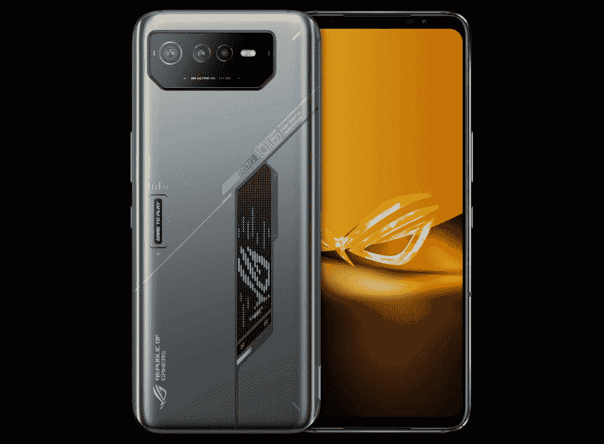
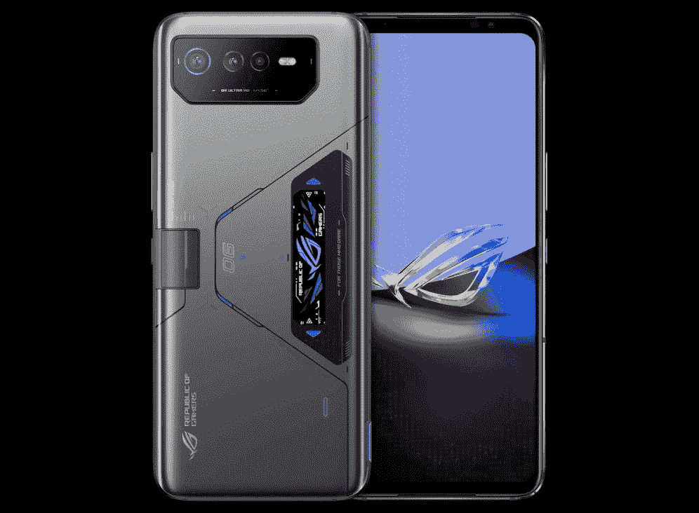

# 华硕最新的游戏智能手机封装了联发科的 Dimensity 9000 Plus 芯片和 LPDDR5X RAM

> 原文：<https://www.xda-developers.com/asus-rog-phone-6d-ultimate-launch/>

华硕揭开了其最新游戏智能手机组合——ROG 手机 6D 和 ROG 手机 6D 旗舰版的面纱。正如之前泄露的信息所示，新设备与今年早些时候的 ROG Phone 6 和 [ROG Phone 6 Pro](https://www.xda-developers.com/asus-rog-phone-6-pro-review/) 基本相同，[联发科天玑 9000 Plus](https://www.xda-developers.com/mediatek-dimensity-9000-plus/) SoC 是唯一显著的区别。

## 华硕 ROG 手机 6D 和 ROG 手机 6D 旗舰版:规格

| 

规格

 | 

ROG 电话 6D

 | 

ROG 电话 6D 终极版

 |
| --- | --- | --- |
| **打造** | 

*   IPX4 防水性
*   康宁大猩猩玻璃 Victus

 | 

*   IPX4 防水性
*   康宁大猩猩玻璃 Victus

 |
| **尺寸&重量** |  |  |
| **显示** | 

*   6.78 英寸 FHD+ AMOLED
*   2448 x 1080p 分辨率
*   165 赫兹刷新率

 | 

*   6.78 英寸 FHD+ AMOLED
*   2448 x 1080p 分辨率
*   165 赫兹刷新率

 |
| **SoC** | 联发科天玑 9000 以上 | 联发科天玑 9000 以上 |
| **闸板&存放** | 

*   高达 16GB LPDDR5X RAM
*   256GB UFS 3.1 存储空间

 | 

*   高达 16GB LPDDR5X RAM
*   512GB UFS 3.1 存储

 |
| **电池&充电** | 

*   6000 毫安时
*   65W 有线快充支持

 | 

*   6000 毫安时
*   65W 有线快充支持

 |
| **安全** | 显示指纹扫描仪 | 显示指纹扫描仪 |
| **后置摄像头** | 

*   主要:50MP f/1.9 索尼 IMX766
*   超宽:1300 万像素
*   宏:5MP

 | 

*   主要:50MP f/1.9 索尼 IMX766
*   超宽:1300 万像素
*   宏:5MP

 |
| **前置摄像头** | 12MP | 12MP |
| **端口** | 

*   USB 类型-C
*   3.5 毫米耳机插孔

 | 

*   USB 类型-C
*   3.5 毫米耳机插孔

 |
| **音频** | 

*   对称前置立体声扬声器
*   采用华硕降噪技术的三麦克风

 | 

*   对称前置立体声扬声器
*   采用华硕降噪技术的三麦克风

 |
| **连通性** | 

*   5G
*   4G LTE
*   蓝牙 5.3
*   Wi-Fi 6E
*   国家足球联盟

 | 

*   5G
*   4G LTE
*   蓝牙 5.3
*   Wi-Fi 6E
*   国家足球联盟

 |
| **软件** | 

*   基于 Android 12 的 ROG UI 和 Zen UI
*   两次操作系统升级和两年的安全更新

 | 

*   基于 Android 12 的 ROG UI 和 Zen UI
*   两次操作系统升级和两年的安全更新

 |
| **颜色** | 太空灰 | 太空灰 |

* * *

新的 ROG 手机 6D 和 ROG 手机 6D 旗舰版分别采用了与 ROG 手机 6 和 ROG 手机 6 Pro 相同的设计。新款机型在硬件方面也没有太大不同，采用相同的 6.78 英寸 165Hz AMOLED 显示屏，一块 6000 毫安时的大电池，背面有三个摄像头，前面有立体声扬声器。

 <picture></picture> 

Asus ROG Phone 6D

联发科天玑 9000 Plus SoC 是新款车型上为数不多的重大变化之一。此外，ROG 手机 6D 阵容获得蓝牙 5.3 支持，LPDDR5X 内存，和略有改善的微距相机。我们预计软件方面也不会有任何重大变化，因为新机型开箱即可运行华硕基于 Android 12 的 ROG 用户界面。

 <picture></picture> 

Asus ROG Phone 6D Ultimate

虽然华硕没有在最新机型上引入很多重大变化，但该公司为 ROG 手机 6D 旗舰版添加了一个新的 AeroActive 门户网站，以改善散热。这应该有助于在长时间的游戏过程中控制温度。

## 定价和可用性

ROG 手机 6D 在英国的售价为 799 英镑(约合 911 美元)，而 ROG 手机 6D 旗舰版的售价为 1199 英镑(约合 1367 美元)。两种型号都有新的太空灰配色。目前，华硕尚未透露这些设备的上市细节。但该公司已经证实，新型号不会进入北美。

如何看待新的华硕 ROG 手机 6D 和 ROG 手机 6D 旗舰版？您会选择联发科天玑 9000 Plus 车型，而不是骁龙 8 Plus 第一代车型吗？请在下面的评论区告诉我们。