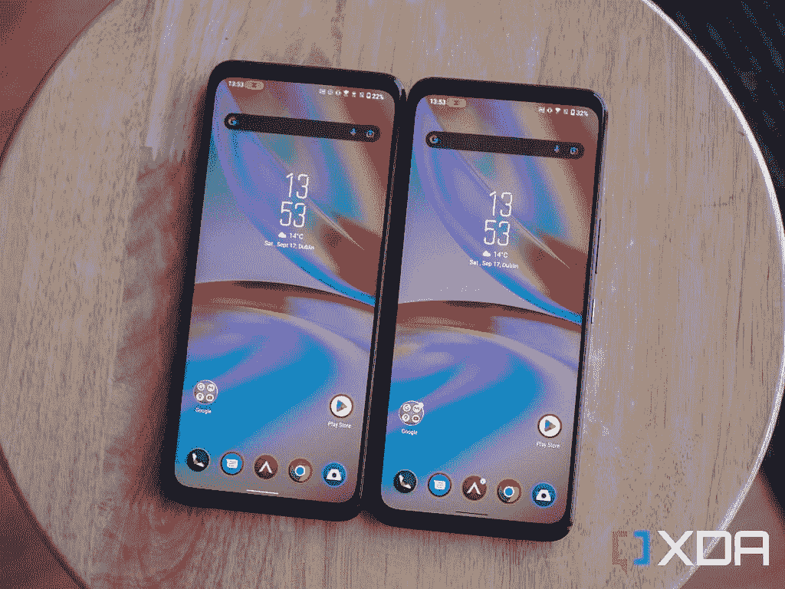
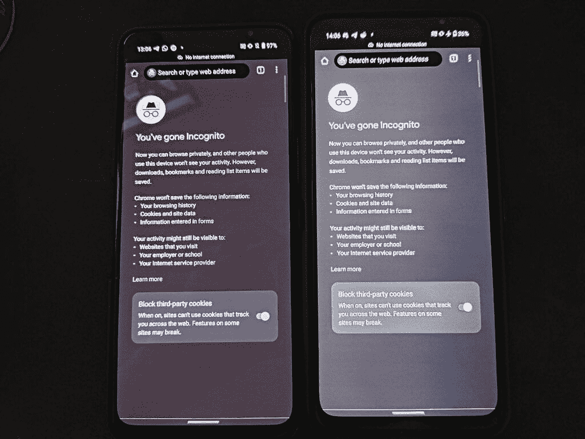

# 华硕 ROG 手机 6D 终极回顾:联发科的 Dimensity 9000 Plus 是有史以来最强大的移动芯片组之一

> 原文：<https://www.xda-developers.com/asus-rog-phone-6d-ultimate-review/>

最近几个月，华硕一直在芯片组领域领先。高通骁龙 8 Plus Gen 1 首先通过华硕 ROG 手机 6 Pro 到达西方，这是一个真正的发电站，拥有一切和厨房水槽。接下来是 [Zenfone 9](https://www.xda-developers.com/asus-zenfone-9-review/) 的出现，这是一个非常小但功能强大的设备。现在，我们将获得华硕 ROG 手机 6D 旗舰版，这又是一个第一次——这一次，这是联发科天玑 9000 Plus 第一次来到西方。

联发科天玑 9000 也从未来到西方，而是在 OPPO Find X5 Pro 等一些设备中推出...但仅限于中国。这是联发科在旗舰领域的重大回归，Dimensity 9000 表现出色，而且非常节能——这可能要归功于它在 TSMC 的生产。现在，该芯片组出现在 ROG 手机 6D 旗舰版中，这款手机预计比华硕 ROG 手机 6 Pro 更强大。但它能对得起“终极”这个名字吗？

ROG 手机 6D 旗舰版除了一个以外没有任何其他变化，那就是增加了一个与[气动冷却器 6](https://www.xda-developers.com/asus-aeroactive-cooler-6-review/) 集成的冷却孔——顺便说一下，这也是手机自带的。这是一个机械通风口，当你将冷却器连接到它时，它会上升，以帮助气流。除此之外，这款手机与几个月前发布的 6 Pro 完全相同。因此，我们真的只会检查性能，你可以[阅读华硕 ROG 手机 6 Pro 评测](https://www.xda-developers.com/asus-rog-phone-6-pro-review/)了解其余内容。

 <picture></picture> 

Asus ROG Phone 6D Ultimate

##### 华硕 ROG 手机 6D 旗舰版

华硕 ROG 手机 6D 旗舰版与华硕 ROG 手机 6 Pro 是同一款手机，但代之以联发科天玑 9000 Plus。

## 华硕 ROG 手机 6D 旗舰版:规格

| 

规格

 | 

华硕 ROG 手机 6D 旗舰版

 |
| --- | --- |
| **打造** | 

*   康宁大猩猩玻璃 Victus
*   IPX4 防水性

 |
| **尺寸&重量** |  |
| **显示** | 

*   6.78 英寸 FHD+ AMOLED
*   2448 x 1080p 分辨率(395PPI)
*   165 赫兹刷新率
*   720Hz 触摸采样率
*   5-800 尼特亮度@APL100 + HBM
*   1200 尼特峰值亮度@APL1
*   111.23%的 DCI-P3 覆盖率
*   150.89%的 sRGB 覆盖率
*   1000000:1 对比度
*   Pixelworks i6 处理器

 |
| **SoC** | 

*   联发科天玑 9000 以上
*   Arm Mali-G710 MC10

 |
| **闸板&存放** | 

*   高达 18GB LPDDR5 RAM
*   高达 512GB 的 UFS 3.1 存储

 |
| **电池&充电** | 

*   6000 毫安时
*   65W 有线快充支持

 |
| **安全** | 显示屏内指纹传感器 |
| **后置摄像头** | 

*   主要:50MP IMX766
*   超宽:1300 万像素
*   宏:2MP

 |
| **前置摄像头** | 12MP IMX663 |
| **端口** | 

*   双 USB 3.1 第二代 C 型
*   3.5 毫米耳机插孔

 |
| **音频** | 

*   5 磁铁 12×16 超线性扬声器
*   2x Cirrus Logic CS35L45，带 15V 升压
*   三麦克风阵列

 |
| **连通性** | 

*   5G
*   4G LTE
*   Wi-Fi 6E
*   蓝牙 5.2
    *   LDAC，aptX，aptX HD，aptX 自适应，AAC

*   国家足球联盟

 |
| **软件** | 

*   基于 Android 12 的 ROG UI & Zen UI
*   2 次操作系统升级和 2 年安全更新

 |
| **配件/其他功能** | 

*   航空机箱
*   超级充电电源适配器
*   ROG 视觉彩色有机发光二极管显示器

 |

***关于本次评测*** *:华硕于 2022 年 8 月 15 日向我们提供了华硕 ROG 手机 6D 旗舰版以供评测之用。它没有为这次审查的内容提供任何投入。*

* * *

## 华硕 ROG 手机 6D 旗舰版:设计

华硕 ROG 手机 6D 旗舰版采用了与 6 Pro 完全相同的设计。它有相同的显示屏，顶部和底部有相同的边框...这完全是一个翻版。设计上唯一的主要区别是在背面，它去掉了左手边的“敢跳”LED。此后，它被一个集成了气动冷却器的机械通风口所取代。如果你没有手机，那么这款手机的设计在功能上是一样的，我们之前讨论的一切都是一样的。通风口打开，让空气流过铜散热器。

概括一下，这款手机顶部有一个耳机插孔，侧面有一个 USB-C 端口，底部有一个 USB-C 端口，触觉非常好，背面有一个三摄像头。显示器完全不受任何类型的凹口或穿孔的影响，这使得它非常适合游戏。简而言之，这是一个很好的功能性设计，尽管这款手机有 6.78 英寸那么大。这款设备在设计上没有什么太大的不同。

 <picture></picture> 

Try to tell them apart.

然而，我们遇到的一个主要问题是面板的一致性。看看下面的照片。

 <picture></picture> 

Left: Asus ROG Phone 6 Pro // Right: Asus ROG Phone 6D Ultimate

在华硕 ROG 手机 6D 旗舰版上，右侧的面板明显更暗。虽然我使用了灰色背景来更好地强调这个问题，但它在整个 UI 中都很明显。在使用手机大约五分钟后，它会以任何刷新率发生，一旦你注意到它，就很难忽视它。我们联系了华硕，希望能尽快得到回复。

* * *

## 华硕 ROG 手机 6D 旗舰版:性能

鉴于这款智能手机除了芯片组之外，其他方面都与前代相同，这是最值得谈论的部分。其余的基本上只是老调重弹。然而，联发科天玑 9000 Plus 是一个完全不同的芯片组。几乎这款手机的所有设计都考虑到了它会如何影响游戏体验，显然，性能是游戏的重中之重。这款手机拥有最快的 UFS 3.1 存储(和大量的)，和 18GB 的 LPDDR5 内存。

当谈到 CPU 性能时，联发科天玑 9000 Plus 击败了任何其他产品

至于 Dimensity 9000 Plus，与骁龙 8 Plus Gen 1 相比，它是一个混合体。在不久的将来，我们肯定会做一个全面的比较，但底线是，它在某些方面更好，而在另一些方面更差。最值得注意的是 CPU 性能的提高，而与高通芯片组中的 Adreno 产品相比，GPU 有点动力不足。然而，关键的要点是:联发科天玑 9000 Plus 在 CPU 性能方面胜过任何其他产品。

然而，这里有一件重要的事情需要解决，那就是华硕应用于启用 X 模式的特定芯片组的超频。启用 X 模式后，CPU 上的主核心从 3.2GHz 跃升至 3.35GHz。但这还没完，三个超级核心也从 2.85GHz 跃升至 3.2GHz。这是一个疯狂的跳跃，意味着启用 X 模式后，您可以获得更高的性能。根据联发科的规格表，这些超级核心实际上跳到了与主核心应该达到的*相同的*频率。不过，这也是以牺牲能效为代价的。

### GFXBench

智能手机的图形功能是游戏最重要的方面之一。联发科芯片组中的 Mali GPUs 并不十分强大，遗憾的是，这种情况仍然存在。虽然它在某些方面可以跟上，但它大多落后于华硕 ROG 手机 6 Pro 中的 Adreno GPU 的能力。它仍然很好，但是在基准测试中，这种差异非常明显。

### 3DMark 野生动物极限版

令人惊讶的是，Dimensity 芯片组的 Mali GPU 在 3DMark 的野生生命极限测试中确实与骁龙的 Adreno GPU 保持了足够的接近。这是一个非常密集的测试，所以对于这个特定的芯片组来说是一个好兆头，特别是在用 GFXBench 比较两个芯片时代替上述结果。

### CPU 节流测试

CPU Throttling Test 是谷歌 Play 商店上的一个免费应用程序，它用 C 语言重复了一个简单的多线程测试，时间短至 15 分钟。我们把时间长度增加到 30 分钟。该应用程序绘制了一段时间内的分数，这样你就可以看到手机何时开始节流。这个分数是以 GIPS 来衡量的，即每秒十亿次运算。这本质上是一个可以测量芯片组持续性能的测试。虽然手机确实变热了，但它并不是难以忍受的热，即使在它达到的最热温度下也完全可以使用。

联发科天玑 9000 Plus 实现了我在任何测试中从未见过的芯片组所做的事情:在我们的 CPU 节流测试中，它突破了 400 GIPS 大关。**在这次测试中，它的最低 CPU 性能仅略低于在华硕 ROG 手机 6 Pro 上测量的最高性能的 10%***，这表明了这种特殊芯片组的强大处理能力。即使受到限制，良好的性能也很重要，因为这意味着您的游戏性能应该不受限制。*

 *### 极客工作台 5

在 Geekbench 的多核结果中也有类似的情况，联发科天玑 9000 Plus 的得分比骁龙 8 Plus Gen 1 高出 7%。不过，基准测试并不是全部，智能手机芯片组的其他方面也很重要。

### 游戏性能

华硕 ROG 手机 6D 旗舰版的游戏性能是最令我困惑的。你会认为从“专业版”升级到“终极版”会带来净改进，对吗？然而，这并不是我在测试中看到的全部情况。联发科天玑 9000 Plus 在几个不同的方面与骁龙 8 Plus Gen 1 进行了交易。

以《辛普森一家:T4》为例，这是一款我经常用来测试智能手机性能的游戏。我通过一个 PlayStation 2 模拟器 AetherSX2 运行这个游戏。即使在华硕 ROG 手机 6 Pro 上测试时发生了一些非常计算繁重的事件，它仍设法达到了 55 FPS 的中值 FPS。相比之下，华硕 ROG 手机 6D 旗舰版的平均 FPS 为 47。

至于为什么会这样，我可以想象有两个原因。首先，Dimensity 9000 Plus 中的 GPU 比骁龙芯片组中的 Adreno GPU 稍弱。然而，除此之外，你通常会在骁龙*上有更好的模拟体验，无论如何*有很多不同的原因，几乎所有的原因都与驱动程序有关。那么，像 Genshin Impact 这样的游戏呢？

出于客观测试的目的，我们以 60 FPS 的绝对最大设置运行游戏。结果给我留下了非常非常深刻的印象，因为我没想到它会这么好。这实际上比华硕 ROG 手机 6 Pro 表现更好，因为它保持了极其稳定的帧速率，几乎没有明显的帧丢失。手机变热了，但摸起来从来不会觉得太热，即使变热也没有明显的节流现象。

华硕 ROG 手机 6 Pro 的性能已经很可笑了，不知何故，联发科天玑 9000 Plus 在 Genshin Impact 方面超过了它

华硕 ROG 手机 6 Pro 的性能已经很可笑了，不知何故，联发科天玑 9000 Plus 在 Genshin Impact 方面超过了它。考虑到这是一个非常激烈的游戏，这是一个令人印象深刻的壮举。

* * *

## 华硕 ROG 手机 6D 旗舰版:电池寿命

在智能手机中，手机的许多不同方面都会影响功耗。显示器在照亮像素和刷新速率方面消耗了相当大一部分功率。手机的另一个消耗大量电池的部分是手机的调制解调器，它处理各种连接。然而，手机最耗电的部分可以说是它的芯片组。这就是为什么芯片组的变化给电池寿命带来了巨大的问号。Dimensity 9000 被认为是一种效率优势，那么 9000 Plus 的表现如何呢？

令人惊讶的是，与骁龙 8 Plus Gen 1 相比，这款手机的电池寿命相当差。它仍然很好，但远没有我想象的那么好，尤其是当骁龙 8 加第一代更好的时候。我有很多理论来解释这是为什么，但是显然没有一个理论能真正解决问题。我认为最有可能的是，倍频器的最后几个步骤使用了最多的能量，鉴于联发科基本上已经超频了 Dimensity 9000，它将在其峰值时钟速度下使用更多的能量。

同样，这不是真的*坏*电池寿命。然而，不可否认，这是一个降级，尤其是对游戏玩家来说，电池寿命是一个有争议的问题。你显然希望你的手机能够持续长时间的游戏，如果这款手机不能做到这一点，那么拥有一款游戏手机又有什么意义呢？

* * *

## “终极”难题

用过这个设备，不可否认它的强大。联发科天玑 9000 Plus 在计算方面确实很强大，但与竞争对手相比，GPU 似乎是一个薄弱环节。我很惊讶这款设备与《辛普森一家:Hit》Run 的斗争有多激烈，而我以前对这一代芯片组只有很好的体验。然而，它在 Genshin Impact 上做得很好。我不确定是华硕的实现还是芯片组本身，但尽管如此，很难说这款手机无愧于“终极”的绰号。

 <picture></picture> 

Asus ROG Phone 6D Ultimate

##### 华硕 ROG 手机 6D 旗舰版

华硕 ROG 手机 6D 旗舰版与华硕 ROG 手机 6 Pro 是同一款手机，但代之以联发科天玑 9000 Plus。

如果有的话，我觉得这款手机应该被定位为 6 Pro 的替代版本，有点像 OPPO 在中国推出的 Find X5 Pro Dimensity Edition。“终极”意味着更好，当我认为它更多的是降级和升级之间的一个侧面。这两种设备都有好处。卓越的电池续航时间和仿真性能归功于骁龙 8 Plus Gen 1，而 Dimensity 9000 Plus 由于增强的 CPU 和几乎不相上下的 GPU，可以说是整体上更强大的芯片组。这款芯片组不会出错，但骁龙 8 Plus Gen 1 也不会出错。都是你最看重的东西。*