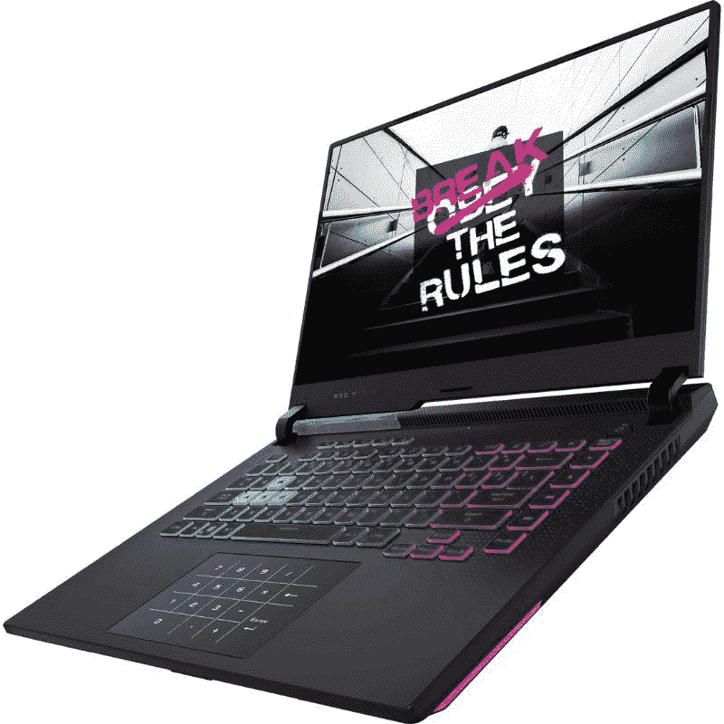

# AMD 锐龙 9 6900HX 评论:它比英特尔阿尔德湖？

> 原文：<https://www.xda-developers.com/asus-rog-strix-g15-review/>

英特尔推出了第 12 代 Alder Lake CPU，在业界掀起了巨大的波澜，但 AMD 还没有放弃。AMD 锐龙 6900HX 代表了 AMD 在新锐龙 6000 系列芯片性能方面的最佳表现。这款 45W 芯片在基准测试和真实测试中都表现可靠。

一周来，我一直在测试由 AMD 锐龙 6900HX 驱动的华硕 ROG Strix G15 游戏笔记本电脑，我可以有把握地说，这台机器非常强大。锐龙 9 6900HX 在大多数任务中的性能与酷睿 i9-12900HK 不相上下，甚至更好。它的得分也比苹果的 M1 Pro 高。这种新处理器，以及 AMD 锐龙 6000 系列的其他高性能芯片，将在今年广泛用于高端游戏笔记本电脑，它们绝对是你应该关注的东西。

虽然 AMD 锐龙 9 6900HX 与英特尔进行了一场伟大的斗争，但如果你考虑所有的分数，我认为[酷睿 i9-12900HK](https://www.xda-developers.com/intel-core-i9-12900hk-review/) 是整体的赢家。这并不意味着 AMD 锐龙 9 6900HX 是一个坏芯片。碰巧的是，英特尔的新混合架构在大多数情况下都能产生更好的结果，并且更加可靠，能够在不同的用例中持续提供良好的结果。也就是说，英特尔和 AMD 的高端芯片都比我们在移动计算领域的任何产品都要好，这两种芯片都很难出错。

 <picture></picture> 

Asus ROG Strix G15

##### 华硕 ROG Strix G15 (2022)

华硕 ROG Strix G15 是首批搭载 AMD 新锐龙 9 6900HX CPU 和 Nvidia GeForce RTX 3070 Ti 显卡的游戏笔记本电脑之一。

* * *

**浏览此评论:**

## 定价和可用性

华硕还没有分享华硕 ROG Strix G15 游戏笔记本电脑在美国的定价和可用性细节，只是还没有。你可以购买一些其他型号的笔记本电脑，包括一款 17 英寸显示屏和英特尔酷睿 i9-12900HK CPU 的笔记本电脑，价格约为 2500 美元。然而，在印度，你可以从 Flipkart、华硕电子商店和其他线下零售店买到新款华硕 ROG Strix G15 游戏笔记本电脑，价格从₹1,06,990 开始。

* * *

## 华硕 ROG Strix G15 (2022)游戏笔记本电脑

下面快速浏览一下华硕 ROG Strix G15 (2022)游戏笔记本电脑的规格:

|  | 

华硕 ROG Strix G15 (2022)

 |
| --- | --- |
| **CPU** | AMD 锐龙 9 6900HX |
| **图形** | Nvidia GeForce RTX 3070 Ti，8GB GDDR6 (125W TGP +25W 动态增强) |
| **正文** | 354.9 x 259.9 x 22.69 ~ 27.2(毫米)，2.3 千克 |
| **显示** | IPS WQHD 165Hz 赫兹(3 毫秒)100% DCI-P3 |
| **内存** | 高达 16GB DDR5 4800MHz SDRAM |
| **存储** | 2* PCIe 固态硬盘插槽 M.2 1TB1TB+1TB (Raid 0) |
| **网络摄像头** | 不适用(包装盒中包含独立的摄像头) |
| **键盘** | 背光 Chicklet 键盘，每键 RGB |
| **连通性** | Wi-Fi 6E 802.11AX (2x2) +BT 5.2，支持范围扩大 |
| **港口** | 

*   2 个 USB3.2 第 1 代 A 型
*   1 个 USB 3.2 Gen2 Type-C(支持显示端口和 100W PD 充电器)
*   1 个 USB 3.2 Gen2 Type-C
*   1 个局域网 RJ-45 插孔
*   1 个 HDMI 2.0b 接口
*   1 个音频组合插孔
*   1 个梯形

 |
| **电池** | 90 瓦时 |
| **交流适配器** | 240 瓦 |
| **操作系统** | Windows 11 |

在我们深入了解这款性能评测之前，让我们先来看看 ROG Strix G15 (2022)游戏笔记本电脑，我已经用了大半个星期来作为我的日常驾驶。

*   华硕 ROG Strix G15 (2022)游戏笔记本电脑采用 15.6 英寸 WQHD 165Hz 显示屏。
*   这款笔记本电脑具有出色的制造质量和时尚的设计，并配有大量 RGB 照明。
*   您还可以获得大量端口、像样的扬声器，以及对 WiFi 6E、MUX Switch 等功能的支持。

ROG Strix G15 游戏笔记本电脑的第一件事就是它引人注目的设计。这是那些不羞于展示其“游戏玩家”美学的机器之一。从机身正面的 RGB 灯条到键盘上的 RGB 照明，Strix G15 随时准备在每次打开时进行灯光表演。就连盖子上的 ROG 标志也会在您打开设备时亮起。

整体构建质量也非常好，这并不奇怪，因为这台笔记本电脑属于 ROG 系列。ROG Strix Scar 笔记本电脑往往更高端，但这次的 Strix G 系列笔记本电脑也是精心打造，整体设计非常棒。华硕已经付出了很大的努力，以确保你得到一个价格的优质笔记本电脑。

我拿到的样品单元上的显示器是一个 WQHD 面板，刷新率为 165Hz，响应时间为 3 毫秒。你也可以购买这款笔记本电脑的变种，配备 300Hz 1080p 面板，所以选择权在你。正如你所看到的，我的评测样本完全可以处理 1440p 游戏，所以我完全没有问题以高帧速率推动许多游戏来充分利用显示器。无论是 WQHD 还是高刷新率 1080p 面板，这两款显示器都针对游戏进行了优化。这是一个标准的 15.6 英寸 IPS 面板，分辨率为 2560 x 1440，支持杜比视觉和自适应同步技术。顶部还有一层防眩光涂层，以避免反光。

至于显示质量本身，我在测试期间没有遇到任何问题。当我将它用于游戏以及一些轻微的视频和照片编辑工作负载时，我的整体体验非常好。这不是华硕 ProArt 笔记本电脑系列中那些高度色彩校准的面板之一，因此它可能不是内容创作者的最佳显示器。然而，华硕表示，它覆盖了 100%的 DCI-P3 色彩空间。这款笔记本电脑最值得强调的一点是，它配有一个多路复用开关，主要用于确保显示器直接连接到专用显卡，以获得最佳体验。您可以通过转到 Armoury Crate 软件来更改此设置。

就端口而言，您可以获得两个支持 DisplayPort/PD 的 USB 3.2 Gen 2 Type-C 端口和两个 USB 3.2 Gen 1 Type-A 端口。还有一个 HDMI 2.0b 端口、一个 2.5G LAN 端口和一个 3.5 毫米组合音频插孔。除了两个 USB Type-A 端口外，所有端口都在背面，请记住这一点。如果这台机器上有一个 SD 卡读卡器就好了，但是你必须依靠外部坞站来实现。笔记本电脑有一个 chicklet 风格的键盘，在按键和 RGB 照明之间有相当大的空间。我不太喜欢 chicklet 风格的键盘，但在这种键盘上打字是一种很好的体验，我很快就习惯了。你还可以在顶部定制按键，这是一个很好的补充。这些键通常会绑定到特定的操作，如增加/减少音量、启动 armoury crate 软件等等。

* * *

## 性能:AMD 锐龙 9 6900HX、Nvidia GeForce RTX 3070Ti、16GB DDR5 内存等

*   AMD 锐龙 9 6900HX 与英特尔酷睿 i9-12900HK 的一般性能相当。
*   锐龙 9 6900HX 运行有点热，尤其是在这个特殊的底盘。
*   GeForce RTX 3070 Ti 可以很好地处理 1440p 游戏。

如果你不想对锐龙 9 6900HX 和其他组件进行详细分析，而只想快速总结一下性能，那么让我告诉你，你不会对整体性能感到失望。我一直将这台笔记本电脑作为我的日常司机，每天用它完成日常工作和玩游戏，我从未失望过。这是那种能帮你完成任何任务的机器。AMD 锐龙 9 6900HX 和 Nvidia GeForce RTX 3070 Ti 组合可以非常好地处理最苛刻的工作负载，而不会退缩。

### AMD 锐龙 9 6900HX -最佳状态的伦勃朗

AMD 锐龙 9 6900HX 具有基于 Zen 3+架构的八个内核。我们正在寻找一个 3.3GHz 的基本时钟和一个 4.9GHz 的睿频，支持 16 线程的 SMT/超线程。这个“伦勃朗”APU 是在 TSMC 使用 6 纳米工艺制造的，名称中的“X”表明它是一个完全解锁的超频 CPU。如果你不知道，Zen 3+是 Zen 3 的更新，具有许多值得注意的功能，包括支持 DDR5 内存、PCIe Gen 4、USB 4、DisplayPort 2 等。您可以前往我们专门的[锐龙 6000 系列页面](https://www.xda-developers.com/amd-ryzen-6000/)，了解更多关于锐龙 6900HX 和该系列其他移动芯片的信息。

在过去使用了许多配备 AMD 锐龙和 Nvidia GeForce RTX 独立 GPU 组合的笔记本电脑后，我对这次评测的期望很高。嗯，华硕 ROG Strix G15 (2022)没有让人失望。我确实对锐龙 9 6900HX 的散热性能有所怀疑，但 Strix G15 游戏笔记本电脑处理得非常好，在评测过程中的任何一点都没有窒息。稍后，我们将详细介绍散热系统，因为现在是时候向您展示这款处理器的能力了。

我最终在这台机器上运行了许多基准来测试锐龙 9 6900HX，但我将只生产其中的几个来保持这篇评论的简短。我们将通过一些性能对比数据来了解这款芯片在与英特尔酷睿 i9-12900HK、苹果 M1 Pro 等产品竞争时的表现。为了测试 CPU，我启动了 Geekbench 5 来开始这个过程。以下是锐龙 9 6900HX 的 Geekbench 分数与市场上一些竞争芯片的结果的对比。

**注意:**笔记本电脑被设置为“涡轮”模式，以允许 CPU 和 GPU 在风扇速度设置为最大的情况下以最佳设置运行。

### 极客工作台 5

| 

产品

 | 

规范

 | 

单核的

 | 

多核

 |
| --- | --- | --- | --- |
| **华硕 ROG Strix G15 (2022)** | AMD 锐龙 9 6900HX，RTX 3070 Ti | 1,573 | 9,912 |
| **微星攻略 GE76** | 英特尔酷睿 i9-12900HK，RTX 3080 Ti | 1,774 | 12,630 |
| **HP om-----------------------------------------------《T9》** | 英特尔酷睿 i9-12900K，RTX 3090 | 1,921 | 15,723 |
| **MacBook Pro** | M1 专业 | 1,755 | 9,954 |

正如你所看到的，锐龙 9 6900HX 在多核测试中无法与 12900HK 的性能相媲美。阿尔德湖部分甚至在单核测试中成功击败了锐龙 9 6900HX，所以可以肯定地说，Geekbench 5 的结果有利于英特尔的阿尔德湖芯片。锐龙 9 6900HX 能够匹配苹果 M1 Pro 芯片的一般性能，然而，M1 Pro 是一个更节能的芯片。

### Cinebench R23

接下来，我有一些 Cinebench R23 的数字来看看锐龙 9 6900HX 在一个广泛流行的基准测试中的表现。在这次测试中，锐龙 9 6900HX 表现良好。虽然它没有完全击败我们使用 12900HK CPU 记录的分数，但它确实非常接近。这次它相当令人信服地击败了苹果的 M1 Pro 芯片，所以这是一个好迹象。由英特尔酷睿 i9-12900K 台式机部分支持的惠普 Omen 45L 台式机轻松击败了移动部分，尽管这不应令人感到惊讶。

| 

产品

 | 

规范

 | 

单核的

 | 

多核

 |
| --- | --- | --- | --- |
| **华硕 ROG Strix G15 (2022)** | AMD 锐龙 9 6900HX，RTX 3070 Ti | 1,545 | 14,343 |
| **微星奇兵 GE76** | 英特尔酷睿 i9-12900HK，RTX 3080 Ti | 1,833 | 14,675 |
| **惠普 OMS ningl** | 英特尔酷睿 i9-12900K，RTX 3090 | 1,894 | 23,659 |
| **MacBook Pro** | M1 专业 | 1,530 | 9,552 |

### PCMark 10

PCMark 10 是该系列的下一款产品，它可以让您的电脑完成一系列任务，包括日常工作负载、3D 应用程序等。这是测试你的电脑性能的一个很好的方法，结果在这里不言自明。

| 

产品

 | 

规范

 | 

得分

 |
| --- | --- | --- |
| **华硕 ROG Strix G15 (2022)** | AMD 锐龙 9 6900HX，RTX 3070 Ti | 7,311 |
| **微星攻略 GE76** | 英特尔酷睿 i9-12900HK，RTX 3080 Ti | 7,820 |
| **高压 omn ization l** | 英特尔酷睿 i9-12900K，RTX 3090 | 9,012 |
| **联想军团 5 Pro** | 锐龙 7 5800H，RTX 3070 | 6,800 |

虽然 AMD 锐龙 9 6900HX 在竞争中取得了不错的成绩，但在整体性能方面还是有所欠缺。这是显而易见的，特别是在与 Core i9-12900HK CPU 竞争时，我们认为这是 6900HX 最接近的竞争对手。也就是说，有许多不同的因素影响笔记本电脑内部芯片的整体性能，因此可能有一些外部因素在起作用，包括机器的散热性能。

华硕表示，它已经在 CPU 上使用液态金属，而不是常规的散热膏。液态金属具有很高的传导性，但它也比大多数其他导热膏解决方案表现更好。在热量方面，我能够在重负载下记录大约 85℃的平均 CPU 温度。下图显示了循环运行 Cinebench R23 时的热量读数。值得指出的是，锐龙 9 6900HX 的最高工作温度(Tjmax)为 95°C，因此我认为它远低于可接受的极限。风扇，特别是在最大转速下会变得非常吵，但很高兴看到他们至少按预期工作。

当我在进行压力测试时记录一些读数时，Nvidia GeForce RTX 3070 Ti 的温度也在可接受的范围内。锐龙 9 6900HX 往往运行有点热，但笔记本电脑在处理热量输出方面没有任何问题。不过，看看这款芯片在不同的机箱中会有怎样的表现会很有趣。

### 水晶圆盘

CrystalDiskMark 是我在所有电脑上运行的另一个测试，用于测试存储性能。这将让你很好地了解你可以从你的存储中期待的性能，这在现代计算机中主要只是一个 NVMe SSD。华硕 ROG Strix G15 游戏笔记本电脑使用的是 PCIe 4.0 NVMe 固态硬盘模块，存储容量为 1TB。

### 3DMark

转到一些 3D 工作负载，在转到现实世界的游戏测试之前，我首先运行了一系列的 3DMark。下面是运行 RTX 3070 Ti GPU 的华硕 ROG Strix G15 游戏笔记本电脑的 3DMark 分数:

| 

试验

 | 

总分

 | 

CPU 得分

 | 

GPU 分数

 |
| --- | --- | --- | --- |
| **时间间谍** | 11,188 | 10,412 | 11,338 |
| **时间间谍极限** | 5,458 | 5,022 | 5,544 |

至于游戏基准，我最后运行了一些最近的 AAA 游戏，以了解锐龙 9 6900HX 和 RTX 3070 Ti combo 如何在 2022 年处理要求苛刻的游戏。我很高兴地报告，CPU 和 GPU 都设法保持抬头，而推动通过每个标题。我能够在运行一些要求苛刻的游戏(如《死亡之光 2》、《极限竞速 5》等)时，即使在 1440p 的速度下也能体验到流畅的 60FPS+游戏体验。如果你不追求高分辨率的游戏，那么我建议选择一个 FHD 300 赫兹面板的变体。

| 

比赛

 | 

华硕 ROG Strix G15(锐龙 9 6900HX，RTX 3070 Ti)

 |
| --- | --- |
| **将死之光 2(1440p 高画质)** | 57 FPS |
| **光环无限(1440p 超画质)** | 68 FPS |
| **Forza Horizon 5(1440p 极致画质)** | 62 FPS |
| **GTA V(1440p 超高品质)** | 123 FPS |
| **红色死亡救赎 2(1080p 超画质)** | 58 FPS |

值得指出的是，新的锐龙 6000 系列只支持 DDR5 内存模块，这意味着所有由这些新芯片驱动的新 AMD 笔记本电脑都将拥有 DDR5 RAM 棒，包括这里展示的 ROG Strix G15。虽然 DDR4 与 DDR5 内存模块之间没有显著的性能差异，但可以保证升级到 DDR5 模块。事实上，DDR5 模块存在高延迟问题。您可以查看我们的 [DDR4 与 DDR5 内存对比](https://www.xda-developers.com/ddr4-vs-ddr5/)，了解更多关于每种内存标准之间的差异。

* * *

## 该不该买？

嗯，这基本上总结了锐龙 9 6900HX 驱动的华硕 ROG Strix G15 游戏笔记本电脑的整体性能测试。如果您已经通读了包含所有基准测试数据的整个性能部分，那么您可能对这款特定的笔记本电脑和 6900HX APU 有一个相当好的想法。AMD 锐龙 9 6900HX 是一款出色的芯片，适用于高性能游戏笔记本电脑。当搭配正确的冷却解决方案和强大的独立显卡时，这款伦布兰特 APU 可以产生一些令人难以置信的性能，这两者华硕 ROG Strix G15 都做到了。AMD 锐龙 9 6900HX 有很多值得喜欢的地方，但并不适合所有人。

### 谁应该购买采用锐龙 9 6900HX 的笔记本电脑:

*   希望从笔记本电脑获得最佳性能的客户。
*   希望在旅途中玩大量游戏的游戏玩家，以及希望快速渲染的创作者。
*   想要高端组件(包括最好的独立 GPU、DDR5 内存等)的发烧友用户。

### 谁不应该购买配备锐龙 9 6900HX 的笔记本电脑:

*   不介意使用台式计算机而不是便携式计算机来获得更高性能的用户。
*   那些不在笔记本电脑上玩游戏或创建媒体内容的人。AMD 和英特尔都有相对较弱的处理器，用于更轻薄的外形或商务笔记本电脑，所以一定要看看周围的选项，如[戴尔 XPS 13 Plus](https://www.xda-developers.com/dell-xps-13-plus-hands-on/) 或[联想 ThinkPad Z16](https://www.xda-developers.com/lenovo-thinkpad-z13-z16-hands-on/) 。

如果你仍然对购买华硕 ROG Strix G15 游戏笔记本电脑犹豫不决，那么我们建议你现在就查看我们收集的[最好的笔记本电脑](https://www.xda-developers.com/best-laptops/)。或者，您也可以查看我们收集的[最佳华硕笔记本电脑](https://www.xda-developers.com/best-asus-laptops/)或[最佳 AMD 锐龙笔记本电脑](https://www.xda-developers.com/best-amd-ryzen-laptops/)，查看您的可用选项。