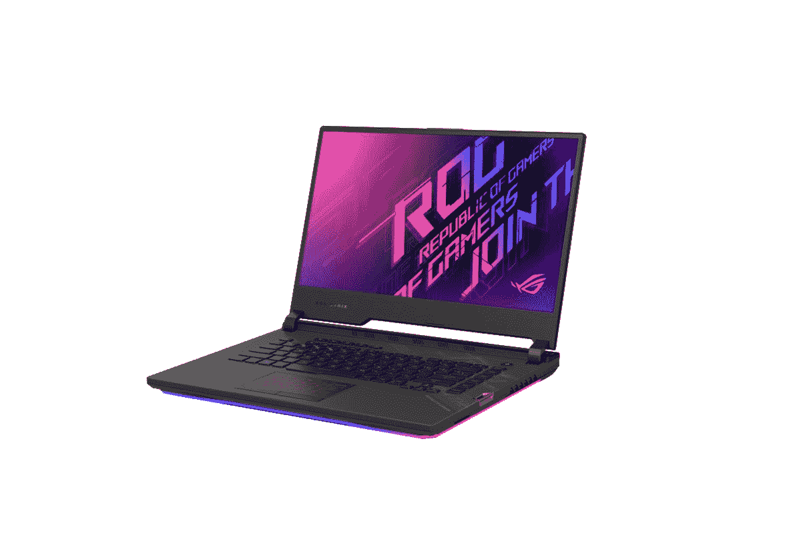

# 获得华硕 ROG Strix Scar 15 在 1850 美元这个网络星期一

> 原文：<https://www.xda-developers.com/asus-rog-strix-scar-15-cyber-monday-sale-amazon/>

# 华硕 ROG Strix Scar 15 英特尔酷睿 i7-10875H 售价最低，为 1850 美元

ROG Strix 疤痕 15 应该为您服务，如果你正在寻找一个可靠的游戏笔记本电脑在这个网络星期一的折扣价！

黑色星期五可能结束了，但网络星期一在这里，这意味着你仍然有机会抓住你想要的交易！在持续的销售中，游戏笔记本电脑是一个受欢迎的类别。华硕正在以前所未有的低价销售其顶级第 10 代英特尔酷睿 i7 变体的 2020 ROG Strix Scar 15。

 <picture></picture> 

ASUS ROG Strix SCAR 15

##### 华硕 ROG Strix SCAR 15

华硕 ROG Strix Scar 15 的这一特殊型号配备了第 10 代英特尔酷睿 i7-10875H 和 16GB 内存以及英伟达的 RTX 2070 Super。

这款笔记本售价 1850 美元，比零售价便宜 350 美元左右。据我们所知，这是它上市以来的最低价格之一。这款笔记本电脑是一款可靠的游戏机，因为它配备了一些顶级硬件。如上所述，这款笔记本电脑运行的是英特尔酷睿 i7-10875H，这是一款八核处理器，主频为 2.30Ghz，最高可达 5.1Ghz。图形由英伟达的 GeForce RTX 2070 Super 处理。这款笔记本配备了 16GB 的 DDR4 3200Mhz 内存(最高 32GB)，1TB 的 M.2 NVMe PCIe 3.0 固态硬盘。该显示器是 15.6 英寸全高清 IPS 级面板，刷新率为 240Hz，响应时间为 3 毫秒，是快节奏竞技游戏的完美笔记本电脑。周围都是 RGB 照明，包括底部面板和键盘，每个按键的照明都可以通过华硕 Aura Sync 软件控制。

在端口和连接方面，有三个 USB 3.2 Gen 1 Type-A 端口，一个 USB3.2 Gen2 Type-C(带 DisplayPort)，一个支持 HDMI 2.0b 的 HDMI 端口，一个音频组合插孔，以太网，以及标准的 Wi-Fi 6 和蓝牙 5.0。Strix Scar 还配备了 Keystone II，这是一个小型 NFC 钥匙，可以让您对笔记本电脑进行个性化设置，并保护您的个人数据。插入此钥匙后，您可以对其进行编程，以启用或禁用某些功能/设置，如个性化设置、快速启动应用程序或您选择的游戏、为私人存储启用隐藏的影子驱动器等。如果你预算紧张，我们还编制了一份 2020 年[最实惠的游戏笔记本电脑清单。](https://www.xda-developers.com/best-cheap-gaming-laptops/)