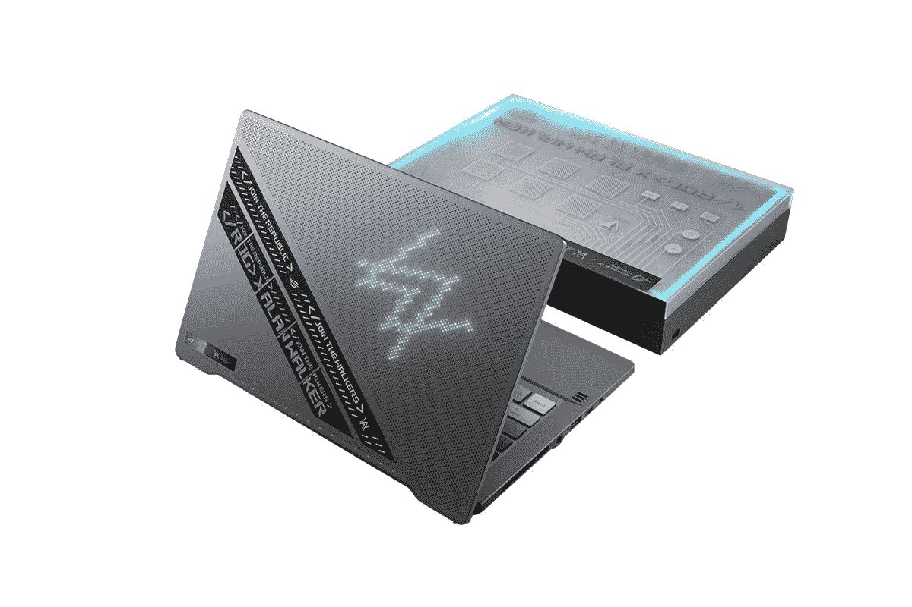

# 华硕 ROG 西风 G14 阿伦·沃克特别版正式上市

> 原文：<https://www.xda-developers.com/asus-rog-zephyrus-g14-alan-walker-launch/>

# 华硕联合 DJ 阿伦·沃克推出 ROG 西风 G14 特别版

华硕与音乐艺术家阿伦·沃克合作，推出了 14 英寸 ROG Zephyrus G14 笔记本电脑的特别版。

在去年推出特殊的 ZPHYRS G14 ACRNM 之后，华硕与 DJ 和音乐制作人阿伦·沃克合作，推出了特别版的 [2021 ROG 西风 G14](https://www.xda-developers.com/asus-rog-zephyrus-g14-g15-duo-15-se-rog-flow-x13-india-launch/) 。该笔记本电脑的硬件与最初的 G14 相同，但与 Walker 合作进行了一些新的外观升级。该笔记本电脑将提供深灰色选项，具有独特的颜色，包括动画矩阵 LED 阵列的特殊 Spectre 蓝色阴影，而不是白色 LED。

盖子上还有一个特殊的金属铭牌，采用蓝色调，ROG 标志旁边有沃克的签名。根据华硕的说法，这种铭牌是用物理气相沉积工艺制造的，具有独特的反光效果。ROG Zephyrus G14 阿伦·沃克特别版还配备了两条织物带，穿过盖子，其中一条带有反光文字，类似于矩阵 led。玻璃触摸板还定制了音乐均衡器图案和蓝色定制键帽，A 和 W 键顶部印有阿伦·沃克的标志。最后，这款笔记本电脑将装在一个独特的包装盒中，可以通过 USB Type-C 电缆连接到 G14，并可以变成一个音乐采样器，让你在表面上用导电垫创作音乐，使用 ROG Remix 定制软件触发沃克自己的 18 种音效。

## 华硕 ROG 西风 G14 阿伦·沃克特别版:规格

|  | 

华硕 ROG 西风 g14 艾伦沃克特别版

 |
| --- | --- |
| **尺寸&重量** | 

*   324 x 222 x 19.9 毫米
*   1.7 公斤

 |
| **显示** | 

*   14 英寸 QHD (2560x1440) IPS 级面板，120Hz，100% DCI-P3，经过 Pantone 自适应同步验证

 |
| **处理器** | 

*   AMD 锐龙 R9 5900HS (3.1GHz / 4.5GHz)

 |
| **GPU** | 

*   AMD 镭龙集成显卡
*   NVIDIA GeForce RTX 3050 ti 4GB gddr 6 VRAM

 |
| **风筒&储存** | 

*   16GB DDR4 双通道 3200MHz 内存
*   1TB NVMe PCIe 固态硬盘

 |
| **电池&充电器** | 

*   180W 电源适配器
*   支持 100W USB PD 充电

 |
| **输入/输出** | 

*   1 个 USB3.2 Gen2 Type-C，带 DisplayPort 1.4 和电源传输
*   1 个 USB3.2 Gen2 Type-C
*   2 个 USB3.2 第 1 代 A 型
*   1 个 HDMI 2.0b 接口
*   1 个 3.5 毫米耳机和麦克风组合插孔
*   1x 肯辛顿锁

 |
| **连通性** | 

*   Wi-Fi 6 802.11AX (2x2)
*   蓝牙 5.1

 |
| **音频** |  |

如上所述，硬件没有重大变化，特别版笔记本电脑将采用单一配置，包括 8 核 16 线程 AMD 锐龙 9 5900HS CPU 和带 4GB VRAM 的 NVIDIA GeForce RTX 3050 Ti GPU。值得注意的是，笔记本电脑的标准版本有更多的内存(32GB)和更好的图形选项(RTX 3060)。

至于定价，新 ROG Zephyrus G14 Alan Walker 特别版在美国和₹1,49,990 的定价为 1999.99 美元，将于今天，8 月 18 日开始发售。

 <picture></picture> 

ASUS ROG Zephyrus G14 Alan Walker Edition

##### 华硕 ROG 西风 G14 阿伦·沃克版

ROG Zephyrus G14 的特别版有特殊的外观升级，是与音乐艺术家阿伦·沃克合作设计的