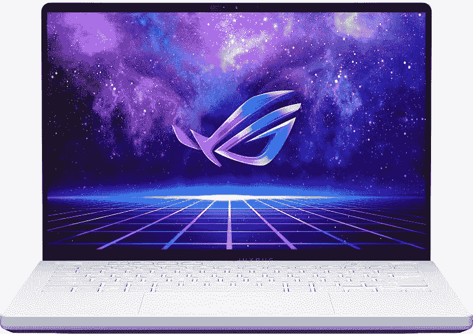

# 这款超快的全 AMD 处理器的华硕 ROG 游戏笔记本电脑现在仅售 1100 美元，下降了 550 美元

> 原文：<https://www.xda-developers.com/asus-rog-zephyrus-g14-laptop-limited-deal/>

# 这款超快的全 AMD 处理器的华硕 ROG 游戏笔记本电脑现在仅售 1100 美元，下降了 550 美元

百思买有全 AMD 驱动的华硕 ROG Zephyrus 游戏笔记本电脑，折扣很低，但仅限未来几个小时。

 <picture></picture> 

ASUS ROG Zephyrus G14 (2022)

##### 华硕 ROG 西风 G14 (2022)

华硕 ROG 西风 G14 (2022)由 AMD 锐龙 9 6900HS 驱动，它配备了 AMD 的 RX 镭龙显卡，而不是使用英伟达的 RTX 30 系列 GPU。

许多[最好的游戏笔记本电脑](https://www.xda-developers.com/best-gaming-laptops/)在引擎盖下配备了英特尔 CPU 和英伟达 GPU，这使得设备的价格略有上升。但百思买目前有一个非常诱人的限时交易，关于一款真正强大的全 AMD 驱动的笔记本电脑，你可能不想拒绝。直到今天，12 月 14 日，你可以只花 1100 美元买到 2022 华硕 ROG Zephyrus G14，价格下降了 550 美元。

这款华硕 ROG 笔记本电脑拥有 16GB 的内存，1TB 的固态硬盘，以及 AMD 锐龙 9 6900HS，共有 8 个内核和 16 个线程。该 CPU 还与 AMD 镭龙 RX 6700S 专用移动 GPU 配对，具有 8GB GDDR6 内存，最大功率为 105W。

结合起来，这些规格意味着你可以运行大多数热门游戏没有任何问题。笔记本电脑将为您完成繁重的工作，尤其是考虑到 AMD SmartShift Max 技术，该技术可以在笔记本电脑认为有必要时提升您的游戏性能。对于那些需要它的人，你甚至会得到一个 MUX 开关，允许你将系统切换到直接 GPU 模式，以减少游戏中的延迟。

华硕 ROG Zephyrus G14 的另一个伟大之处绝对是它的显示屏。它的总分辨率为 2560 x 1600，让您有空间进行多任务处理，并在游戏中看到更多世界。与更便宜的游戏笔记本电脑不同，这款面板还达到了 120Hz 的刷新率，最高可达 500 尼特，确保像*使命召唤*这样的快节奏游戏在您的系统上表现出色。

如果你对 2022 年华硕 ROG 西风 G14 感兴趣，你会想快点行动。这笔交易将于当地时间午夜结束。