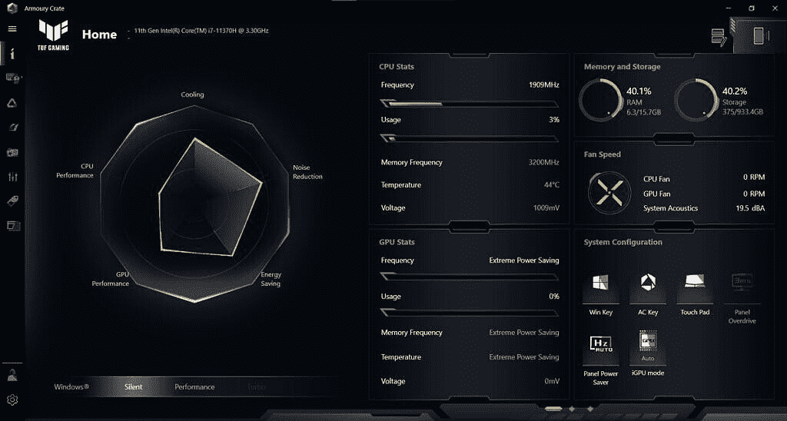
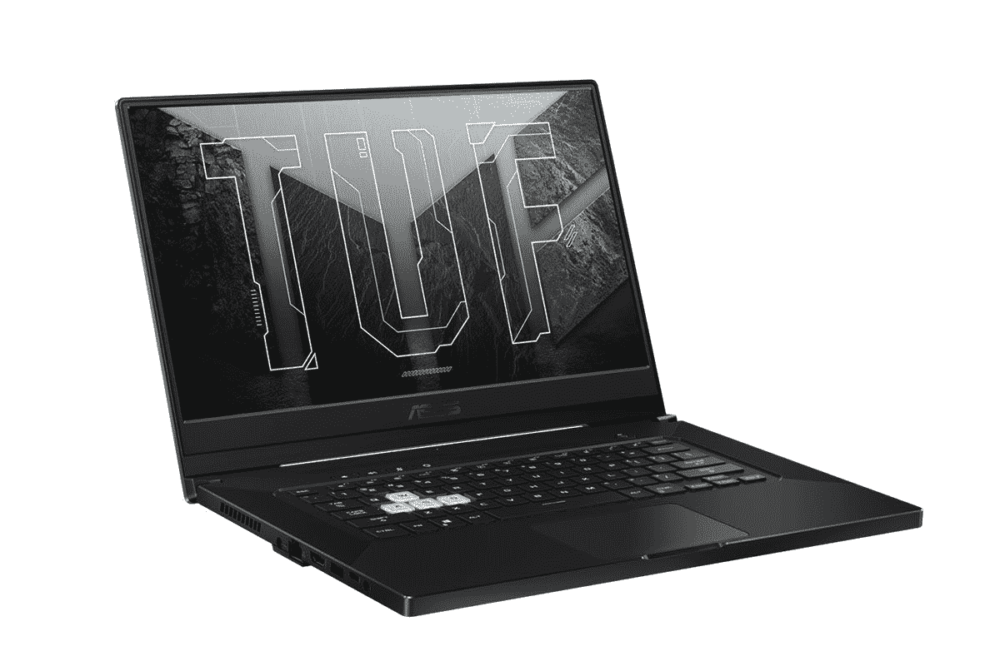

# 华硕 TUF Dash F15 评测:兼顾便携性和性能

> 原文：<https://www.xda-developers.com/asus-tuf-dash-f15-review/>

游戏笔记本电脑正在经历一个变革阶段。许多笔记本电脑制造商已经开始使用 AMD 的部件，而不是英特尔，因为新的[锐龙 5000 移动系列](https://www.xda-developers.com/amd-ryzen-5000-mobile-7nm-zen-3/)提供了出色的性能。英特尔现在正在迎头赶上，但在其新的 Tiger Lake H 系列下，只能为轻薄游戏笔记本电脑提供少量四核处理器。

与此同时，英伟达在今年早些时候为笔记本电脑带来了新的 [GeForce RTX 30 系列 GPU](https://www.xda-developers.com/nvidia-geforce-rtx-30-series-mobile-gpus-for-laptops-officially-announced/)，但有点扭曲。根据笔记本电脑制造商设置的电源配置，这些新的 GPU 可以提供不同级别的性能。但与上一代不同的是，NVIDIA 现在要求笔记本电脑制造商指定消费者可以预期的功耗类型，这造成了一些混乱。鉴于所有这些因素以及全球芯片组短缺，消费者今年应该小心花钱购买新的游戏笔记本电脑。

对于那些在市场上购买新游戏笔记本电脑的人来说，华硕 TUF Dash F15 是一款刚刚上市的产品。它是今年宣布的首批游戏笔记本电脑之一，配备了英特尔的新[第 11 代 Tiger Lake H 系列](https://www.xda-developers.com/intel-11th-gen-vpro-h-series-mobile-processors-launched/)，在我看来，这使它成为 2021 年最受期待的游戏笔记本电脑之一。原因是它将华硕的 TUF 品牌提升到了一个全新的类别。它的目标是成为一款强大、轻薄的 15 英寸游戏笔记本电脑，老实说，华硕在这方面做得很好。凭借高达 NVIDIA GeForce RTX 3070 显卡和 240Hz 刷新率显示器，TUF Dash F15 听起来是游戏玩家的不错选择。但这真的值得吗？

## 华硕 TUF 仪表板 F15:规格

| 

规格

 | 

华硕 TUF Dash F15

 |
| --- | --- |
| **尺寸&重量** |  |
| **显示** | 

*   15.6 英寸全高清(1920x1080) IPS

*   15.6 英寸全高清(1920x1080) IPS
    *   240Hz 刷新率，3 毫秒响应
    *   百分百 sRGB
    *   自适应同步

 |
| **处理器** | 

*   英特尔酷睿 i7-11370H (3.3GHz / 4.8GHz)

 |
| **GPU** | 

*   NVIDIA GeForce RTX 3060 (GDDR6 6GB)
*   英伟达 GeForce RTX 3070 (GDDR6 8GB)

 |
| **闸板&存放** | 

*   16GB DDR4 3200MHz(最高 32GB)
*   8GB 焊接，1x SODIMM 用户可访问
*   1TB NVMe M.2 固态硬盘(两个 M.2 固态硬盘插槽)

 |
| **电池&充电器** | 

*   76 瓦时(声称 16.6 小时)
*   200W 充电器
*   支持 100W USB PD 充电

 |
| **输入/输出** | 

*   Thunderbolt 4 (USB4.0，显示端口 1.4a，PD3.0)
*   3 个 USB 3.2 第一代 A 型
*   HDMI 2.0
*   3.5 毫米音频插孔
*   肯辛顿锁
*   RJ45

 |
| **连通性** | 

*   Wi-Fi 6 802.11AX
*   蓝牙 5.2

 |
| **操作系统** |  |
| **其他特性** | 

*   背光键盘
*   MIL-STD-810H 军用认证
*   DTS:X Ultra

 |

***关于本次评测:**华硕印度给我们发来了华硕 TUF Dash F15 进行评测。这篇评论是在大约 15 天的常规使用后写的，没有第三方对这篇文章的内容有任何意见。*

## 华硕 TUF Dash F15:设计

华硕 TUF Dash F15 有月蚀灰和月光白两种颜色，正如你所看到的，华硕给了我们后者。它有一个引人注目的设计，我绝对喜欢华硕如何推动自己为客户带来独特的体验。当然，白色笔记本电脑意味着它会很快变脏，但老实说，除了用布擦几下，我不用做任何事情来保持 TUF Dash F15 的清洁。华硕表示，油漆会持续更长时间，所以你不应该担心颜色随着时间的推移而变暗。此外，这是专门为白色的变化，这意味着你可以随时去深灰色的版本，这也是一个有点便宜的价格。

我非常喜欢华硕推动自己为客户带来独特体验的方式

TUF Dash F15 的整体构造非常坚固，看起来非常高级，就像 ROG Zephyrus 系列一样。事实上，华硕已经实现了我们在旧的 Zephyrus 笔记本电脑上看到的一些设计选择。首先，TUF Dash F15 没有像 Zephyrus G14 系列和今年早些时候宣布的新款 G15 那样的网络摄像头。有些人会认为，游戏笔记本电脑并不真的需要网络摄像头，智能手机在视频通话方面更好，但随着去年在家工作的激增，这感觉像是错过了一个机会。

这款笔记本电脑配备了阵列式麦克风系统，华硕还将双向人工智能噪音消除作为 TUF Dash F15 的顶级功能之一。然而，这种麦克风系统的最佳潜在用途之一将是视频通话，但这是不可能的，因为没有网络摄像头。我不知道该责备谁，但是每个设计选择都是有原因的，所以我认为这是一个糟糕的决定。

华硕没有网络摄像头是一个糟糕的决定

新的华硕 TUF Dash F15 或多或少是去年 TUF A15 的精致版。它更薄更轻，同时，它的底盘非常坚固，线条简洁。品牌看到一些变化，新的 TUF 标志在盖子的顶角，品牌名称在对面的盖子。我会给它的耐用性加分，因为它符合军用级别的 MIL-STD 标准，确保底盘可以承受轻微的颠簸。我还注意到盖子内侧有一些很好的橡胶衬垫用于保护，底部有一些额外的脚，以便有足够的空间让内部风扇吸入空气。

排气孔在背面和侧面，你可以感觉到热气从里面出来，特别是侧面，因为你在玩游戏时需要使用鼠标。通风口占据了左右两侧的一些空间，因此 I/O 端口被进一步下移。TUF Dash F15 上的充电端口在左边缘，还有一个 RJ45 以太网端口、一个 HDMI 端口、一个 USB Type-A 端口、一个 USB-C 端口以及一个 3.5 毫米耳机和麦克风组合插孔。在另一边，你得到两个以上的 USB 型端口。

在撬动工具的帮助下，您可以在移除底部的所有螺钉后接触到内部构件。在下面，华硕 TUF Dash F15 提供了两个 M.2 SSD 插槽，因此有空间为笔记本电脑添加更多存储空间。这款笔记本电脑使用双通道内存，8GB 内存焊接在主板上，但第二个 SODIMM 插槽可用于升级 TUF Dash F15 的内存。同样，Wi-Fi 模块也可以很容易地升级或更换。在下面，你可以看到五个热管以及两个风扇，它们负责热量和为华硕 TUF Dash F15 供电的 76 瓦时电池。

键盘下方独特的薄荷绿 LED 灯与笔记本电脑的外观相得益彰。添加 RGB 本来会很好，但我在这里没有真正的抱怨，因为我喜欢这种颜色，当它透过透明的 WASD 键时。按键本身在反馈方面感觉很好，我能够很快习惯在华硕 TUF Dash F15 上打字，因为按键间隔很好。出于某种原因，华硕不再在其笔记本电脑的任何地方提供打印屏幕键，这让我有点讨厌，因为我有使用它的习惯。然而，内置的 Windows snipping 工具有一个快捷方式可以提供几乎相同的功能。键盘本身非常宽敞和坚固，顶部有四个专用键，包括音量控制，麦克风静音/取消静音，以及华硕 Armory Crate 软件的快捷键。触控板很好，使用起来非常流畅，支持大多数常见手势。绿色在这里出现，并带有微妙的口音。

就反馈而言，按键本身感觉良好

## 华硕 TUF 仪表板 F15:显示器

华硕在选择用于 TUF Dash F15 的面板时，显然考虑到了电子竞技。该笔记本电脑提供了 240 赫兹的刷新率，以及自适应同步和 3 毫秒的响应时间。它还提供了良好的色彩和对比度性能，100%覆盖 sRGB 以及 Pantone 验证。该面板顶部有一层哑光防眩光涂层，由于它使用 IPS 面板，您可以期待这些宽视角。亮度本来可以更好，但当我在室内使用笔记本电脑时，特别是在网飞上玩游戏或播放流媒体内容时，我觉得已经足够了。华硕提供了一个较低的 144Hz 刷新率模型，但这包括整体的色彩质量。

我喜欢华硕在 TUF Dash F15 上修剪侧面和顶部挡板的方式。它们不像我们在高端超极本上看到的那样超级纤薄，但小边框确实让它们不那么令人分心。显示屏周围的灰色橡胶衬垫也很受欢迎，因为它可以确保按键不会在显示屏上留下痕迹。

我对显示器的唯一担忧是，我测试的大多数游戏都没有超过 144fps，这使得 240Hz 的面板有点过头了。这个数字在纸面上听起来令人印象深刻，虽然一些游戏如 *CS: GO* 实际上会推动这些帧速率，但我认为华硕可以在这方面削减一些成本。我更喜欢单个 144Hz 刷新率面板选项，而不会损害色彩校准的良好性。

## 华硕 TUF Dash F15:性能

如前所述，华硕 TUF Dash F15 由第 11 代英特尔 Tiger-Lake H35 系列处理器酷睿 i7-11370H 提供支持，该处理器配有四个内核、八个线程、高达 4.8GHz 的主频和 Iris Xe 集成显卡。该芯片基于与我们在各种超极本上看到的酷睿 i7-1185G7 或酷睿 i7-1165G7 类似的架构，但你会获得更快的时钟速度和更高的 TDP ( )热设计功率 )额定值 35W。它搭配 16GB 的 DDR4 内存，速度为 3200MHz，而 NVIDIA 新的 GeForce RTX 3070 GPU 可以满足您的游戏需求。你需要注意的是，华硕正在提供 RTX 3070 的低功耗 80+5W 版本，以检查笔记本电脑超薄机箱内的温度。这就是事情变得有趣的地方。

客户需要明白，虽然华硕 TUF Dash F15 是成熟的 RTX 3070 游戏笔记本电脑，能够处理大多数 AAA 游戏，但它的性能不会像其他一些 RTX 3070 游戏笔记本电脑那样好。例如，新的千兆字节 AORUS 15P 也配有 RTX 3070 移动 GPU，但该公司为其配置了 130W 的功率。从本质上说，这意味着它在图形性能方面可以超过 TUF Dash F15 15-20%。这里的底线是，华硕的机器轻了 0.2 公斤，薄了 7.1 毫米。这听起来不像是一个巨大的权衡，但归根结底，消费者可以决定他们是想要 RTX 3070 的全部潜力，还是想要一个更容易处理和携带的游戏笔记本电脑。

 <picture></picture> 

Armory Crate software

至于性能体验，它在任何给定的情况下都没有结巴，并且能够毫不费力地处理我的工作负载。我可以打开超过 20 个 Chrome 标签，通过 Spotify 播放音乐，并在后台运行一系列应用程序，包括 Slack、Discord、Steam 等。即使是在 Adobe Photoshop 上进行基本的照片编辑也轻而易举。当你为了渲染或其他处理器密集型任务而向 CPU 扔高分辨率视频时，CPU 会显示出挣扎的迹象。这在 Cinebench 基准测试中也很明显，我去年在联想军团 7i T1 上测试的酷睿 i7-11370H 仅比酷睿 i7-1185G7 高几分，远远落后于酷睿 i7-10875H。该笔记本电脑带有三种性能预设——静音、性能和涡轮——您可以通过前往 Armory Crate 软件或按下 Fn+F5 键来手动设置。我的大部分测试都是在将模式设置为涡轮模式时进行的，在这种模式下，它会提高功率和风扇速度。为了便于比较，我还使用 Performance 和 Turbo 模式进行了所有的基准测试。

游戏性能一般。新的 RTX 3070 基于 NVIDIA 的 Ampere 架构，并支持下一代光线跟踪，以实现出色的视觉效果，并支持 DLSS 技术，以提升整体分辨率和性能。虽然你应该能够在大多数游戏游戏中获得大约 90-100fps 的最高设置，但一些电子竞技游戏，如 *Apex Legends* 和 *PUBG* 的游戏速度远远超过 130fps。带有光线跟踪的 AAA 级游戏将 GPU 发挥到了极限，所以不要指望*赛博朋克 2077* 在超高速设置下能以超过 40-50fps 的速度运行。

通过使用功耗相对较低的 CPU 并降低 GPU 的整体功耗，华硕成功控制了 TUF Dash F15 的热量。我在玩游戏时记录了平均 76 摄氏度的 CPU 温度和大约 70 摄氏度的 GPU 温度，这令人印象深刻，而且基本上在控制之下。在压力下，CPU 达到了最高 95°C，GPU 在 76°C 的温度下保持在相当可控的范围内。在 1TB NVMe SSD 的存储测试中，在 CrystalDisk 基准测试中，读取速度高达 3，506MBps，写入速度为 2，736MBps。

## 电池寿命和充电

华硕 TUF Dash F15 的电池额定功率为 76 瓦时，华硕声称它可以提供长达 16.6 小时的视频播放。我不确定该公司的测试条件是什么，但我在 loop 上以 1080p 的分辨率运行了一个 YouTube 视频，亮度设置在 50%左右。我的电池续航时间约为 7 小时，老实说，考虑到笔记本电脑的轻薄程度，这还不算太差。还值得注意的是，一旦您从充电器上拔下笔记本电脑，Armory Crate 软件会自动切换到“静音”模式，从而切换到英特尔板载显卡，降低处理器时钟速度，并将屏幕刷新率降至 60Hz，以延长电池寿命。因此，当谈到电池寿命时，你的里程可能会有所不同，因为这取决于你在军械库箱中启用了什么模式。

TUF Dash F15 的充电砖额定功率为 200W，携带起来相当轻巧。笔记本电脑还可以通过 USB-C/Thunderbolt 4 端口充电，该端口支持高达 100W 的速度，如果你不想随身携带标准的筒式充电器，这是一个很好的选择。我能够使用 Aukey 的标准 65W USB-PD 充电器为笔记本电脑充电。当然，如果你想提高游戏性能并充分利用 RTX 3070 显卡，你将需要随附的充电器。

## 结论:华硕 TUF Dash F15 值得买吗？

华硕 TUF Dash F15 不是最好的游戏笔记本电脑，但如果你正在寻找一款在性能和便携性之间取得良好平衡的笔记本电脑，它可以通过。它易于携带，外观整洁，电池续航时间长达 7-8 小时，当您想在您一直想去的新咖啡店工作时，它应该是一个很好的伴侣。

但是你必须做出妥协。例如，缺少内置网络摄像头意味着没有外部网络摄像头[或智能手机](https://www.xda-developers.com/how-to-use-android-phone-as-webcam-for-pc/)你就不能进行视频通话，散热设计意味着它不会像其他类似规格的笔记本电脑一样快。如果你正在寻找能够充分发挥 NVIDIA 新 RTX 30 系列 GPU 潜力的产品，请到别处看看。4 核处理器和低功率 GPU 不会给想要高端性能的游戏玩家留下深刻印象。唯一值得庆幸的是，这款笔记本电脑并不太贵，这一点很重要，因为现在你几乎不可能买到一款新的游戏硬件，或者价格非常昂贵

你可以在印度₹1,41,000 买到配有 NVIDIA RTX 3070 GPU [的华硕 TUF Dash F15，或者在美国](https://www.asus.com/in/Laptops/For-Gaming/TUF-Gaming/2021-ASUS-TUF-Dash-F15/where-to-buy/)买到约 1500 美元的[。配备 144Hz 刷新率显示器的 RTX 3060 型号目前在印度不可用，但如果你在美国，你可以以 1150 美元](https://www.amazon.com/FX516PR-211-TM15-i7-11370H-Windows-Gaming-Notebook/dp/B08X1NXG4P?tag=xda-5vf073o-20&ascsubtag=UUxdaUeUpU2577&asc_refurl=https%3A%2F%2Fwww.xda-developers.com%2Fasus-tuf-dash-f15-review%2F&asc_campaign=Short-Term)在[买到它。](https://www.amazon.com/FX516PM-211-TF15-i7-11370H-Windows-Gaming-Notebook/dp/B08YN5JR5L/?tag=xda-5vf073o-20&ascsubtag=UUxdaUeUpU2577&asc_refurl=https%3A%2F%2Fwww.xda-developers.com%2Fasus-tuf-dash-f15-review%2F&asc_campaign=Short-Term)

 <picture></picture> 

ASUS TUF Dash F15

##### 华硕 TUF Dash F15

华硕 TUF Dash F15 是首批采用英特尔为轻薄游戏笔记本电脑打造的全新第 11 代 Tiger Lake 处理器以及英伟达最新 RTX 30 系列移动 GPU 的笔记本电脑之一