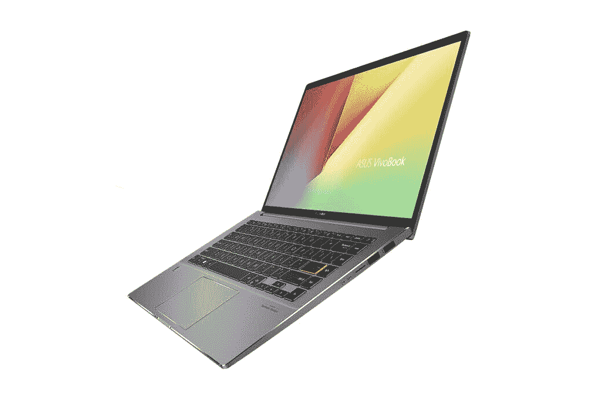

# 华硕推出 ZenBook Pro Duo 15 有机发光二极管、TUF Dash F15 等

> 原文：<https://www.xda-developers.com/asus-unveils-zenbook-pro-duo-models-proart-display-tuf-gaming-laptop/>

华硕昨天发布了其 [ROG 游戏品牌下的一系列新产品，今天我们有该公司主要品牌的更多公告。该公司推出了有机发光二极管版的双屏 ZenBook Pro Duo 15、TUF Dash 15 游戏笔记本、ZenBook Duo 14、VivoBook S14、ExpertBook B9450CEA(博锐)、Chromebook Flip CX5/C536、Chromebook CX9 和华硕 BR1100 教育版。华硕还公布了 ProArt Display PA148CTV 和 ZenBeam Latte 投影仪。](https://www.xda-developers.com/asus-rog-strix-zephyrus-gaming-laptops-13-flow-x13-launch-ces-2021/)

## 华硕 ZenBook Pro Duo 15 有机发光二极管(UX582)

昨天，华硕宣布了由 [AMD 的新锐龙 5000 系列移动 CPU](https://www.xda-developers.com/best-amd-ryzen-laptops/)驱动的新 ZenBook Pro Duo 15 SE。今天，该公司宣布了另一种高级笔记本电脑的变体，现在配有 4K·有机发光二极管·HDR 显示屏和宽 4K 辅助触摸屏。主显示器提供 93%的屏幕与机身比例，而面板具有 1，000，000:1 的对比度，VESA DisplayHDR True Black 500 认证和 Pantone 验证。

 <picture></picture> 

ASUS ZenBook Pro Duo 15 OLED

至于性能，该笔记本电脑继续采用英特尔第十代酷睿 i9 笔记本处理器，最高可配 32GB DDR 4 内存和 1TB PCIe 3.0 X 4 固态硬盘。它还配备了一套健康的 I/O 端口，包括两个雷电 3 USB-C 端口，以及 WiFi 6 (802.11ax)以实现快速无线速度。

## 华硕 ZenBook Duo 14 (UX482)

新的 ZenBook Duo 14 提供了与 ZenBook Pro Duo 15 类似的双屏设置。它配备了英特尔 Evo-verification，这意味着您可以期待这款笔记本电脑提供性能、风格和电池寿命的完美平衡。主要的 14 英寸 FHD (1920 x 1080 像素)显示器提供了 93%的屏幕与机身比率和高达 400 尼特的亮度；它还通过了 Pantone 验证，覆盖了 100%的 sRGB 色域，并通过了莱茵 TV 的低蓝光认证。它还配备了 ScreenPad Plus，这是第二个触摸屏，可倾斜 7 度，以提高可读性并减少潜在的眩光。该笔记本电脑采用最新的[第 11 代英特尔酷睿处理器和英特尔 Iris Xe 显卡](https://www.xda-developers.com/intel-tiger-lake-11th-gen-core-i3-i5-i7-xe/)，并可选配 NVIDIA GeForce MX450 独立显卡。

 <picture></picture> 

ASUS ZenBook Duo 14

据说，笔记本电脑上的电池可以持续 17 小时，用于全天工作，通过 USB-C Easy Charge，您可以使用 USB-C Power Delivery 认证的充电器或任何标准的 USB-C 充电器为笔记本电脑充电。这款笔记本电脑可以使用 Thunderbolt 4 USB-C 端口连接到外部 8K 显示器或两个 4K UHD 显示器。其他功能包括通过华硕 WiFi Master Premium 技术和华硕智能性能技术增强的 WiFi 6 (802.11ax)，后者允许您通过在性能模式下提升高达 40%来控制 CPU 性能。

ZenBook Pro Duo 15 有机发光二极管和 ZenBook Duo 14 上的辅助显示器都配有 ScreenXpert 2 软件和华硕控制面板，这是一款完全可定制的应用程序，位于 ScreenPad Plus 上，适用于创意专业人士。控制面板可以提供对创意应用程序的直观控制，包括 Adobe Photoshop、Lightroom Classic、Premiere Pro 和 After Effects 等应用程序中的画笔大小调整、饱和度、图层不透明度等，在不久的将来会有更多的应用程序支持。用户还可以使用 ScreenPad Plus 上附带的触控笔，该触控笔为书写或绘图提供高精度(4096 压力级别)的触控笔支持。

## TUF 仪表板 F15

TUF 经济实惠的游戏笔记本系列有了新成员。全新 TUF Dash F15 从 ROG Zephyrus 系列中汲取设计灵感，打造出一种真正简洁、纤薄的美感。它将由第 11 代英特尔酷睿 i7 处理器和 GeForce RTX 3070 笔记本电脑 GPU 提供强大的游戏性能。该笔记本电脑还配备了高达 240Hz 的刷新率显示器，响应时间为 3 毫秒，减少了运动模糊。对于散热，华硕增加了一个大型散热器和五个铜热管。还有新的 N-Blade 风扇，通过使用液晶聚合物专门设计来移动更多的空气，使每个风扇可以安装 83 个叶片，并确保承受高转速的强度。它还配备了自清洁冷却模块，可实现长期稳定性和性能，并更新了防尘通道。

这款笔记本电脑在观看视频时的电池续航时间可达 16.6 小时，可以通过 USB Type-C 端口充电。说到这一点，这款笔记本电脑还配有一个 Thunderbolt 4 端口，就像上一代 TUF 笔记本电脑一样，它具有军用级别的耐用性，可以抵御日常撞击和极端温度下的碰撞。

## 华硕 VivoBook S14 (S435)

 <picture></picture> 

ASUS VivoBook S14

新的 VivoBook S14 超极本也获得了英特尔 Evo 认证，据说是最轻的 14 英寸 VivoBook 机型。该笔记本电脑采用最新的第 11 代英特尔酷睿 i7 处理器，配有英特尔 Iris Xe 显卡、16GB 内存和英特尔 Optane 内存 H10。它还配备了 1TB PCIe 固态硬盘以及华硕智能性能技术。使用四面 NanoEdge 14 英寸显示屏，您可以获得 90%的屏幕与机身比率，并且该显示屏通过了莱茵 TV 的低蓝光发射认证。这款笔记本电脑采用了时尚的设计，厚度为 15.9 毫米，重量为 1.3 千克。VivoBook S14 还配备了 Thunderbolt 4 USB Type-C 端口，支持快速充电，40 Gbps 的数据传输速度，以及向单个外部 8K 或两个 4K UHD 显示器输出视频。该笔记本电脑还具有 USB 3.2 Gen 1 Type-A 和 USB 2.0 端口以及 microSD 读卡器。

## 华硕 Chromebook CX9 (CX9400)

新款 Chromebook CX9 是该公司提供的优质产品，符合 MIL-STD 810H 美国军事测试标准，拥有 16 毫米厚的耐用镁合金机箱，重量仅为 1 千克。尽管是一款超薄笔记本电脑，但它配备了高达第 11 代英特尔酷睿 i7 处理器，配有英特尔 Iris Xe 显卡和防眩光 14 英寸 FHD (1920 x 1080 像素)显示屏。在连接方面，CX9 配备了 WiFi 6 以及 Thunderbolt 4，这是一种标准的 USB Type-A 和 HDMI 输出。这款笔记本电脑还配备了哈曼卡顿认证的双扬声器音频，对于企业级的保护，有泰坦 C 安全存储敏感信息，如密码和加密密钥。此外，Chromebook CX9 还配备了指纹传感器，用于无密码登录，以及网络摄像头保护罩，用于增加隐私。

## ProArt 显示器 PA148CTV

作为便携式 14 英寸 FHD IPS，华硕 ProArt Display PA148CTV 可以快速连接到 PC、笔记本电脑或平板电脑，以快速完成创作任务。显示器提供 100% sRGB 和 100% Rec。709 色彩空间，经过 Calman 验证和工厂预校准，可提供 Delta E < 2 color accuracy. The display also features a 10-point multi-touch panel and an anti-glare film. With the ASUS Dial, which is a physical dial at the back of the display, users can control compatible Adobe software and Microsoft Surface Dial features. The Virtual Control Panel provides adjustment dials, sliders, buttons, and wheels, delivering programmable hotkeys. There is also an integrated on-screen display (OSD) controller to quickly adjust the monitor to your liking, and the two USB-C ports can deliver audio, video, and power input over a single cable. Additionally, there is also a micro HDMI port, a tripod socket for mounting purposes, and an adjustable metal kickstand.

## ASUS ExpertBook B9 B9450CEA

Claimed to be the world's lightest 14-inch business laptop, the ExpertBook B9 also qualifies for the Intel Evo platform. It's powered by the latest [第 11 代英特尔酷睿 i7 博锐处理器](https://www.xda-developers.com/intel-11th-gen-vpro-h-series-mobile-processors-launched/)，并内置英特尔 Iris Xe 显卡。它还配有双 2TB 固态硬盘，支持 RAID 0 和 RAID 1 配置。华硕提供两种型号:0.8 千克的型号配有 33 瓦时的电池，0.99 千克的型号配有 66 瓦时的电池。ExpertBook B9 还符合 MIL-STD 810H 美国军用标准，并支持 WiFi 6 和华硕的 WiFi Master Premium 技术。为了安全起见，有一个 Kensington NanoSaver 锁和一个可选的可信平台模块(TPM) 2.0 芯片来存储密码和加密密钥。其他功能包括红外摄像头和智能接近传感器，以实现快速生物识别面部登录。此外，期待基于人工智能的降噪功能和哈曼卡顿认证的扬声器。

## 华硕 BR1100

最后，还有用于教育目的的 11 英寸华硕 BR1100。该笔记本电脑采用英特尔赛扬 N4500 或新的英特尔奔腾银处理器，配有 16GB 内存和高达 128 GB eMMC 和 1 TB M.2 SSD 的存储选项。这款笔记本电脑还提供军用级别的保护，可以承受日常的撞击和跌落，四个外部边缘都有橡胶缓冲器，还有防泼溅键盘。该笔记本电脑将提供标准翻盖式或可转换式外形。BR1100 还配备了用于保护眼睛的德国莱茵 TV 认证显示器、华硕双向人工智能降噪麦克风、降噪摄像头、WiFi 6、网络摄像头屏蔽和用于保护隐私的麦克风静音键。电池额定为 42Whr，还有一个 4G LTE 的选项。还有一个完整的 I/O 端口阵列，包括 USB Type-C 3.2 Gen 2 和 USB 3.2 Gen 1 Type-A 端口、HDMI 和 microSD 读卡器。

| 

模型

 | 

有效性

 |
| --- | --- |
| 华硕 ZenBook Pro Duo 15 有机发光二极管(UX582) | 2021 年 4 月 |
| 华硕 ZenBook Duo 14 (UX482) | 2021 年 1 月 |
| 华硕 VivoBook S14 (S435) | 2021 年 2 月 |
| 华硕专家手册 B9 B9450CEA | Q1 2021 |
| 华硕 Chromebook CX9 (CX9400) | Q2 2021 |
| 华硕 BR1100 | Q1 2021 |
| 华硕 ProArt 显示器 PA148CTV | Q2 2021 |
| 华硕 TUF Dash F15 | Q1 2021 |