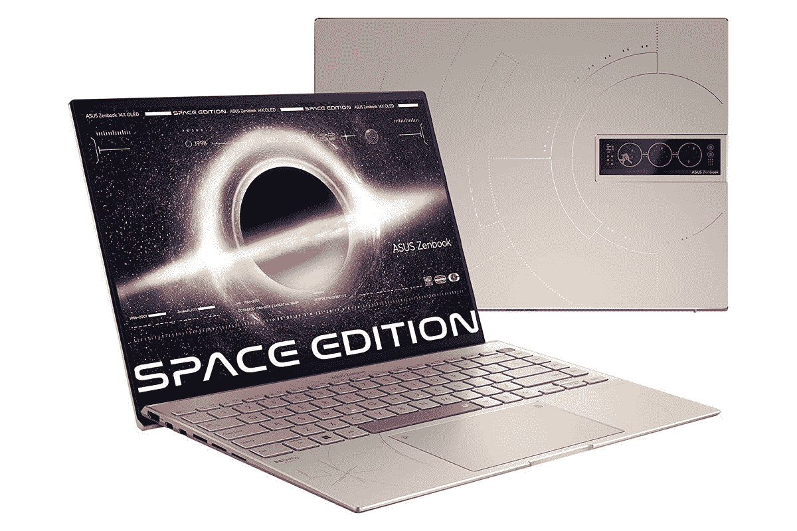

# 华硕的 ZenBook 14X 有机发光二极管太空版笔记本电脑现在可以购买

> 原文：<https://www.xda-developers.com/asus-zenbook-14x-oled-space-edition-laptop-now-available/>

继今年早些时候在 CES 上宣布 ZenBook 14X 有机发光二极管太空版笔记本电脑之后，华硕正式推出了这款笔记本电脑。顾名思义，这款笔记本电脑采用了太空灵感设计，旨在庆祝华硕笔记本电脑首次被发射到太空。可能它最独特的地方是盖子上的 3.5 英寸显示屏，但这里有很多值得喜欢的地方。

首先，华硕 ZenBook 14X 有机发光二极管太空版由英特尔酷睿 i9-12900H 提供支持，具有 14 个内核和 20 个线程，加上集成的英特尔 Iris Xe 显卡。这是目前你可以获得的最快的移动处理器之一，它由 32GB 的 LPDDR5 RAM 和 1TB 的 PCIe 第四代固态硬盘支持，所以你有足够的性能。

主显示器是 14 英寸的 OLED 面板，长宽比为 16:10，分辨率为 2.8K，即 2880 x 1800，刷新率为 90Hz，支持触摸。在色彩方面，它覆盖了 100%的 DCI-P3，133%的 sRGB，对比度为 1，000，000:1，与有机发光二极管面板一样，而且经过了 PANTONE 验证。它可以达到 550 尼特的亮度，并通过了 VESA DisplayHDR True Black 500 的认证。至于盖子上的 3.5 英寸显示屏，也是 OLED 面板，但它是单色的，主要目的是显示自定义图形和信息，包括电池寿命、时间和日期。

对于设计的其余部分，它采用了优雅的“零重力钛”颜色，并在各处点缀了空间图案，包括盖子上的莫尔斯电码信息，代表和平号空间站的图案，以及上面有行星图标的红色空格键。像往常一样[华硕笔记本电脑](https://www.xda-developers.com/best-asus-laptops/)，触摸板还包括一个虚拟数字键盘。该笔记本电脑的设计还符合 MIL-STD-810H 耐用性标准，此外，它还经过了“太空级”标准的测试，可以抵抗极端振动和高温及低温。最后，对于端口，你有两个 Thunderbolt 4 端口，USB Type-A，HDMI，耳机插孔和 SD 读卡器，另外还有一个 USB Type-A 到 RJ45 千兆以太网适配器。

你可以从今天开始订购华硕 ZenBook 14X 有机发光二极管太空版，但它仍被视为预购。根据 Newegg 的上市信息，这款笔记本电脑预计将于 4 月 19 日开始发货。

 <picture></picture> 

ASUS ZenBook 14X OLED SPace Edition

##### 华硕 ZenBook 14X 有机发光二极管太空版

华硕 ZenBook 14X 有机发光二极管太空版由最新的英特尔处理器提供动力，并包括一个以太空为主题的设计，这一定会让人眼前一亮。