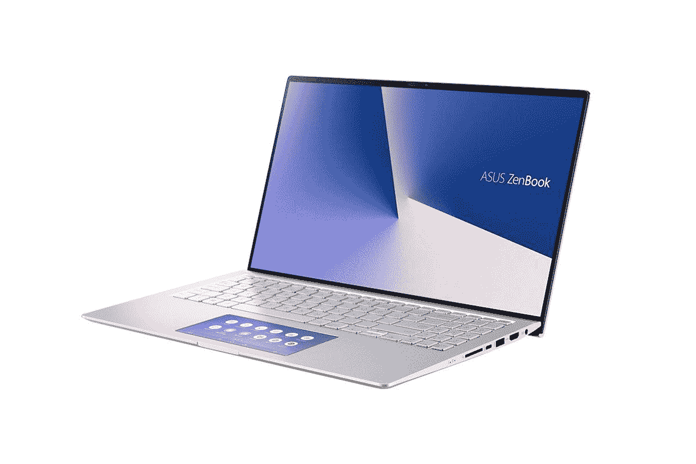

# 华硕 ZenBook 15 以 999 美元的折扣价出售

> 原文：<https://www.xda-developers.com/asus-zenbook-15-intel-core-i7-black-friday-sale-amazon/>

# 搭载 10 代英特尔酷睿 i7 CPU 的华硕 ZenBook 15 售价大幅下调至 999 美元

华硕 ZenBook 15 旨在为希望拥有坚固显示屏和专用显卡的轻薄笔记本电脑的创意专业人士提供服务。

除了智能手机，笔记本电脑是黑色星期五最受欢迎的类别之一。如果你正在寻找一款能够处理你的创意任务并同时玩一点游戏的好笔记本，亚马逊有一款华硕 ZenBook 15，你不应该错过。这款笔记本原价为 1，999 美元，现在只卖 999 美元——半价！确保你迅速抓住这笔交易，因为它很快就会结束。

 <picture></picture> 

ASUS ZenBook 15

##### 华硕 ZenBook 15

ZenBook 15 适合想要轻薄便携笔记本电脑的创意专业人士。

华硕 ZenBook 15 UX534FTC 是一款超薄笔记本电脑，在 14 英寸的尺寸中提供了 15.6 英寸的显示屏。根据华硕的说法，这款笔记本电脑还符合 MIL-STD-810G 军用标准，使其成为一款坚固耐用的机器。该笔记本电脑装载了四核酷睿 i7-10510U 处理器，配有专用的 NVIDIA GeForce GTX 1650 Max-Q GPU。GPU 应该有助于视频和照片编辑以及一些游戏等任务。你不能在最高设置下玩 AAA 游戏，但它适合竞技电子竞技游戏。这款笔记本配备了 16GB 内存，可升级至 32GB，并配有 512GB NVMe 固态硬盘用于存储。显示器是笔记本电脑的亮点，因为哑光 IPS 面板提供了出色的视角，以及良好的对比度和色彩表现。这款笔记本还提供亚马逊 Alexa 语音服务，因此你也可以发出语音命令。

我们会批评这款笔记本电脑缺乏 Thunderbolt 端口，但你确实有一个 USB 3.2 Gen 1 Type-A，一个 USB 3.2 Gen 2 Type-A 端口，两个 USB 3.2 Gen 2 Type-C 端口，其中一个支持 display out，HDMI 1.4，3.5 毫米音频插孔和全尺寸 SD 读卡器。这款笔记本电脑的其他显著功能包括 Windows Hello 面部识别和 ScreenPad，这是一种嵌入触摸板本身的触摸屏显示器。

如果你错过了 Thunderbolt，那就看看我们的指南吧，里面有雷电 3 端口的[最佳笔记本电脑。](https://www.xda-developers.com/best-thunderbolt-3-laptops/)