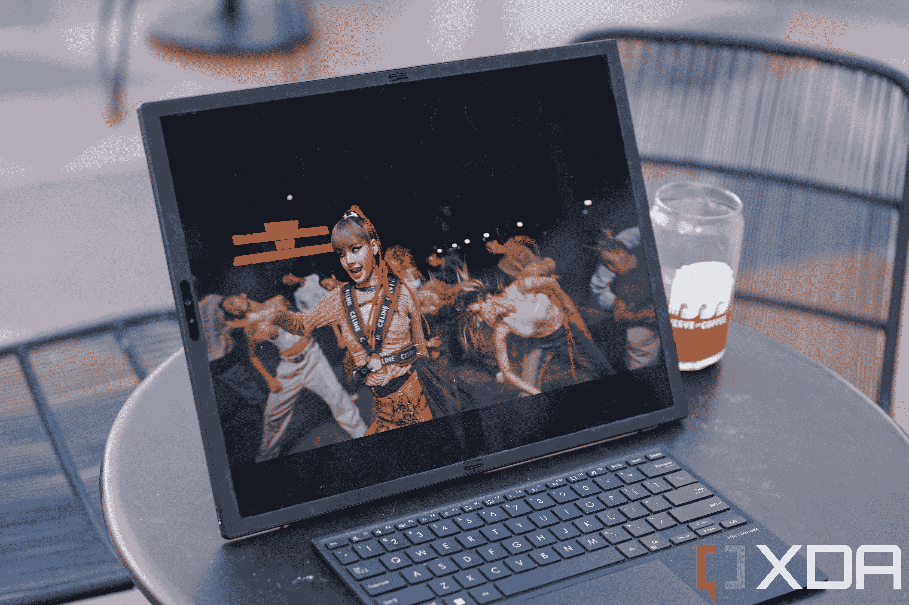
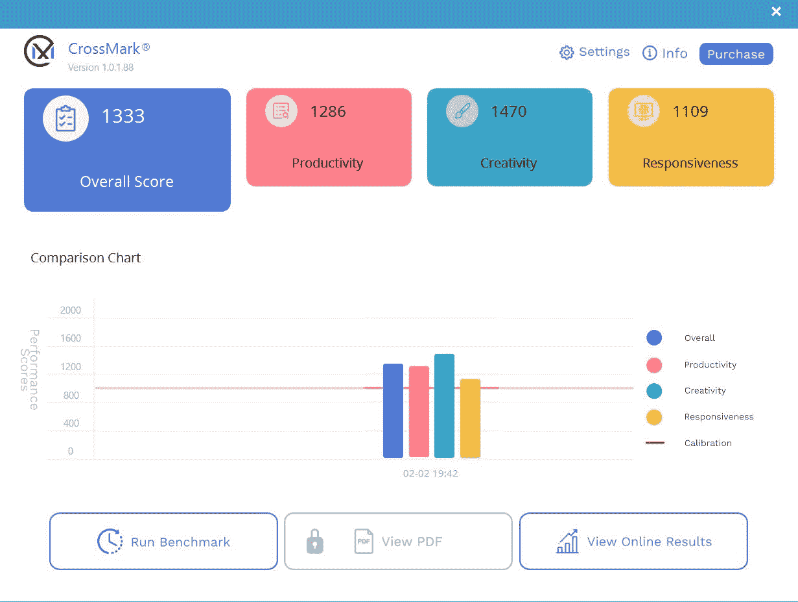

# 华硕 Zenbook 17 折有机发光二极管评论:个人电脑未来一瞥

> 原文：<https://www.xda-developers.com/asus-zenbook-17-fold-oled-review/>

如果有一件事是技术极客们都同意的，那就是屏幕越大越好。没有人会说在 12 英寸的屏幕上工作比在 15 英寸的屏幕上工作更好。但笔记本电脑不能像电视或显示器那样不断增大尺寸，因为它们必须保持便携性(以及放入包中的能力)。因此，大多数最好的消费者笔记本电脑都选择了 13 英寸的屏幕，更有野心的机器会选择 16 或 17 英寸。

但是可折叠显示技术的进步改变了一切。现在有可能配备更大的显示屏，但仍然可以折叠成便于管理的尺寸。这就是华硕 Zenbook 17 Fold 有机发光二极管的用武之地。是的，名字是笨重的，但我目前正在洛杉矶一家挤满数字游民的咖啡店里写这句话，我有迄今为止最大的工作画布，这给了我一个 4:3 纵横比的 17.3 英寸屏幕。我可以让所有重要的窗口在一个网格中打开，我不需要前倾就能看到文字。当我完成工作后，我可以把整个东西折叠成一个包，在二维空间上比大多数其他笔记本电脑都要小。

对于 Zenbook 17 折有机发光二极管有一些合理的抱怨。它的价格高达 3500 美元，甚至比不上[其他华硕笔记本电脑](https://www.xda-developers.com/best-asus-laptops/)，而且有点厚和重。但是作为一个想法，谁能否认这种设置的有用性呢？我对 Zenbook 17 Fold 的想法非常着迷，我认为当技术足够成熟，价格可以降低，电池寿命可以提高时，它将成为那些需要或希望在移动中工作的人的未来。

***关于这篇评测:**这篇评测是在测试了华硕提供的一台 Zenbook 17 Fold 有机发光二极管一周后写的。该公司在这篇文章中没有任何投入。*

##### 华硕 Zenbook 17 折有机发光二极管

华硕 Zenbook 17 Fold 有机发光二极管拥有巨大的屏幕，但其独特的外形使其成为市场上最便携的大屏幕笔记本电脑之一。然而，这个价格标签很难接受。

**Brand**

Asus

**Color**

Tech Black

**Storage**

1TB M.2 NVMe SSD

**CPU**

12th-Gen Intel Core i7-1250U

**Memory**

16GB

**Operating System**

Windows 11 Pro

**Battery**

75WHrs

**Ports**

2x Thunderbolt 4, 1x headphone jack

**Camera**

5.0MP with IR

**Display (Size, Resolution)**

17.3-inch OLED, 500 nits peak brightness, 4:3 aspect ratio

**Weight**

3.31 pounds (1.5kg)

**GPU**

Intel Iris Xe Graphics

**Dimension**

14.9 x 11.32 x 0.34 ~ 0.51 inches (378.5 x 287.6 x 8.7~11.7mm)

**Network**

Wi-Fi 6E, Bluetooth 5

**Price**

$3,499

**Pros**

*   这是一个 17.3 英寸的屏幕，可以对折，放在包里
*   优秀的键盘
*   多功能外形

**Cons**

*   高价
*   厚重
*   屏幕不够亮

## 华硕 Zenbook 17 折有机发光二极管:价格和可用性

*   这种笔记本电脑现在可以在 B&H 和新蛋等零售商处买到
*   你可以花 3499 美元买到它

华硕 Zenbook Fold 17 有机发光二极管现在在 B&H 和新蛋等零售商处有售，售价 3499 美元。它目前在华硕的网站上缺货，但你可以注册接收何时有货的通知。

## 设计和硬件:独特的外形

*   坚固的铰链和结构
*   与几乎任何其他现代计算设备相比，显示器相对较暗
*   优秀的键盘

当从盒子中取出设备时，值得记住的是，这是一台采用第 12 代酷睿 i7-1250U 处理器的一体化 PC，而不是采用更小 ARM 芯片的类似 iPad 的设备。否则，它会感觉又大又笨重。基于 Arm 芯片的移动设备通常比英特尔机器更时尚，因为后者马力更大，但能耗效率低得多。因此，华硕需要在机器中建立一个风扇，并给它额外的散热空间，这使得机器比高通骁龙芯片上运行的东西厚得多。

接下来要说明的是，这个设计不是原创的；Zenbook 17 Fold 的硬件设计和概念与 2020 年末推出的[联想 ThinkPad X1 Fold、](https://www.xda-developers.com/lenovo-thinkpad-x1-fold-hands-on/)基本相同。除了缺乏原创性和典型的 Windows 笨重硬件之外，硬件结构相当不错。铰链非常坚固，17.3 英寸的有机发光二极管显示屏没有出现折痕。显示屏周围的边框相对较厚，但这并不是一件坏事，因为它有可能被用作 17 英寸的手持平板电脑，所以更多的边框空间可以让你安心。

该设备的背面主要是铝合金，部分被人造革包裹，其中还包含内置支架。支架设计只能在横向支撑设备，然而，与联想的支架不同，联想的支架可以在纵向或横向支持设备。

当合拢时，这款设备感觉像一本大书，放在百科全书旁边的书架上也不会显得格格不入。尽管厚度很大，但 Zenbook 17 Fold 仍然可以放入我背包的笔记本电脑隔间。

有两个 UBS-C 端口，都是 Thunderbolt 4，我喜欢它们位于机器的不同侧。我可以选择将充电线放在更有利于机器当前放置的一侧，无论是放在我的腿上、床边还是咖啡桌上。还有一个 3.5 毫米耳机插孔，以及常见的电源按钮和音量摇杆。有很大的散热孔。

包装中包括薄键盘，尽管很薄，但仍提供了 1.5 毫米的出色按键行程。我打字速度很快(每分钟 107 个单词),在没有任何调整期的情况下，我很轻松地打出了单词。键盘的触控板也很灵敏。

就像联想的 ThinkPad X1 Fold 一样，Zenbook 17 Fold 的键盘被设计成能够占据半个屏幕，这样你就可以将设备折叠成 L 形，并将其用作更小的笔记本电脑。在这种形式下，你会得到一个 3:2 宽高比的 12.5 英寸屏幕。它占用的空间更小，可以和食物、饮料一起放在小咖啡店的桌子上，我想还可以放在飞机托盘桌上。

当键盘被折叠成更容易的一体式包装时，它可以夹在设备之间。挡板足够高，键盘不会接触到屏幕。

## 显示器:一点也不够亮

*   2560 x 1920 分辨率，60Hz 刷新率，4:3 宽高比
*   500 尼特的峰值亮度不足以在户外舒适地使用

## 

17.3 英寸的触摸屏分辨率为 2560 x 1920，刷新率为 60Hz，纵横比为 4:3，最大亮度约为 300 尼特。是的，这一点也不亮，而且在户外阳光直射下使用有时很困难。显示器的塑料性质意味着表面非常反光，这并没有帮助。

当在户外使用时，与我身上的任何其他便携式设备相比，这个屏幕都没有什么吸引力。但是当我在一个更加可控的环境中使用它时，没有光线从屏幕上反射，显示器看起来非常漂亮。我一直将它用作床头电影/YouTube 机器，拥有这么大的便携式显示器是一种令人满意的感觉。

## 软件和性能

*   作为一台生产力机器非常好
*   低于标准的电池寿命
*   只能玩轻度游戏

Zenbook 17 Fold 有机发光二极管运行的是 Windows 11 Pro，华硕基本上不理会该软件，只有该公司的 Display Xpert 可以算作定期弹出的臃肿。默认情况下还有 McAfee LiveSafe 杀毒软件。谢天谢地，你可以把它们都关掉。

然而，因为这台机器可以改变成几种形式，所以肯定会有软件怪癖，特别是因为这是我们正在谈论的 Windows。旋转方向需要一两秒钟，有时我可以在小型笔记本电脑模式下使用机器(键盘覆盖了半个屏幕)，但窗口会在整个 17.3 英寸的屏幕上打开，要求我移除然后放回键盘，以提醒机器应该只使用半个屏幕。

此外，这与其说是一个错误，不如说是微软的一个长期问题:Windows 在触摸屏平板电脑上很糟糕。按钮仍然很小(因为它们是为鼠标光标使用而设计的)，滑动手势，如前面提到的方向旋转，有第二次延迟。

Windows 糟糕的平板优化，加上机器的重量，使得 Zenbook 17 Fold 作为手持平板电脑不切实际。还是有用例的。例如，当我坐在沙发上阅读文章或浏览 Twitter 时，我喜欢把机器放在腿上，但这显然是三者中最糟糕的形式。

相反，当它完全展开放在桌子上，键盘就在旁边时，我绝对喜欢使用它。我喜欢在充满活力的地方写作，比如独立时尚咖啡店——比起在家里盯着同一面墙看几个小时，在这样的环境中更能激发我的创造力——而且拥有比平时更大的屏幕让我的工作更容易。

这款笔记本电脑采用英特尔第 12 代酷睿 i7-1250U 处理器，配有两个高性能内核和八个高效内核，以及 16GB 内存和 1TB 存储空间。有一块 75Wh 的电池和四个扬声器均匀分布在左右两侧。所有这些组件都很好，它们只是在笔记本电脑领域没有什么特别之处。

我不是一个很好的游戏玩家，但我也在 Zenbook 17 Fold 上尝试了几个游戏。赛车游戏 *Asphalt Xtreme* 运行得非常好，在手持模式下在如此大的屏幕上玩它感觉既棒又累。

然而，我试图在机器上通过 Xbox Game Pass 玩*光环*，这就是硬件局限性显而易见的地方。仅使用 Iris Xe 集成显卡，它无法运行 *Halo* 而不会每 10 秒左右出现明显的丢帧和打嗝。

 <picture></picture> 

Zenbook 17 Fold OLED's CrossMark score.

对于一般的工作任务，我用这台机器在 Chrome 上打开了半打标签，Spotify 流媒体和 Twitter 在旁边运行没有问题。当我试图打开第四个或第五个应用程序时，风扇确实启动了，但作为一个典型的办公室工作人员的机器，没有问题。

正如前面提到的，电池寿命并不好。即使在我的办公效率使用下，这台机器每小时也会消耗大约 15-20%的电池。如果你只是流媒体视频，机器可以运行大约 9-10 个小时，但其他任何东西，4-5 个小时将耗尽电池。

## 你应该买华硕 Zenbook 17 折有机发光二极管吗？

**你应该买华硕 Zenbook 17 Foled 有机发光二极管如果:**

*   你不认为 3500 美元是一大笔钱
*   您想要一款多功能设备，可以是小型笔记本电脑、台式电脑和迷你平板电脑
*   你想成为屏幕较小的人羡慕的对象

**你不应该买华硕 Zenbook 17 折有机发光二极管如果:**

*   3500 美元对你来说不是一笔小数目
*   你需要一个更好的显示器
*   你想玩电子游戏

虽然有很多理由购买或不购买华硕 Zenbook 17 Fold 有机发光二极管，但这一切都归结于 3500 美元对你来说是多少。这是一个公平的问题，因为我一直认为“没有人应该为一部手机支付 1000 美元”这样的笼统说法没有考虑到不同的人有不同的购买力。我有一些朋友对花 15 美元吃饭嗤之以鼻，还有一个朋友经常花 150 美元吃饭。有些人认为 3500 美元是微不足道的一笔钱，对他们来说，如果他们认为 Zenbook 17 Fold 有机发光二极管是一个很酷的小玩意，为什么不买呢？

然而，可以肯定的是，对于大多数人来说，3500 美元并不是微不足道的，所以对于大多数人来说，仅仅因为这个价格，我不能推荐 Zenbook 17 Fold 有机发光二极管。就目前而言，华硕的产品更多的是一个概念验证和对未来的一瞥，而不是一个面向大众的真正产品。

当可折叠个人电脑技术成熟时——从手机进步的速度来看，这是应该的——或许 Zenbook 17 Fold 有机发光二极管会更便宜、更薄，更适合主流市场。有传言称苹果计划推出可折叠的 iPad，我认为这个未来并不遥远。怀疑论者总是会找到消极的理由，但就像我多年来对可折叠手机所说的那样，[可折叠是未来](https://www.xda-developers.com/google-pixel-fold-foldable-scene-forward/)，个人电脑也将如此。

##### 华硕 Zenbook 17 折有机发光二极管

华硕 Zenbook 17 Fold 有机发光二极管拥有巨大的屏幕，但其独特的外形使其成为市场上最便携的大屏幕笔记本电脑之一。然而，这个价格标签很难接受。