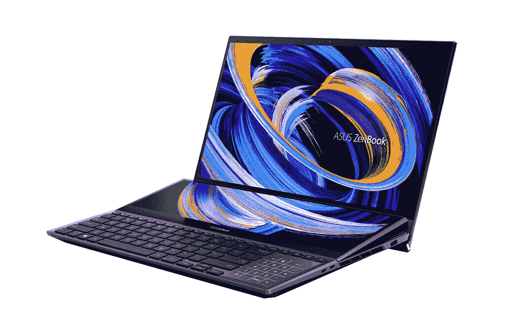
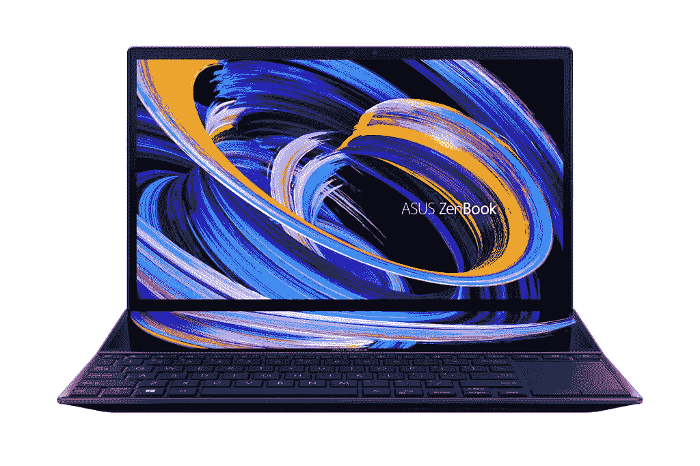

# 华硕在印度推出 ZenBook Pro Duo 15 有机发光二极管、ZenBook Duo 14

> 原文：<https://www.xda-developers.com/asus-zenbook-pro-duo-15-oled-zenbook-duo-14-india-launch/>

华硕将向印度推出两款新的高端 ZenBook 笔记本电脑。新的 ZenBook Pro Duo 15 有机发光二极管和 ZenBook Duo 14 在今年早些时候的 CES 上首次亮相，其特色是一个名为 ScreenPad Plus 的辅助显示器，以提高用户的工作效率。由于双屏体验和强大的内部硬件，这两款笔记本电脑都面向从创意专业人士到游戏玩家的广泛受众。

| 

规格

 | 

华硕 ZenBook Pro Duo 15 有机发光二极管

 | 

华硕 ZenBook Duo 14

 |
| --- | --- | --- |
| **尺寸&重量** | 

*   359.8×249.2×21.5 ~ 21.5 毫米
*   2.34 千克

 | 

*   324×222×16.9 ~ 17.3 毫米
*   起始重量为 1.57 千克

 |
| **显示** | 

*   15.6 英寸 4K UHD(3840 x 2160)OLED 触摸屏
*   440 尼特亮度
*   100% DCI-P3 色域
*   Pantone 已验证
*   VESA 显示 HDR 500 真黑
*   TUV 莱茵认证
*   14 英寸辅助 4K (3840 x 1100)IPS 级触摸屏

 | 

*   14 英寸 FHD (1920 x 1080) IPS 级别
*   400 尼特亮度
*   100% sRGB 色域
*   Pantone 已验证
*   93%的屏幕与身体比例
*   12.65 英寸辅助(1920 x 515) IPS 级触摸屏

 |
| **处理器** | 

*   英特尔酷睿 i9-10980HK
*   英特尔酷睿 i7-10870H

 | 

*   英特尔酷睿 i7-1165G7
*   英特尔酷睿 i5-1135G7

 |
| **GPU** | 

*   英特尔 UHD 公司
*   NVIDIA GeForce RTX 3070(8GB GDDR6)

 | 

*   英特尔 Iris Xe
*   NVIDIA GeForce MX450 (2GB GDDR6)

 |
| **内存&存储** | 

*   高达 32GB DDR4 内存
*   1TB M.2 NVMe PCIe 3.0 固态硬盘

 | 

*   高达 32GB LPDDR4X RAM
*   高达 1TB M.2 NVMe PCIe 3.0 固态硬盘

 |
| **电池&电源** | 

*   92 瓦时电池
*   240W 充电器

 | 

*   70 瓦时电池
*   65W 充电器

 |
| **输入/输出** | 

*   USB 3.2 第二代 A 型
*   2x 雷电 3
*   HDMI 2.1
*   3.5 毫米耳机组合插孔
*   DC-因

 |  |
| **连通性** |  |  |
| **操作系统** | 

*   Windows 10 主页
*   Windows 10 专业版

 | 

*   Windows 10 主页
*   Windows 10 专业版

 |
| **其他特征** | 

*   哈曼卡顿扬声器
*   麦克风阵列
*   手写笔支架
*   Windows Hello face 登录
*   MIL-STD 810H 认证

 | 

*   哈曼卡顿扬声器
*   麦克风阵列
*   手写笔支架
*   Alexa 语音识别支持
*   MIL-STD 810H 认证
*   Windows Hello face 登录

 |
| **价格** |  |  |

## 华硕 ZenBook Pro Duo 15 有机发光二极管

新的 ZenBook Pro Duo 15 有机发光二极管配备了 15.6 英寸 4K UHD 有机发光二极管 NanoEdge 触摸屏，提供 100% DCI-P3 色域，178 度视角，高达 440 尼特的亮度，以及 VESA Display HDR 500 True Black 认证。该显示器也通过了 Pantone 认证和 TUV 莱茵认证。辅助显示器位于键盘的正上方，对角线尺寸为 14.1 英寸，并以一定角度升起，以便更好地观看和通风。它具有 3840 x 1100 像素的分辨率，峰值亮度高达 400 尼特，100% sRGB 色域覆盖率，并支持手写笔。

 <picture></picture> 

ASUS ZenBook Pro Duo 15 OLED

该笔记本电脑采用第 10 代英特尔酷睿处理器，最高可配酷睿 i9-10980HK、32GB DDR 4 内存和 1TB M.2 PCIe 3.0 固态硬盘存储。图形由 NVIDIA 的新 GeForce RTX 3070 处理，这意味着你也可以在这台机器上享受游戏。这款笔记本电脑还支持 Wi-Fi 6 和蓝牙 5.0，而 I/O 端口包括两个雷电 3 端口、一个 USB 3.2 Gen 2 Type-A 端口、HDMI 2.1 和一个耳机插孔。对于音频，有哈曼卡顿支持的扬声器和麦克风阵列。华硕还表示，这款笔记本配备了 MIL-STD 810G 军用级标准，使其经久耐用。笔记本装有 92Wh 电池，而充电器的额定功率为 240W。

## 华硕 ZenBook Duo 14

ZenBook Duo 14 是一款较小的笔记本电脑，与 ZenBook Pro Duo 15 具有类似的双屏设置。主要的 14 英寸 FHD (1920 x 1080 像素)显示器提供了 93%的屏幕与机身比率和高达 400 尼特的亮度。它还经过 Pantone 验证，覆盖 100%的 sRGB 色域，并获得 tüV Rheinland 低蓝光认证。它还配备了 ScreenPad Plus，这是一个 12.65 英寸的辅助触摸屏，可以倾斜以提高可读性并减少眩光。该笔记本电脑采用最新的[第 11 代英特尔酷睿处理器](https://www.xda-developers.com/intel-tiger-lake-11th-gen-core-i3-i5-i7-xe/)和英特尔 Iris Xe 显卡，以及用于独立显卡的 NVIDIA GeForce MX450 选项。它还配备了[英特尔 Evo-verification](https://www.intel.com/content/www/us/en/products/docs/evo.html) ，这意味着您可以期待这款笔记本电脑提供性能、快速连接和电池续航时间的良好平衡。

 <picture></picture> 

ASUS ZenBook Duo 14

该笔记本电脑将配备最高英特尔酷睿 i7-1156G7 处理器，最高 16GB 的 LPDDR4x 内存和 1TB 的 M.2 SSD 存储。在连接部，你有两个 Thunderbolt 4 端口，一个 USB 3.2 Gen 2 Type-A 端口，一个 HDMI 1.4 和一个 3.5 毫米耳机插孔。它还具有 Wi-Fi 6 和蓝牙 v5.0 无线连接选项。据说笔记本电脑上的电池可以持续 17 小时，通过 USB-C Easy Charge，你可以使用 USB-C Power Delivery 认证的充电器或任何标准的 USB-C 充电器为笔记本电脑充电。就像 15 英寸的型号一样，ZenBook Duo 14 配备了哈曼卡顿支持的扬声器和支持 Cortana 的阵列麦克风设置。

## 定价和可用性

谈到价格，华硕 ZenBook Duo 14 (UX482)将在₹99,990 上市，并将于今天开始购买。华硕 ZenBook Pro Duo 15 OLED (UX582)的价格为₹2,39,990，将于 5 月份上市。客户可以通过亚马逊、Flipkart 和线下零售商(包括华硕专卖店、Croma、Reliance Digital 和 Vijay Sales)购买其中任何一款。