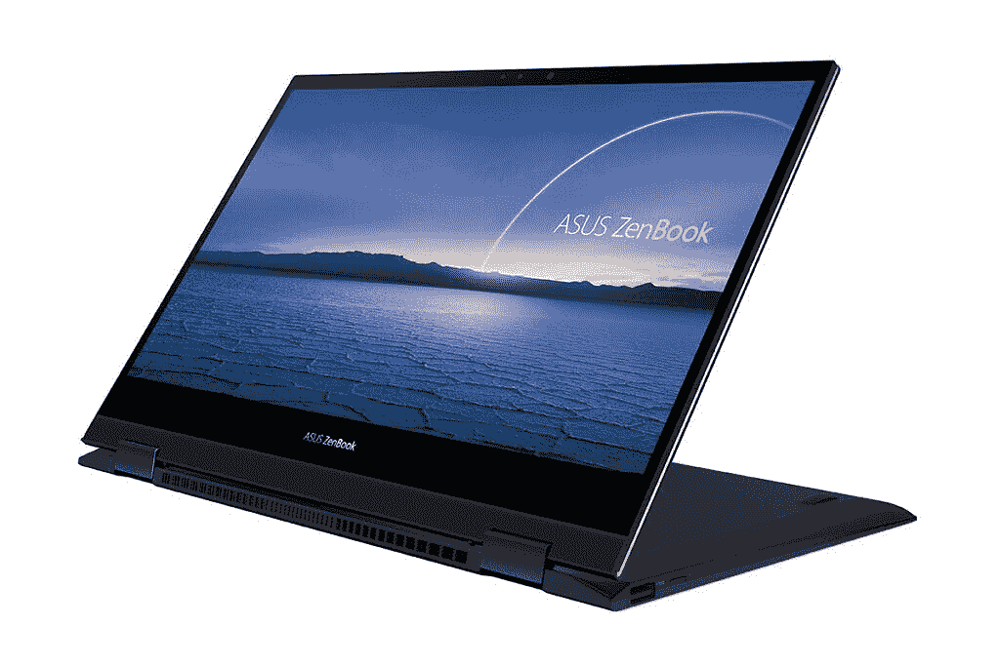
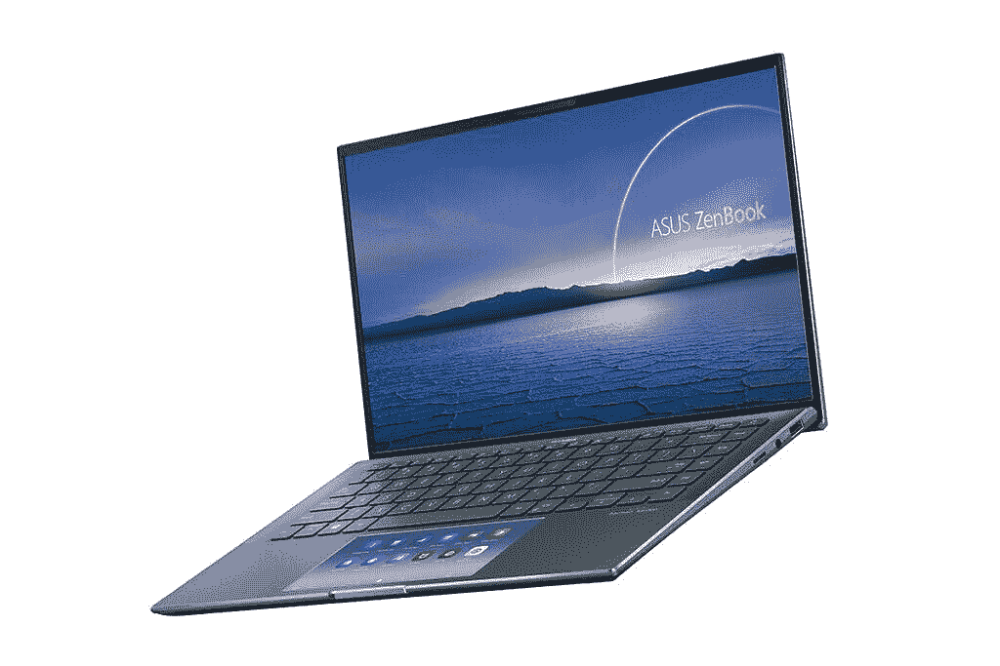
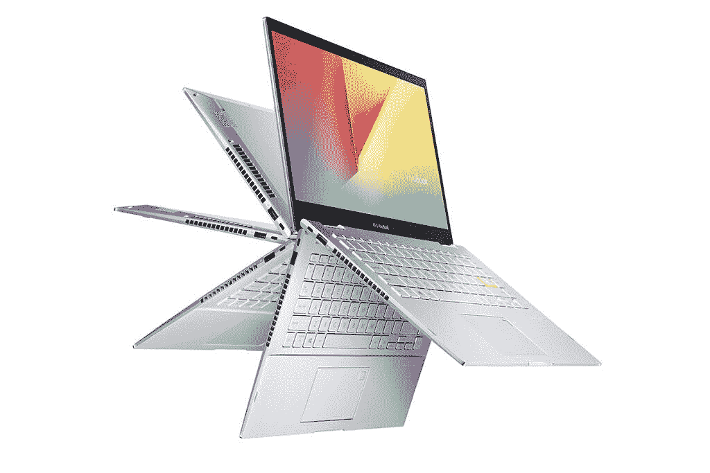
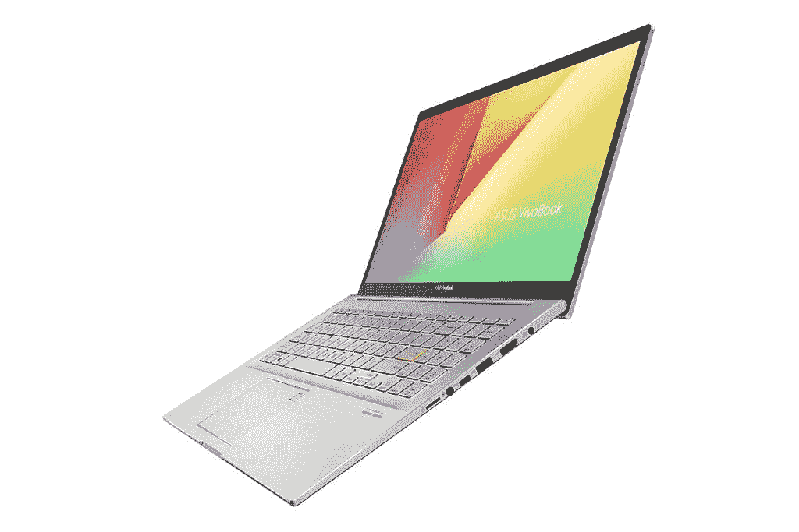

# 华硕 ZenBook、VivoBook 在印度获得新的第 11 代英特尔处理器

> 原文：<https://www.xda-developers.com/asus-zenbook-vivobook-lineups-refreshed-11th-gen-intel-processors-india/>

华硕今天在印度宣布了其新的笔记本产品系列，在印度采用了最新的第 11 代英特尔 Tiger Lake 处理器。ZenBook 和 VivoBook 系列将采用 9 月份宣布的新处理器，以及一些添加到更高端机型的新功能。除了新的处理器，华硕还提供了一些配备英伟达移动 GPU 的型号，以提高图形性能。

## 华硕 ZenBook

首先让我们看看 ZenBook 系列，这是该公司在消费者笔记本系列中的中高档产品。新的 ZenBook Flip S UX371 领先于其 4K UHD 纳米边缘有机发光二极管 HDR 触摸屏显示器，提供 400 尼特的亮度。“翻转”表示它采用了 2 合 1 设计，允许显示屏一直折叠到 180 度。华硕声称，ZenBook Flip S 上的面板 100%覆盖了 DCI-P3，133%覆盖了 sRGB 色域。它也通过了 Pantone 验证，据说可以提供 1.6 倍于 LCD 的色彩量。触摸屏支持多达 4096 个压力点的触摸手写笔。然后是 ZenBook Flip 13 UX363，与 Flip S 相比，这是一款稍微实惠的 2 合 1 产品，具有 1080p 有机发光二极管显示屏和紧凑时尚的设计。

 <picture></picture> 

ASUS ZenBook Flip S UX371

ZenBook 的不可转换版本也获得了新的处理器选项，包括 ZenBook 14 UX435，它带有该公司的 ScreenPad 功能。这就是触摸板实际上是一个触摸屏，可以用来启动应用程序和软件，甚至可以作为第二显示屏，可以拖放窗口以改善多任务处理。今年早些时候推出的轻薄型 [ZenBook 13 UX325](https://www.amazon.in/ASUS-i7-1165G7-13-3-inch-Graphics-UX325EA-EG701TS/dp/B08P66543L/?tag=xdaportalin-21) 和 [ZenBook 14 UX425](https://www.amazon.in/ASUS-ZenBook-i5-1135G7-Graphics-UX425EA-BM501TS/dp/B08M4SQ83T/?tag=xdaportalin-21) 型号采用了英特尔第十代处理器，也获得了最新的处理器选项，价格明显与上一代型号相似。

 <picture></picture> 

ASUS ZenBook 14 UX435

## 华硕 VivoBook

VivoBook 系列也更新了最新的第 11 代英特尔处理器，这些处理器面向主流笔记本用户。因此，这个系列不像 ZenBook 那么高端，但应该是物有所值的。

 <picture></picture> 

ASUS VivoBook Flip TP470

VivoBook S 系列有 13 英寸(S333)、 [14 英寸(S433)](https://www.amazon.in/ASUS-VivoBook-i5-1135G7-Graphics-S433EA-AM501TS/dp/B08PQXKZG6/?tag=xdaportalin-21) 和 15 英寸(S532)型号，而 VivoBook Flip 14 TP470 是一款二合一选件。最实惠的选择是 VivoBook Ultra，它将提供 14 英寸(K413)和 15 英寸(K513)两种尺寸。

 <picture></picture> 

ASUS VivoBook K15 K513

上述所有笔记本电脑都采用了新的英特尔 Tiger Lake 处理器，从酷睿 i3-1115G4 到酷睿 i7-1165G7。

## 定价和可用性

华硕通过各种分销渠道提供笔记本电脑，包括在线合作伙伴亚马逊、Flipkart、Reliance Digital、Vijay Sales、Croma 以及各种线下零售商，包括他们自己的分销渠道。

| 

模型

 | 

处理器

 | 

制图法

 | 

显示

 | 

RAM 和存储

 | 

价格

 |
| --- | --- | --- | --- | --- | --- |
| 华硕 VivoBook Ultra K413/K513 |  |  | 14 英寸 FHD LED 背光，45% NTSC 覆盖率 |  | 从₹49,990 开始 |
| 华硕 VivoBook Flip 14 TP470 |  |  | 14 英寸 FHD LED 背光，45% NTSC 覆盖率 |  | 从₹51,990 开始 |
| 华硕 vivo book S S13/S14/S15(S333/S433/S532) |  |  |  |  | [从₹89,990 开始](https://www.amazon.in/ASUS-VivoBook-i5-1135G7-Graphics-S433EA-AM501TS/dp/B08PQXKZG6/?tag=xdaportalin-21) |
| 华硕 ZenBook 13/14 (UX325/UX425) |  | 英特尔 Iris X ^e 显卡 |  |  | [从₹82,990 开始](https://www.amazon.in/ASUS-i7-1165G7-13-3-inch-Graphics-UX325EA-EG701TS/dp/B08P66543L/?tag=xdaportalin-21) |
| 华硕 ZenBook 14 UX435 |  | NVIDIA GeForce MX450 2GB GDDR6 | 14 英寸 FHD IPS 级液晶面板，防眩光显示屏，LED 背光(可选触摸屏) |  | 从₹99,990 开始 |
| 华硕 ZenBook Flip 13 UX363 | 英特尔酷睿 i5-1135G7

*   英特尔酷睿 i7-1165G7
*   英特尔 Iris X ^e 显卡

 | 13.3 英寸 FHD 有机发光二极管触摸屏，400 尼特亮度 | 13.3 英寸 FHD 有机发光二极管触摸屏，400 尼特亮度 | 高达 16GB 4266MHz DDR4 内存

*   512GB M.2 NVME PCIe 固态硬盘
*   32GB 英特尔 Optane(可选)
*   从₹94,990 开始

 | 华硕 ZenBook Flip S UX371 |
| 英特尔酷睿 i7-1165G7 | 英特尔 Iris X ^e 显卡 | 13.3 英寸 4K UHD 有机发光二极管 HDR 触摸屏，100% DCI-P3 覆盖率，400 尼特亮度 | 13.3 英寸 4K UHD 有机发光二极管 HDR 触摸屏，100% DCI-P3 覆盖率，400 尼特亮度 | 16GB 4266MHz DDR4 内存

*   1TB M.2 NVME PCIe 固态硬盘
*   从₹1,49,990 开始

 | 从₹1,49,990 开始 |