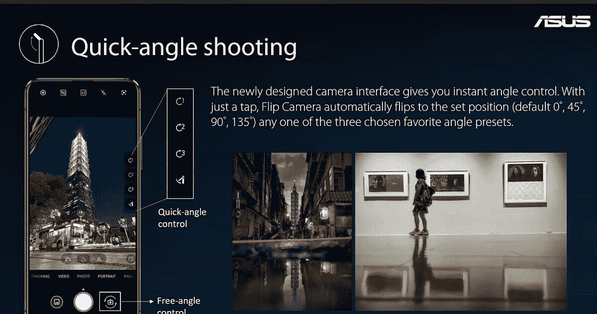
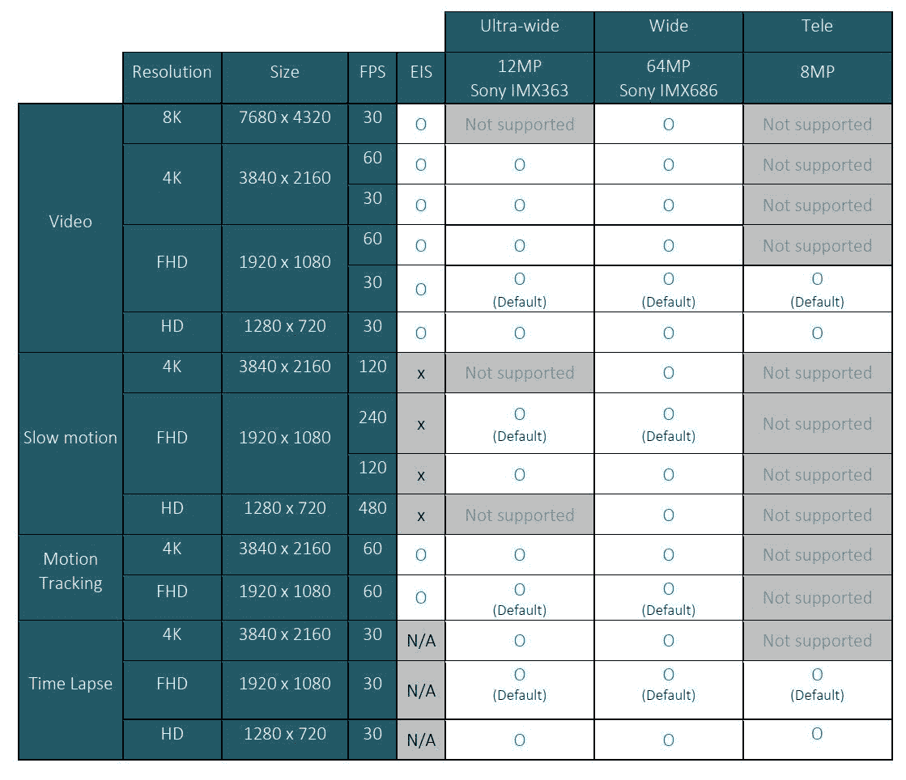

# 华硕 ZenFone 7 吹捧一个电动翻转相机和旗舰性能

> 原文：<https://www.xda-developers.com/asus-zenfone-7-pro-specs-features-pricing-availability/>

**更新 1 (09/01/2020 @ 06:26 PM ET):** 华硕在欧洲推出了 ZenFone 7 系列，起价为€699 英镑，并确认这款手机不会在美国推出。滚动到底部了解更多信息。下面保留了 2020 年 8 月 26 日发表的文章。

几代人以来，华硕 ZenFone 系列一直是经济实惠的旗舰产品领域的有力竞争者，但由于各种原因，华硕设备通常都不为人所知。[华硕 ZenFone 6](https://www.xda-developers.com/tag/asus-zenfone6/) 或[华硕 6Z](https://www.xda-developers.com/asus-6z-zenfone-6-launch-india/) 是被低估的智能手机的一个典型例子，它为我们提供了一些最好的智能手机硬件和软件，而又没有倾家荡产。由于其翻转相机模块，它还是少数几款没有凹口*或*打孔切口的智能手机之一。ZenFone 6 的继任者现在在 ZenFone 7 中，尽管这一次，有两个设备需要讨论。认识一下新的华硕 ZenFone 7 和 ZenFone 7 Pro。

**[华硕 ZenFone 7 论坛](https://forum.xda-developers.com/asus-zenfone-7)**| |**|[华硕 ZenFone 7 Pro 论坛](https://forum.xda-developers.com/asus-zenfone-7-pro)**

## 华硕 ZenFone 7 和 ZenFone 7 Pro 规格

| 

规格

 | 

华硕 Zen fone 7(zs 670 ks)/Zen fone 7 Pro(zs 671 ks)

 |
| --- | --- |
| **尺寸&重量** | 

*   165.08 x 77.28 x 9.6 毫米
*   230 克

 |
| **设计&建造** | 

*   玻璃背面带有康宁大猩猩玻璃 3 保护层
*   铝制中框
*   没有 IP 等级
*   底部的 LED 指示灯

 |
| **显示** | 

*   6.67 英寸全屏纳米边缘显示屏(三星 AMOLED 面板)
*   92%的屏幕与机身比例
*   2400x1080 分辨率，20:9 纵横比，100000:1 对比度，δE<1 color accuracy
*   550 nits with 100% APL, 700 nits with HBM and 100% APL, 1000 nits peak for HDR
*   90Hz refresh rate, 200Hz touch sampling rate, 1ms response time
*   HDR10+ certified, SGS Certified Eye Care Display
*   Corning Gorilla Glass 6 protective layer
*   Pixelworks' Soft Iris Features:
    *   HDR Tone Mapping
    *   DC Dimming

 |
| **CPU&GPU** | 

*   ZenFone 7
    *   高通骁龙 865
        *   1 个 Kryo 585(基于 ARM Cortex-A77)Prime core @ 2.84 GHz
        *   3 个 Kryo 585(基于 ARM Cortex-A77)性能内核@ 2.4GHz
        *   4 个 Kryo 385(基于 ARM Cortex A55)高效内核@ 1.8GHz
    *   肾上腺素 650
*   **ZenFone 7 Pro:**
    *   高通骁龙 865 Plus
        *   1 个 Kryo 585(基于 ARM Cortex-A77)Prime core @ 3.1 GHz
        *   3 个 Kryo 585(基于 ARM Cortex-A77)性能内核@ 2.4GHz
        *   4 个 Kryo 385(基于 ARM Cortex A55)高效内核@ 1.8GHz
    *   Adreno 650 (10%超频)

 |
| **内存&存储** |  |
| **电池&充电** |  |
| **安全** | 侧装式指纹传感器(0.3 秒解锁，支持 5 个指纹)，集成基于智能钥匙软件的面部识别 |
| **摄像机** | **照片:**

*   **主要:**
    *   64MP 索尼 IMX686
    *   4 合 1 像素宁滨，1600 万像素默认输出分辨率
    *   f/1.8 光圈，1/1.7 英寸传感器，0.8μm/1.6μm 有效像素尺寸，2x1 OCL PDAF，EIS
    *   赞成:OIS
*   **二次(超广角):**
    *   12MP 索尼 IMX363
    *   113 FoV，实时失真校正
    *   f/2.2 光圈，双 PDAF
    *   4cm 微距摄影
*   **第三代(长焦):**
    *   800 万像素
    *   3 倍光学变焦，12 倍总变焦
    *   f/2.4 光圈
    *   赞成:OIS
*   双 LED 闪光灯

**视频:**

*   主要:高达 8K @ 30fps，带 EIS
*   次要:高达 4K @ 30/60 fps
*   第三级:高达 1080p @ 30fps
*   慢动作:4K @ 120fps，1080p @ 240fps，720p @ 480fps
*   超稳定:1080p @ 30/60fps
*   运动跟踪:4K @ 60fps
*   时间流逝:4K
*   3 个麦克风，用于滤风、麦克风聚焦和声音聚焦功能
*   录制过程中镜头之间的无缝转换

**其他模式&特点:**

*   汽车全景
*   快速角度拍摄
*   人像模式
*   夜间模式
*   专业视频模式

 |
| **音频** | 立体声动态 5 磁铁扬声器，带双智能放大器(恩智浦 TFA9874 智能放大器)和采用华硕降噪技术的三麦克风 |
| **端口** | USB Type-C，无显示端口备用模式/视频输出无 3.5 毫米音频插孔 |
| **连通性** |  |
| **软件** | 搭载 ZenUI 7 的 Android 10 |
| **颜色** | 极光黑、粉彩白 |
| **包装盒内** |  |

## 设计和展示

在 ZenFone 7 系列中，华硕通过跳过 2020 年在显示器上打孔的趋势，保留了正面的“全屏纳米边缘显示器”。今年的显示屏实际上比 ZenFone 6 上的更大；华硕将屏幕尺寸从 ZenFone 6 的 6.4 英寸提高到了 ZenFone 7 系列的 6.67 英寸。下巴变大了，但是变薄了，尽管一些部件被移动了以达到这个效果；例如，通知 LED 现在位于底部，而不是顶部挡板。

华硕 ZenFone 7 的背面是玻璃材质但有一层康宁的 3D 曲面大猩猩玻璃 3 做一些保护；正面显示屏同样受到一层康宁大猩猩玻璃 6 的保护。中框由“一块 6000 系列铝”制成，翻盖相机外壳除外(我们稍后会谈到)。在底部，你会发现 USB Type-C 端口，1 个麦克风，通知 LED 和一个底部发射扬声器。另一个扬声器位于顶部挡板，在通话过程中也可用作耳机扬声器。两个扬声器都有 5 个磁铁，并由恩智浦的 TFA9874 智能放大器放大。虽然这意味着华硕 ZenFone 7 和 7 Pro 像 ROG Phone 3 一样有双扬声器，但后者的特点是拥有瑞典音频公司 Dirac 的大量音频调谐。

在顶部，你会发现另一个麦克风，但除此之外什么都没有——翻盖相机，带有三个摄像头阵列，占据了很大的空间！在左侧，您会发现三卡插槽，最多可容纳 2 个 nanoSIM 卡插槽+ 1 个 microSD 卡。在右边，你会发现音量按钮和电源按钮，它也容纳了电容指纹扫描仪，并作为一个可编程的“智能钥匙”。

如果你注意到了，我们没有提到 3.5 毫米音频插孔。那是因为华硕 ZenFone 7 和 ZenFone 7 Pro 都没有，可悲。华硕表示，他们不得不做出这种妥协，以保留 ZenFone 6 的相同 5,000mAh 电池，为更大的翻盖相机模块腾出空间，并容纳占用额外 PCB 空间的[专用 5G 调制解调器和天线](https://www.xda-developers.com/5g-push-unintentionally-killed-flagship-killer-this-year/)组件。

华硕 ZenFone 7 系列最大的改进之一是，您现在可以获得刷新频率高达 90Hz 的三星 AMOLED 显示屏。ZenFone 6 上的 60Hz LCD 本身并不坏，但消费者已经开始将有机发光二极管和更高的刷新率与旗舰产品联系起来，而 ZenFone 7 两者都有。当然，还有其他显示改进，包括δE<1 color accuracy, higher brightnesses, HDR10 support for video streaming services like Netflix, and some of [pixel works 的软光圈功能](https://www.xda-developers.com/pixelworks-iris-5-visual-processor-android-display-experience-oppo-find-x2/)，如 HDR 色调映射和 DC 调光。分辨率保持在全高清以上，低于一些高端旗舰产品，但对于该范围内的设备来说是典型的。

## 翻转相机

翻盖相机模块是华硕 ZenFone 6 真正脱颖而出的功能之一，它在华硕 ZenFone 7 上得到了多方面的改进。首先，华硕已经改善了处理外壳所用液态金属的方式，这有望意味着 ZenFone 7 不会像 ZenFone 6 那样面临很多供应问题。华硕表示，有一种新的步进电机模块可以带来更快、更平稳、更准确的运动。还有一个角度传感器可以检测翻转相机的角度，允许用户设置相机应该翻转的预定义角度。

华硕表示，ZenFone 7 的步进电机内部采用了 I 形设计，而 ZenFone 6 采用了 U 形电机。这种设计效率更高，扭矩增加了近 2.2 倍，而体积却缩小了约 40%。(华硕表示，步进电机的更高扭矩应该不会对电池寿命产生不利影响，因为大多数人不会经常使用相机。)此外，ZenFone 7 使用了 18 层柔性印刷电路(FPC)电缆，具有 110 个信号输出，允许翻盖相机模块承受“高达 200，000 次”的翻转。这是 ZenFone 6 额定翻转次数的两倍，Zen fone 6 有 32 根信号电缆和 17 根电源电缆，总共有 49 个信号输出。翻盖相机外壳甚至可以承受 40%以上的重量(35 千克)，不会因弯曲而断裂。

由于这款翻盖相机，你不仅可以获得一个干净的正面，只有最少的边框，没有缺口或穿孔，而且还是一个很好的自拍相机。由于后置摄像头可以翻转成为前置摄像头，因此您可以从正面和背面获得相同的图像传感器和相机模式。大多数智能手机都有强大的后置摄像头，但前置摄像头的质量却不尽相同；或者在罕见的关注自拍的智能手机的情况下，情况正好相反。通过翻转相机设置，华硕 ZenFone 7 提供了两个世界的最佳选择。

来源:华硕

这次的翻盖相机采用了三摄像头设置(和双 LED 闪光灯)，包括一个主 64MP 索尼 IMX686 图像传感器，带有 f/1.8 光圈镜头和 2x1 片上镜头(OCL) PDAF，一个辅助 12MP 索尼 IMX363 图像传感器，带有 f/2.2 光圈、113 视场广角镜头和双 PDAF，以及一个第三 8MP 图像传感器，带有 f/2.4 光圈和 3 倍光学变焦镜头。来自主摄像头的图像被像素合并到 1600 万像素的分辨率，并在 ZenFone 7 Pro 上使用 OIS 进行稳定。长焦相机也安装在 OIS 模块中，尽管这只是华硕 ZenFone 7 Pro 型号的情况。超广角相机还可以通过自动对焦进行低至 4 厘米距离的微距摄影，它还负责 HyperSteady 功能，该功能结合了超广角相机和 EIS 的更宽 FoV，以提供更大的裁剪画布来补偿相机抖动。

在私下里，华硕对 ZenFone 7 进行了几项调整，以提高相机质量，包括改善颜色和对比度再现，添加独立的焦点和曝光调整功能，在变焦时实现 3 个相机之间的无缝转换，实现面部的实时失真校正，以及使用 IMX686 传感器的高增益模式在低光下将亮度提高多达 12dB。为了获得更好的低光照片，华硕已经将其夜间模式更新为动态模式，这意味着相机应用程序可以根据检测到的光线和移动量提供更长的曝光选项。

对于视频，ZenFone 7 支持最高 8K @ 30fps 的 EIS，最高 4K @ 120fps 的慢动作，以及最高 1080p @ 60fps 的 HyperSteady。有趣的是，这使得华硕 ZenFone 7 可能是唯一一款支持从正面进行 8K 视频录制的智能手机。华硕已经包括 3 个麦克风，以改善音频记录，这些麦克风用于风过滤器功能，麦克风焦点(即。音频缩放)特征，以及声学聚焦(即定向音频)特征。还有一个新的专业视频模式，用于手动控制焦点、白平衡、ISO 等。在视频录制期间，虽然它还不支持音频录制的外部麦克风。不过，在专业视频模式中有一个新的自由变焦功能，可以让你在取景器中的任何位置点击，快速放大特定的点。录制的同时，还可以在镜头间无缝过渡。

 <picture></picture> 

Source: ASUS

最后，华硕还改进或增加了一些独特的相机功能，使翻转相机系统成为可能。快速角度拍摄是一项新功能，它使用角度传感器将相机快速调整到用户定义的 3 个角度之一。运动跟踪得到了改进，现在可以在自动跟踪对象时无缝放大。自动全景得到优化的快门速度调整，现在与超广角相机。一个尚未添加的功能是定时模式下的自动平移，华硕表示这是可能的，但需要进一步优化相机算法。

 <picture></picture> 

A chart summarizing which video features are supported by the 3 cameras on the ASUS ZenFone 7\. Source: ASUS

## 表演

在内部，ZenFone 7 系列仍然是一款旗舰产品。你在非专业版上得到[高通骁龙 865](https://www.xda-developers.com/qualcomm-snapdragon-865-processor-specifications-features/) SoC，在专业版上得到[高通骁龙 865 Plus](https://www.xda-developers.com/qualcomm-snapdragon-865-plus-launch/) (很像 [ROG Phone 3](https://www.xda-developers.com/asus-rog-phone-3-gaming-smartphone-snapdragon-865-plus-144hz-display-6000mah-battery-launch/) )。对于那些不熟悉的人，高通骁龙 865 采用 TSMC 的 7 纳米工艺制造，采用 1+3+4 配置的八核 CPU，由 1 个 ARM Cortex-A77“Prime”内核@ 2.84GHz，3 个 ARM Cortex-A77“Performance”内核@ 2.4GHz 和 4 个 ARM Cortex-A55“Efficiency”内核@ 1.8GHz 以及 Adreno 650 GPU 组成。骁龙 865“Plus”拥有一个 3.1GHz 的超频 Prime core 和一个 10%速度的 GPU。无论如何，ZenFone 7 和 7 Pro 都配有 LPDDR5 内存和 UFS 3.1 存储，7 有 6GB 或 8GB 内存和 128GB 存储，而 7 Pro 有 8GB 内存和 256GB 存储。使用 microSD 卡，存储空间仍可扩展至 2TB。

除了打包更新的芯片组，华硕还进行了几项软件优化，以提高 ZenFone 7 的 UI 流动性和响应能力。其中包括:

*   启动时间减少到 13.32 秒。
*   图像预览(拍照后图像预览的速度)减少到 0.13 秒。
*   解锁速度降低到 0.28 秒。
*   接听电话的反应时间减少到 0.48 秒。
*   一般内存管理调整，以改善多少应用程序可以留在后台缓存。

对于核心性能指标评测或游戏，可以通过切换高性能模式来进一步提升软件的性能，这将热限制从 37°C 的峰值皮肤温度提高到 46°C，并将 CPU 频率保持在最高水平。

因为 ZenFone 7 和 7 Pro 有高通的骁龙 865 SoC，也有高通的骁龙 X55 多模 5G/4G/3G/2G 调制解调器。ZenFone 7 系列支持低于 6GHz 的 5G 网络，但没有毫米波天线。一次只能从一张 SIM 卡使用 5G 数据。高通 FastConnect 芯片提供对 Wi-Fi 6 和蓝牙 5.1 的支持，同时主芯片组还提供对双频 GNSS 的支持以及对 T2 卫星网络的支持。

## 电池和充电

为华硕 ZenFone 7 和 7 Pro 供电的是一个 5,000 mAh 的大电池，使用华硕的 HyperCharge 技术可以充电高达 30W，使用高通 Quick Charge 4.0 兼容充电器可以充电高达 27W，或者通过 USB PD 3.0 PPS 充电器可以充电高达 30W。通过包装盒中提供的 30W USB PD 3.0 PPS 适配器，ZenFone 7 可以在不到 35 分钟的时间内充满 60%。这可能没有市场上一些[更疯狂的有线充电实现](https://www.xda-developers.com/iqoo-5-iqoo-5-pro-120w-flashcharge-launched-in-china/)快，但对电池寿命来说也更安全。为了安抚那些希望最大限度延长设备寿命的用户，华硕还增加了几个可选的电池保护功能，包括慢速充电开关、带智能警报的充电计划程序、充电限制和可定制的电池模式。

唯一真正缺少的是无线充电支持。

## 泽内 7 号

华硕的 ZenUI 软件已经升级到 ZenUI 7 版本。它仍然基于谷歌的 Android 10 版本，尽管未来计划对 Android 11 进行更新。凭借 ZenUI 7，华硕增加了几个新功能，包括:

*   **新功能**
    *   一个新的切换来改变快速设置布局，使其更加单手友好。
    *   主题。除了系统范围的深色主题(现在可以根据太阳周期或自定义计划进行安排)，您还可以从 4 种字体样式、8 种主题颜色、4 种图标形状和 4 种电源菜单样式中进行选择。
    *   新的 Hibernate 应用程序功能可以检测和暂停某些在后台运行的应用程序。华硕表示，这项功能将闲置电池寿命提高了 67%，但它在默认情况下是禁用的，因此用户不会错过他们的[应用程序被过早终止的重要通知](https://www.xda-developers.com/dontkillmyapp-benchmark-test-background-app-killing/)。
    *   三指截屏手势。
    *   完成静音切换，使系统在您将手机静音时将媒体音量设置为 0。
    *   当按下音量摇杆时，显示所有音量调节和媒体输出的快捷方式。
*   **对旧功能的增强**
    *   更智能的智能钥匙功能。智能钥匙在 ZenFone 6 上是一个独立的按钮，但现在它与电源按钮集成在一起，电源按钮中还嵌入了指纹扫描仪。这意味着任何智能键操作现在都可以在屏幕关闭和手机锁定时工作，因为点击智能键也会扫描你的指纹。
    *   新的音乐控制手势- Draw ||暂停/恢复音乐或< to skip to the previous track or >跳到下一首曲目。
    *   ZenTalk 社区已经重新设计，你很快就可以从系统更新页面轻松注册 ZenUI 测试版。
    *   游戏精灵已经更新了 ROG 界面中的实时系统信息覆盖。
    *   始终展示 3 种不同的时钟风格。

除此之外，ZenUI 与其早期版本相比没有太大变化。总体外观和感觉保持不变，华硕大部分遵循传统的 Android 设计，同时在顶部添加了大量功能和定制选项。

## 华硕活动案例

最后但同样重要的是，华硕在 ZenFone 7 的包装盒中包括了一个新的“活动外壳”。这种加固的情况下提供了保护周围的角落，并与相机颠簸水平。还有一个插销，你可以拔出来锁定相机，以防你担心翻盖相机意外激活。

## 华硕 ZenFone 7 定价和可用性

华硕 ZenFone 7 和华硕 ZenFone 7 Pro 可能是今年香草-Pro 组合的最佳实现，因为无论你选择什么手机，你都可以获得一个坚实的旗舰。Pro 有一些很好的额外功能，但如果你预算紧张，你不会后悔选择香草变种，[这不是我们可以对每个设备系列都说的](https://www.xda-developers.com/dont-buy-regular-galaxy-note-20/)。两者之间唯一的区别是 SoC，RAM 和存储量，以及主相机和长焦相机上 OIS 的存在。

华硕 ZenFone 7 系列将在台湾推出极光黑和粉彩白两种颜色，售价如下:

*   华硕 Zen fone 7(6GB+128 GB):21990 新台币
*   华硕 Zen fone 7 Pro(8GB+256 GB):27990 新台币

这两款手机自 8 月 26 日起在华硕的祖国台湾销售，但从 9 月 1 日开始，现在也在几个欧洲国家销售，如西班牙、法国、葡萄牙、意大利、德国和爱尔兰，但不包括英国。以下是欧洲的定价:

*   华硕 ZenFone 7 (8GB + 128GB): €699
*   华硕 ZenFone 7 Pro (8GB + 256GB): €799

华硕不打算在美国销售这款手机，尽管该公司尚未证实是否有计划在印度销售这款手机，由于[商标问题](https://www.xda-developers.com/asus-zenfone-copyright-india-zen/)，这款手机可能会在印度以“华硕 7Z”的名称销售。

[ASUS ZenFone 7 论坛](https://forum.xda-developers.com/asus-zenfone-7)| |**[ASUS zenfone 7 论坛](https://forum.xda-developers.com/asus-zenfone-7-pro)**

[ASUS ZenFone 7 论坛](https://forum.xda-developers.com/asus-zenfone-7)| |**[ASUS zenfone 7 论坛](https://forum.xda-developers.com/asus-zenfone-7-pro)**