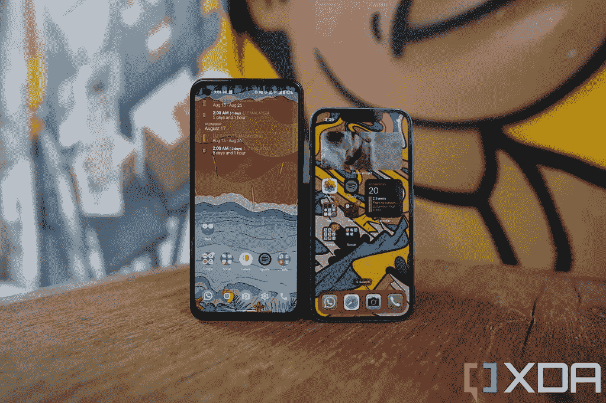
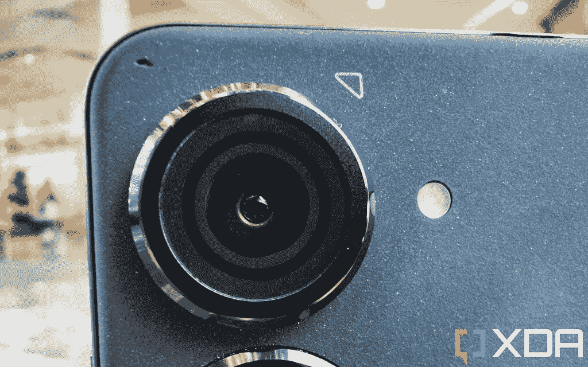

# 华硕 Zenfone 9 评测:比 iPhone 13 Mini 更好的小手机

> 原文：<https://www.xda-developers.com/asus-zenfone-9-review/>

华硕的 Zenfone 系列并不总是很小。就在几年前， [Zenfone 7 和 Zenfone 7 Pro](https://www.xda-developers.com/asus-zenfone-7-pro-review-a-flipping-fantastic-flagship-smartphone/) 配备了通常的 6.7 英寸屏幕，这在 Android 领域是不稀罕的。但从去年的 Zenfone 8 开始，华硕转向了一个要求:手机必须小。事实上，工程师和设计师有很难达到的目标:设备的宽度必须小于 70 毫米。华硕的代表说，这个数字是因为这是普通人的拇指水平能达到的最远距离。华硕成功实现了这一目标，而 [Zenfone 8](https://www.xda-developers.com/asus-zenfone-8-review/) 是一款非常简单的单手手机，也许是因为完全缺乏竞争，它被几乎所有科技出版物评为最佳小型安卓手机。

但是除了小，Zenfone 8 没有任何其他显著的特点。它和其他安卓旗舰机运行在同一个芯片上，摄像头一般，也许最糟糕的是，它的设计是我见过的最简单、最普通的设计之一。

这一切都随着 [Zenfone 9](https://www.xda-developers.com/asus-zenfone-9-launch/) 而改变:它有一个视觉上引人注目的设计，看起来和感觉都很棒，一个由微型万向节稳定系统支持的改进的主摄像头，一个全新的骁龙旗舰芯片，可能会在北美首次亮相，是的，华硕仍然设法让手机变得很小。Zenfone 9 的起价为 699 美元，这是一个显而易见的推荐，不仅适用于寻求小型手机的人，也适用于寻求超值旗舰产品的人。

顺便说一句，注意我没有走捷径，说 Zenfone 9 是为那些寻找“小型*Android*手机”的人准备的不，我认为这是最好的小型手机。苹果可能已经砍掉了它的迷你产品线，但如果它还在生产迷你 iPhones，它应该向华硕学习。

​​​​​​​

* * *

## 华硕 Zenfone 9:定价和可用性

华硕 Zenfone 9 将很快在世界许多地方上市，包括美国、加拿大、英国、新加坡、香港和台湾。在美国，Zenfone 9 的基本 8GB/128GB 型号的建议零售价为 699 美元，而同一型号在欧洲的€起价为 799 美元。

 <picture></picture> 

Asus Zenfone 9

##### 华硕 Zenfone 9

华硕 Zenfone 9 是一款小型手机，内置一个强大的旗舰芯片和一个可以工作的万向摄像头系统。

## 华硕 Zenfone 9:规格

| 

规格

 | 

华硕 Zenfone 9

 |
| --- | --- |
| **打造** | 

*   IP68 防尘防水等级
*   聚碳酸酯背面
*   大猩猩玻璃 Victus 正面

 |
| **尺寸&重量** | 

*   146.5 x 68.1 x 9.1 毫米
*   169 克

 |
| **显示** | 

*   5.9 英寸三星 AMOLED
*   120 赫兹
*   1080 x 2400
*   800 尼特峰值亮度

 |
| **SoC** | 高通骁龙 8 加第 1 代 |
| **闸板&存放** | 

*   8GB LPDDR5 内存+ 256GB UFS 3.1 存储
*   8GB + 256GB
*   16GB + 256GB

 |
| **电池&充电** | 

*   4300 毫安时
*   30W 有线快速充电支持

 |
| **安全** | 侧装式指纹扫描仪 |
| **后置摄像头** | 

*   主要:50MP 索尼 IMX766，f/1.9，由万向节系统支持
*   超宽:12MP IMX363，f/2.2

 |
| **前置摄像头** | 12MP IMX663 |
| **端口** | USB 类型-C |
| **音频** |  |
| **连通性** | 

*   双 5G
*   4G LTE
*   无线网络 6
*   蓝牙 5.2
    *   BLE 音频支持
    *   骁龙声音支持
    *   AAC/LDAC/LHDC/aptX 自适应

*   多功能 NFC

 |
| **软件** | 基于 Android 12 的 ZenUI |
| **其他功能** | 

*   耳机插孔
*   含 30W 充电器

 |

***关于这篇评测:**华硕给我和我的同事 Adam Conway 各提供了一台 Zenfone 9 进行测试。这篇评论是在对手机进行了近两周的测试后撰写的。华硕在这次审查中没有任何投入。*

* * *

## 华硕 Zenfone 9:硬件和设计

*   5.9 英寸的屏幕是一款非常容易使用的单手手机，但它不像 iPhone 13 的迷你屏幕那样太小
*   对 Zenfone 8 进行了重大美学改进
*   对于一部小手机来说，电池寿命真的非常好

我经常从手机粉丝那里听到的一个抱怨是，移动品牌将最好的硬件功能留给了大手机，而将较小的手机留在了较低的层次。嗯，华硕的工程师在最近的一次媒体吹风会上提出了一个很好的观点:在 2022 年制造一款小型旗舰比十年前困难得多，因为顶级移动组件的尺寸急剧增加。根据华硕的说法，为 Zenfone 9 提供动力的[高通骁龙 8 Plus Gen 1](https://www.xda-developers.com/qualcomm-snapdragon-8-plus-gen-1/) 芯片比去年的骁龙 888 大 10%；Zenfone 9 的改进相机系统比 Zenfone 8 的相机大 40%；而且 Zenfone 9 的电池和散热系统也比去年大了很多。

尽管如此，华硕仍然设法保持 Zenfone 9 的整体尺寸与 Zenfone 8 大致相同(重量也完全相同)。Zenfone 9 的尺寸为 146.5 x 68.1 x 9.1 毫米，重量为 169 克，按照 2022 年的标准，它仍然是一款非常小的手机。我的拇指确实可以轻松地到达屏幕的另一边，尽管它仍然需要伸展一点才能到达顶角。但这完全不是问题，因为 Android 的用户界面，加上华硕的软件微调，意味着我永远不需要到达屏幕顶端做任何事情。没有 iPhones 让我每天做十几次的烦人的“从右上角滑动”动作。我将在后面的软件部分详细讨论这一点，但其他一些手机用户界面的单手不友好程度对我来说绝对令人困惑。

华硕的工程师表示，有两个因素帮助他们保持了 Zenfone 9 与 8 相同的尺寸，尽管组件更大:改用比去年使用的玻璃背板更轻的聚碳酸酯(又名塑料)背板，以及 Zenfone 9 使用了更盒子的形式，而不是去年的弯曲、锥形侧面和角落。这有效地为华硕腾出了足够的空间，以便在不增加手机高度和宽度的情况下塞进组件。

### 它很小，不是微小，这是个好消息

在大手机与小手机的辩论中，我总是站在大手机一边。当然，小手机更容易拿着和塞进口袋，但我们生活在一个许多人(大多数？)的人盯着手机屏幕的时间比盯着其他任何屏幕的时间都多。无论是阅读新闻稿，观看抖音视频，甚至是给照片取景，内容在 [iPhone 13 Pro Max](https://www.xda-developers.com/apple-iphone-13-pro-max-review/) 上看起来都比在 [iPhone 13 Mini](https://www.xda-developers.com/apple-iphone-13-mini-review/) 上看起来好得多。我会牺牲一点手的舒适度和口袋空间，换一个不需要我斜视的更身临其境的屏幕。

 <picture></picture> 

The Asus Zenfone 9 is small, the iPhone 13 Mini is tiny.

华硕 Zenfone 9 的 5.9 英寸屏幕大约是 2022 年完美的小型手机尺寸——任何更小的屏幕都太小了

华硕 Zenfone 9 的 5.9 英寸屏幕大约是我愿意去的最小屏幕。任何更小的东西，比如 iPhone 13 Mini 的 5.4 英寸显示屏，对于现代应用程序来说都感觉太局促了，特别是社交媒体，这些应用程序都注重漂亮的视觉效果。我认为 Zenfone 9 的整体形状大约是 2022 年完美的“小手机”大小。

### 一个塑料背，实际上很好

我是这种聚碳酸酯背板的粉丝，它具有砂岩般的抓地力纹理。背面的四个象限中有三个是完全干净的，左上角有两个大相机镜头和一些文本和奇怪的箭头标记。我通常不喜欢手机上的随机文本和标记，但它们在这里足够小，我没关系，我喜欢惊人的大，对称的双摄像头环。不幸的是，我的评论单元可能是最暗淡的颜色(黑色)，但它仍然是一个重大的美学改进去年的平淡无奇，布拉石板。我会说我的黑色型号 Zenfone 9 看起来不错，但蓝色和红色版本看起来很棒。

铝制机箱侧面平坦，但不像 iPhone 12 或 13 那样棱角分明，边缘略有倒角，所以边角不会戳到我的手掌。金属栏杆里有几个有趣的部分。第一个是右侧的触摸感应面板，位于电源按钮的正下方，兼作指纹扫描仪。此面板允许您将应用程序启动或操作分配给滑动。第二个很酷的地方是 3.5 毫米耳机插孔的存在。就我个人而言，我很久以前就已经开始使用蓝牙耳机了，但仍然有人抱怨失去了这个端口，所以华硕已经覆盖了它们。最后，这最后一点只是表面上的装饰，但 SIM 卡托盘盖随着手机的角落弯曲。这是一个很好的小设计，比大多数其他 SIM 卡托盘盖需要更多的工程工作。

### 显示

从技术上讲，从规格表的数字来看，Zenfone 9 的 5.9 英寸 120Hz OLED 面板不在其他高端旗舰屏幕的水平上。例如，Zenfone 9 屏幕不是 LTPO 面板，所以你必须在 60Hz、90Hz 或 120Hz 刷新率之间进行选择(或者让手机自动为你切换)；1080 x 2400 的分辨率比 WQHD+屏幕的像素少，800 尼特的最大亮度没有像 [Galaxy S22 Ultra](https://www.xda-developers.com/samsung-galaxy-s22-ultra-review/) 或 [iPhone 13 Pro](https://www.xda-developers.com/apple-iphone-13-pro-review/) 屏幕那样亮。

但是你知道吗，这对 99%的人来说都不重要，包括我自己。也许 XDA 的常驻显示专家 Dylan Raga 可能会说不然，但我不认为大多数人会看着这个面板说“哦，是的，这没有 Galaxy S22 Ultra 面板好。”屏幕足够清晰，颜色足够流行，我唯一一次发现最大亮度不足是在户外严酷的阳光下。我们还必须记住，Zenfone 9 比我刚才提到的所有其他手机便宜 30-40%。这个屏幕是完美的。

### SoC、内存和其他硬件位

华硕 Zenfone 9 由高通骁龙 8 Plus Gen 1 驱动，是首批采用这种芯片组的手机之一。我已经用这种芯片测试了几个设备，主要收获是它有明显更好的能效。这一点，再加上相对较大的 4，300 毫安时电池，使得一部小手机的电池寿命出奇地长。事实上，Zenfone 9 可能是我在过去几年中使用的所有小型手机中电池寿命最好的。像 iPhone 13 Mini 和 Pixel 4a 这样的手机对我来说从来不会持续一整天，Zenfone 9 有时可以做到。我将在性能部分详细阐述电池寿命。电池充电速度最高可达 30W(含充电器)，但没有无线充电功能。

Zenfone 9 的初始容量为 8GB LPDDR5 内存和 128 GB UFS 3.1 存储，下一个选项将存储容量增加了一倍，达到 256GB。最高型号的内存也增加了一倍，达到 16GB。缺少介于 12GB 之间的选项有点奇怪。我的评测单元是最高 16GB 版本，性能一直很快很流畅。但我认为 8GB 内存的型号应该表现不错。

其他硬件从好到好不等:IP68 防水防尘；立体声扬声器，对小型手机来说听起来不错(但肯定缺乏大型手机可以发出的魅力)；和一个不错的触觉引擎。

* * *

## 华硕 Zenfone 9:相机

*   由微型万向节系统支持的 5000 万像素主摄像头确实可以产生更稳定的视频
*   颜色有时会过于对比鲜明
*   超宽相机刚刚好

Zenfone 9 的双镜头相机系统由一个 50MP f/1.9 主(宽)相机和一个 12MP 超宽相机组成。主拍摄者使用索尼 IMX766 传感器，这是一种广泛使用和经过验证的传感器，具有 1/1.57 英寸的图像传感器。虽然 1/1.57 英寸不会给像我这样被宠坏的评论家留下深刻印象(因为我最近一直在使用 1 英寸的传感器)，但与去年的 Zenfone 8 或 iPhone 13 Mini 的图像传感器相比，它仍然是一个重大的尺寸增加。

但更有趣的是，主摄像头由微型三轴万向节稳定系统支撑，使镜头保持浮动状态。如果你移动手机，你可以看到镜头移动。这项技术并不新鲜，Vivo 多年来一直在旗舰手机中使用这项技术，但这是北美消费者首次接触到这项技术。

 <picture></picture> 

You can see the camera lens shift around as you move the phone.

就像 Vivo 的万向节系统一样，不要指望华硕的万向节能上演奇迹。它不会像大尺寸万向节那样完全消除真实相机的抖动。但是这个微型万向架确实比典型的 OIS 系统更有助于稳定。华硕的一名代表说，万向节允许在 X 轴和 Y 轴上额外的三度移动(上下移动)，外加补偿一点“偏转运动”，即手机在面向同一方向时从左向右摆动。传统的 OIS 系统不补偿偏航运动。我让视频样本来说话，下面的视频剪辑显示了 Zenfone 9 稳定偏航运动抖动，随后是一堆在各种照明条件下拍摄的手持视频样本，包括在多岩石的香港电车上。

从视频样本中可以看出，万向节确实抵消了手机来回摇摆运动带来的一些抖动，而且它确实有助于产生令人难以置信的平滑平移镜头，即使我单手握着手机。但是行走和说话的镜头仍然会显示上下摆动的动作，特别是当我爬楼梯的时候。夜间录像也将比白天录像表现出更多的微抖动。总的来说，我对视频片段非常满意，考虑到手机如此小巧轻便，我认为它将是我的旅行相机之一。

事实上，华硕想到了这一点，并设计了一个连接到可伸缩绳上的外壳，然后可以夹在背包带或胸带上。这个想法是华硕 Zenfone 9 可以成为一个行动相机，冒险家可以一直把它绑在胸前。我没有机会尝试这种情况下的配件，但我肯定会计划得到一个用于我的个人旅行博客。

### 静态照片

在拍摄静态照片之前，我很少关注相机的视频性能，但我在这里这样做是因为万向节稳定是独一无二的，Zenfone 9 的相机可以拍摄出质量不一致的照片。有时候，当光线合适，我的手还够用时，主相机拍出的照片看起来很棒，色彩鲜艳，清晰度极佳，还有点真正的散景。

但即使在白天，快门也有点慢，所以在晚上，当手机倾向于调低快门速度并求助于夜间模式时，我必须保持完全静止，否则照片会变得模糊。我带着 Zenfone 9 和朋友出去玩了一个晚上，拍了 100 多张照片，其中可能有 25 张主题模糊。华硕的色彩科学也过于反差，尤其是红色。

我想澄清这一点:我在这里吹毛求疵是因为我习惯了测试绝对的[顶级旗舰相机手机](https://www.xda-developers.com/best-smartphone-cameras/)。如果我真的考虑 Zenfone 9 的低得多的价格标签，那么相机是好的。如果我将华硕 Zenfone 9 相机与 iPhone 13 Mini 之类的东西进行比较，华硕的相机绝对经得起考验。

超宽和自拍相机可以用同样的方式评价——在真空中，或者在这个价格范围内绝对没问题，但自然会输给更贵的旗舰手机。超宽照片在白天看起来很棒，但在光线较暗的场景中，照片开始出现大量噪点，清晰度明显下降。自拍相机也受到主相机快门慢的影响——如果我在弱光条件下拍摄，主体必须保持静止超过一秒半，否则某人的脸会模糊不清。

我在下面的 Flickr 相册中添加了全分辨率图像，供那些可能想自己像素窥视的人使用。最终，Zenfone 9 的相机系统在摄影方面很扎实，并且非常擅长摄像。冒着打死马的风险-在这个 699 美元的价格，华硕已经超过交付。华硕应该调查的唯一现实投诉是微调色彩科学和白天的快门速度。否则，要求更大的图像传感器或真正的变焦镜头是不现实的。

* * *

## 华硕 Zenfone 9:软件

*   几乎有我能想到的所有快捷手势
*   UI 设计非常方便单手操作——即使屏幕更大
*   快速性能

Zenfone 9 运行 Android 12，顶配华硕的 ZenUI，我是个大粉丝。ZenUI 看起来像普通的 Android 一样简单干净，但它挤满了定制选项，提供了完成智能手机任务的快捷方式。例如，前面提到的电容式触摸条可以定制为在滑动时执行不同的动作。长按或双击电源按钮也可以分配特定的任务。

几乎所有我能想到的第三方快捷手势，像双击锁屏，三指向下滑动抓取截图，或者在睡眠屏幕上画一个形状来控制音乐播放，都在这里。有一个单手模式(尽管你在这款手机上几乎永远不需要它)，还有一个让背部滑动手势变得更敏感或更不敏感的能力。在手机背面双击可以触发一个动作。在这里，你可以做和定制的东西多得令人难以招架。

### 单手能力

考虑到屏幕只有 5.9 英寸，Zenfone 9 显然是一款容易单手使用的手机，但我认为 ZenUI 的优化非常好，可以单手使用，即使屏幕是 6.3 英寸左右，单手使用也非常容易。

例如，文件夹中的应用程序会在屏幕的下半部分打开，这样用拇指就可以轻松找到它们。这是一种如此合乎逻辑的设计元素，以至于大多数手机品牌都没有提供给我们。例如，苹果的 iOS 在屏幕中间打开一个文件夹 smack dab，这在 iPhone 13 Mini 上没问题，但想象一下这在 iPhone 13 Pro Max 上。

这就是我对整个 iPhone Mini 体验的最大不满之一:苹果不得不将手机*做得过于小巧*，以弥补 iOS 不支持单手操作的事实。

苹果不得不将手机做得过小，以弥补 iOS 不适合单手操作的缺陷

在 Android 手机上，即使我使用的是 6.7 英寸的屏幕，我也可以将所有最常用的应用程序放在主屏幕的底部，方便拇指够到。这在 iPhone 上是做不到的，应用程序必须从上到下，从左到右排列。因此，要么我把我的主屏幕完全填满应用程序(我不喜欢这样做，因为我觉得那很笨重)，要么处理应用程序在屏幕上比期望的要高的事实。看看我一年前拍的照片，一部 iPhone 12 Pro Max 和一部 LG Wing——哪部手机单手使用更方便？

iPhone 粉丝认为，手机屏幕必须降到 iPhone SE 或 iPhone Mini 的小尺寸，以便单手使用。事实并非如此。Zenfone 9 的 5.9 英寸屏幕甚至比 Mini 的 5.4 英寸屏幕更容易单手操作，并使 6.1 英寸的 iPhone 13 屏幕感觉笨重。

* * *

## 华硕 Zenfone 9:性能和电池寿命

*   骁龙 8 Plus Gen 1 的电池效率非常高
*   我们测试过的最流畅的手机之一

*这部分由我的同事兼 XDA 高级技术编辑[亚当·康威](https://www.xda-developers.com/author/adamconway/)撰写。*

华硕 Zenfone 9 是首批与高通全新的骁龙 8 Plus Gen 1 一起上架的智能手机之一，它很可能会成为第一个到达美国的*。虽然这是芯片组的“Plus”版本，但我们在测试华硕 ROG 手机 6 Pro 时观察到，这种特殊的芯片组代表了更多的同比改进，而不仅仅是中期更新。*

 *骁龙 8 Plus Gen 1 采用了改进的高通 Kryo CPU，一个 Cortex-X2 prime 内核主频为 3.2Ghz，三个 Cortex A710 性能内核主频为 2.8GHz，四个 Cortex A510 效率内核主频为 2.0GHz。高通声称，升级后的 CPU 比骁龙 8 Gen 1 上的 CPU 快 10%，CPU 能效提高 30%。我们在测试华硕之前与我们分享的[骁龙 8 Plus Gen 1 参考设备时也有类似的发现。](https://www.xda-developers.com/qualcomm-snapdragon-8-plus-gen-1-benchmarks/)

### CPU 节流测试

CPU Throttling Test 是谷歌 Play 商店上的一个免费应用程序，它用 C 语言重复了一个简单的多线程测试，时间短至 15 分钟。我们把时间长度增加到 30 分钟。该应用程序绘制了一段时间内的分数，这样你就可以看到手机何时开始节流。这个分数是以 GIPS 来衡量的，即每秒十亿次运算。这本质上是一个可以测量芯片组持续性能的测试。当我运行这项测试时，手机变得非常热，几乎烧伤了我的手，但我从未在这款设备的任何其他场景中经历过这种情况。

华硕 Zenfone 9 在一段时间后节流相当严重，但那是因为它变得多热。因为它是一个更小的设备，所以散热面积更小。

### UI 口吃/邱建测试

为了量化华硕 Zenfone 9 在现实场景中保持 120 FPS 的表现，我们运行了谷歌开源 JankBench 基准的修改版。该基准测试模拟了您将在日常应用中看到的一些常见任务，包括滚动带文本的列表视图、滚动带图像的列表视图、滚动带阴影效果的网格视图、滚动低命中率文本渲染视图、滚动高命中率文本渲染视图、用键盘输入和编辑文本、用卡片重复透支以及上传位图。我们的脚本记录了测试过程中每一帧的绘制时间，最终在一个图中绘制出所有帧及其绘制时间，以及代表四种常见显示刷新率(60Hz、90Hz、120Hz 和 144Hz)的目标帧绘制时间的几条水平线。

这些结果证明了华硕 Zenfone 9 在整体使用方面有多流畅。几乎所有的动作都能够保持一致的 120 FPS，这将反映在手机的整体使用上。仅从这些结果来看，华硕 Zenfone 9 是我们在一般使用方面测试过的最流畅的智能手机之一。

### 电池寿命和充电

华硕 Zenfone 9 配备了 4300 毫安时的电池，这对于一部小型手机来说大约是合适的。不过，更小的显示屏加上更高效的芯片组确保了持久的电池续航时间，我一次充电可以连续使用长达 8 小时的屏幕。不过，通常是六到七个小时。

我知道从 Ben 的经验来看，他的电池寿命不是很好，尽管他也提到他拍了很多照片和视频。这将使任何手机的电池都处于压力之下，本说这仍然是一部能让他按时屏幕五到六个小时的手机。这款手机可以让他一天工作 12 到 13 个小时，根据他的经验，这比任何其他小型手机都要多。

对于我来说，这款手机拥有这一代智能手机中最好的电池寿命。上面的截图是我一整天使用手机的结果，我大部分时间都在外面。这是我很长时间以来手机上最好的电池续航时间。

老实说，几乎每个骁龙 8 代 1 设备给我的电池寿命都低于标准，而骁龙 8 Plus 代看起来绝对成功。华硕可能有一些软件优化水平在这里进行，这有助于它的一部分，但很明显，这种芯片组只是比常规的骁龙 8 代 1 更有效。

我在电池寿命和充电方面遇到的唯一问题是充电时间不一致——哦，还有没有无线充电。不过充电时间尤其糟糕，有时用盒子里的官方充电器充电需要一个多小时，更像是一个半小时。我还使用了华硕 ROG 手机 6 Pro 附带的 65W 充电器，我得到了相同的结果，所以我不确定是什么原因。然而，有了如此长的电池寿命，你真的只需要每天给这个设备充电一次。

* * *

## 华硕 Zenfone 9:该不该买？

**你应该买华硕 Zenfone 9 如果:**

*   你想要一部单手就能轻松使用的手机。
*   你拍了很多 vlogs，想要更好的稳定性。
*   你想要一部接近旗舰的手机，而不需要支付四位数的价格。

**你不应该买华硕 Zenfone 9 如果:**

*   你想要一台无论白天还是晚上都性能良好的相机。
*   你喜欢拍摄变焦照片。
*   你的视力不好，经常阅读较小的文本，因此，最好使用较大的手机。

简单来说，华硕 Zenfone 9 是当今最好的小型手机。但即使尺寸不重要，Zenfone 9 也绝对物超所值，尤其是在北美市场。只需 699 美元，就能买到一台骁龙 8 Plus Gen 1，一个真正有效的万向摄像头系统，一个充满活力的显示屏，一个设计精良、易于握持的包装？对大多数人来说，这绝对是一个简单的建议。

我很高兴华硕有远见地将 Zenfone 系列转向更小的外形，以从智能手机的海洋中脱颖而出，因为尽管我很喜欢 2022 年的每一款旗舰产品都表现出色，但我开始感到有点厌倦，因为它们看起来和感觉都一样。Zenfone 9 是一股清新的空气。

 <picture></picture> 

Asus Zenfone 9

##### 华硕 Zenfone 9

华硕 Zenfone 9 是一款小型手机，内置一个强大的旗舰芯片和一个可以工作的万向摄像头系统。*