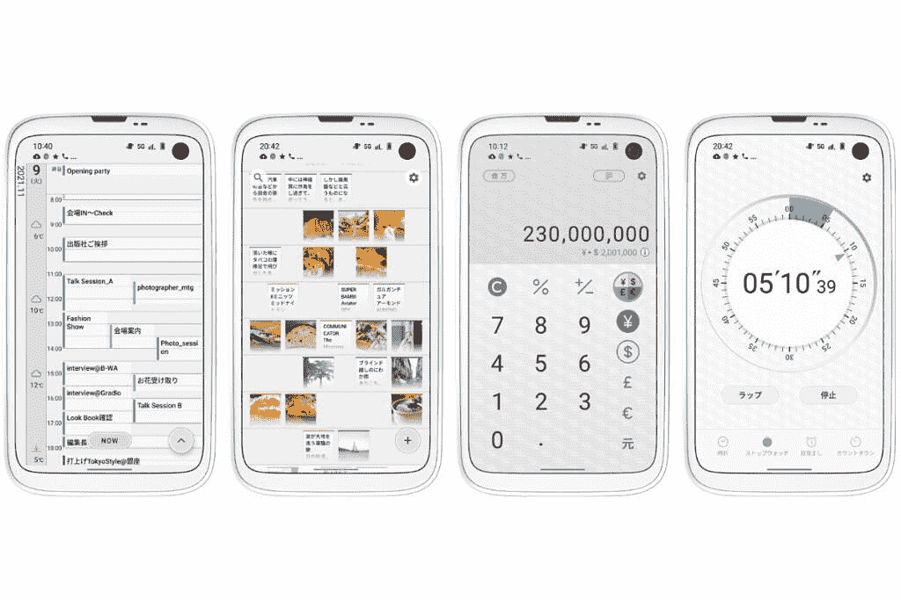
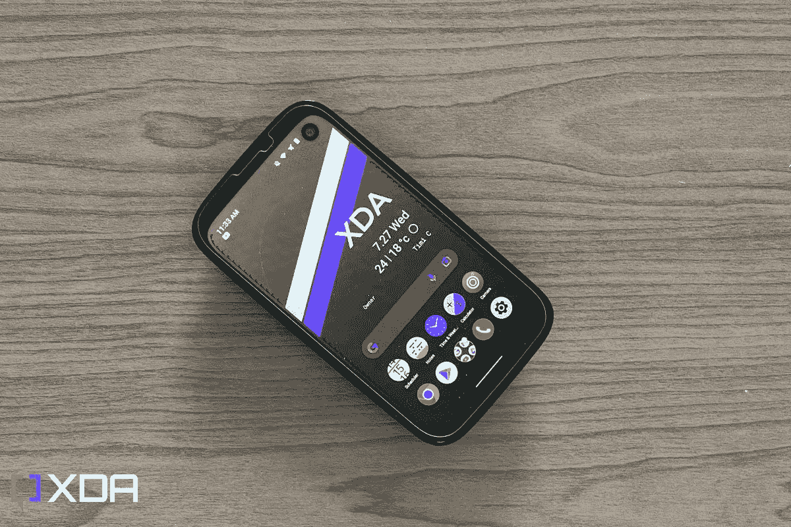

# 巴尔穆达手机评论:一款小巧的安卓手机出人意料地在日本找到了市场

> 原文：<https://www.xda-developers.com/balmuda-phone-review/>

尽管 Balmuda 有着悠久的历史，但该公司最出名的可能是其相对昂贵的烤面包机和电水壶等产品。那么，当一家现代设计公司想要涉足智能手机市场时，会发生什么呢？当然，它创造了自己的智能手机。Balmuda 手机于 2021 年底在日本推出，由于接收效果不佳，据称仅在推出几个月后就停产了。

尽管如此，这款智能手机仍在商店出售，无论是否签约，都可以轻松购买。那么一部没有受到好评的手机如何获得第二次机会呢？它被卖它的人重新利用。它不是作为高端 Balmuda 进行营销，而是作为一款经济实惠的紧凑型智能手机进行销售，非常适合第一次使用。最重要的是，根据合同购买，这款手机几乎不花一分钱。你可以看到在这一点上，它可能会变得诱人。对大多数人来说，这足以做成一笔买卖。但是，有 Balmuda 名字的紧凑型智能手机有什么好处吗？让我们找出答案。

## 巴尔穆达手机:规格

| 

规范

 | 

巴尔穆达电话

 |
| --- | --- |
| **建造** |  |
| **尺寸&重量** | 

*   123 毫米 x 69mm 毫米 x 13.7mm 毫米&#124; 138 克

 |
| **显示** | 

*   4.9 英寸全高清液晶显示屏

 |
| **SoC** |  |
| **内存&存储** | 

*   6GB 内存+ 128GB 内部存储

 |
| **电池&充电** | 

*   USB-C 有线充电
*   无线充电
*   不含充电器

 |
| **安全** | 

*   指纹扫描仪(电源按钮)

 |
| **后置摄像头** |  |
| **前置摄像头** |  |
| **端口** |  |
| **音频** | 

*   单个后置扬声器

 |
| **连通性** | 

*   5G - n3/n28/m77/n78
*   LTE 频段 1/2/3/4/8/12/17/18/19/28/41/42
*   3G 频段 1/2/4/5/8
*   GSM - 850/900/1800/1900

 |
| **软件** |  |
| **其他特征** |  |

* * *

## 巴尔穆达手机:设计

Balmuda 手机是一项独特的技术，不是因为它包含有趣的功能，而是因为它是由非智能手机公司制造的智能手机。它展示了当一家公司不习惯它正在进入的领域，而真正相信它的愿景时，市场会出现什么。虽然这种方法在过去已经在有限的几个人身上取得了成功，但是成功的机会确实很少。

Balmuda 手机的设计乍一看与目前市场上的产品完全不同，因此很快就脱颖而出。但如果我们回到 10 年前，当有更多的实验设备时，我们可以看到 Balmuda 手机的灵感可能来自哪里。这款手机已经瞥见了 Palm Pre、微软 Kin One 和其他产品。虽然 Palm 从一个鸵鸟蛋中找到了设计灵感，但 Balmuda 更关心的是避免硬线，尽一切努力在手机的每个角度融入倾斜的曲线。

在正面，我们有一个小但可用的 4.9 英寸全高清显示屏，右上角有一个穿孔，用于前置摄像头。显示屏很清晰(449 PPI)，在大多数情况下工作良好，但面板是 LCD，所以你不应该期待深黑色或流行的颜色。另外需要注意的是，Balmuda 手机有两种不同的颜色选择，黑色和白色。如果您有黑色型号，显示器周围的挡板不太明显，但对于白色型号，您可能会在显示器的顶部和底部看到一些额外的空间。

该设备的后部有一个独特的外观，左侧有圆形电源按钮/指纹传感器，右侧有一个摄像头。在电源按钮和相机之间有一个扬声器格栅和闪光灯，相机旁边有一个小型 LED 指示灯。想象一下我第一次收到一条信息并看到它闪烁时的惊讶:这很令人愉快，因为这不是你最近经常看到的东西。不幸的是，通过查看设置菜单，没有办法自定义颜色或图案，所以你只能用柔和的白色照明来显示所有警报。

由于其较小的尺寸、倾斜的曲线和 138 克的重量，Balmuda 手机的手感应该非常好。该设备将你的手掌放在摇篮中，坦率地说，这与你习惯使用智能手机的感觉完全相反。这款手机由塑料制成，在 2022 年感觉有点便宜，背面的纹理表面提供了足够的握持感，感觉很舒服。奇怪的是，巴尔穆达精心制作的设计是我无法欣赏的，也许是由于多年来使用方形板不断蚀刻在我的手掌上。

关于环保，Balmuda 手机提供了官方 IPX4 评级。该设备经认证可在水边使用，偶尔会溅起水花，但它不能沉入水中，不被认为是防水的。该评级也意味着它最有可能防止出汗。

* * *

## 巴尔穆达手机:软件

Balmuda 手机装载了 Android 11，截至 2022 年 7 月，它已经收到了 2022 年 6 月的安全更新。由于这是一个运营商品牌的设备，所以包含了一些运营商专用的应用程序，它们不是 Android 的一部分，但没有侵入性。Android 11 的体验是干净的，Balmuda 在这里和那里添加了一些内容。这些“触摸”是手机软件最令人惊讶的方面之一，因为它们是深思熟虑的补充。

“条纹”功能是主屏幕上一个有趣的部分，通过滑动背景中的条纹，用户可以快速访问快捷方式。您可以设置条纹功能来执行预定的操作，或者将其设置为启动您最喜爱的应用程序。最重要的是，它是可定制的。您可以调整条纹以符合右手或左手握法，也可以完全禁用它。你也可以根据自己的心情设置颜色。

Balmuda 有一些工具和附带的小部件，如日程表、时钟、笔记和计算器。这不是什么新鲜事，因为大多数手机都安装了这些应用程序，但 Balmuda 对它们的利用相当不错。比如在它的日程安排 app 上，布局美观直观。您可以捏合来放大和缩小您的日程，显示您的日、周甚至月日程。还有集成的天气，在日历视图中提前一周显示天气情况。

 <picture></picture> 

image via [Balmuda](https://tech.balmuda.com/jp/phone/app/)

时钟应用程序也很漂亮，提供时间，天气集成，秒表，闹钟和倒计时定时器。这很难描述，但外观和感觉使体验似乎很优雅。它的笔记和计算器应用程序也是如此，小小的触摸比你在其他设备上的标准应用程序稍微多一点能量。声音设计也很迷人，铃声，通知，甚至充电都有优雅有趣的音调。每个人对这些东西都有自己的偏好，但作为第一次尝试，巴尔穆达抓住了它，给人一种迷人而难忘的体验。

* * *

## 巴尔穆达手机:相机和娱乐

相机是任何智能手机的重要组成部分。如果没有合适的摄像头，这款手机对许多有眼光的消费者来说可能就没什么用了。如果你想用智能手机拍出出色的照片，Balmuda 手机不适合你。它只有一个 4800 万像素的摄像头，这意味着你拍摄的照片和视频种类会受到限制。

也许这款手机令人惊讶的地方在于，它在明亮的环境中表现不佳。启用 HDR 确实有助于提高质量，但看到新智能手机的这种质量有点令人震惊。你可以想象，一旦灯光变暗，它就不那么好了。对于那些喜欢拨入相机设置的人来说，没有这些选择。在最好的情况下，你可以选择一种模式，包括电影、照片、菜肴、肖像和夜视。我有我的意见，但我留下了一些照片样本，所以你可以判断。

在 Balmuda 上看电影时，较小的屏幕看起来并不那么糟糕。但是一个需要改进的地方是音频。背面的单个扬声器是不够的，它会锻炼你多年来的肌肉记忆，让你把手机背面拉成杯状以向前传递声音。如果这还不够，音频不够清晰，当以更大的音量播放时经常会失真。这不是世界上最糟糕的事情，但那些想把它作为媒体消费设备的人可能会想去别处看看。此外，这款设备没有音频插孔，蓝牙和 USB-C 音频直通是唯一的选择。

* * *

## 巴尔穆达手机:电池和性能

Balmuda 手机没有最快的 SoC，甚至没有最大的电池；在日常使用中，它显示。虽然高通骁龙 765 处理器在大部分情况下都还不错，但有时当你滚动网页、观看 YouTube 或玩游戏时，你会感觉到甚至看到轻微的抖动或口吃。

就 2,500mAh 的电池而言，可以使用一天。假设你是一个像我一样的普通用户。在这种情况下，你可能会用手机听几个小时的音乐，浏览网页，使用 Instagram 和 Twitter 等应用程序进行一些轻度的社交媒体，偶尔用 WhatsApp、Voice、Slack 等应用程序发送消息。如果这是你使用手机的方式，你会顺利度过一天，但当你回家时，电池只剩 30%左右，你可能会感到有点紧张。

如果你是超级用户，你会在一般体验的基础上增加导航、拍照和录像、看 YouTube 之类的视频、接电话等等。在这种使用情况下，你可以预计电池将达到极限，一天下来大约只剩下不到 10%的电量。幸运的是，你可以选择通过 USB-C 有线充电或无线充电。

* * *

## 最后的想法

Balmuda 在日本以提供烤面包机、吸尘器、电水壶等名牌产品而闻名。虽然并不总是最实际的价格，但还是有一些追随者。不幸的是，该公司推出了 Balmuda 手机，试图像其他项目一样涉足智能手机业务，但没有成功。

尽管如此，日本还是有小型智能手机的市场。Balmuda 手机可能是这方面最好的例子，还有其他一些手机，如 Rakuten Mini 和夏普シンプルスマホ(简单的智能手机)。虽然这些手机通常不作为紧凑型智能手机销售，但它们在销售时考虑到了易用性和首次购买者。尽管有报道称 Balmuda 手机的要价非常高，但从那时起，这款手机的价格已经下降了不少，现在不到 200 美元就能买到。此外，如果你与无线运营商签约，这款手机只需一分钱。

 <picture></picture> 

Balmuda Phone

##### 巴尔穆达电话

Balmuda 手机提供了独一无二的设计。

但我认为，即使按照调整后的速度，这也是一款没有多少人会选择的利基产品。此外，如果你进入中档市场，巴尔穆达应该坐在那里，有很多更好的选择。我认为除了手机行业，还没有哪家公司生产出真正成功的产品。这个空间竞争太激烈了，如果没有一个强有力的立足点，事情肯定会出错。希望这不仅是对巴尔穆达的一个教训，也是对其他人的一个教训，也许有一天，我们会从一家外部公司那里得到一部令人印象深刻的智能手机。

如果你想要一部好的小手机，可以考虑选择华硕 Zenfone 9。