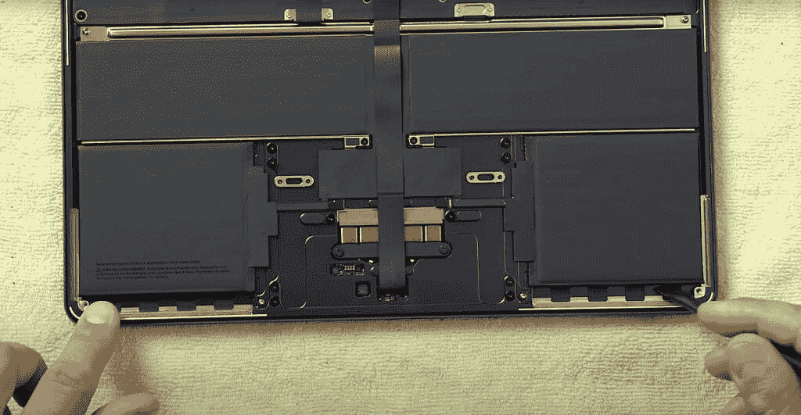

# MacBook Air (2022)的电池可以更换吗？

> 原文：<https://www.xda-developers.com/battery-replacement-macbook-air-2022/>

# MacBook Air (2022)的电池可以更换吗？

你想知道苹果 MacBook Air (2022)的电池是否？关于这件事，你需要知道以下几点。

在 WWDC22 的主基调上，苹果发布了 MacBook Air 13 (2022)，以及 [macOS Ventura](https://www.xda-developers.com/macos-ventura) 。这款受欢迎的产品加入了 [Mac 系列](https://www.xda-developers.com/best-macs/)，摆脱了经典的苹果笔记本设计。相反，它推出了一种更简约的机箱，类似于 MacBook Pro (2021 年)的机箱。考虑到这台 Mac 装有 M2 芯片，你可能想看看苹果芯片的[最佳应用。这些应用程序是专门为不断扩大的苹果 M 系列芯片而优化的。这通常反映在更好的性能和能效上。说到电源效率，你一定想知道 MacBook Air (2022)的电池是否可以更换。关于这件事，你需要知道以下几点。](https://www.xda-developers.com/best-apps-apple-silicon/)

## MacBook Air (2022)电池可更换性

苹果因其许多产品难以被用户修复而臭名昭著。然而，最近它采取了一种不同的方法。例如，它推出了自助维修计划，让用户获得真正的维修零件，并指导他们完成整个过程。此外，它还包括 MacBook Pro (2021)中的电池拉片，便于更换。

 <picture></picture> 

*Credit: Max Tech*

当谈到 MacBook Air (2022)时，苹果采用了它在 MacBook Pro (2021)中包含的相同方法。MacBook Air (2022)具有类似的拉环，便于更换电池。尽管如此，这不是一个简单的过程。如果普通用户试图自己更换电池，他们可能会发现自己丢失甚至损坏内部部件。虽然苹果已经让这个过程变得简单了一点，但它仍然没有迎合新手。

如果您不确定自己在做什么，将您的 MacBook Air (2022)发送给授权服务提供商为您更换电池无疑是更明智的做法。毕竟，安全起见，支付电池更换费比冒险处理更严重的损坏和随后的维修更明智。

 <picture></picture> 

Apple MacBook Air M2

##### 苹果 MacBook Air (2022)

2022 年的 MacBook Air 提供了 M2 芯片和支持 MagSafe 的重新设计的机箱。它有四种颜色可供选择。

*您多久更换一次 MacBook Air 的电池？请在下面的评论区告诉我们。*