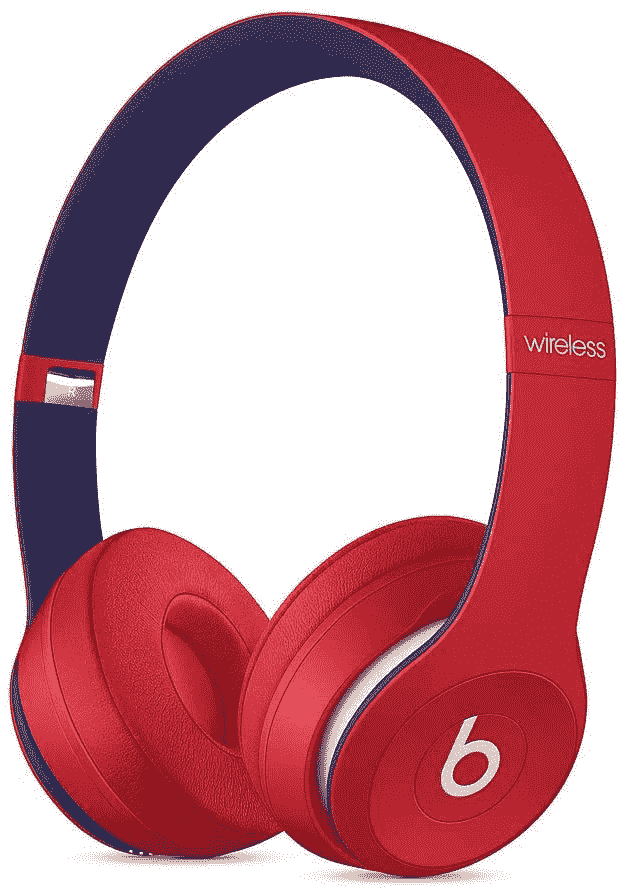

# 用苹果公司的 Beats Solo 3 无线耳机来彰显自己的风格，价格低至 120 美元

> 原文：<https://www.xda-developers.com/beats-solo-3-wireless-headphones-apple-black-friday-sale-amazon/>

# 苹果公司的 Beats Solo 3 无线耳机在亚马逊上降到了 120 美元，如果你想做一个风格声明的话

苹果公司的 Beats Solo 3 无线耳机以时尚配件而闻名，在黑色星期五大甩卖时，只要花 120 美元就可以买到。

让我们面对现实:苹果产品受欢迎的部分原因是它们是好的技术，也是因为苹果营销和广告做得非常好。Beats Solo 3 无线耳机是其中一款不错的产品，但由于背后的营销压力，它被过分炒作了。这更像是一种时尚宣言，起到了某种旁白的作用。如果你想给自己的造型添加一个新的元素，苹果公司的 Beats Solo 3 无线耳机现在在亚马逊上的价格从通常的 200 美元降到了 120 美元。

 <picture></picture> 

Beats Solo3

##### 击败 Solo 3

苹果公司的 Beats Solo 3 无线耳机更多的是形式而不是功能，但它们绝对让人眼花缭乱。如果你正在为你的风格宣言寻找配饰，九种颜色中的一种应该适合你的口味。

老实说，如果你正在寻找功能多于形式的优质耳机，有很多选择比 Beats Solo 3 好得多。但是，如果你正在寻找一副宣布你到来的耳机，并且更多的是形式而不是功能，Beats Solo 3 是一个可靠的选择。首先，这是一款苹果产品，有着突出的 Beats 品牌，这让他们明白无误。作为此次销售的一部分，这些耳机在亚马逊上还有多种颜色，不像 Apple.com 上通常有三种颜色。既然你可以在打折时买到，那么世界上的其他人就不需要知道你是以 80 美元的优惠价买到的。

Beats Solo 3 采用苹果 W1 芯片，兼容 iOS 和 Android 设备。您可以在 iOS 设备上使用多功能耳机控制功能来接听电话、控制音乐和激活 Siri。凭借承诺的 40 小时电池寿命，这些耳机可以在你的头上持续一段时间。苹果还声称，你可以为它们充电 5 分钟，并获得 3 小时的电池播放时间。这款耳机采用可折叠设计，因此当您不想外出时，可以轻松携带。请记住，这些都是通过 microUSB 充电的，即使在 2020 年，所以这是一个负面的。尽管如此，你买这些是为了表达你的风格，有九种颜色可供选择，包括最近的“俱乐部系列”,它们完成了这项工作。