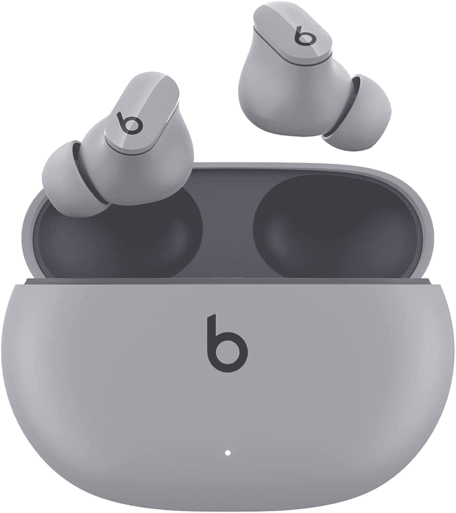
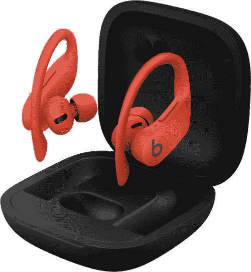

# 这一热门交易将多功能的 Beats Studio Buds 降至圣诞节前的最低价格

> 原文：<https://www.xda-developers.com/beats-studio-buds-deal-amazon/>

# 这一热门交易将多功能的 Beats Studio Buds 降至圣诞节前的最低价格

优质的 TWS 耳塞绝对便宜，只需 90 美元

 <picture></picture> 

Beas Studio Buds

##### Beats Studio Buds

Beats Studio Buds 提供了一系列高级功能，包括 ANC、空间音频支持、防汗等等，这使得它们只需 90 美元就非常划算。

正在寻找价格低于 100 美元的 AirPods Pro 的替代品吗？不要再看了，因为 Beats Studio Buds 目前在亚马逊上有 40%的折扣，仅售 90 美元。优质的 TWS 耳塞是这个价格的必需品，因为它们提供了苹果优质 TWS 耳塞的几乎所有功能。

Beats Studio Buds 提供出色的音频输出、带透明模式的主动降噪(ANC)、IPX4 防汗、空间音频支持，以及单次充电长达 8 小时的播放时间。耳塞配有一个紧凑型充电盒，可额外增加 16 小时的播放时间。然而，它不支持无线充电。

如果你过着积极的生活，并且正在寻找一种在晨跑时不会掉出的耳塞，你可以考虑 Powerbeats Pro。耳塞配有安全合适的耳钩，可以在锻炼过程中保持在适当的位置，您还可以获得苹果 H1 芯片，以提高音频性能，一次充电可播放 9 小时，并支持音频共享。

 <picture></picture> 

Powerbeats Pro

##### Beats Powerbeats Pro

149.95 美元249.95 美元节省 100 美元

Powerbeats Pro 提供了 Beats Studio Buds 的所有功能，以及苹果的 H1 芯片，一次充电可播放长达 9 小时，并支持音频共享。你只需花 150 美元就可以通过下面的链接得到它们。

Powerbeats Pro 的零售价通常为 250 美元，但你可以通过上面的链接以 100 美元的折扣购买。耳塞是一个非常棒的选择，价格仅为 150 美元，而且由于内置苹果 H1 芯片，它们对 iPhone 用户来说尤其重要。