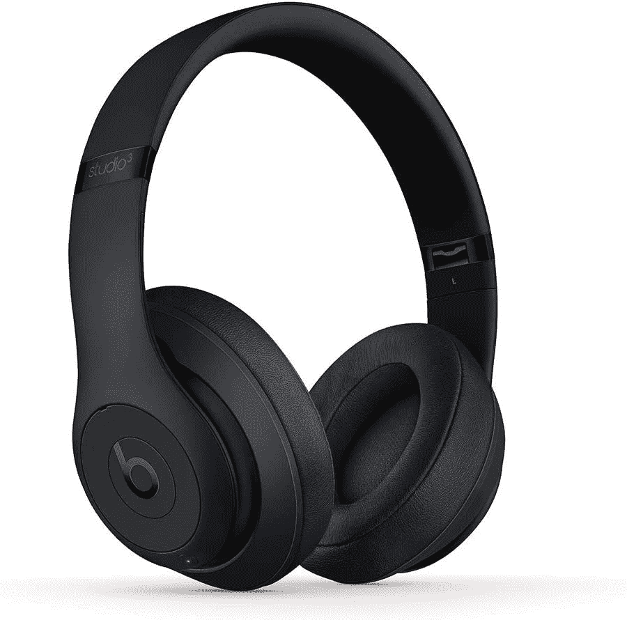

# 只需一半的价格，就可以用 Beats Studio3 封锁世界

> 原文：<https://www.xda-developers.com/beats-studio3-half-price-2022/>

# 只需一半的价格，就可以用 Beats Studio3 封锁世界

你可以半价买到一台 Beats Studio3。这是一个限时交易，将到期，所以在为时已晚之前购买一个！

几年前，苹果收购了著名耳机品牌——Beats。现在，该公司给了它 AirPods 待遇，允许用户将这些音频耳机无缝配对到他们的苹果设备上。高级 Beats Studio3 耳机也不例外。只需轻轻一点，你就可以将它们与兼容的设备配对。除此之外，还可以激活 Siri，并在空间音频中欣赏受支持的音乐和电视内容。对于那些拥有苹果设备并想要一个声誉好的产品的人来说，它们是完美的耳挂式耳机。

在限时的 Prime 早期访问销售中，亚马逊正在以 169 美元的价格出售 Beats Studio3。通常，它们的价格高达 349 美元。因此，通过申请此优惠，您可以节省超过 50%的费用，并享受高端产品。好消息是，你还可以从六种颜色中选择一种。所以你并不局限于那个你真的无法忍受的阴影。这些选项包括哑光黑、红、白、黑红、午夜黑和阴影灰。

 <picture></picture> 

Beats Studio3

##### Beats Studio3

Beats Studio3 有六种不同的颜色，并提供即时配对、空间音频支持、噪音消除等功能。

Beats Studio3 提供了纯粹的自适应降噪功能，苹果的 W1 芯片可与 iDevices 即时配对，以及一个巨大的电池。在一次充电的情况下，您可以在关闭噪音消除的情况下收听不超过 40 小时。如果您启用了上述功能，那么一次充电应该可以持续 22 小时左右。电池的好处在于，仅仅 10 分钟的充电就可以为你提供 3 小时的音频播放。

由于内置的物理按钮，您无需拿出手机就可以控制音频播放和音量。或者，你可以按住专用按钮来触发 Siri 并发出语音命令。比起蓝牙，你更喜欢有线连接吗？您还可以在两种模式之间进行选择，并且可以互换。

*你会挑哪个 Beats Studio3 的颜色？请在下面的评论区告诉我们。*