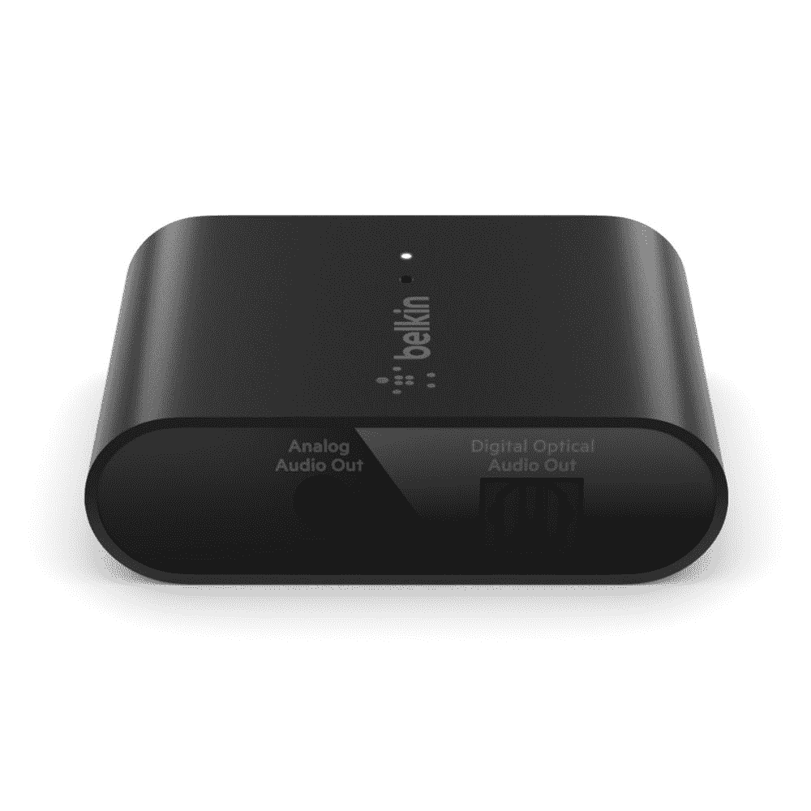

# belkin 100 美元的加密狗使任何扬声器都与 AirPlay 2 兼容

> 原文：<https://www.xda-developers.com/belkin-soundform-connect-dongle-airplay-2/>

# belkin 100 美元的加密狗使任何扬声器都与 AirPlay 2 兼容

Belkin 已经发布了一款名为 Soundform Connect 的新加密狗，它将使任何扬声器系统都与 AirPlay 2 兼容。

Belkin 已经发布了一款名为 Soundform Connect 的新加密狗，它将使任何扬声器系统都与 AirPlay 2 兼容。您可以从今天开始以 99.99 美元的价格预订加密狗。

通过为您的扬声器添加 AirPlay 2 支持，您将能够从 iOS 和 macOS 设备流化音频。如果您拥有多个 AirPlay 2 兼容设备，包括 HomePod 或 Sonos 的扬声器，您可以一次流化到多个源。苹果的协议基于 WiFi，以更少的延迟为用户提供更干净的收听体验。

*图片:贝尔金*

[Belkin 在其网站上说](https://www.belkin.com/us/adapters/audio-video/soundform-connect-audio-adapter-with-airplay-2/p/p-auz002/)“继续享受你最喜欢的音响设备，而不需要昂贵的组件更新。”。“Soundform Connect Audio Adapter with AirPlay 2 可将您的立体声音响变成支持 AirPlay 2 的扬声器，从 iOS 和 Mac 设备上播放您喜爱的音乐。我们的适配器配备了光学和 3.5 毫米输出，可将信号从您的设备传输到任何带有音频输出的扬声器或接收器。”

加密狗本身的尺寸为 43.4 x 62 x 19mm 毫米，包括一个模拟音频输出端口和数字光学音频输出端口，由 USB-C 供电。一旦连接到有源扬声器或带有光学或 3.5 毫米输入的音响系统，您只需轻按 AirPlay 图标即可连接到加密狗。除了播放音频，该适配器还使扬声器能够与 HomeKit 兼容，从而可以轻松地将它们分配到不同的房间，并在苹果的 Home 应用程序中创建场景和自动化。

在[苹果宣布](https://www.xda-developers.com/apple-will-offer-lossless-audio-in-apple-music-without-a-price-hike/)将在今年夏天免费为苹果音乐带来无损音频后几天，Belkin 的新加密狗就上市了。对于那些拥有更强大的扬声器系统或家庭影院音响系统的人来说，Soundform Connect 可能是一个不错的选择。根据 Belkin 的说法，Soundform Connect 与运行 iOS 11.4 及更高版本的设备兼容，所以你需要更新你的设备才能使用它。

 <picture></picture> 

Belkin Soundform Connect

##### Belkin Soundform 连接

Belkin Soundform Connect 将把您的旧扬声器系统变成一个与苹果 AirPlay 2 协议兼容的系统。