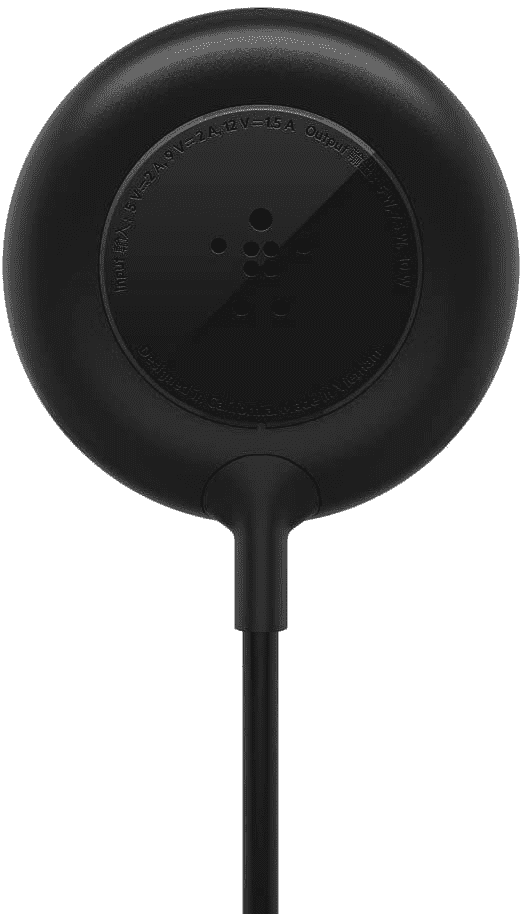
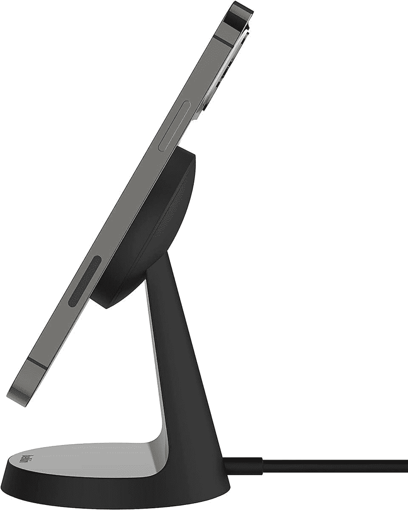

# Belkin 为 iPhone 12 设计的 MagSafe 充电器现在降价 14-17%

> 原文：<https://www.xda-developers.com/belkins-magsafe-chargers-for-the-iphone-12-are-14-17-off-right-now/>

# Belkin 为 iPhone 12 设计的 MagSafe 充电器现在降价 14-17%

Belkin 目前有两款 MagSafe 充电器在售:一款是苹果自有 MagSafe 适配器的廉价替代品，另一款是充电底座。

苹果在 iPhone 12 系列上推出了新的 MagSafe 充电标准，将 Qi 无线充电与磁性附件相结合，这导致了许多新的 iPhone 配件。其中两个是 Belkin 的磁性充电器和充电座，它们现在在亚马逊分别售价 24.99 美元和 29.99 美元。那比正常价格低了 5 美元。

非支架充电器的功能与苹果的 MagSafe 充电器大致相同，但价格[比](https://www.amazon.com/Apple-MHXH3AM-A-MagSafe-Charger/dp/B08L5NP6NG?tag=xda-4ehub7s-20&ascsubtag=UUxdaUeUpU3339&asc_refurl=https%3A%2F%2Fwww.xda-developers.com%2Fbelkins-magsafe-chargers-for-the-iphone-12-are-14-17-off-right-now%2F&asc_campaign=Short-Term)低 10 美元。它是一个黑色的圆圈，可以磁性附着在任何 iPhone 12 的背面，电缆比苹果自己的充电器长(6 英尺比 3.2 英尺)。你也可以在任何兼容 Qi 的手机上使用充电器，尽管磁性附件只适用于 iPhone 12 系列。

 <picture></picture> 

Belkin Wireless Charger

##### 贝尔金磁性无线充电器

这款 MagSafe 充电器比苹果官方充电器便宜 10 美元，而且线缆更长。不过，你还是需要买一个 USB Type-C 墙壁适配器。

 <picture></picture> 

Belkin Wireless Charging Stand

##### Belkin 15W 无线充电座

这款 MagSafe 充电座可在充电时保持手机处于高位。与其他充电器一样，你需要一个 USB Type-C 墙壁适配器。

Belkin 也有 MagSafe 充电支架出售。它可以把你的手机抬高一个角度，通常看起来比有线充电器好一点。dock 是床头充电的好选择，或者在工作时将手机放在办公桌上充电。然而，这两款充电器都没有自带的 USB Type-C 墙壁适配器——如果你还没有的话， [Anker Nano](https://www.amazon.com/dp/B07WRKXQ8W?tag=xda-4ehub7s-20&ascsubtag=UUxdaUeUpU3339&asc_refurl=https%3A%2F%2Fwww.xda-developers.com%2Fbelkins-magsafe-chargers-for-the-iphone-12-are-14-17-off-right-now%2F&asc_campaign=Short-Term) 是个不错的选择。