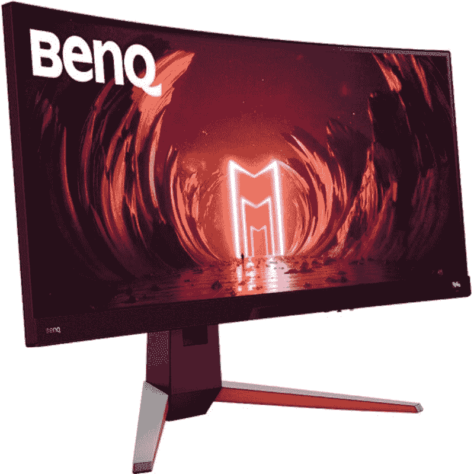

# 明基 Mobiuz EX3415R 评测:是最好的曲面超宽显示器吗？

> 原文：<https://www.xda-developers.com/benq-mobiuz-ex3415r-review/>

BenQ Mobiuz EX3415R 是一款令人印象深刻的 34 英寸曲面超宽显示器，拥有您想要的高端显示器的一切。它具备提供快速响应游戏体验的所有智能。曲面超宽屏幕还让一切都更加身临其境，无论是玩游戏、看电影，还是简单地使用显示器进行日常工作。明基为这款显示器使用了很棒的面板，内置扬声器也出奇的棒。

但就像其他许多显示器一样，这款显示器也有一些我们认为值得一提的注意事项。没有 HDMI 2.1，典型的亮度也相当低，只有 200 尼特。更不用说，定价也是一个需要考虑的重要因素，明基 Mobiuz EX3415R 的价格不菲。但除此之外，我们认为 BenQ Mobiuz EX3415R 是一款非常棒的超宽曲面显示器，对于那些寻求可靠显示器来提高工作效率和玩游戏的人来说，它是一个可靠的补充。

 <picture></picture> 

BenQ Mobiuz EX3415R

##### 明基 MOBIUZ EX3415R

明基 Mobiuz EX3415R 是一款游戏显示器，配备 34 英寸曲面超宽面板，最大刷新率为 144Hz，响应时间为 2 毫秒。

* * *

**浏览此评论:**

## 定价和可用性

*   明基 Mobiuz EX3415R 目前在美国售价 800 美元。

明基 Mobiuz EX3415R 已经上市有一段时间了。明基在新的 Mobiuz 游戏系列中还有一些其他选择，值得一试。在撰写本文时，这种特殊的弯曲超宽型号(即 EX3415R)的售价为 800 美元。这不是目前市场上最实惠的游戏显示器，但它最初的售价要高得多，现在已经下降了 100 美元。我们建议您点击上面方框中的购买链接，立即在网上找到最优惠的价格。

* * *

## 明基 Mobiuz EX3415R 评测:规格

在讨论这款显示器的其它细节之前，让我们先快速浏览一下规格表，看看它能带来什么:

| 

**规格**

 | 

**明基 Mobiuz EX3415R**

 |
| --- | --- |
| **面板类型** | IPS 技术 |
| **屏幕尺寸** | 34 英寸，21:9 英寸 |
| **支持的最大分辨率** | 3440x1440 |
| **最大刷新率** | 144 赫兹，AMD 自由同步 |
| **响应时间(GTG)** | 2 毫秒(1 毫秒 MRPT) |
| **静态对比度** | 1000:1 |
| **亮度** | 200 尼特，(400 尼特峰值 HDR) |
| **视角** | 178 水平，178 垂直 |
| **色域** |  |
| **端口** | 

*   USB 3: 2
*   USB 类型 B 上游:1
*   3.5 毫米音频输出:1
*   HDMI 2.0: 2
*   显示端口 1.4 版:1

 |
| **重量** | 8.5 公斤 |
| **尺寸** | 425.1 - 525x815.2x269.7 |
| **保修** | 3 年有限保修 |

* * *

## 设计和制造质量

*   显示器外壳看起来简单，但优雅，没有任何 LED 照明。
*   支架足够坚固，可以将显示器固定在适当的位置，您也可以通过多种方式调节显示器。
*   虽然它没有 HDMI 2.1 端口，但你可以在后面找到一个不错的端口选择。

Mobiuz EX3415R 是一款曲面超宽游戏显示器，曲率额定值为 1900R。这种弯曲度是大多数屏幕宽高比为 21:9 的显示器的标准。三星有一些 1000R 曲率的型号，所以如果你不习惯弯曲的超宽显示器，可能想看看这些。我们认为 1900R 达到了超宽显示器的最佳点，因为它允许更多的沉浸感，同时让你在屏幕上看到更多的东西。这可能需要一些时间来适应，但我们认为它适合所有类型的工作负载，无论是游戏、工作效率还是简单的内容消费。

显示屏外壳是一个简单而优雅的银色外壳，背面有 Mobiuz 标志。显示器坐在黑颈支架上，橙色口音。这似乎是明基为 Mobiuz 系列设计的新语言的一部分，因为其他单元也有非常相似的美学。包装在包装盒内的显示器底座允许您上下滑动、左右旋转或前后倾斜显示器。与我们最近评测的优派 XG270QG 显示器不同，这款显示器不能从横向模式切换到纵向模式。这不一定是一个交易破坏者，因为我们怀疑你是否会想在纵向使用这样的超宽显示器。

重量为 8.5 千克的 Mobiuz EX3415R 也比市面上的许多其他显示器略轻。当评审样本到达时，对我们来说设置监视器并开始评审是非常容易的。如果您不喜欢附带的支架，那么您也可以使用任何 VESA 兼容的壁挂支架，只要它能够承受重量。

与其他许多游戏显示器不同，Mobiuz EX3415R 的外壳上没有任何 RGB 照明。这使得它对很多人来说更有吸引力，我们认为它还允许显示器适合几乎任何设置，没有任何问题。我们喜欢这款显示器的另一点是它的扬声器系统。Mobiuz EX3415R 的屏幕底部有一个全长条形音箱。它配备了两个 2 瓦的扬声器和一个 5 瓦的低音扬声器，音量惊人，输出清晰的音频。事实上，我们认为扬声器系统是这款显示器的优势之一。我们非常喜欢在使用显示器的时候使用它。

所有端口都位于显示器的背面，面朝下，便于您进行布线。你有两个 HDMI 2.0 端口，一个 DisplayPort 1.4b 端口，一个上游 USB 端口，两个下游 USB 3.0 Type-A 端口，以及一个耳机插孔和电源连接器。虽然我们认为这是一个不错的端口选择，但如果有一个 HDMI 2.1 输入而不是两个 HDMI 2.0，那就更好了。如果你不知道，这两者之间的主要区别是，新的规范有更多的带宽来支持 60Hz 时高达 8K 的刷新率或 120Hz 的 4K，而 HDMI 2.0 只能在 60Hz 时实现 4K。然而，只要你通过 DisplayPort 1.4b 输入连接你的电脑，你应该没问题。

* * *

## 显示和性能

*   34 英寸的弧形超宽面板可能需要一些时间来适应，但它弥补了一些惊人的视觉效果。
*   我们建议您使用 HDR 模式，以便在观看内容或播放 HDR 支持的节目时获得最佳效果。
*   EX3415R 还可以作为一款出色的生产力显示器，因为它提供了更多的屏幕空间。

Mobiuz EX3415R 的典型亮度为 200 尼特，HDR 的峰值亮度高达 400 尼特。它肯定不是市场上最亮的面板，尽管只要你启用 HDR 模式，它应该没问题。它的额定对比度为 1，000:1，这正是你期望从 IPS 面板中看到的对比度。我们看到的是 34 英寸宽的面板，长宽比为 21:9，最大分辨率为 3440x1440，视觉效果非常清晰。至于色域覆盖，EX3415RR 覆盖高达 100%的 sRGB 色域和高达 94%的 DCI-P3 空间。对于内容创作者来说，这不是色彩最准确的显示器，但仍然是一个相当不错的选择。我们建议在观看媒体内容时使用 HDR 模式的显示器，因为这样会让一切看起来更好。甚至一些 YouTube 视频用 HDR 看起来更好，因为颜色看起来更有活力。

这同样适用于游戏。支持 HDR 的标题看起来要比在 SDR 模式下运行好得多。像《赛博朋克 2077》、《光环无限》和《战神》这样的游戏看起来不可思议，只要你有一个强大的[显卡](https://www.xda-developers.com/best-graphics-cards/)在最大设置下运行它们。由于输入延迟较低，Mobiuz EX3415R 上充满动作的多人游戏体验也同样出色。像 Apex 传奇，Valorant，CG:GO 等游戏。感到爽快和有反应。这种特殊的显示器也支持 AMD 的 FreeSync，尽管我们注意到它很难跟上 G-Sync 兼容显示器的步伐。

我们还想指出 EX3415R 如何兼作出色的工作显示器，这要归功于多任务处理的充足空间。只要你有足够的空间容纳一个 34 英寸的超宽显示器，我们认为这是一个伟大的替代有两个专用显示器。它不仅让您更容易在一个屏幕上管理所有应用程序，还可以节省您处理两个独立显示器和每个显示器的额外连接的额外工作。我们认为这也是一个提高工作效率的可靠选择，因此如果您打算为工作站购买新显示器，请务必查看。

* * *

## 值得买吗？

明基 Mobiuz EX3415R 符合现代游戏显示器的许多重要要求，同时也是提高工作效率的绝佳显示器。话虽如此，它并不适合所有人。

## 明基 Mobiuz EX3415R 应该买谁的？

*   寻求用于游戏和办公的坚固曲面超宽显示器的人。1900R curvature 为游戏和工作时管理各种任务带来了身临其境的体验
*   希望购买 HDR 显示器来体验身临其境的游戏和内容消费的人。

## 谁不该买明基 Mobiuz EX3415R？

*   如果你是一个正在寻找高度精确颜色面板的内容创作者，就不要买这个。
*   不要为了打竞技电竞冠军而买。你最好买一个反应更灵敏的专用 TN 面板。Mobiuz EX3415R 的 GTG 响应时间为 2 毫秒，请记住这一点。

总体而言，可以肯定地说，BenQ Mobiuz EX3415R 是一款出色的游戏显示器，尤其是在支持高清的游戏中表现出色。弯曲的超宽面板也让玩游戏或只是看电影成为绝对的乐趣。内置扬声器也令人印象深刻，将媒体消费体验提升到了一个全新的水平。除了游戏和媒体消费，Mobiuz EX3415R 还可以作为可靠的工作显示器。巨大的 34 英寸 3440 x 1440 面板为您提供了充足的空间，让您可以舒适地分割屏幕，同时管理多项任务，而无需设置不同的显示器。市场上不乏超宽显示器，但我们认为 EX3415R 绝对值得在我们收集的[最佳显示器](https://www.xda-developers.com/best-monitors/)中独占鳌头。

 <picture></picture> 

BenQ Mobiuz EX3415R

##### 明基 MOBIUZ EX3415R

明基 Mobiuz EX3415R 是一款游戏显示器，配备 34 英寸曲面超宽面板，最大刷新率为 144Hz，响应时间为 2 毫秒。