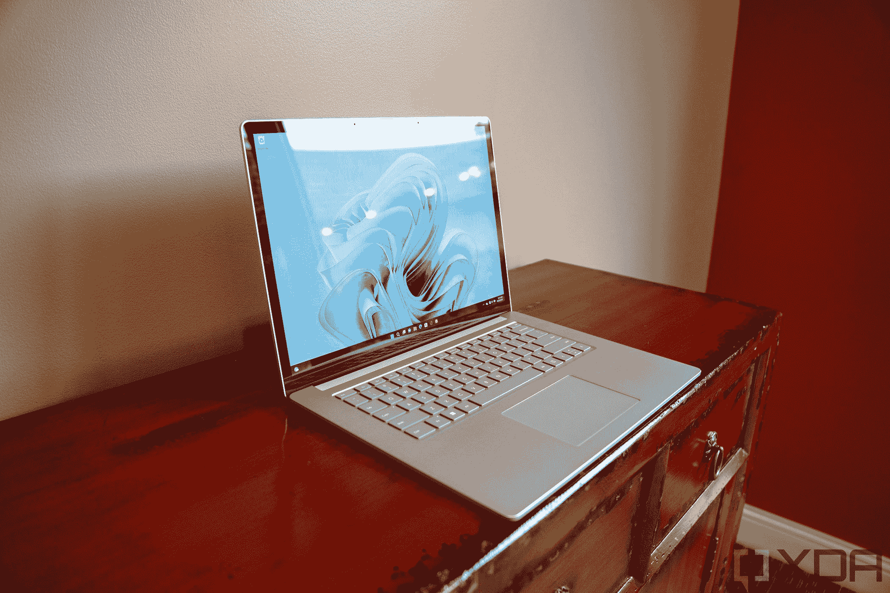
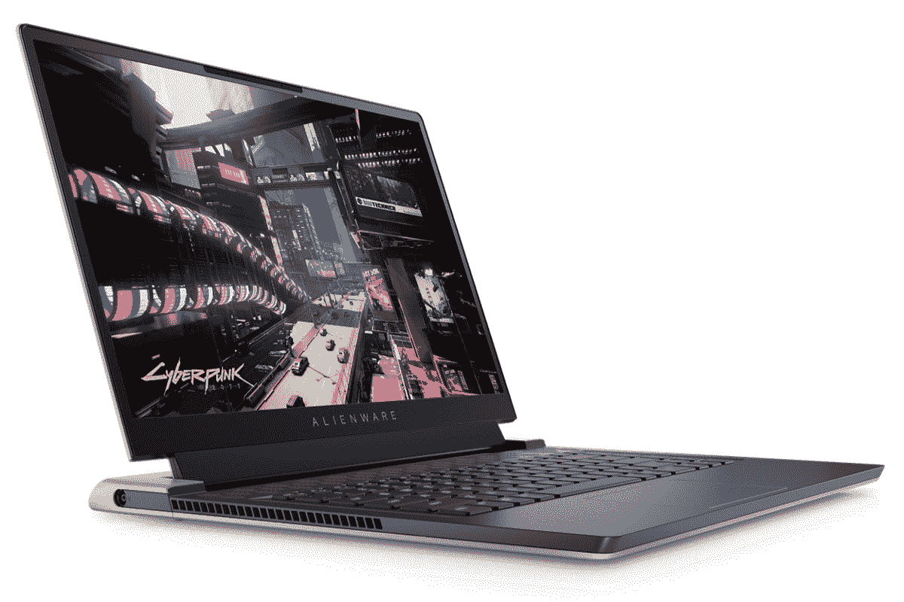

# 2023 年最佳 15 英寸笔记本电脑

> 原文：<https://www.xda-developers.com/best-15-inch-laptops/>

对于许多用户来说，15 英寸的屏幕是笔记本电脑的理想尺寸。这是一个你仍然可以在便携性和占地面积之间取得巨大平衡的尺寸。大多数 17 英寸的笔记本电脑往往很重，13 英寸的笔记本电脑不会给你足够大的屏幕来舒适地进行多任务处理。正因为如此，15 英寸的笔记本电脑仍然非常普遍，如果你想买一台新的，你肯定会发现有很多选择。我们是来提供帮助的，所以我们收集了您今天能买到的最好的 15 英寸笔记本电脑。

虽然 15 英寸的外形很受欢迎，但不一定适合所有人。因此，不妨看看我们对你能买到的最好的笔记本电脑的综合报道。在这里，我们只关注 15 英寸的设备，尽管我们已经看到越来越多的人转向 16 英寸的笔记本电脑。随着越来越多的笔记本电脑使用更高的 16:10 宽高比，这些显示器现在也更大，但笔记本电脑也有类似的外形。你可能想看看[最好的 16 英寸笔记本电脑](https://www.xda-developers.com/best-16-inch-laptops/)，未来几个月，15 英寸型号的数量将开始下降。

## 最佳 15 英寸笔记本电脑:戴尔 XPS 15 (9520)

我们对戴尔 XPS 系列赞不绝口，但这是有充分理由的。如果你正在寻找一台 15 英寸的笔记本电脑，[戴尔 XPS 15](https://www.xda-developers.com/dell-xps-15-2022-review/) 无疑是你今天可以买到的最好的笔记本电脑之一，它提供了令人难以置信的功能和便携性的结合，让人难以拒绝。

首先说性能。戴尔 XPS 15 配备英特尔第 12 代英特尔酷睿处理器，最高可配英特尔酷睿 i9-12900HK。这是一个 14 核，20 线程的 CPU，它可以提升到 5GHz。这已经能够实现出色的性能，但如果能够为 45W 功率的 NVIDIA GeForce RTX 3050 Ti 添加专用显卡，性能会更好。现在，这不是你可能在高端游戏笔记本电脑中找到的那种 GPU，但如果你除了工作以外还想玩一些游戏，你绝对可以在这里做到这一点。你还可以配置高达 64GB 的内存和 2TB 的固态硬盘，这足以满足几乎所有人的需求。

您可以选择的显示器选项也非常出色，首先是这是一款 15.6 英寸 16:10 显示器。这意味着它将比典型的 15 英寸屏幕更高，但没有那么宽，加上最小的边框，这确实有助于 XPS 15 感觉更便携。基本配置是全高清+ (1920 x 1200)面板，亮度为 500 尼特。这已经是一个伟大的展示，但最好的部分来自升级。你可以选择 400 尼特的 3.5K (3456 x 2160)有机发光二极管显示器，它可以为你带来令人难以置信的对比度和深黑色；或者你可以得到一个 4K+ (3820 x 2400)液晶显示器，亮度为 500 尼特，但 100%覆盖 Adobe RGB -非常适合对颜色敏感的工作。这两个选项都支持触摸，加上它们受到康宁大猩猩玻璃 6 的保护，使这成为一款真正的高端笔记本电脑。

真正的缺点是显示器顶部的 720p 微型网络摄像头，它不会让你在视频会议中保持最佳状态。这是 XPS 笔记本电脑的常见问题，但它变得更加突出，因为在 2022 年，许多其他笔记本电脑已经升级到 1080p 网络摄像头。尽管如此，至少这个网络摄像头支持 Windows Hello 面部识别。

XPS 15 最令人印象深刻的一点是它的紧凑性。尽管功能强大，但 Dell XPS 15 的厚度仅为 18 毫米，虽然有点重，起始重量不到 4 磅。使用的材料也很有趣，因为戴尔在笔记本电脑的内部和外部使用了不同的材料。外部由铝制成，有两种银色，但内部可以由黑色碳纤维或“北极白”编织玻璃纤维复合材料制成，这有助于 XPS 15 在使用时感觉与其他笔记本电脑截然不同。

端口在这里有点受限。你有两个 Thunderbolt 4 端口，一个标准 USB Type-C (3.2 Gen 2)，一个 SD 读卡器和一个耳机插孔。然而，戴尔包括一个 USB Type-C 到 Type-A 和 HDMI 适配器，因此您不会完全失去传统设备的运气。不过，对于像这样的大型笔记本电脑来说，如果能再多一点就好了。

总的来说，尽管有一些缺点，这无疑是最好的 15 英寸笔记本电脑之一，而且可能是最好的。您可以在下面购买，也可以在戴尔网站上找到其他配置。

##### 戴尔 XPS 15 9520

2022 年的戴尔 XPS 15 型号升级到第 12 代英特尔酷睿处理器，同时保留强大的英伟达 RTX 显卡和出色的显示屏。这是最好的 15 英寸笔记本电脑之一，几乎可以做任何事情。

## 同样出色的还有:Surface Laptop 5

### 

戴尔 XPS 15 是一款非凡的笔记本电脑，但它有点重，而且它的功率超过了大多数人的需求。但是，如果你想要另一台更易于携带且功能强大的出色笔记本电脑，新款 [Surface Laptop 5](https://www.xda-developers.com/surface-laptop-5-review/) 就是为你准备的。

Surface Laptop 5 搭载英特尔第 12 代酷睿处理器，最高可配酷睿 i7-1255U。这些是 U 系列处理器，具有更低的 15W TDP，这意味着它们使用更少的功率(从而为您提供可靠的电池寿命)，但您仍然可以获得 10 个内核和 12 个线程，为各种日常任务提供非常可靠的性能。您还可以为 Surface Laptop 5 配置高达 32GB 的内存和 1TB 的固态硬盘，这让您几乎可以在任何环境下工作。

除了功能规格之外，Surface Laptop 5 还拥有出色的显示屏。它采用单一配置，是一个 15 英寸的面板，长宽比为 3:2(典型的 Surface 设备)，分辨率为 2496 x 1664。这为你提供了 201 PPI 的像素密度，这对于默认配置来说是非常好的，并且高纵横比使它成为完成工作的绝佳屏幕。可悲的是，那个显示器上面只有一个 720p 的网络摄像头，这在 2022 年末尤其令人失望。尽管如此，至少 Windows Hello 面部识别作为默认功能受到支持。

在设计方面，Surface Laptop 5 也非常高端。它采用铝制机箱，看起来和感觉都很棒，拥有我们从 Surface 期待的极其干净的外观。15 英寸的型号有白金或哑光黑色两种配色，笔记本电脑本身重量为 3.44 磅，对于铝制的 15 英寸笔记本电脑来说相当轻。如果你想变得更轻，你就必须买些镁制的，感觉不那么高级。也很薄，14.7mm。

加上端口，Surface Laptop 5 实际上可能是微软产品线中最好的设备之一。它有一个 Thunderbolt 4 端口(USB-C)，一个 USB Type-A 端口，一个 3.5mm 耳机插孔，一个 Surface Connect 端口，用于充电。这为您提供了一点多样性和多功能性，当然，Thunderbolt 支持意味着您可以使用坞站来连接任何您需要的额外端口。

总的来说，Surface Laptop 5 是最好的笔记本电脑之一，如果你想在便携性和性能之间取得巨大平衡，同时仍然拥有优质的体验，它可能是最好的。你可以在下面查看一下。

##### 微软 Surface Laptop 5

Surface Laptop 5 是一款优质且相对轻便的笔记本电脑，采用第 12 代英特尔酷睿处理器，采用铝制设计，显示屏出色。

## 最佳 15 英寸游戏笔记本电脑:外星人 x15 R2

如果你正在寻找你的下一个游戏装备，外星人 x15 R2 T1 令人印象深刻。这是一款非常强大的游戏笔记本电脑，它使用了一些独家的外星人技术来保持轻薄和凉爽。它也是首批采用英特尔全新 Alder Lake 处理器的笔记本电脑之一。

从性能开始，您可以获得外星人 x15 R2，最高可配英特尔酷睿 i9-12900H，它有 14 个内核(6P + 8E)和 20 个线程，最高可提升至 5GHz。这是由专用的 NVIDIA 显卡支持的，高达 GeForce RTX 3080 Ti，这也是新的，比标准的 RTX 3080 有很大的性能改进。为了最大限度地利用这些高性能组件，外星人 x15 R2 使用了一种叫做 Element 31 的热接口，即使在像这样的薄笔记本电脑中，它也能非常有效地驱散热量并保持冷却。除此之外，您还可以在 RAID 0 中获得高达 32GB 的主频为 5200MHz 的 LPDDR5 RAM 和 4TB 的 SSD 存储，因此您可以获得您想要的所有速度。

显示器也是使这款游戏成为最佳选择的一个重要因素，您可以从几个选项中进行选择。入门级选项是具有 165Hz 刷新率的全高清面板，但您可以一直升级到 360Hz，或者升级分辨率以获得具有 240Hz 显示屏的四高清显示屏。坦率地说，我们推荐后者，因为你不太可能注意到 240Hz 到 360Hz 之间刷新率的差异，而更不可能注意到分辨率的差异。

显示器上方是一个 720p 的网络摄像头，这意味着如果你想在这台笔记本电脑上播放游戏或进行视频通话，它并不出色。不过，它确实支持 Windows Hello 面部识别，这不是每台游戏笔记本电脑都有的。这是一个非常受欢迎的补充。

在设计方面，外星人 x15 R2 非常符合其他外星人笔记本电脑。笔记本电脑的背面有大型排气孔，两侧有进气口，以保持空气在内部流动。不同的是，这个是薄的。在最厚的地方，外星人 x15 R2 的厚度为 16.75 毫米，这对于这些规格来说是非常令人印象深刻的，而在最薄的地方，它只有 12.5 毫米。它的重量从 5 磅开始，最大可达 5.2 磅，所以它不是超级便携的，但对于这样一台功能强大的笔记本电脑来说，这并不坏。

这台笔记本电脑的大部分端口都在背面。你会发现一个 Thunderbolt 4/USB Type-C 端口，一个带 DisplayPort 的标准 USB-C 端口，USB Type-A，HDMI 和 microSD 读卡器。右侧有一个 3.5 毫米耳机插孔，左侧有一个专有的筒式充电器端口。背面还有一个巨大的 RGB 背光环，环绕在端口和通风口周围。你可以根据自己的喜好定制它，如果你在公共场合拿出这台笔记本电脑，它肯定会引起一些关注。外星人标志和键盘也是 RGB 背光，看起来更加个性化。

如果您正在寻找一款游戏笔记本电脑，能够提供高性能、流畅(清晰)的视觉效果和舒适的游戏体验，外星人 x15 R2 可能是您的最佳选择。

 <picture></picture> 

Alienware x15 R2

##### 戴尔外星人 x15 R2

外星人 x15 R2 是一款功能强大的游戏笔记本电脑，采用最新的英特尔 CPU、NVIDIA 显卡和创新的冷却系统，使其变得轻薄。

## 最佳商务笔记本电脑:惠普 EliteBook 650 G9

许多商用笔记本电脑开始从老式的 15.6 英寸 16:9 显示器转向更新的 16 英寸 16:10 面板，但如果您更喜欢 16:9 的宽高比，仍有型号使用旧风格的屏幕。其中一款笔记本电脑是 HP EliteBook 650 G9，这是一款很容易推荐的笔记本电脑，因为它比我们评论过的 EliteBook 865 G9 等其他优秀笔记本电脑稍逊一筹。

这是一款基于英特尔技术的型号，采用第 12 代处理器，最高可配酷睿 i7-1270P 或酷睿 i7-1265U，具体取决于您的喜好。P 系列机型耗电量更大，电池寿命通常也更长，但性能更高。U 系列处理器应该更高效，但在要求更高的任务中速度不会那么快，尽管像网页浏览和编写文档这样的事情应该一样快。一些 U 系列型号还包括 Nvidia GeForce MX570，这是一款帮助完成某些任务的入门级 GPU。除此之外，您还可以为笔记本电脑配置高达 64GB 的内存和 1TB 的固态硬盘，这样您就拥有了获得出色体验所需的一切。

当然，显示器是一个 15.6 英寸的面板，它的长宽比为 16:9，正如我们提到的那样。与惠普产品线中的高端机型不同，它只有全高清显示屏，没有任何隐私屏幕选项。但是，您可以从 250 尼特的基本型号升级到 400 尼特的面板，或者如果您喜欢以这种方式使用笔记本电脑，可以添加触摸支持。在显示器上方，有一个 720p 的摄像头，这在今天并不令人惊讶，你可以选择 Windows Hello 的红外摄像头。

在设计方面，如果你见过任何惠普的商务笔记本电脑，HP EliteBook 655 G9 会感觉非常熟悉。这是一个银色的机箱，旨在适应任何工作环境，而不会太突出。19.81 毫米，不是特别薄，3.83 磅的重量也没有让它特别轻，但考虑到它的尺寸，它还是很便携的。这个尺寸也为数字键盘留出了空间，如果你的工作需要大量的数字运算，这是一个很好的笔记本电脑。

商务笔记本电脑有一点是正确的，那就是端口，尽管它是惠普产品线中较便宜的型号之一，但情况确实如此。它包括一个 USB4/Thunderbolt 4 端口、三个 USB Type-A 端口、HDMI、以太网、一个耳机插孔和一个 microSD 卡插槽。它还有一个可选的智能卡读卡器，这在一些业务场景中很有用。在无线方面，还有可选的 LTE 支持，因此您可以在任何需要的地方使用互联网。

这不是一台特别花哨的笔记本电脑，但 HP EliteBook 650 G9 为商业用户提供了所有基本功能，并且不像许多高端笔记本电脑那样过于昂贵。

##### 惠普 EliteBook 650 G9

HP EliteBook 655 G9 笔记本电脑是一款功能强大的商用笔记本电脑，拥有您期望的所有功能，包括高端性能和大量端口，同时价格相对低廉。

## 最佳轻量级 15 英寸笔记本电脑:三星 Galaxy Book 2 Pro

三星的 Galaxy Book Pro 系列是最近推出的笔记本电脑系列，但它已经取得了很大进步，特别是在轻薄方面。这是这款笔记本电脑的主要吸引力，因为它非常便携，至少在基本型号中是如此，但它仍然具有现代笔记本电脑所需的功能和规格。

在性能方面，它与 2022 年的任何其他笔记本电脑一样先进。它搭载了第 12 代英特尔 P 系列处理器，最高可达酷睿 i7-1260P。这为您提供了 12 个内核、16 个线程和高达 4.7GHz 的速度，这应该可以为您提供日常任务所需的所有性能。它还包括英特尔 Iris Xe 显卡，但截至最近，如果您想要为创造性工作负载提供更多的图形处理能力，您还可以添加英特尔 Arc A350M 独立 GPU。除此之外，您还可以获得高达 32GB 的内存和 1TB 的固态硬盘存储，或者 16GB+512GB(如果您放弃独立 GPU 的话)。

显示器是 15.6 英寸的面板，它采用了更典型的 16:9 宽高比，这可能是这台笔记本电脑最过时的一个方面，大多数其他人都转向了 16:10。但这并不是说这是一个糟糕的屏幕。不管你的配置如何，这是一台 OLED 面板，它有全高清(1920 x 1080)分辨率，所以它看起来很棒，有着深黑色和 viid 颜色。如果可以选择获得清晰的显示效果，那就太好了，但这对大多数用户来说已经足够好了。

就在显示屏上方，有一个网络摄像头，这是另一个 1080p 摄像头。这已经成为 2022 年网络摄像头的新标准，也是时候了。与最初的 Galaxy Book Pro 相比，三星还使用了视野更广的镜头。没有 Windows Hello 面部识别功能，但你可以使用指纹识别器来轻松解锁你的电脑。

不过，设计无疑是这款笔记本电脑最令人印象深刻的方面，原因很简单，因为它非常轻薄。没有独立 GPU，Galaxy Book 2 Pro 只有 11.7 毫米厚，重量只有 2.45 磅，对于 15 英寸的笔记本电脑来说轻得惊人。即使加上独立 GPU，厚度依然只有 13.4mm，重量 2.58lbs，依然超级可观。这真的是最便携的笔记本电脑之一，它看起来也很棒。它有石墨色或银色两种配色，后者有白色的内饰，看起来真的很不错。

对于港口，你也可以做得更糟。三星 Galaxy Book 2 Pro 配有一个 Thunderbolt 4 端口、一个标准 USB-C 端口、一个 USB Type-A 端口、HDMI、一个耳机插孔和一个 microSD 读卡器，对于这么薄的东西来说，这是非常令人印象深刻的。它涵盖了所有的基础知识，与这个类别中的大多数笔记本电脑相比，它真的是一个伟大的设置。

三星的 Galaxy Book 系列确实让它出类拔萃，它制造了一款极其便携的机器，仍然可以处理你在笔记本电脑中预期的所有工作负载。此外，它有一个很棒的 AMOLED 显示屏，一个 1080p 网络摄像头和许多端口——毫无疑问，这是最好的 15 英寸笔记本电脑之一。

##### 三星 Galaxy Book 2 Pro

三星 Galaxy Book 2 Pro 是一款非常轻薄的笔记本电脑，但它仍然拥有你对 2022 年高端设备的所有预期规格。

## 最佳敞篷车:惠普 Envy x360 15

对于一些用户(包括我自己)来说，可转换的外形比典型的笔记本电脑更有吸引力。它让您能够以更多方式使用笔记本电脑，例如 factor 的平板电脑，或者在帐篷模式或支架模式下观看电影。如果你有同样的感觉，那么惠普 Envy x360 15 是一个非常棒的选择。

从内部开始，HP Envy x360 15 配备了第 12 代英特尔酷睿处理器，尽管也有 AMD 版本。英特尔型号最高可配英特尔酷睿 i7-1255U 或酷睿 i7-1260P，具体取决于您是想要更高的能效还是更高的性能。您还可以将酷睿 i7-1255U 与 Nvidia GeForce RTX 2050 笔记本电脑 GPU 相结合，为您提供更多处理视频编辑和其他 GPU 加速任务的能力。该笔记本电脑可以配置高达 16GB 的内存和 1TB 的固态硬盘。

关于显示器，HP Envy x360 15 自然配备了 15.6 英寸的面板，并采用了经典的 16:9 纵横比，就像列表中的大多数笔记本电脑一样。基本型号是全高清面板，亮度可升级至 400 尼特。您也可以选择顶层面板，它具有四倍高清分辨率和平滑的 120Hz 刷新率，如果您打算使用笔记本电脑玩游戏，这将是非常好的。显示屏上方是惠普标志性的 500 万像素网络摄像头，支持 1080p 视频和自动取景等智能功能，是笔记本电脑上最好的网络摄像头之一。

惠普大多数笔记本电脑的设计语言几乎完全相同，在这里也没有什么不同。你会得到一个纯银色(或黑色)的铝制机箱，看起来和感觉都很高级，但并不突出。它的厚度为 18.54 毫米，重量为 3.75 磅，因此对于一辆 15 英寸的敞篷车来说，便携性相当好，尽管它并不特别轻。

加上端口，这里提供的设置非常可靠。你有两个 Thunderbolt 4 端口、两个 USB Type-A 端口、HDMI、一个耳机插孔和一个全尺寸 SD 读卡器，非常适合从相机导入媒体。对于这种笔记本电脑，你不能要求更多，而且你应该可以用它来使用所有的外围设备。

总的来说，HP Envy x360 15 仍然是最好的敞篷车之一，随着越来越多的笔记本电脑转向 16 英寸显示器，它更容易成为一个出色的选择。

##### 惠普 Envy x360 (2022) 15 英寸(英特尔)

HP Envy x360 15 是目前最好的敞篷车之一，其高端设计和高端规格可以支持大多数工作负载。

## 最适合创作者:华硕 Zenbook Pro Duo 15 有机发光二极管

华硕制造了一些非常独特的笔记本电脑，其中的巅峰可能就是 Zenbook Pro Duo 15 有机发光二极管。这台笔记本电脑有一个 15.6 英寸的屏幕，是的，但这只是这个故事的一部分。还有第二块屏幕是专门为帮助创意专业人士而制作的，笔记本电脑具有支持这种疯狂设计的性能。

但是让我们从那场表演开始。最新型号的华硕 Zenbook Pro Duo 15 有机发光二极管采用第 12 代英特尔处理器，具体来说是酷睿 i9-12900H。这是一个 45W 处理器，具有 14 个内核、20 个线程，速度提升至 5GHz，因此您可以在这方面获得很高的性能。此外，它还搭配了 Nvidia GeForce RTX 3060 GPU，为依赖 GPU 渲染的创造性工作负载提供充足的动力。除此之外，32GB 的内存和 1TB 的固态硬盘完善了这些强大的规格，使笔记本电脑可以处理几乎任何你扔给它的东西。

不过，这里的展示才是真正的故事。首先，华硕 Zenbook Pro Duo 15 有机发光二极管拥有 15.6 英寸的主屏，长宽比为 16:9。这是一款 OLED 面板，分辨率高达 4K(3840 x 2160)，因此对于各种媒体消费和创作来说，它看起来绝对棒极了。现在，16:9 的宽高比对于面向创意专业人士的高端笔记本电脑来说可能有点奇怪，但这正是第二块屏幕的用武之地。在笔记本电脑的底座上，就在键盘上方，Zenbook Pro Duo 15 有机发光二极管有第二个屏幕，它与主显示屏一样宽，但高度大约是主显示屏的一半。像素密度也一样，所以分辨率是 3840 x 1100，显示屏支持触控。这第二个屏幕可以容纳各种信息，包括成熟的应用程序，也包括为较小屏幕量身定制的应用程序，甚至是主屏幕上应用程序的扩展。例如，您可以使用第二个屏幕来更改视频编辑软件中的音量，这样您就有了更多的屏幕空间来工作。

正如你所料，主显示屏上方有一个网络摄像头，不幸的是，它仍然是一个 720p 的摄像头，所以图像质量不是最好的。然而，你确实得到了对 Windows Hello 面部识别的支持，这总是受欢迎的，并且使解锁 PC 变得容易得多。

由于两个屏幕的独特实施，华硕 Zenbook Duo Pro 15 有机发光二极管的设计也有一些独特的元素。由于笔记本电脑底座上的大屏幕，键盘必须被压到底部，这样，触摸板实际上是垂直放置在键盘的右侧，而不是下面。然而，触摸板也兼作数字键盘，这对于这种布局来说很有意义。这款笔记本电脑的设计还可以在你打开盖子时提升底部屏幕，以便处于更舒适的角度，所以这款笔记本电脑有很多移动部件。因此，这款笔记本电脑的厚度为 21.5 毫米，重量为 5.16 磅是有道理的。它不是最便携的机器，但对于这些规格和这种设计来说，它很有意义。它不是你想去哪里都带着的东西，但它是一个很棒的工作工具。

华硕 Zenbook Pro Duo 15 有机发光二极管在这个复杂的机箱中仍然适合相当多的端口。你有两个 Thunderbolt 4 端口，一个 USB Type-A 端口，HDMI 2.1 和一个耳机插孔，这是你对笔记本电脑的所有要求。考虑到所有组件都已经装入这个机箱，很难想象还有更多空间用于端口，这仍然涵盖了大多数人的所有基本需求，所以我们认为这是一个可靠的选择。

虽然这肯定不是每个人都适合的笔记本电脑，但 Zenbook Pro Duo 15 有机发光二极管是一款独特而强大的机器，为创意专业人士量身定制，我们建议任何需要高性能和额外屏幕空间的人使用。它应该成为最好的 15 英寸笔记本电脑之一，即使它超出了许多人的预算。

##### 华硕 ZenBook Pro Duo 15 有机发光二极管

华硕 Zenbook Pro Duo 15 有机发光二极管是一款功能强大的双屏笔记本电脑，非常适合创造性工作负载和其他生产力使用案例。

## 性价比最高的 15 英寸笔记本电脑:联想 IdeaPad 5 (AMD)

不是每个人都想花近 1000 美元买一台笔记本电脑，如果你只是想要一台足以满足大多数日常使用情况的笔记本电脑，联想 IdeaPad 5 是一个很好的选择。你可能不得不密切关注销售，但联想几乎总是有一些，而且不到 700 美元，这是一个了不起的笔记本电脑。

联想 IdeaPad 5 由 AMD 锐龙处理器提供支持，特别是 AMD 锐龙 7 5825U，这是一款非常强大的 CPU，具有 8 个核心，16 个线程，速度高达 4.5GHz，在日常任务中提供充足的性能。您还可以获得高达 16GB 的内存和 1TB 的固态硬盘，这是您在网页浏览和基本日常使用方面获得出色体验的全部需求

显示屏并不令人印象深刻，但它是一个全高清面板，对于这种尺寸的屏幕来说，这是相当清晰的。它的亮度高达 300 尼特，并且还有一个触摸支持选项。在显示器上方，有一个 1080p 的网络摄像头，这是如此实惠的笔记本电脑的一个非常受欢迎的附加功能。许多更便宜的笔记本电脑仍然有 720p 的摄像头，所以这是非常好的。

当然，设计也不是这种价格实惠的笔记本电脑的主要关注点。它的设计确实使用了铝，所以它应该仍然感觉很坚固，尽管有些型号混合了铝和塑料。全金属型号的厚度仅为 16.9 毫米，这对于廉价的笔记本电脑来说是不错的，但它们的重量也只有 4.08 磅，所以它们不太便携。使用塑料的型号略厚(17.9 毫米)，但重量为 3.9 磅。

最后，在端口方面，联想 IdeaPad 5 配备了两个 USB Type-C 端口、两个 USB Type-A 端口、HDMI、一个耳机插孔和一个全尺寸 SD 读卡器。这是一个非常好的设置，你可以在没有任何适配器的情况下连接一些外围设备。

联想 IdeaPad 5 并不总是以预算为导向，但它经常非常实惠，是这个尺寸的一款出色的笔记本电脑。如果你想要更便宜的东西，你也可以看看 IdeaPad 3。

##### 联想 IdeaPad 5

联想 IdeaPad 5 是一款相对实惠的笔记本电脑，采用 AMD 锐龙处理器，全高清显示屏和网络摄像头，以及铝合金设计。

* * *

这些是我们为你挑选的今天能买到的最好的 15 英寸笔记本电脑。[戴尔 XPS 15](#BestOverall) 绝对值得被认为是最好的一款，因为它融合了强大的规格、紧凑和高端的设计以及绝对梦幻的显示选项。有些人可能不喜欢翻盖外形，但这无疑是最好的笔记本电脑之一。就个人而言，像 HP Envy x360 15 这样的笔记本电脑是更有趣的选择，因为它具有可转换的外形。

如果你家里有一堆 CD 或 DVD 想要播放，你可能想看看我们的带光驱的[笔记本电脑列表。它们是濒临灭绝的物种，没有一只出现在这个名单上就证明了这一点。](https://www.xda-developers.com/best-laptops-with-optical-drive/)