# 2023 年最佳苹果 MacBook Pro 保护套

> 原文：<https://www.xda-developers.com/best-15-inch-macbook-pro-cases/>

# 2023 年最佳苹果 MacBook Pro 保护套

用保护套保护你的苹果笔记本电脑可能会为你节省数百美元。以下是目前最好的 MacBook Pro 保护套。

苹果的 MacBook Pro 机型是许多创作者的首选设备。毕竟，尽管设计紧凑，但它们是最强大的 MAC 电脑之一。它们不仅在外形上提供了无与伦比的性能，而且还能持续使用很多很多年。不过，为了让它们经受住时间的考验，你可能需要投资一个案例。毕竟，事故无时无刻不在发生，一个保险罩可能会阻止许多由此造成的损害。为了帮助你，我们整理了一份目前最好的 MacBook Pro 外壳列表。它包括所有最近的模型和尺寸。所以无论你有 [MacBook Pro 13 (2022)](https://www.xda-developers.com/apple-macbook-pro-13-inch-m2-2022-review/) 还是 [MacBook Pro 14/16 (2023)](https://www.xda-developers.com/macbook-pro-2023/) ，你都应该可以找到一些选择。

## 最佳 MacBook Pro 13 个案例

### 2016-2022 款

*   <picture>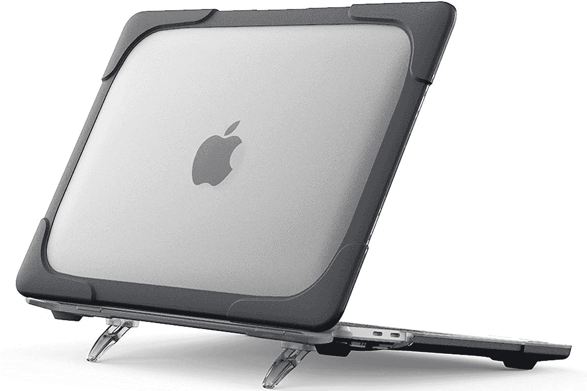</picture>

    ProCase 硬壳带支架

    ##### ProCase 硬壳 MacBook Pro 外壳

    ProCase 硬壳提供了防刮擦和防摔保护，但还有另一个锦囊妙计。它有一个可折叠的支架，可以使打字更方便。

*   ##### Supcase 独角兽甲壳虫 for MacBook Pro 13

    赞助

    这款来自 Supcase 的机箱是 13 寸 MacBook Pro 的最佳选择之一。它给你的 MacBook 增加了一个时髦的外观，并提供了足够的保护以防跌落。

*   <picture>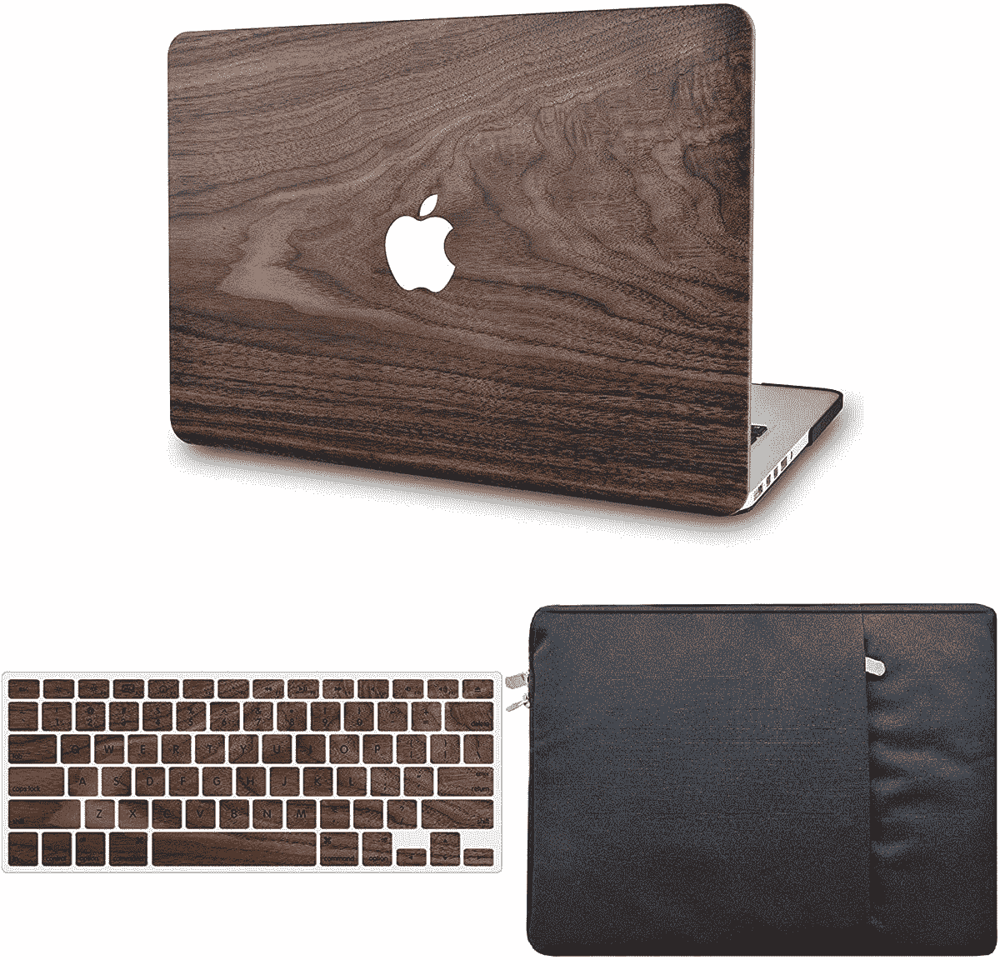</picture>

    KECC 木质 MacBook Pro 硬壳 13

    ##### KECC 木质 MacBook Pro 外壳

    这款木质硬壳外壳让你的 13 寸 MacBook Pro 焕然一新。此外，你还可以得到一个键盘盖和一个免费的袖套，这是额外的奖励。

*   <picture>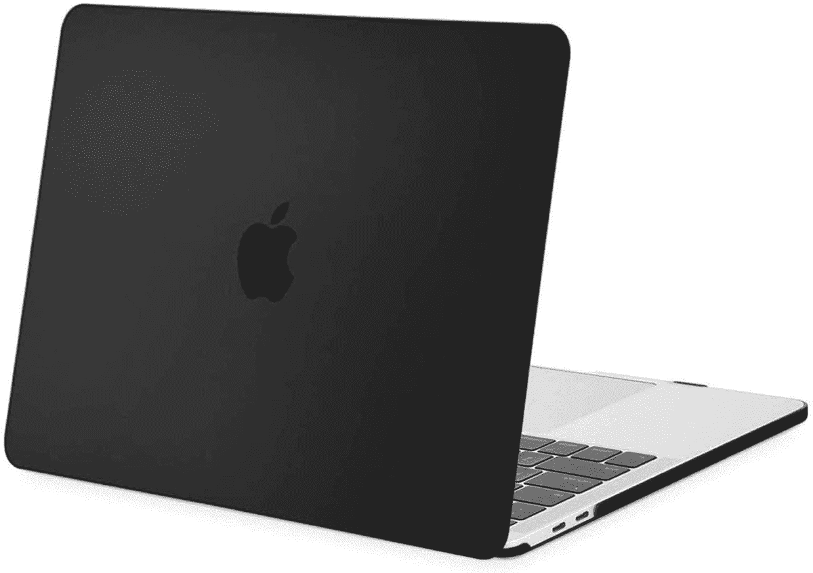</picture>

    MOSISO 硬壳 MacBook Pro 外壳 13

    ##### MOSISO 硬壳 MacBook Pro 外壳

    如果你想让你的 MacBook Pro 看起来隐身，这是你能得到的最好的外壳。哑光黑色搭配 MacBook Pro 的铝制侧面看起来很棒，使其整体看起来很时尚。

*   <picture>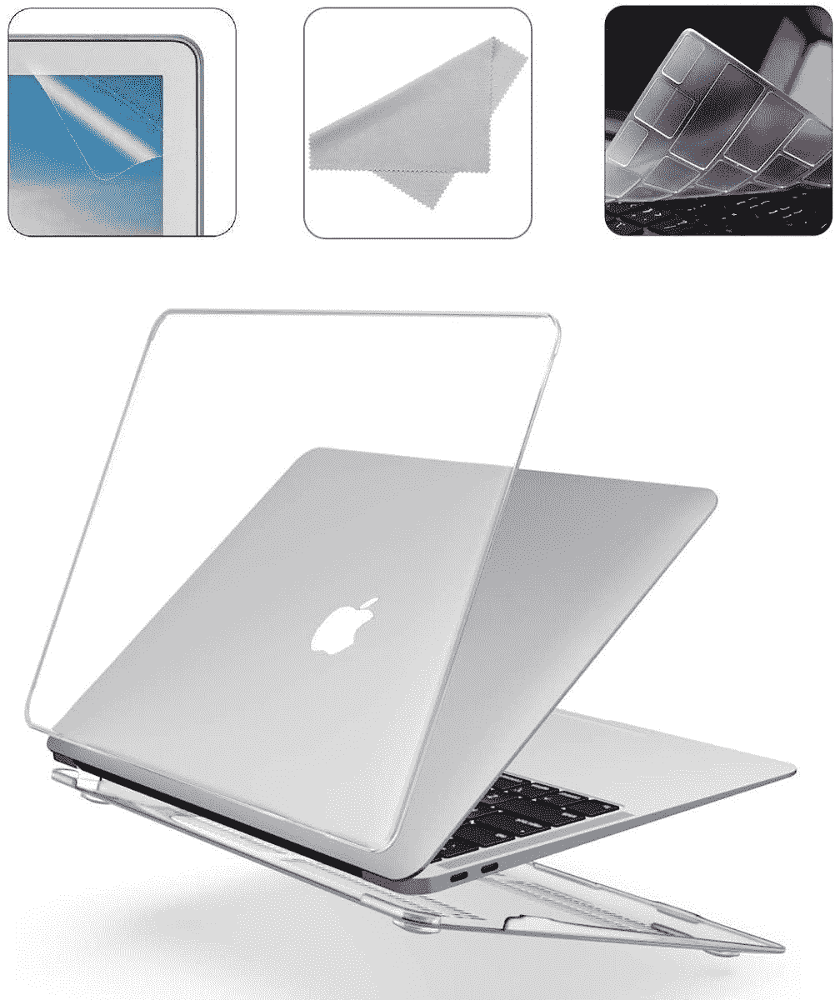</picture>

    透明硬塑料外壳

    ##### EO ocoo 晶莹剔透的 MacBook Pro 外壳

    如果你想炫耀你的带有闪亮苹果标志的全新 MacBook，这款外壳将让你做到这一点，同时提供良好的保护。它还配有键盘保护套。

*   <picture>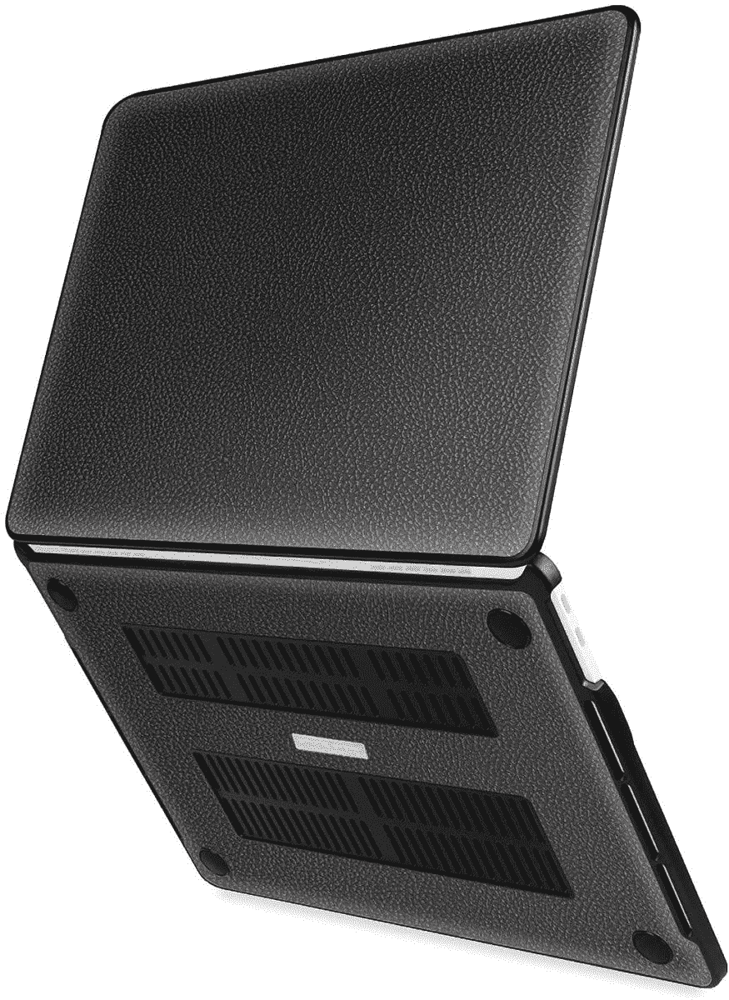</picture>

    fin tie 皮革硬质外壳

    ##### fin tie 皮革 MacBook Pro 硬质外壳

    这种外壳在硬质外壳层的顶部具有 PU 皮革外观，提供了高级的外观和感觉。如果你是一个皮革爱好者，你希望你的笔记本电脑看起来优雅，这是一个很好的选择。

### 2013-2015 款

*   ##### Speck 智能外壳

    Speck 是最著名的外壳制造商之一，这款用于 MacBook Pro 的外壳看起来不错，并提供了相当多的保护。

    T34
*   <picture>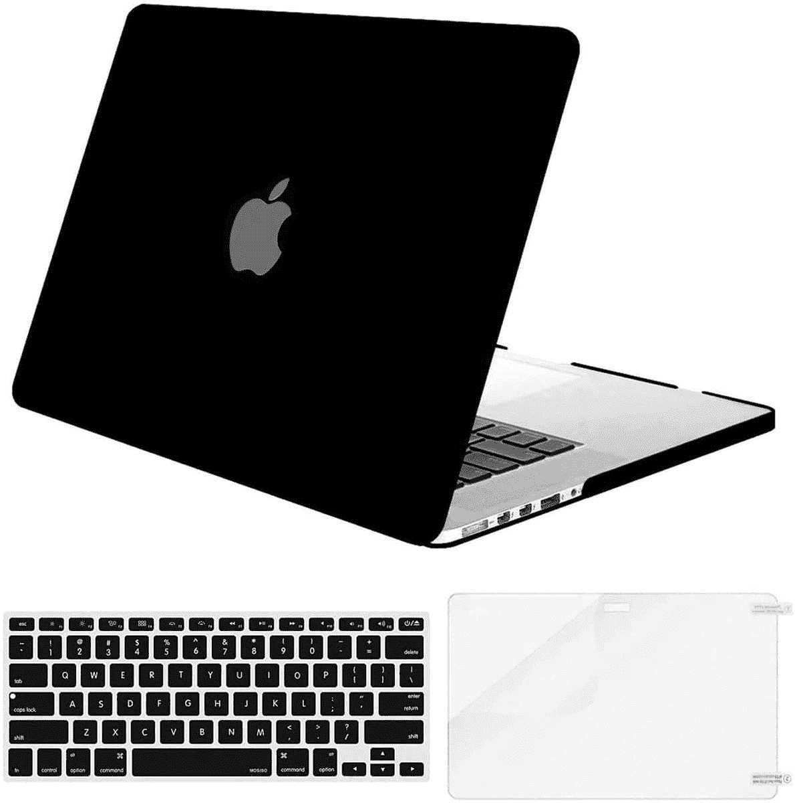</picture>

    Mosiso 硬壳保护套

    ##### Mosiso 硬壳 MacBook Pro 保护套

    这款哑光处理保护套有多种颜色可选，甚至在包装盒中还附赠一个免费的键盘盖和屏幕保护套。

*   <picture>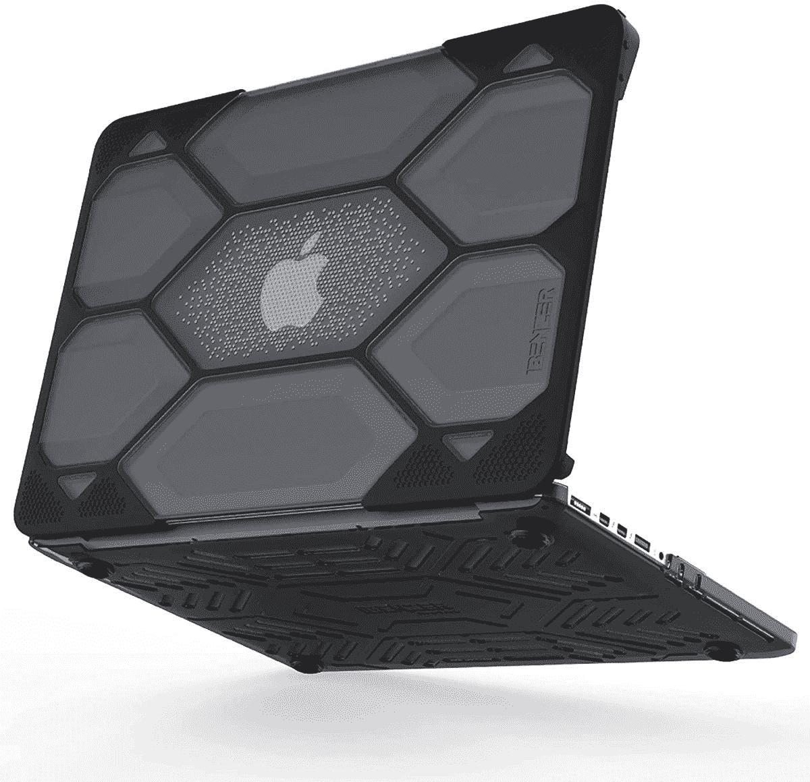</picture>

    Ibenzer 重型机箱

    ##### Ibenzer 重型 MacBook Pro 机箱

    如果你想让你的 MacBook 得到最好的保护，你需要得到这款机箱。它有两层，给人一种粗犷的感觉，但也增加了一些体积。

### 

* * *

## 最佳 MacBook Pro 14 (2021-2023)案例

*   ##### KECC MacBook Pro 14 外壳

    有多种颜色和图案可选，此包装包括键盘盖、塑料硬壳外壳和保护套。这是一个很好的选择，它为您的 MacBook Pro 14 提供了时尚和保护的融合。

    T34
*   ##### Supcase 独角兽甲壳虫 for MacBook Pro 14

    赞助

    这款来自 Supcase 的机箱是 14 寸 MacBook Pro 的最佳选择之一。它为您的 MacBook 增添了一种酷炫的工业外观，并提供了充分的防摔保护。

*   ##### EooCoo MacBook Pro 14 外壳

    如果你是 MacBook Pro 14 原始设计的粉丝，这款外壳将提供保护，同时让笔记本电脑的表面可见。如果你喜欢它的建造质量，但更喜欢鲜艳的选项，那么你可以在将它添加到购物车之前选择四种颜色。

*   ##### Mosiso MacBook Pro 14 外壳

    这款外壳有三十多种不同颜色可供选择。它包括屏幕保护套、键盘盖和配件袋。

    T33
*   ##### sup case UB Clear MacBook Pro case

    赞助商

    如果你想要一个薄而透明的面板留在你的 MacBook 上，以保护它免受划痕和凹痕的影响，这是你需要的。它的外形简约而轻巧。

    T47
*   <picture></picture>

    Tomtoc 袖套包

    ##### Tomtoc 360 保护型笔记本电脑单肩包

    这是一款非常好看的 MacBook Pro 14 袖套，甚至还附带了一个手柄，可以用来随身携带。

* * *

## 最佳 MacBook Pro 15 个案例

### 2016-2019 款

*   ##### Funut 橡胶塑料外壳

    如果你正在寻找闪闪发光的东西，这款外壳有各种各样的彩色和闪光图案，可以让你的 MacBook Pro 脱颖而出。

    T34
*   <picture>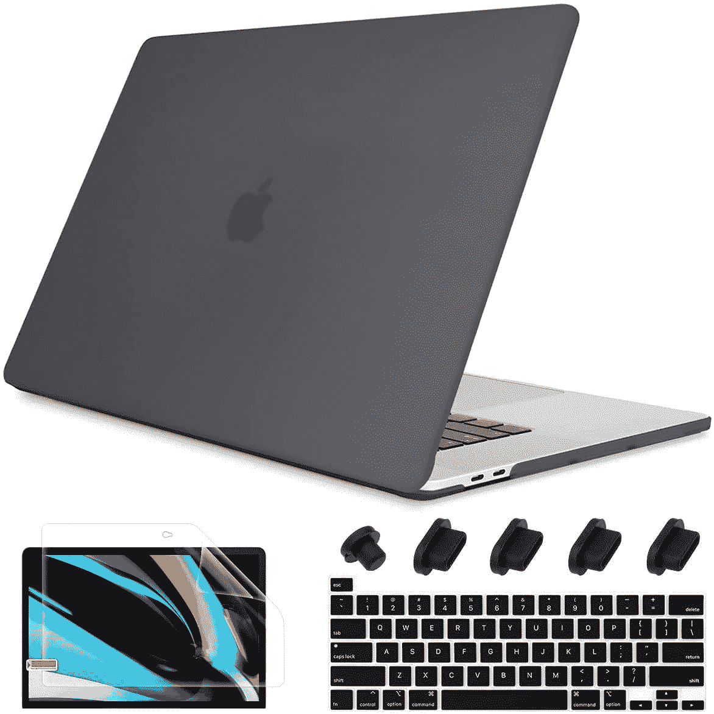</picture>

    哑光硬面外壳

    ##### May Chen 哑光硬面 MacBook Pro 外壳

    如果你正在寻找一款哑光质地的简约外壳，这就是你要挑选的一款。它还有多种颜色可供选择，并配有屏幕保护器和端口盖。

*   <picture>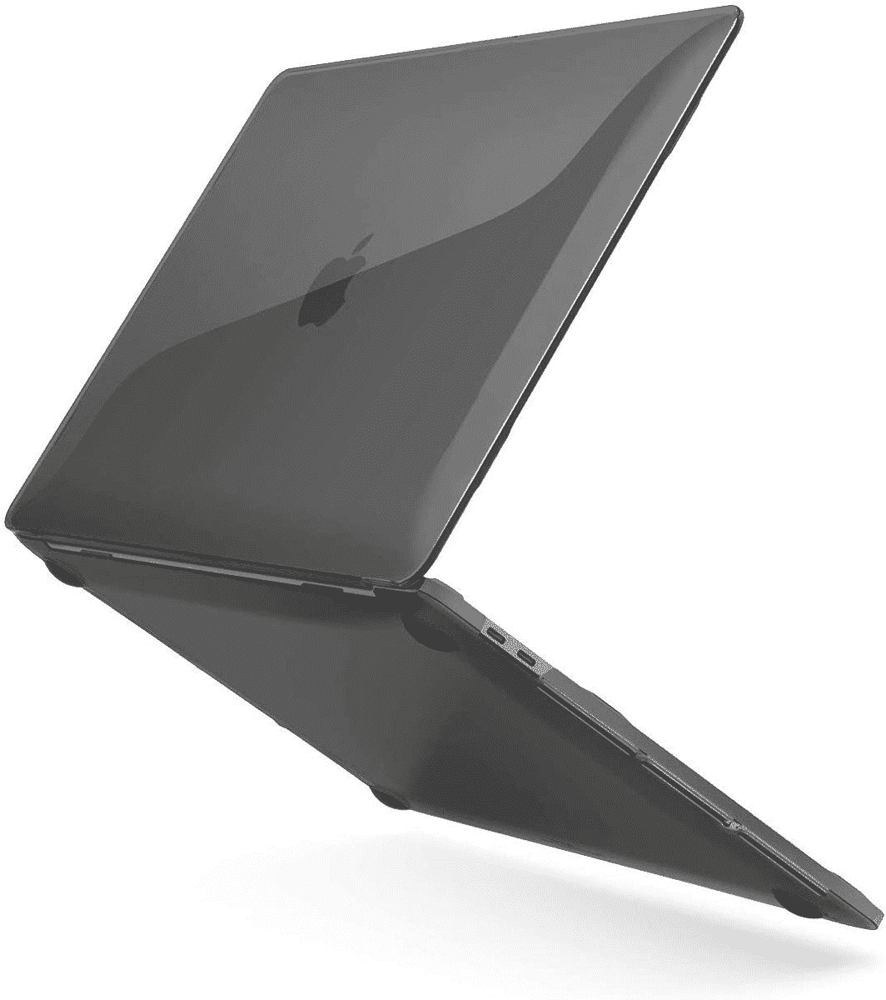</picture>

    Elago Slim 外壳

    ##### Elaco Slim MacBook Pro 外壳

    这是一个清晰的外壳，有一种烟熏的外观，给它一种浅灰色的半透明外观。它看起来相当隐蔽，并提供良好的保护。

### 2013-2015 款

*   ##### 带脚架的硬质保护套

    这是一款保护性极强的保险杠保护套。它还有一个内置的支架，可以以一定的角度放置 MacBook。

    T34
*   <picture>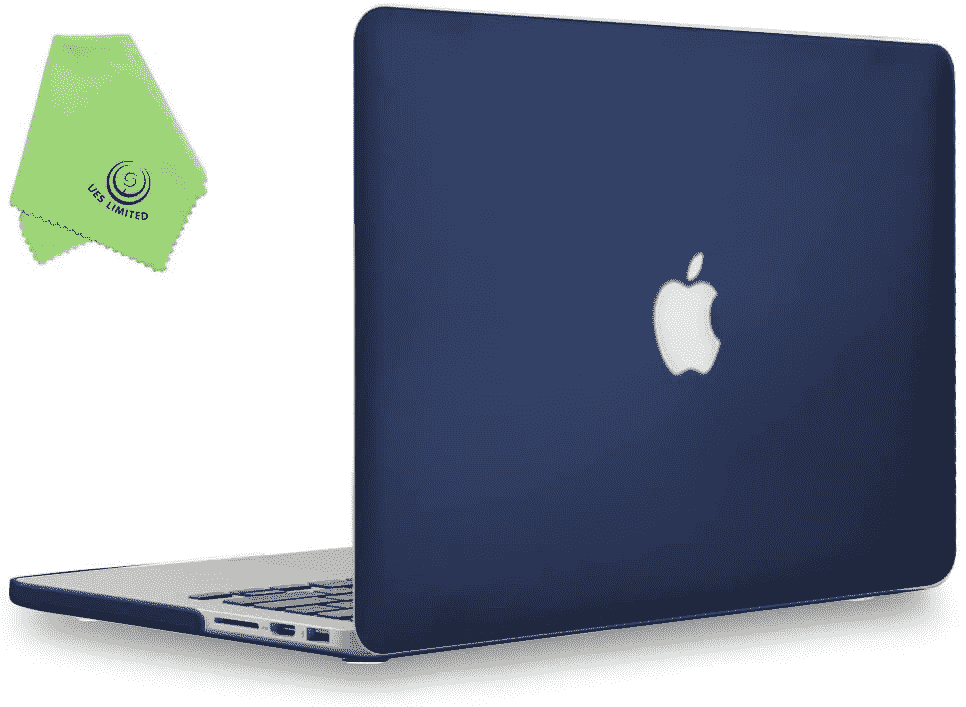</picture>

    哑光硬面外壳

    ##### May Chen 哑光硬面 MacBook Pro 外壳

    如果你正在寻找一款哑光质地的简约外壳，这就是你要挑选的一款。它还有多种颜色可供选择。

*   <picture>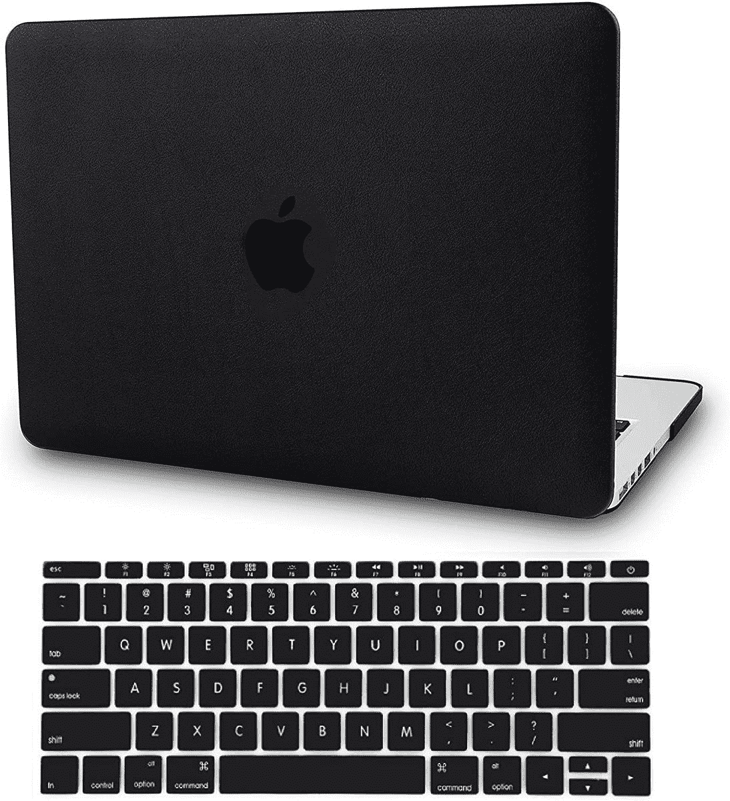</picture>

    KECC 皮套

    ##### KECC 皮套 MacBook Pro 皮套

    皮套往往都是高级的，上档次的，所以如果你在寻找看起来手感都不错的东西，可以考虑这一款。

### 

* * *

## 最佳 MacBook Pro 16 个案例

### 2021-2023 款

*   <picture>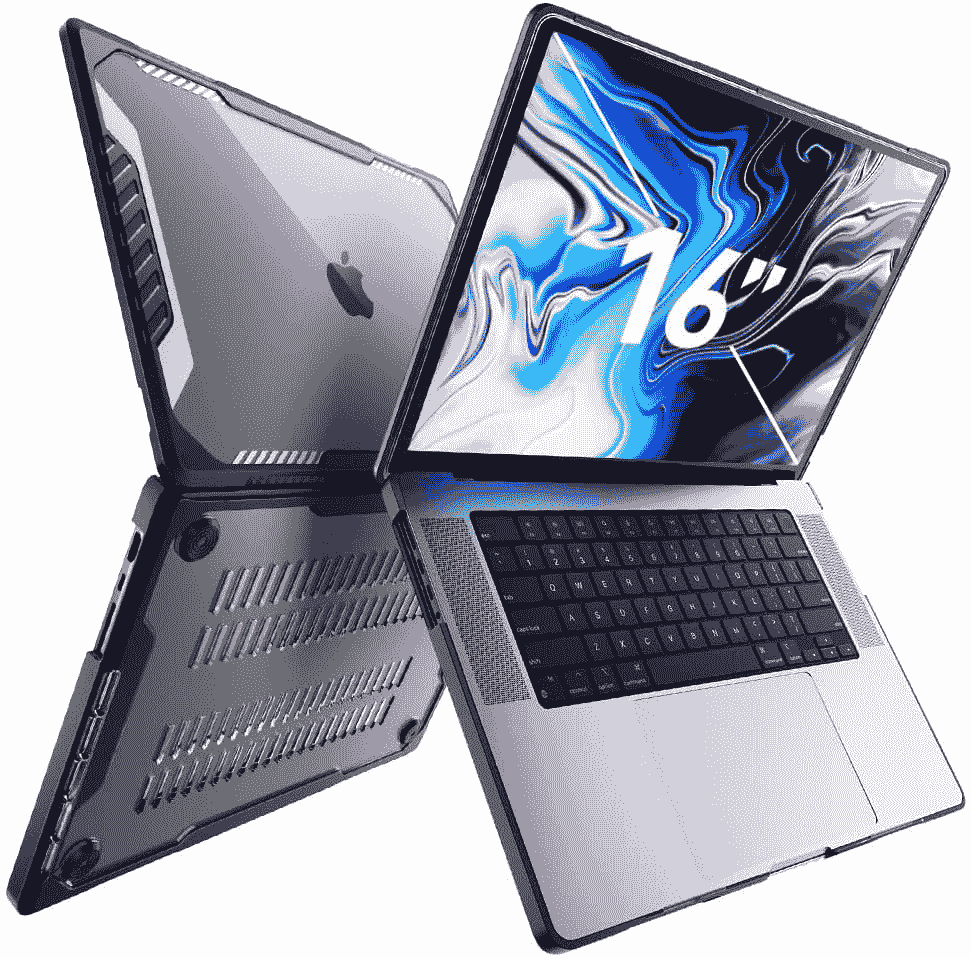</picture>

    Supcase 独角兽甲虫

    ##### sup case UB MacBook Pro case

    赞助商

    这款来自 sup case 的机箱是 16 英寸 MacBook Pro 的最佳选择之一。它为您的 MacBook 增添了一种酷炫的工业外观，并提供了充分的防摔保护。

*   <picture></picture>

    Tomtoc 袖套包

    ##### Tomtoc 360 保护型笔记本电脑单肩包

    这是一款非常好看的 MacBook Pro 16 袖套，甚至还附带了一个手柄，可以用来随身携带。

*   <picture></picture>

    sup case Unicorn Beetle Clear

    ##### sup case UB Clear MacBook Pro case

    supported

    如果你想要一个薄而清晰的面板，让它留在你的 MacBook 上，防止它出现划痕和凹痕，这就是你需要的情况。它的外形简约而轻巧。

### 2019-2020 款

*   <picture>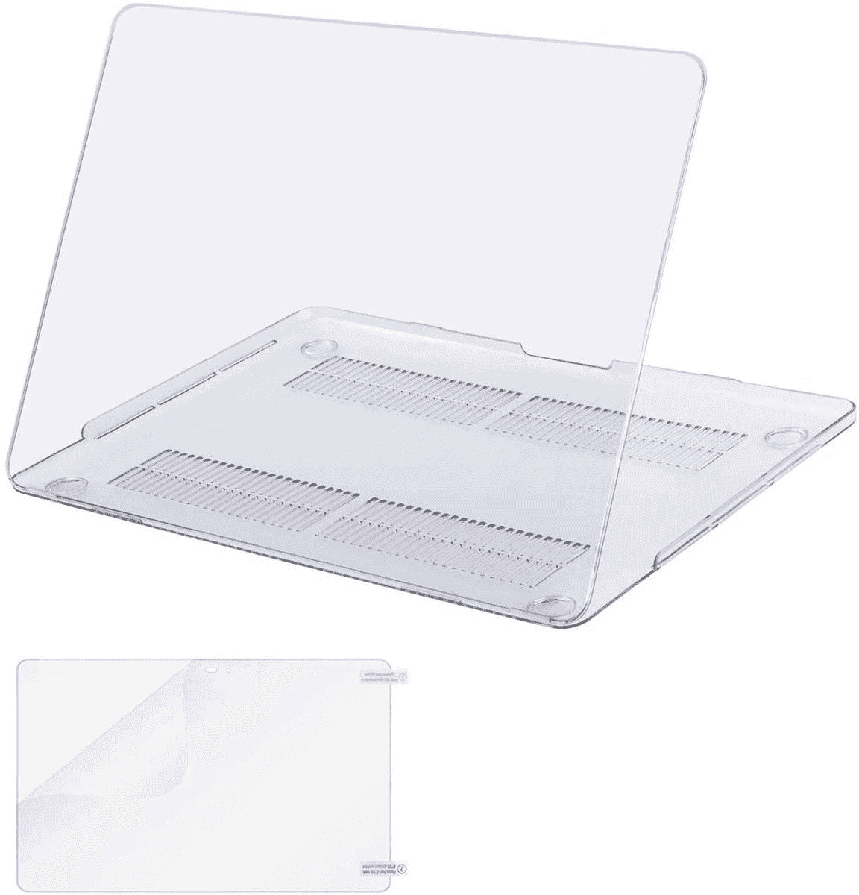</picture>

    透明硬塑料外壳

    ##### EO ocoo 透明硬塑料外壳 MaBook Pro 16 英寸外壳

    如果你想炫耀你的带有闪亮苹果标志的全新 MacBook，这款外壳将让你做到这一点，同时提供良好的保护。让太空灰透透！

*   ##### Supcase 独角兽甲壳虫 MacBook Pro 16 机箱

    赞助

    这款来自 Supcase 的机箱是 16 寸 MacBook Pro 的最佳选择之一。它给你的 MacBook 增加了一个时髦的外观，并提供了足够的保护以防跌落。

*   <picture>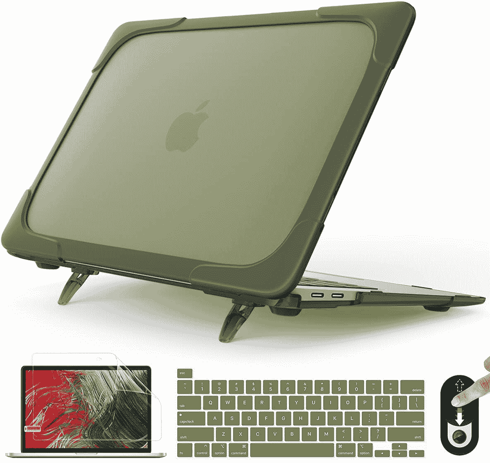</picture>

    带支架的 Mektron 外壳

    ##### Mektron 支架 MacBook Pro 外壳

    这款硬壳外壳提供了防刮擦和跌落保护，但还有另一个锦囊妙计。它有一个可折叠的支架，可以使打字更方便。

* * *

这些是你目前能为苹果 MacBook Pro 找到的一些最好的案例。如果你还没有，考虑投资一个 [USB-C 集线器](http://www.xda-developers.com/best-usb-c-hubs-macbook-pro/)、[好的网络摄像头](http://www.xda-developers.com/best-webcams-mac/)和[外部便携式监视器](http://www.xda-developers.com/best-portable-monitors-mac/)。最终，这些配件只会帮助你最大限度地利用你购买的东西。如果没有插件的帮助，MacBook Pro 本身可能无法为您提供完整的套件。

*   ##### MacBook Pro M2

    2022 款 MacBook Pro 采用了经典的机箱，包装了 Touch Bar 和苹果的 M2 芯片组。有太空灰和银色可选。

*   ##### 苹果 MacBook Pro (2023)

    14 英寸和 16 英寸 MacBook Pro(2023)型号采用了 2021 年首次推出的相同外观底盘。他们提供增强的 M2 Pro 和 M2 Max 芯片，Wi-Fi 6E 和蓝牙 5.3 支持，HDMI 2.1 兼容性，凹槽显示屏等等。

您会购买这些 MacBook Pro 保护套中的哪一个，为什么？请在下面的评论区告诉我们。