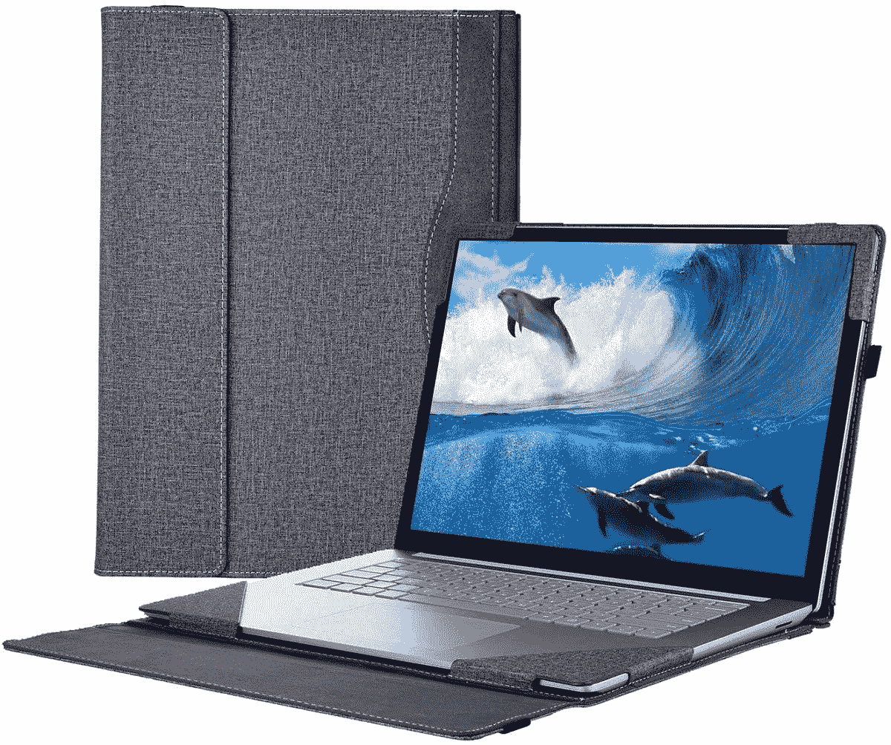

# 15 英寸微软 Surface Laptop 4 的最佳选择

> 原文：<https://www.xda-developers.com/best-15-inch-microsoft-surface-laptop-4-cases/>

# 15 英寸微软 Surface Laptop 4 的最佳选择

需要一种方法来保护您的笔记本电脑？这些是微软 Surface Laptop 4 的最佳案例，包括来自 mCover 等的选项。

微软制造了一些很棒的高端电脑，它的 Surface 系列是最知名的品牌之一。它们都是很棒的笔记本电脑，值得与市场上[最好的笔记本电脑](https://www.xda-developers.com/best-laptops/)竞争。在 Surface 系列中， [Surface Laptop 4](https://www.xda-developers.com/microsoft-surface-laptop-4-review/) 是你现在能买到的最好的电脑之一，它采用了最新的英特尔处理器和高端设计。虽然它很贵，所以你要确保它能穿很长时间。为了帮助你做到这一点，我们收集了微软 Surface Laptop 4 多年来保持安全的最佳案例。

具体来说，我们正在谈论 15 英寸型号的 Surface Laptop 4。微软随 Surface Laptop 3 推出了 15 英寸版本的 Surface Laptop，继任者的尺寸完全相同。这意味着所有这些情况在 Surface Laptop 3 和 Surface Laptop 4 上的表现一样好。你只需要确保你有其中一个的 15 英寸版本。

*   ##### mCover 硬壳 Surface 笔记本电脑外壳

    微软 Surface 笔记本电脑有几种微妙的颜色选择，但如果你想要一些流行的东西，这种硬壳可以帮你做到这一点。它可以在您使用笔记本电脑时保护您的笔记本电脑，并为其增添一抹亮色。

    T13T15
*   ##### ProCase Surface 笔记本电脑保护套

    为了提供额外的保护，ProCase 的坚固硬套采用了坚固的设计，可以保护您的笔记本电脑免受坚硬的跌落和碰撞。它还包括支撑 Surface 笔记本电脑的支脚，以便您可以更舒适地打字。

    T25T27
*   <picture></picture>

    蜜罐外壳外壳

    ##### 蜜罐皮面笔记本电脑 4 外壳

    蜜罐外壳的这款外壳可以从各个方面保护您的笔记本电脑，但它的超细纤维和 PU 皮革表面也增加了高级外观。它也有几种颜色可供选择。

*   ##### Smatree 15-16 英寸硬壳笔记本电脑套

    这款 Smatree 硬壳套由坚硬的模压尼龙制成，既防震又防水，因此您的微软 Surface 笔记本电脑永远安全。它也采用了时尚的设计，所以你不需要太大的体积来保护你的笔记本电脑。

*   ##### Tomtoc 360 保护型笔记本电脑单肩包

    这款 Tomtoc 保护你的笔记本电脑，做起来也好看。它有三种颜色，许多不同的尺寸，周围有许多填充物，在角落里有额外的保护以防意外跌落。

    T17
*   ##### Kinmac 360 保护套

    许多保护套都有几种不同的颜色，但很少有像 Kinmac 的这款保护套提供这么多选择。有超过 20 种图案可供选择，袖子本身提供了大量的软缓冲，防水和钢化框架，以防止更严重的跌落。

*   <picture></picture>

    deal case 笔记本电脑套

    ##### deal case 15.6 英寸笔记本电脑套

    如果你想为你的微软 Surface 笔记本电脑 4 携带一些额外的配件，这款保护套包括一个额外的袋子，这样你就可以将所有东西安全地放在自己的袋子里。表壳本身是防水的，可以防止碰撞和刮擦。

*   <picture></picture>

    Targus Strata 笔记本电脑套

    ##### Targus Strata 笔记本电脑套

    如果你带着你的微软 Surface 笔记本电脑 4 旅行，这款 Targus 套可以提供保护，并且由于它有肩带，携带起来更方便。它看起来既现代又时尚，还为配饰留出了额外的空间。

*   <picture></picture>

    Casematix 笔记本电脑硬套

    ##### Casematix 笔记本电脑硬套

    你可能永远都不需要为你的笔记本电脑提供这么多保护，但如果你需要，这里就是。这款保护套提供了坚固的外壳和大量的内部填充物，可以保护你的微软 Surface Laptop 4 免受任何东西的伤害，包括硬摔和水溅。

有了这些保护套选项，保护您的 Microsoft Surface Laptop 4 变得更加容易。有些是为了在旅行时使用，而有些可以在你使用笔记本电脑时使用。对于旅行， [Kinmac 笔记本电脑套](https://www.amazon.com/Kinmac-Protective-inch-13-5-Waterproof-MacBook/dp/B082LNZDBZ?tag=xda-1m4i84b-20&ascsubtag=UUxdaUeUpU31599&asc_refurl=https%3A%2F%2Fwww.xda-developers.com%2Fbest-15-inch-microsoft-surface-laptop-4-cases%2F&asc_campaign=Commerce)是个人的最爱，因为有无数的设计可供选择。另一方面， [mCover 硬壳](https://www.amazon.com/dp/B082GCPZSN?tag=xda-1m4i84b-20&ascsubtag=UUxdaUeUpU31599&asc_refurl=https%3A%2F%2Fwww.xda-developers.com%2Fbest-15-inch-microsoft-surface-laptop-4-cases%2F&asc_campaign=Commerce)保护套是增加保护和个人风格的好方法，即使你正在使用你的电脑。

如果你还没有，你可以从下面的链接购买 15 英寸的 Surface Laptop 4，不过如果你有预算的话，我们建议你看一看更新的 [Surface Laptop 5](https://www.xda-developers.com/surface-laptop-5-review/) 。那台电脑有完全相同的机箱，所以你可以使用相同的外壳，但它配备了更快的处理器和 Thunderbolt 支持。

 <picture></picture> 

Surface Laptop 4 ($300 off)

##### 微软 Surface Laptop 4

微软 Surface Laptop 4 是一款高端笔记本电脑，由于采用了最新的英特尔处理器，它具有卓越的设计和出色的性能。它还有一个支持触摸的高分辨率显示屏。