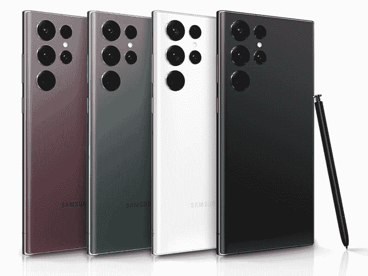
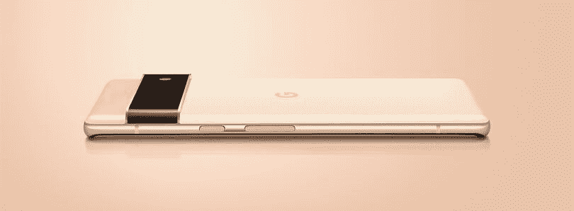

# 这些是 2023 年你能买到的最好的 5G 手机

> 原文：<https://www.xda-developers.com/best-5g-phones/>

5G 在世界各地不断推出，所以如果你正在购买一部新手机，选择一部支持第五代网络的手机可能是值得的。在我们的[最佳手机](https://www.xda-developers.com/best-phones/)和[最佳安卓手机](http://www.xda-developers.com/best-android-phones/)名单中，大多数手机已经支持 5G——但你现在不必花旗舰机的钱来获得高速连接。以下是 XDA 关于支持 5G 的最佳手机的指南。

## 钱能买到的最好的 5G 可折叠手机:三星 Galaxy Z Fold 4

如果你想要最强大、最炫的 5G 手机，那就是现在的三星 Galaxy Z Fold 4。Galaxy Z Fold 4 是一款迷你平板电脑，可以对折成为一款可随身携带的产品，是目前世界上最前沿的智能手机。

今年，三星增加了更耐用的建筑材料，改善了人体工程学，增加了屏幕亮度，使其成为一款非常有能力的生产力机器。我们 XDA 的一些人已经用这个设备工作了，包括为这个网站写文章。当然，它永远比不上在合适的笔记本电脑上工作，但在 Z Fold 4 上打字/写作和多任务处理要比在典型的平板手机上容易得多。

但是如果你想把这台机器玩玩，你也可以这么做。Galaxy Z Fold 4 提供了一个 120Hz 的 7.6 英寸大屏幕，非常适合游戏和视频观看，而“Flex Mode”，即铰链保持半折叠的能力，允许 Galaxy Z Fold 4 像笔记本电脑一样呈 L 形放置。这意味着免提视频通话、集体自拍或定时拍摄。外部“覆盖屏幕”尺寸为 6.2 英寸，虽然有点窄，但仍然非常有用，非常适合在外出时单手使用。

Galaxy Z Fold 4 配有骁龙 8 Plus Gen 1 和 4400 毫安时电池，可以处理你扔给它的任何东西，包括马拉松游戏。

Galaxy Z Fold 4 终于解决了以前折叠的一个最大缺点:摄像头。新型号借用了与 Galaxy S22 Plus 相同的相机硬件，加上改进的图像处理，它最终提供了一种您可以依赖的相机体验。新的 50MP 主拍摄镜头远优于 Galaxy Z Fold 4 的 12MP 拍摄镜头，而 10MP 长焦镜头也能提供良好的效果，尽管它仍然无法与 Galaxy S22 Ultra 的变焦相机相媲美。

 <picture></picture> 

Samsung Galaxy Z Fold 4

Galaxy Z Fold 4 是 Android 中最新的顶级狗手机，所以它当然有 5G 支持！你也会想要高速连接，因为这是一个有能力的多任务处理机器。

## 1000 美元至 1500 美元之间的最佳 5G 手机:三星 Galaxy S22 Ultra

三星 Galaxy S22 Ultra 可以说是目前世界上最好的平板手机，除了顶级的网络连接，你现在可以在移动设备上获得最好的屏幕，6.8 英寸的三星 AMOLED 屏幕，具有自适应刷新率，最高可达 120 赫兹，最强的颜色和 1750 尼特的最大亮度。我们也是其 Galaxy Note 灵感设计的粉丝。

相机系统也是最通用的:它由一个 108 兆像素的相机和一个相对较大的图像传感器，一个 12 兆像素的超宽，10 兆像素的 10 倍潜望镜变焦镜头和另一个 10 兆像素的 3 倍远摄变焦镜头组成。拥有两个变焦镜头使 S22 Ultra 成为当今智能手机中最通用的焦距范围，主摄像头也可以捕捉有力、明亮和充满活力的图像。超宽相机没有达到其他相机的标准，但也没有什么大不了的。

S21 Ultra 配有骁龙 8 Gen 1 和 5，000 毫安时电池，是目前续航时间最长的手机之一，能够连续使用至少 12 小时，对于临时用户来说则更长。充电速度也从 25W 提高到了 45W。

Galaxy S22 Ultra 还在 S 系列中首次内置了 S Pen，因此您可以根据自己的需要画草图或记笔记。

还有三星 DeX，它可以让你将手机连接到外部显示器，像“真正的”电脑一样使用它——前提是你有蓝牙键盘。所有这些功能使 S21 Ultra 成为市场上更具生产力的平板手机之一。如果你想要一部检查所有盒子的 5G 手机，很难超越 S22 Ultra -除非你想让你的手机折叠。

 <picture></picture> 

Samsung Galaxy S22 Ultra

Galaxy S22 Ultra 无疑是市场上最好的平板手机，具有 6.8 英寸的大显示屏，强大的变焦摄像头和 S Pen 支持。

## 800 美元至 999 美元之间的最佳 5G 手机:苹果 iPhone 13

标准的 [iPhone 13](https://www.xda-developers.com/apple-iphone-13-review/) 在这个 800 美元到 1000 美元的价格范围内已经是尽善尽美了——而且稳坐低端市场还能加分。iPhone 13 与它更大、更贵的兄弟产品 Pro 系列运行在同一处理器上——苹果 A15 Bionic——这意味着 iPhone 13 的处理器是目前市场上最好的移动处理器。

与之前的 iPhone 相比，iPhone 13 还具有一个功能强大的双摄像头系统，传感器更大，因此静态照片具有更好的进光能力，以及更好的景深。超广角相机也是业内最好的相机之一，没有你在一些 Android 手机中发现的明显的颜色偏移。并且 iPhone 13 还拥有同类最佳的视频录制能力，捕捉最稳定的镜头，具有适当的动态范围，甚至可以选择添加半令人信服的人工散景。

凭借 6.1 英寸的有机发光二极管屏幕和 174 克的重量，iPhone 13 也是目前最轻最小的手机之一。虽然我们很多人觉得以前的 iPhone 的弯曲设计稍微更舒适，但不可否认的是，iPhone 13 的平坦侧面和坚硬的角度设计有一种专业、成熟的氛围。这是一部看起来更像是真机而不像是小玩意的手机。

当然，在购买苹果时，你必须考虑软件和生态系统。iPhone 13 运行在 iOS 15 上，这是一个流畅直观的操作系统，可以与苹果的其他产品无缝协作。例如，如果你在 iPhone 13 上录制了一个语音备忘录，你可以在 Mac 上找到相同的备忘录(如果你使用的话)。或者你可以通过隔空投送轻松地将文件发送到其他 iPhones 或苹果设备上。我们还喜欢的是，如果你用一台苹果设备登录 wifi，你所有的其他苹果设备将自动知道密码并登录，而不需要你再次做这个过程。正是这些小东西让 iPhone 在全世界如此受欢迎。

 <picture></picture> 

Apple iPhone 13 Mini

##### 苹果 iPhone 13

iPhone 13 符合这个令人高兴的中等价格区间(至少对北美人来说)，因为它高于中端价格，所以你可以期待一款旗舰设备，但它不在真正昂贵的高端旗舰产品领域。

## 800 美元到 999 美元之间也很棒:三星 Galaxy Z Flip 4

如果你知道你不想使用 iPhone，那么[三星 Galaxy Z Flip 4](https://www.xda-developers.com/samsung-galaxy-z-flip-4-review/) 在这个价格范围内是一个极好的替代选择。Galaxy Z Flip 4 既是一种倒退，也是对前沿未来科技的一种审视:这是一款 6.4 英寸的超薄平板智能手机，对折后变得更加紧凑。

三星对之前的 Galaxy Z 翻盖手机进行了一系列改进——由于覆盖屏幕的新薄膜材料，折叠屏幕感觉比以前更坚固，塑料感更低。由于 120 赫兹的刷新率，动画看起来也非常流畅。外面的“封面显示”有了新的花样，让你可以快速回复通知和

Galaxy Z Flip 4 比以往任何时候都更加耐用，在外壳上包装了 Gorilla Glass Victus Plus，主显示屏强度提高了 45%，具有 IPX8 防水功能，并改进了铝制装甲铰链。我们是“灵活模式”的忠实粉丝，这种模式允许 Galaxy Z Flip 4 在任何角度都保持半折叠状态，这意味着你可以进行免提视频通话或自拍，以及一系列其他可能性。升级的双 12MP 相机系统也做得很好，产生清晰和充满活力的宽和超宽图像。由于它的可折叠设计，你也可以使用这些相机自拍。当然，主屏幕上还有一个更传统的 10MP 自拍相机。

Galaxy Z Flip 4 由骁龙 8 Plus Gen 1 驱动，是目前最强大的安卓手机之一。无论是游戏还是网飞，生产力任务还是社交媒体，Galaxy Z Flip 4 都可以处理您扔给它的任何东西。

Galaxy Z Flip 4 配备了 3700 毫安时的电池，比 Galaxy Z Flip 3 的 3300 毫安时电池有所提高。充电速度也从 15W 提升到了 25W。

 <picture></picture> 

Samsung Galaxy Z Flip 4

Galaxy Z Flip 4 是一款时尚性感的翻盖可折叠手机，提供华丽的屏幕，IPX8 防水，当然还有 5G！

## 700 美元到 800 美元之间:一加 10 专业版

如果你想要一部价格低于 800 美元的手机，提供强大的性能和 QHD+显示屏，那么[一加 10 Pro](https://www.xda-developers.com/oneplus-10-pro-review/) 是一个不错的选择。它提供了几个与高端 Galaxy S22 Ultra 相匹配的规格，如 120Hz 有机发光二极管屏幕，骁龙 8 Gen 1 芯片组，优质玻璃和铝结构，以及一个非常好的带大传感器的主摄像头。

然而，它缺乏毫米波 5G 频段，因此在美国，它只支持 T-Mobile 和威瑞森的 5G，而不支持美国电话电报公司的 5G。而且它缺少三星顶级狗手机的疯狂变焦镜头。尽管如此，对于大多数认为手机最重要的东西是屏幕、主摄像头和处理器的人来说，一加 10 Pro 绝对可以赶上任何人。

我们也是一加的软件皮肤 OxygenOS 的粉丝，它很干净，看起来像普通的 Android，但有大量的定制选项，以及手机提供的各种有趣的颜色，如上面照片中的翡翠森林色。

5000 毫安时的电池也足够为手机供电一天多，如果你需要充电，一加有最快的充电技术之一:手机附带 65W 的充电砖，它可以在 29 分钟内从 0 到 100%充满手机。这意味着即使在中午充电八分钟，也应该为手机添加足够的电量供整夜使用。

 <picture></picture> 

OnePlus 10 Pro

##### 一加 10 专业版

一加 10 Pro 是 1000 美元以下最好的旗舰之一。它支持威瑞森和 T-Mobile 的 5G 网络，但不支持美国电话电报公司。

## 500 美元至 699 美元之间的最佳 5G 手机:谷歌 Pixel 6

 <picture></picture> 

Pixel 6 back

售价 599 美元的[谷歌 Pixel 6](https://www.xda-developers.com/google-pixel-6-pro-review/) 轻松拿下这一类别。事实上，谷歌 Pixel 6 可能是这个市场上最超值的手机。这款手机运行在谷歌自己的 SoC Tensor 上，拥有 8GB 内存和 6.4 英寸 90Hz 有机发光二极管屏幕，以及一个非常好的相机系统，这是一款几乎拥有旗舰硬件的手机，可以提供权威的 Android 体验——这正是谷歌想要的。

Pixel 6 显然可以连接到 5G，但除了软件之外，获得这款手机的主要原因是摄像头。这款 50MP 相机可以拍摄出令人惊叹的照片，这要归功于它更快的光圈和大图像传感器，后者允许相机自然地吸收更多的光线，因此它不必经常求助于夜间模式，并在某些镜头中产生看起来自然的真实散景。

16MP 超宽镜头没有达到同样的高度，但仍然是一个非常有能力的镜头，然而，视野比市场上大多数超宽相机窄。除了硬件之外，谷歌的计算摄影技术使这款手机能够捕捉到远高于其价格级别的照片。我们最喜欢的功能之一是 Magic Eraser，它利用谷歌的机器学习从照片中以数字方式删除不想要的人或元素。它并不总是有效，但当它有效时，它看起来真的像魔术一样。

Pixel 6 Pro 的 6.4 英寸屏幕在我们看来也是一个理想的尺寸，因为它不会太大，无法单手使用。对于这种尺寸的手机来说，4，614 mAh 的电池相当大，因此可以轻松获得全天的电池续航时间。

 <picture></picture> 

Google Pixel 6

谷歌 Pixel 6 是这份名单上最超值和时尚的手机之一。

## 500 美元以下最佳 5G 手机:三星 Galaxy A53 5G

 <picture></picture> 

Galaxy A53 display.

凭借 120Hz 有机发光二极管显示屏、Exynos 1280 SoC 和一个可以与 Galaxy S22 进行交易的非常强大的主摄像头， [Galaxy A53](https://www.xda-developers.com/samsung-galaxy-a53-5g-hands-on/) 是今年发布的最好的中端手机之一。

我们喜欢这款手机的明亮柔和的颜色，尽管它有塑料背，但拿在手中感觉很好。如前所述，64MP、f/1.8 主摄像头非常强大，拍摄的照片通常具有适当的动态范围和强烈的色彩。其他镜头从固体到几乎无用。12MP 超宽相机位于前一阵营，是一个有能力的射手，可以拍摄出视野开阔的照片，尽管如果放大，细节会有点柔和。然而，这对用于深度和微距的 500 万像素传感器比真正的相机更具装饰性，因为它们应该有助于人像和微距拍摄，但结果很一般。尽管如此，考虑到这款手机的价格，你仍然可以获得两个非常强大的相机，外加一个 32MP 自拍相机。

A53 还运行在三星的 One UI 上，这是目前较为成熟的软件皮肤之一，具有一系列出色的功能和定期的安全更新。

是的，机身主要由塑料制成，显示屏上的指纹识别器不是最快的，但为了节省几百美元，这种权衡是值得的——此外，大多数人都用手机外壳。

Galaxy A53 装有一个 5000 毫安时的大电池，可快速充电 25 瓦。总之，这是一个更好的价值中游侠在美国。

 <picture></picture> 

Samsung Galaxy A53

##### 三星 Galaxy A53 5G

Galaxy A53 是目前你能买到的最便宜的安卓手机之一，拥有 120 赫兹的有机发光二极管屏幕，5G 连接和安卓 12 系统

## 300 美元以下最佳 5G 手机:一加 Nord N10

有了骁龙 690 和塑料机身，没人会把一加诺德 N10 当成旗舰手机；但它拥有连接 5G 所需的调制解调器，仍然拥有相当生动的 6.5 英寸 90Hz 液晶显示器。尽管 SoC 较旧，但由于超级干净和流畅的 OxygenOS 软件，手机仍能在令人满意的水平上运行。

对于光学系统，6400 万像素的主摄像头可以完成任务，因为它使用了像素宁滨技术，你可以拍摄包含很多细节的 1600 万像素的照片。但是 8MP 超宽摄像头，可以打也可以不打。同样好用的是 16MP 相机，如果你在阳光充足的条件下拍摄，它往往会吹出高光，但在这个价格范围内，你不能期望太多。

4300 毫安时的电池可以轻松地为手机供电一整天，手机还附带了一个 30W 的快速充电块。接下来是软件，一个快速可靠的 OxygenOS 将毫无问题地满足基本使用需求。我们对这个软件唯一的不满是它缺少单手操作模式。一加诺德 N10 还装有立体声扬声器，所以这是一个很好的电影观赏机。然而，对于游戏，您必须设定现实的预期，因为处理器的功能不足以在最大设置下运行图形密集型游戏，您必须降低图形设置才能获得适当的性能。

 <picture></picture> 

OnePlus Nord N10 5G

##### 一加北部 N10 5G

一加诺德 N10 5G 是一款廉价的 5G 手机，电池续航时间长，屏幕好。

* * *

最终，如果钱不是问题，我现在选择的最好的 5G 手机是 Galaxy Z Fold 4 和 Galaxy S22 Ultra 之间的双向选择——但我知道价格让许多人都不去。对于大多数人来说，我认为 [iPhone 13](https://www.xda-developers.com/apple-iphone-13-review/) 或一加 10 Pro 是绝佳的购买品；你得到的智能手机基本上和去年的技术允许的一样好，价格在四位数以下。