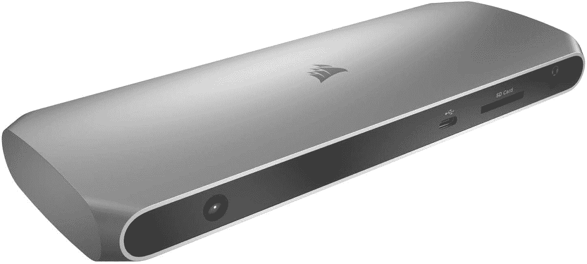
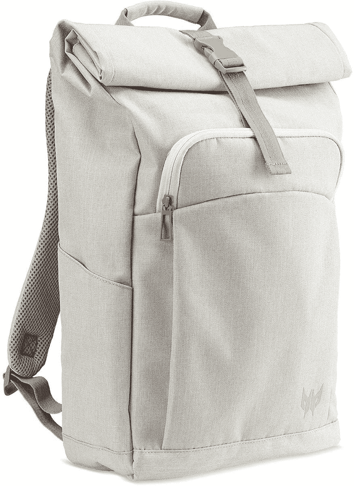

# Acer Swift 3 的最佳配件(2022)

> 原文：<https://www.xda-developers.com/best-accessories-acer-swift-3/>

Acer Swift 3 的 [2022 更新版本相比其前代产品有一些值得注意的升级。最值得注意的是，它拥有](https://www.xda-developers.com/acer-swift-3-2022-review/)[第 12 代英特尔处理器](https://www.xda-developers.com/intel-12th-gen-alder-lake/)和新的四核高清显示屏选项，为您提供更清晰的图像。这些升级使宏碁 Swift 3 成为一款非常好的笔记本电脑，但这并不意味着你不能通过添加一些配件来让它变得更好。

无论是用于提高工作效率的额外显示器、用于游戏的外部 GPU，还是简单的机箱，您都可以使用附件让 Acer Swift 3 更好地为您服务。为了帮助你，我们收集了一些你能买到的最好的配件。我们涵盖了广泛的类别，所以无论你是谁，这里一定会有你感兴趣的东西。事不宜迟，让我们开始吧。

**浏览这篇文章:**

## Acer Swift 3 (2022)的外部显示器

宏碁 Swift 3 的显示屏现在可能会有更高的分辨率——是的，这是一个非常受欢迎的升级——但这并不意味着它足以满足所有人。第二个屏幕可以极大地提高您在家或外出时的工作效率(是的，有便携式显示器)，即使您不想同时使用两个屏幕，外部显示器也可以提供 Acer Swift 3 所不具备的功能。游戏的高刷新率、超宽的宽高比或者仅仅是更大的尺寸都是额外显示器成为 Acer Swift 3 附件之一的充分理由。

*   <picture></picture>

    三星 S65UA

    ##### 三星 S65UA Ultra WQHD 显示器

    如果你想提高工作效率，超宽显示器可能是一个不错的选择。这款三星面板具有 21:9 的宽高比、清晰的 WQHD 分辨率和 HDR 支持。此外，它是弯曲的，更加舒适。有了这个，就不需要其他显示器了。

*   <picture></picture>

    华硕 ProArt pa 328 cgv

    ##### 华硕 ProArt PA328CGV 32 寸 4K 显示器

    这款华硕 ProArt 显示器功能极其丰富，而且相对来说买什么都实惠。它是 32 英寸的四高清面板，95%的 DCI-P3 和 Delta E < 2 覆盖率，另外它支持 DisplayHDR 600，并且具有 165Hz 的刷新率，因此您可以用于工作和游戏。

*   <picture></picture>

    宏碁 R242Y

    ##### 宏碁 R242Y

    只是想要一台基本的显示器来提高您的工作效率吗？宏碁 R242Y 是一个非常实惠的选择，一定会为您带来惊喜。它有全高清分辨率和 75Hz 的刷新率，所以使用起来感觉有点流畅，加上它有非常薄的边框，所以不会浪费空间。

*   <picture></picture>

    宏碁掠夺者 XB 283k

    ##### 宏碁掠夺者 XB273K 27 寸 UHD 游戏显示器

    想玩最新的 AAA 游戏吗？这款 Acer Predator 显示器提供 4K 分辨率和 144Hz 刷新率，为您带来最佳游戏体验之一。添加 HDMI 2.1，您也可以从您的 PC 和最新的控制台获得最佳的游戏体验。

*   <picture></picture>

    Arzopa 便携式监护仪

    ##### Arzopa 便携式监护仪

    出门在外？这不是没有双屏设置的理由。这款 14 英寸的 Arzopa 显示器非常实惠，但它具有全高清分辨率，内置扬声器，并通过 USB-C 连接。它还包括一个智能外壳，可兼作支架。

总体而言，您可以在我们的[最佳显示器](https://www.xda-developers.com/best-monitors/)综述中找到更多选项。

## 外部 GPU 外壳

我们上面有几个面向游戏的显示器，但你可能想知道如何利用这一点。毕竟宏碁 Swift 3 内部没有独立的 GPU。这就是 Thunderbolt 4 的威力发挥的地方——使用 Acer Swift 3 上的 Thunderbolt 4/USB-C 端口，您可以将外部 GPU 连接到您的笔记本电脑，获得桌面级的图形性能。外部 GPU 外壳是有点昂贵的附件，但它们为 Acer Swift 3 增加了大量的多功能性。以下是我们的一些建议。

*   ##### Sonnet Breakway Box 750

    Sonnet Breakway Box 更面向专业人群，采用时尚低调的设计，但它仍然有一个强大的 750 瓦 PSU，能够为您的 GPU 提供高达 475 瓦的峰值负载，加上 100 瓦的笔记本电脑充电。这款没有 USB 接口，但有一款有。

*   <picture></picture>

    Gigabyte Aorus 游戏盒

    ##### Gigabyte Aorus 游戏盒

    外置 GPU 通常需要你单独购买，但这个包装中包含了一个 NVIDIA GeForce RTX 3080。盘柜本身有一个 550 瓦的 PSU，并增加了三个 USB 端口和以太网。像大多数 GPU 一样，在库存中很难找到它，但如果你不想自己组装任何东西，这是一个很好的解决方案。

如果您想了解一些其他选项，我们还提供了一份[最佳外部 GPU 附件列表](https://www.xda-developers.com/best-external-gpus-for-your-laptop/)。

## 鼠标和键盘

让电脑变得便携需要做出一些牺牲。例如，笔记本电脑必须有一个有点浅的键盘，而不是典型的鼠标，他们有一个触摸板。这对便携性来说很好，但是如果你在家使用笔记本电脑工作呢？一个合适的鼠标和键盘可以是添加到您的 Acer Swift 3 的优秀附件，提高您的整体舒适度和工作效率。以下是我们的一些建议。

*   <picture></picture>

    罗技 Ergo K860

    ##### 罗技 Ergo K860

    一个舒适的键盘很重要，尤其是如果你整天都在使用它的话。Logitech Ergo 符合人体工程学，可将所有按键轻松放在触手可及的地方，此外，它还能让您以最自然的姿势放置双手，这样您就不会扭伤手腕，而且它还能让重要的按键触手可及。

*   <picture></picture>

    宏碁掠夺者 aet hon 301 TKL

    ##### 宏碁掠夺者 Aethon 301 TKL

    如果你打算玩一些游戏，机械键盘可能是你想要的东西。这一款采用紧凑的 tenkeyless 设计，使用 Gateron 蓝色开关，另外它支持 RGB 照明，并具有蓝色 WASD 键帽，为个性增添了一抹亮色。

*   <picture></picture>

    罗技 MK270 组合

    ##### 罗技 MK270 组合

    想要一个完整的设置而不大惊小怪？这款罗技套装包括一个带有舒适大按键的全尺寸键盘，以及一个用于基本用途的双手通用鼠标。外围设备使用无线加密狗连接，因此您可以不用线缆，并且它们在充电后可以持续很长时间。

*   <picture></picture>

    罗技 MX Master 3S

    ##### 罗技 MX Master 3

    关于 MX Master 3 已经没有太多没说的了，那是因为它太棒了。它有一个带 SmartShift 的 MagSpeed 滚轮，一个甚至可以在玻璃上工作的高分辨率传感器，以及一个高级的人体工程学设计，没有什么比这更好的了。

*   <picture></picture>

    雷蛇蛇怪 V3

    ##### 雷蛇蛇怪 V3

    对于游戏玩家来说，雷蛇蛇怪 V3 是一个梦幻般的有线选择。它有一个快速的 26K DPI 传感器，用于精确瞄准，11 个可编程按钮，一个快速的 HyperScroll 倾斜轮，以及一个符合人体工程学的握柄设计。此外，它支持通过 Razer Synapse 可定制的色度 RGB 照明。

## 耳机和耳塞

我们不应该解释为什么戴耳机或耳塞是个好主意，但无论如何我们都会尝试。如果你在公共场合，或者你和其他人在家里，你可能不希望你的笔记本电脑声音打扰你周围的人。同样，耳机也可以为你淹没背景噪音，所以它们可以成为帮助你集中注意力的重要工具。此外，如果您想在 Acer Swift 3 上打电话，它们可能是特别重要的附件，因为它们通常还包括一个麦克风，更靠近您的嘴，总体质量更高。

*   <picture>![If you're looking to buy a pair of Samsung wireless earbuds that offer the best value for money, then we think you should consider the Galaxy Buds 2\. Though not as feature-rich as the Galaxy Buds Pro, we think the Galaxy Buds 2 delivers a good set of features and impressive audio quality for the price. Features like active noise cancellation and Ambient Mode at $150 make it very easy for us to recommend the Galaxy Buds 2\. Hit the link below if you're looking for a reliable pair of wireless earbu](img/a8a82ea469b53773c665309832db5a5e.png)</picture>

    三星 Galaxy Buds 2

    ##### 三星 Galaxy Buds 2

    大多数耳塞都是为智能手机设计的，但三星 Galaxy Buds 2 实际上有一个 Windows 应用程序，所以它们更容易使用和调谐，不需要你的手机。此外，它们拥有出色的音频、ANC、触摸控制和漂亮的设计，有多种颜色可供选择。

*   <picture></picture>

    索尼 Linkbuds

    ##### 索尼 LinkBuds

    你听说过开放式耳机，但耳塞呢？嗯，这就是索尼试图用 LinkBuds 做的事情，LinkBuds 有一个开环设计，让你更自然地听到你周围的事情，同时仍然提供 grea 质量的音频。它们可能看起来很奇怪，但听起来很棒。

*   <picture></picture>

    Surface 耳机 2

    ##### 微软 Surface 耳机 2

    Surface 耳机 2 是你能为一台 Windows PC 买到的最好的耳机之一除了出色的音频和 ANC，您还可以在耳罩上获得现代舒适的设计和超直观的拨号和触摸控制。此外，你可以通过电脑或手机的 Surface app 轻松配置它们。它们有白金或黑色可选。

*   <picture></picture>

    雷蛇梭鱼 X

    ##### 雷蛇梭鱼 X

    说到耳机，雷蛇梭鱼 X 是我个人的最爱。它使用 USB-C 加密狗来连接几乎任何设备，无论是您的 PC、手机还是交换机。此外，它非常舒适，看起来很时尚，而且它有一个可拆卸的麦克风，因此您可以根据需要轻松地将其拆下。

*   <picture></picture>

    steel series Arctis 1

    ##### steel series Arctis 1

    想要钱包上轻松一点的东西吗？SteelSeries Arctis 1 是一款非常棒的游戏和通信耳机，采用可拆卸麦克风和简洁时尚的设计。它使用有线连接，所以你不必担心电池，它有内置的音量控制和耳机上的静音开关。

## Acer Swift 3 的网络摄像头

开箱即用，宏碁 Swift 3 配备了具有时间降噪功能的全高清网络摄像头，这一点很难抱怨。宏碁终于放弃了 720p 网络摄像头，这是一个非常受欢迎的升级。然而，它并不完美。首先，还没有 Windows Hello 面部识别支持，这仍然是解锁 PC 最方便的方式。此外，您可以随时获得更高的质量，或者，如果您感兴趣，可以获得一个不错的网络摄像头来进行流媒体播放。

*   <picture></picture>

    Razer Kiyo

    ##### Razer Kiyo

    如果你打算在黑暗的房间里进行流媒体游戏，Razer Kiyo 的内置环形灯可能会派上用场。你可以调节它的亮度，而且它支持 1080p 视频，价格也不贵。

*   <picture></picture>

    戴尔 UltraSharp 4K 网络摄像头

    ##### 戴尔 UltraSharp 4K 网络摄像头

    如果你想要花钱就能买到的最好的网络摄像头，大概就是这个了。它有一个 4K 索尼 STARVIS 传感器，自动对焦，自动取景，HDR 和 WIndows Hello 支持。它不太适合黑暗的房间，但对其他任何东西来说都很棒。

## Acer Swift 3 的坞站和适配器

Acer Swift 3 实际上有非常稳定的附件端口供应，包括两个 Thunderbolt 端口、两个 USB Type-A 端口和 HDMI。但是，如果你得到了我们上面提到的所有附件(或者像外部存储这样的东西)，你仍然可以使用所有这些端口。幸运的是，你可以添加更多，由于 Thunderbolt 4 的强大功能，这样做实际上并不太难。有了一个 [Thunderbolt dock](https://www.xda-developers.com/best-thunderbolt-docks/) ，你可以添加大量的端口——还可以添加高速端口——并且只使用笔记本电脑上的一个端口就可以给笔记本电脑充电。如果不需要超高速，也可以买便宜点的 USB 适配器。

*   <picture></picture>

    海盗船 TBT100

    ##### 海盗船 TBT100 雷电 3 坞站

    海盗船 TBT 100 坞站特别纤薄，选择了更宽的设计，但它仍然有很好的端口供应——两个 USB Type-A 端口，两个 USB Type-C，两个 HDMI 输出和千兆以太网。此外，它有一个 SD 读卡器，可以以 85 瓦的功率为您的笔记本电脑充电。

*   <picture></picture>

    Anker Apex 12 合 1 Thunderbolt 4 Dock

    ##### Anker 777 Thunderbolt Dock 坞站

    Anker 777 是一款 Thunderbolt 坞，采用全金属设计，外观和感觉都很高级。它有很多端口，包括四个 USB Type-A、下游 Thunderbolt、USB-C、以太网和两个 HDMI 输出，外加一个 SD 读卡器。它也支持 90W 充电。

*   <picture></picture>

    CalDigit Element Hub

    ##### CalDigit Element Thunderbolt 4 Dock

    CalDigit Thunderbolt 4 Element Hub 是一款非常紧凑的 Dock，并不缺乏动力。凭借三个 Thunderbolt 下游端口和四个 USB Type-C 端口，它可以轻松处理外围设备和显示器，并且支持为您的笔记本电脑进行 60W 充电。

*   <picture></picture>

    可插拔坞站

    ##### 可插拔 USB 3.0 通用笔记本坞站

    如果 Thunderbolt 坞站对你的需求来说太贵了，这可能是个不错的解决方案。它有六个 USB 端口、以太网、HDMI 和 DVI 显示输出(加上一些适配器)。它不会给你的笔记本电脑充电，速度也没有那么快，但它仍然非常通用。

*   <picture></picture>

    Totu 9 合 1 集线器

    ##### Totu 9 合 1 USB-C 集线器

    如果您想在一个非常紧凑的外形中添加更多端口，可以随身携带，这款集线器就是您的选择。它有三个 USB 端口，两个 HDMI，VGA 和 SD 读卡器，所有这些都在一个非常紧凑的机箱中。它甚至可以通过 100W 的功率给你的笔记本电脑充电。

## Acer Swift 3 的机箱

宏碁 Swift 3 是一款外观出众的笔记本电脑，它还有一些有趣的颜色。但是，如果你想让它保持原始状态，你就要用箱子来保护它。我们已经收集了 Acer Swift 3 的最佳案例，但这里有一些我们推荐的亮点。

*   <picture></picture>

    Smatree 笔记本电脑套

    ##### SMA tree 硬质笔记本电脑套

    如果你想保护你的笔记本电脑免受一些较硬的磕碰，这款 SMA tree 笔记本电脑套是一个实惠又轻薄的办法。它拥有坚硬的外壳和时尚的设计，非常适合 Acer Swift 3。它也有几种颜色。

*   <picture></picture>

    Acer Predator roll top Jr .

    ##### Acer Predator roll top Jr .

    如果你要进行一次长途旅行，需要随身携带很多东西，背包可能是一个更简单的解决方案。宏碁的这款 Rolltop 机型感觉像是经典和现代设计的融合，而且它有足够的空间来放置您需要的任何东西。

## 外部存储器

宏碁表示，你可以为宏碁 Swift 3 配备高达 2TB 的内部存储，但这种升级可能会很昂贵。或者，如果你想在买了之后再做，这需要一些工作。如果您想轻松添加更多存储空间，或者您需要一种不用笔记本电脑就能随身携带文件的方式，外置硬盘可能是最佳解决方案。这些不是每个人都需要的附件，但如果您的 Acer Swift 3 空间不足，它们是很好的选择。

*   <picture></picture>

    LaCie 加固型 SSD

    ##### LaCie 加固型 SSD

    这并不总是关乎速度，但 LaCie 加固型 SSD 已经足够了。借助雷电 3 支持，您可以以高达 2，800MB/s 的速度传输文件，它采用坚固耐用的设计，具有 IP67 防水和防尘性能，抗压能力高达两吨力，等等。

*   <picture></picture>

    三星 T7 Touch

    ##### 三星 T7 Touch 便携 SSD

    想确保没人窃取你的数据？三星 T7 Touch SSD 内置指纹传感器，因此只有您可以访问存储在上面的文件。另外，速度高达 1，050MB/s，仍然非常快，金属设计可以抵抗跌落。

*   <picture></picture>

    WD My Passport SSD

    ##### WD My Passport SSD

    WD My Passport SSD 是一款比较基础的便携式 SSD，外观时尚，有几种颜色可供选择。它提供高达 1，050MB/s 的速度和密码保护的文件加密，以及高达两米的防震性能。

*   <picture></picture>

    希捷扩展硬盘

    ##### 希捷扩展硬盘

    有时候，你不需要超快地移动文件，你只是希望能够保证它们的安全。使用希捷扩展硬盘，您可以存储高达 18TB 的数据，比固态硬盘便宜得多，因此您可以备份所有文件。

*   <picture></picture>

    金士顿微多 3C

    ##### 金士顿微多 3C

    这个微型闪存盘是在紧要关头分享文件最方便的方式，因为你可以轻松地将它放入口袋，放在其他东西旁边。它有 USB-A 和 USB-C 连接，所以它可以在电脑，平板电脑和大多数安卓手机上工作。

## 电光队

没有人希望丢失笔记本电脑自带的充电器，但有时，意外还是会发生。充电器对笔记本电脑来说是非常重要的，所以你必须找到替代品。我们为那些不幸丢失了原装充电器的人收集了一些很好的选择。

*   <picture></picture>

    Baseus 100 w GaN II 快速充电器

    ##### Baseus 100 w GaN II USB-C 充电器

    如果你想要一个最强大的充电器，你现在就可以购买，这也是一个很棒的选择。它比宏基 Swift 3 需要的速度更快，但这意味着你将来也可以在更强大的笔记本电脑上使用它。

*   <picture></picture>

    Belkin 108 w 4 端口充电器

    ##### Belkin boost charge Pro 108 w GaN 4 端口充电器

    想要一个电源适配器供您的所有设备使用吗？这款 108 瓦的大砖块可以为您的笔记本电脑以及您的手机、平板电脑或其他小型设备充电 65 瓦。如果你只是将它用于笔记本电脑，它可以提供高达 96W 的功率。

## 多方面的

至此，我们已经介绍了 Acer Swift 3 的所有基本附件，但仍有一些您可能会感兴趣的内容。我们收集了一些额外的东西，您可能想在下面的设置中使用:

*   <picture></picture>

    Xbox 无线手柄

    ##### 微软 Xbox 无线手柄

    上面我们已经推荐了一款游戏键盘，但是有些游戏只是用一个手柄效果更好而已。由于其符合人体工程学的设计和良好的控制，这无疑是最好的之一。此外，它还有一些有趣的颜色。

*   <picture></picture>

    屏幕妈妈屏幕清洁剂套件

    ##### 屏幕妈妈屏幕清洁剂

    保持笔记本电脑的清洁对很多人来说都是一件再熟悉不过的事情，但这款屏幕清洁剂或许能帮到你。包装包括清洁液和超细纤维布，这样你就有了你需要的所有东西，而且应该能用很长时间。

* * *

这就是我们推荐您为 Acer Swift 3 购买的所有附件。我们已经看了很多，虽然我们并不是建议每个人都应该购买清单上的所有东西，但这里肯定有一些你会发现有用的东西。无论是键盘、显示器还是笔记本电脑支架，这里都有很好的选择。

如果你想自己购买宏碁 Swift 3，可以使用下面的链接购买。否则，你可以看看今天能买到的最好的宏碁笔记本电脑，或者如果你想看看其他品牌提供的最好的 T2 笔记本电脑。

 <picture></picture> 

Acer Swift 3

##### 宏碁 Swift 3

Acer Swift 3 采用第 12 代英特尔处理器，最高配有四核高清显示屏和新的全高清网络摄像头。