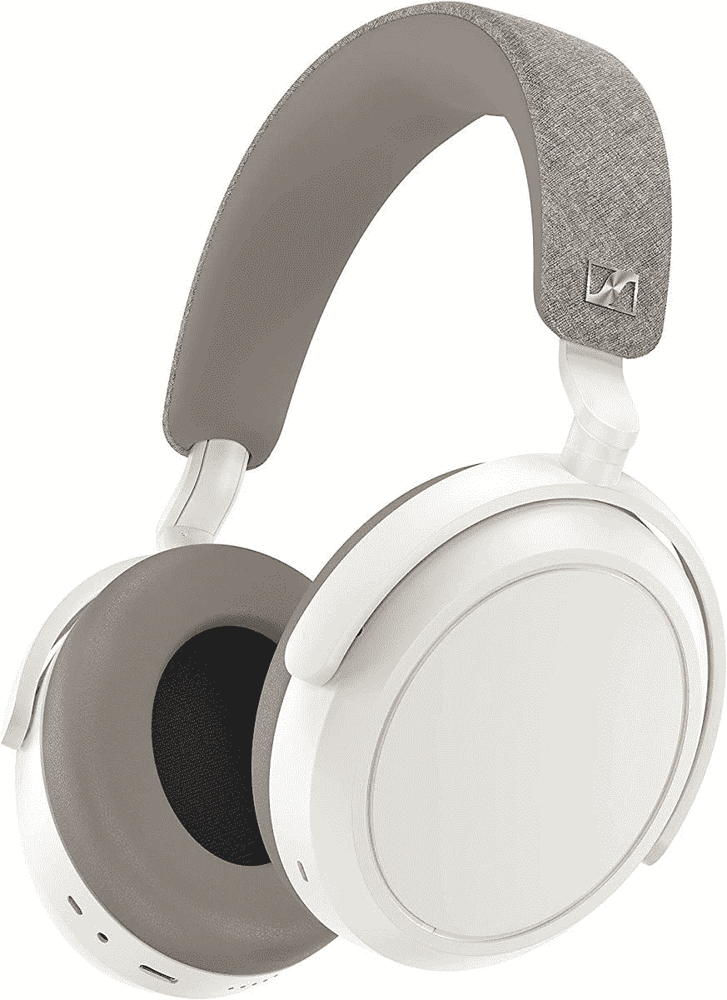
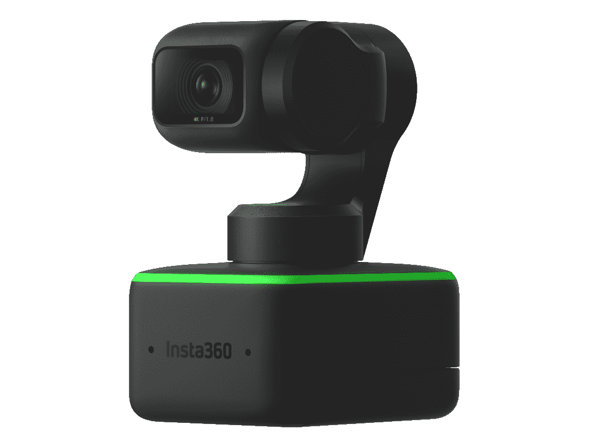
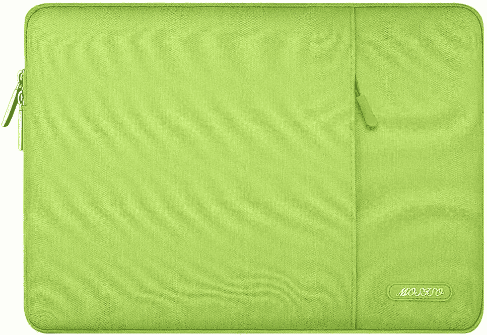
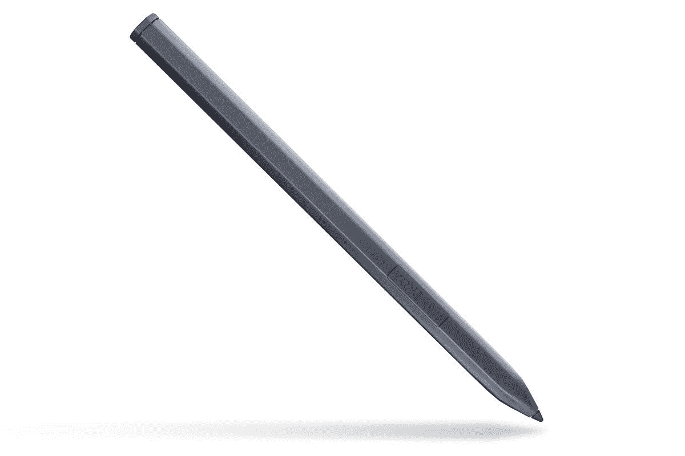
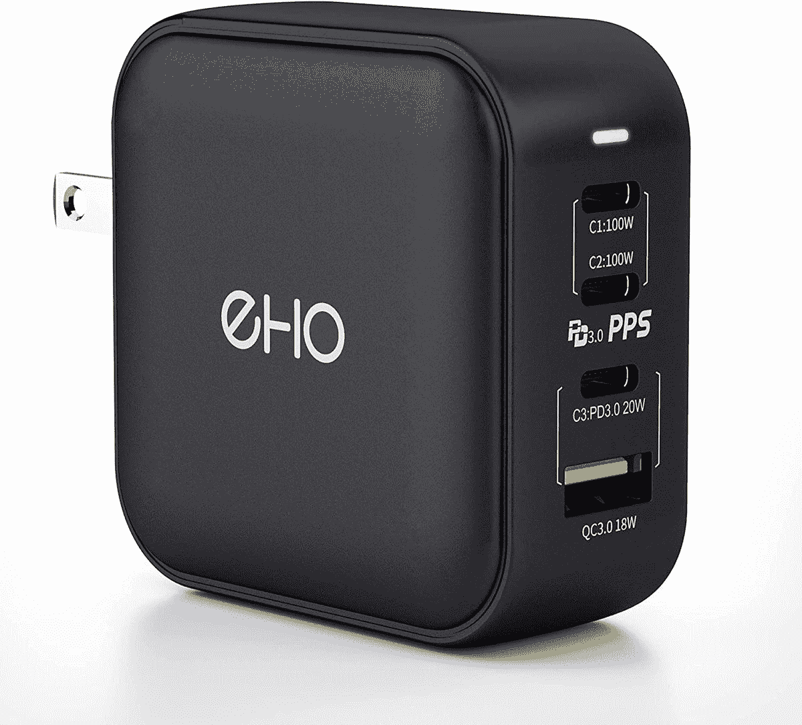

# 戴尔 XPS 13 二合一设备的最佳附件(2022 年)

> 原文：<https://www.xda-developers.com/best-accessories-dell-xps-13-2-in-1-2022/>

戴尔 XPS 系列通常是最突出的 Windows 笔记本电脑系列之一，今年它受到了相当大的冲击。即将推出的最新型号[戴尔 XPS 13 二合一](https://www.xda-developers.com/dell-xps-13-2-in-1-2022-review/)，与其前代产品相比，是一个完全的重新设计。它不再是敞篷车，取而代之的是一款 [Windows 平板](https://www.xda-developers.com/best-windows-tablets/)，类似于 Surface Pro 8。它仍然是一个神奇的设备，但总有空间让事情变得更好。这就是为什么我们收集了您可以为 Dell XPS 13 2 合 1 (2022)购买的最佳附件。

我们的综述包括各种类别的配饰，因此您一定会在这里找到对自己有用的东西。从显示器到键盘、坞站和机箱，每个人都可以找到自己想要的东西。很明显，你不需要在这里买所有的东西，甚至不需要从每一个类别买一样东西。这些只是在这里以防你需要它们。现在，让我们来看看您可以购买哪些附件来增强您对 Dell XPS 13 2 合 1 设备的体验。

**浏览这篇文章:**

## Dell XPS 13 2 合 1 设备的坞站和适配器

戴尔 XPS 13 二合一，尤其是 2022 型号的最大限制之一就是缺少端口。你真正从盒子里得到的是两个 Thunderbolt 4 端口，尽管你在盒子里有几个适配器。尽管如此，如果你要使用这个列表中的许多附件，你将需要更多的端口，而不仅仅是两个。这就是 Thunderbolt docks 发挥作用的地方，因为您可以使用一个端口为您的笔记本电脑添加大量端口，并且每个端口仍然有很大的带宽。当然，也有更便宜的选择，所以我们下面有几个。

*   <picture></picture>

    CalDigit TS4

    ##### CalDigit TS4 迅雷 4 Dock

    迅雷 Dock 比 CalDigit TS4 好不了多少。总共有 18 个端口，包括两个 Thunderbolt 下游端口、DisplayPort、三个 USB-C 端口、五个 USB Type-A 端口和超快 2.5Gb 以太网，这是另一回事。它还具有坚固的金属结构，这有助于它感觉优质和耐用。

*   <picture></picture>

    肯辛顿迅雷 4 坞站

    ##### 肯辛顿 SD5700T 迅雷 4 坞站

    花 400 多美元买一个坞站听起来是不是很疯狂？肯辛顿 SD5700T 可能适合你，价格不到 370 美元。不过，它仍然有大量的端口，包括三个 Thunderbolt 连接、千兆以太网、四个 USB Type-A 端口、一个耳机插孔和一个 SD 读卡器，而且它看起来坚固耐用。

*   <picture></picture>

    戴尔双充电坞站

    ##### 戴尔双充电坞站

    这款戴尔官方坞站没有 Thunderbolt，但它确实给你提供了几个端口，包括两个 USB Type-A 端口、HDMI、DisplayPort 和以太网，它可以给你的笔记本电脑充电。此外，这是一个无线充电器，也是您手机的支架，因此您可以轻松地为您的所有设备充电。

*   <picture></picture>

    可插拔的 UD-CA1A 坞站

    ##### 可插拔的 UD-CA1A 坞站

    如果你想要一个多功能的坞站而又不花大钱，可插拔的 UD-CA1A 是一个很好的选择，它有五个 USB A 类端口、HDMI、以太网、用于输入和输出的分离式音频插孔，并支持 6 个它也有一个平面和现代外观的设计。

*   <picture></picture>

    Hiearcool 7 合 1 USB-C hub

    ##### Hiearcool 7 合 1 USB-C hub

    如果你真的只需要几个额外的端口，又不想花很多钱，Hiearcool 的这款小型 USB-C hub 拥有所有的基本功能——两个 USB 它甚至有几种有趣的颜色可供选择。

## Dell XPS 13 2 合 1 (2022)外置显示器

一旦有了坞站，您就可以开始将各种外围设备连接到您的 Dell XPS 13 2 合 1 设备，其中一种您可能会特别感兴趣的设备是显示器。当然，拥有一个可以带到任何地方的超薄轻巧的设备是很好的，但是当你想坐下来工作时，第二块屏幕(或者第三块，我们不做判断)可以极大地帮助提高工作效率。找到具有 HDMI 或 DisplayPort 输入的显示器要容易得多，您可以使用上面的坞站，但如果您想要更简单的连接，我们也有一些直接与 USB-C 配合使用的选项。

*   <picture></picture>

    华硕 ProArt PA278CV

    ##### 华硕 ProArt PA278CV 27 英寸 WQHD 显示器

    如果你想要更中端一点的东西，华硕 ProArt pa 278 cv 在价值上很难打败。这是一个 27 英寸的四高清显示器，它涵盖了 100%的 sRGB 和娱乐。709 和 75Hz 的刷新率。该面板经过卡尔曼验证，具有δE<2，因此它也非常适合对颜色敏感的工作。此外，它通过 USB-C 连接，可以为您的 XPS 13 二合一设备提供 65 瓦的电源。

*   <picture></picture>

    LG ultra wide 34 WP 65 c-B

    ##### LG ultra wide 34 WP 65 c-B

    拥有多台显示器可以提高您的工作效率，但成本高昂且难以设置。有了像 LG 这样的超宽显示器，您可以获得大量的工作空间，而不会有任何麻烦。这是一个 24 英寸的大屏幕，分辨率高达 3440 x 1440，覆盖了 sRGB 99%的区域。不过，你需要一个 HDMI 或 DisplayPort 适配器。

*   <picture></picture>

    权杖 E248W-19203 r

    ##### 权杖 E248W-19203R

    想要一种实惠的方式来扩展您的工作空间吗？这款 24 英寸的 Sceptre 显示器是一个很好的解决方案，非常便宜(大约 100 美元)，但仍然具有全高清分辨率和 75Hz 的刷新率，体验稍微流畅一些。它甚至还内置了扬声器，这在这个价位是极其罕见的。它确实需要一个 USB-C 适配器，但对于你所得到的来说，这仍然是一个障碍。

*   <picture></picture>

    戴尔 14 款便携式显示器

    ##### 戴尔 14 款便携式显示器

    一旦您习惯了双显示器，就很难回头了，戴尔 14 款便携式显示器随时为您提供帮助。有了它，您可以在任何地方设置双显示器，无论身在何处，只需使用一根 USB-C 电缆即可连接显示器并为其供电。它具有全高清分辨率和宽视角，是增强移动工作空间的绝佳方式。

*   <picture></picture>

    Arzopa 便携显示器

    ##### Arzopa 便携显示器

    戴尔官方显示器有点贵，而且那是相当典型的戴尔官方配件。但 Arzopa 的这款替代产品价格较低，但分辨率更高，为 2560 x 1600，长宽比更高，为 16:10，与 XPS 13 二合一设备更接近。此外，尺寸也更加相似，都是 13.3 英寸，这是一对更加完美的组合。

如果您想查看更多选项，我们已经汇总了[最佳显示器](https://www.xda-developers.com/best-monitors/)，这里有一些最佳选项..

## 外部 GPU 外壳

考虑到 Dell XPS 13 2 合 1 的低功耗处理器，我们不一定会推荐它玩游戏，但 Thunderbolt 的伟大之处在于，即使相对较弱的设备也可以通过外置 GPU 玩游戏。或者，您可以将这种能力用于视频编辑等创造性工作。考虑到您最终可能会在这些配件上花费比 Dell XPS 13 2 合 1 本身更多的钱，将这些配件称为配件可能有点不合适，但它们有点令人惊讶。你需要购买一个像下面这样的外部 GPU 外壳，然后添加你想要的 GPU，或者在某些情况下，将所有东西打包。

*   ##### 十四行诗分离盒 750

    另一个很棒的选择也稍微便宜一点的是十四行诗分离盒。这款手机采用时尚的黑色设计，带有蓝色标志，规格方面，它有一个 750 瓦的 PSU，支持需要高达 375 瓦连续电源的 GPU(外加 85 瓦的峰值负载)。它还为您的笔记本电脑提供 85W 充电。

*   <picture></picture>

    技嘉 Aorus 游戏盒

    ##### 技嘉 Aorus 游戏盒

    外置 GPU 机箱通常需要你单独购买 GPU，但这款包括一款 Nvidia GeForce RTX 3080。机箱本身有一个 550 瓦的 PSU，它还增加了三个 USB 端口和以太网。可悲的是，GPU 是固定的，不可升级，但你可以以非常合理的价格获得一吨的能力。

在我们对[最佳外部 GPU 附件](https://www.xda-developers.com/best-external-gpus-for-your-laptop/)的总结中，您可以查看更多选项。

## 鼠标和键盘

默认情况下，Dell XPS 13 2 合 1 包括 XPS Folio 保护盖，它为您提供了键盘和触摸板。但是像这样的键盘盖也有一些缺点。首先，触摸板不能真正复制传统的鼠标，所以有很好的理由想要一个。此外，笔记本电脑的键盘通常有点狭窄，或者它们没有太多的移动空间，所以打字并没有想象中那么舒服。幸运的是，您可以很容易地找到这些附件来增强您对 Dell XPS 13 2 合 1 设备的体验，因此这里有一些最佳选项。然而，请记住，第三方键盘无法真正取代 XPS Folio，因为平板电脑依赖它才能站立。然而，没有什么能阻止你两者兼得。

*   <picture></picture>

    罗技 MX Mechanical

    ##### 罗技 MX Mechanical Mini

    很多人对机械键盘深信不疑，如果你想要一个专注于生产力的人，罗技 MX Mechanical 是一个梦幻般的选择。它具有专业和纤薄的设计，60%的布局(也有全尺寸模型)。您也可以在线性、点击式和触摸式开关之间进行选择。

*   <picture></picture>

    微软 Surface 键盘

    ##### 微软 Surface 键盘

    想要一个看起来和 XPS 13 二合一本身一样现代的键盘？微软 Surface 键盘拥有时尚现代的设计，标志性的铂金配色非常适合任何工作空间。这也是一个全尺寸键盘，包括一个数字键盘和全尺寸箭头键。

*   <picture></picture>

    Perixx peri board-613 w

    ##### Perixx peri board-613 w

    它可能不好看，但 Perixx-Periboard 613B 具有人体工程学设计，确保您在长时间打字时尽可能舒适。弧形设计让所有按键触手可及，宽大的腕托帮助您保持健康的姿势。

*   <picture></picture>

    戴尔移动专业版无线鼠标

    ##### 戴尔移动专业版无线鼠标

    就想要一个鼠标？Dell Mobile Pro 是一款小巧时尚的鼠标，可通过蓝牙工作，分辨率为 1，600 DPI。您也可以使用无线转换器，但通过蓝牙，您不需要使用 XPS 13 二合一设备上的任何端口。此外，它还相当实惠。

*   <picture></picture>

    罗技 MX Master 3S

    ##### 罗技 MX Master 3S

    谈论最好的鼠标而不提罗技 MX Master 3S 将是过分的。它有一个快速的 8,000 DPI 传感器，甚至可以在玻璃上工作，它有一个金属滚轮(和一个用于水平滚动的滚轮)的高级构造，它超级舒适。此外，它支持蓝牙或无线加密狗。

## 耳机和耳塞

Dell XPS 13 2 合 1 配备了一对立体声扬声器，应该可以在家中为您提供足够好的音频体验，但当您外出时，最好有更私密的聆听体验。如果你不想让每个人都听到你的电影或音乐(你不应该这样)，耳机或耳塞是很好的选择。因为戴尔 XPS 13 二合一设备甚至没有耳机插孔，所以我们希望专注于无线配件，所以让我们来看看一些最佳选择。

*   <picture></picture>

    AirPods Pro

    ##### 苹果 AirPods Pro

    苹果 ai rpods Pro 无疑是最受欢迎的高端无线耳塞，而且理由充分。凭借出色的音质、卓越的 ANC 和舒适的贴合感，这些都是您可以获得的最佳选择。Windows 还包括一些针对 AirPods 家族的音频优化。

*   <picture></picture>

    索尼 WF-1000XM4

    ##### 索尼 WF-1000XM4

    如果你对这些品牌或设计都不热衷，另一个绝佳的无线耳塞选择是索尼 WF-1000 xm4。这些有一个相当独特的外观，他们提供了很好的音频质量和 ANC 支持。他们还拥有长达 24 小时的电池续航时间。

*   <picture></picture>

    森海塞尔 Momentum 4 无线

    ##### 森海塞尔 Momentum 4 无线

    森海塞尔 Momentum 的最新迭代电池续航时间长达 60 小时，使用 42 毫米驱动器和四个麦克风进行拾音，可以提供出色的音频质量，并且它们还具有 ANC。此外，他们有一个经典的设计，在黑色或白色看起来很棒。

*   <picture></picture>

    Surface Headphones 2

    ##### 微软 Surface Headphones 2

    它们比这份名单上的一些其他耳机稍老一些，但 Surface Headphones 2 仍然提供了出色的音频质量，或许更重要的是，由于每个耳罩内建的转盘，它还提供了非常直观的音量和 ANC 控制。它们也有一个现代的设计，可以用 Windows 的 Surface 应用程序来管理，这是一个优点。

*   <picture></picture>

    Razer Barracuda X

    ##### Razer Barracuda X

    最初的 Razer Barracuda X 已经是一个非常经济实惠的选择，具有广泛的兼容性，但 2022 款还支持蓝牙，所以即使你不想或不能使用 USB-C，加密狗此外，吊杆话筒通常比其他无线耳机中的波束成形话筒效果更好。

## 适用于 Dell XPS 13 二合一设备的网络摄像头

Dell XPS 13 2 合 1 是第一款真正拥有良好网络摄像头的 XPS 笔记本电脑，因此我们实际上倾向于说，这是大多数人不需要外部网络摄像头的时候。但是，无论您想要终极图像质量还是有非常具体的使用案例，您可能仍然需要升级。有了这些附件，我们真正专注于这一点-为特定场景获得最佳网络摄像头，而不仅仅是一个好的网络摄像头-因为 Dell XPS 13 2 合 1 已经有了一个好的网络摄像头。

*   <picture></picture>

    Insta360 Link

    ##### insta 360 Link

    这是一款更加昂贵的相机，但 insta 360 Link 是一款独特的相机，可以在你几乎在任何地方移动时跟踪你。它拥有任何相机中最好的网络摄像头传感器之一，甚至还具有白板或桌面视图模式等功能，因此您可以在演示过程中轻松显示文档或白板。

*   <picture></picture>

    Anker PowerConf C302

    ##### Anker PowerConf C302 网络摄像头

    你有很多视频通话的地方旁边有人吗？Anker PowerConf C302 是一款独特的网络摄像头，它有一个非常广角的镜头，因此您可以与其他人一起参加会议。此外，2K 传感器应该可以为您提供出色的图像质量，并在需要时进行弱光校正。

## 适用于 Dell XPS 13 2 合 1 设备的机箱

考虑到 XPS Folio 键盘盖是可拆卸的，你可能会认为 2022 年的戴尔 XPS 13 二合一设备已经配备了一个外壳。但是你仍然不想损坏这样一个昂贵的配件，而且它真的不能提供全方位的保护，所以最好还是买一个专用的盒子来真正保护它的安全。这些类型的附件很容易找到，但我们认为您可能会喜欢您的 Dell XPS 13 2 合 1 设备的几个外壳。

*   <picture></picture>

    MOSISO 笔记本电脑套

    ##### MOSISO 笔记本电脑套

    想为你的日常携带增添一点个性吗？这款 Mosiso 袖子提供了基本的保护，它有很多颜色可供选择，包括我个人最喜欢的酸橙绿。

*   <picture></picture>

    都市护甲套

    ##### UAG 笔记本套

    你是否倾向于对自己的设备有点粗暴？UAG 笔记本电脑套配有坚硬的外壳和内部皮带，可以固定您的笔记本电脑，因此即使摔得再重也不会造成问题。它也有岩浆红色。

## 外部存储器

2022 年的戴尔 XPS 13 二合一设备自带高达 1TB 的固态硬盘存储，与以前的型号相比有点降级。如果您觉得需要一些额外的空间来存放文件，这里有一些很棒的存储附件，您可以搭配 Dell XPS 13 2 合 1 使用。

*   <picture></picture>

    TEKQ Super Veloce SSD

    ##### TEKQ Super Veloce SSD

    这款外观年轻的 SSD 非常独特，因为它支持迅雷速度，但它也是可升级的。如果你想要更大的东西，你可以很容易地打开它，用另一个 M.2 2280 固态硬盘取代固态硬盘。

*   <picture></picture>

    SanDisk G-Drive Pro SSD

    ##### SanDisk G-Drive Pro SSD

    如果您需要一个真正能够承受打击的外部 SSD，SanDisk G-Drive Pro 可以承受 1000 磅的压碎力，同时仍能提供高达 2，800 的迅雷级速度

*   <picture></picture>

    三星 T7 Touch

    ##### 三星 T7 Touch 便携 SSD

    安全性固然重要，但你也要在这与便利性之间取得平衡。三星 T7 Touch 具有指纹识别器，因此您可以加密数据，也可以通过手指触摸来访问数据。它支持高达 1，050MB/s 的速度，这还是相当不错的。

*   <picture></picture>

    希捷扩展硬盘

    ##### 希捷扩展硬盘

    大多数人可能想要快速存储，但有时，你只是想要大规模备份。这款巨大的希捷硬盘容量高达 18TB，因此您可以以比同等容量的固态硬盘存储低得多的价格存储您的所有文件。

*   <picture></picture>

    戴尔 XPS 触控笔

    ##### 戴尔 XPS 触控笔

    这自然是戴尔 XPS 13 二合一的最佳搭配。它不仅有 4096 级压力，加上倾斜支持，而且还被设计成磁性附着在平板电脑的侧面，并以这种方式无线充电。

*   <picture></picture>

    Wacom Bamboo Ink Plus

    ##### Wacom Bamboo Ink Plus

    这款可能不会更便宜，而且它失去了磁性附件之类的东西，但它确实支持 Wacom AES 和 MPP 协议，所以它几乎可以与任何支持 Windows Ink 的笔记本电脑一起工作。

*   <picture></picture>

    特莎活动笔

    ##### 特莎活动笔

    如果你确实想要便宜一点的东西，特莎活动笔是一款非常节省预算的笔，它削减了倾斜支持等功能，它有 2046 个压力级别。然而，它的成本远远低于其他选择。

## 电光队

与手机不同，笔记本电脑在很大程度上仍然带着充电器，所以不是每个人都需要买新的。尽管如此，在这里的所有配件中，如果你想实际使用你的 Dell XPS 13 二合一设备，充电器是最重要的一个。因此，如果你丢失或放错了你的，这里有一些替代选项供你选择。由于它通过 USB-C 充电，因此不难找到选项。

*   <picture></picture>

    Spigen 45W USB-C 充电器

    ##### Spigen 45W arc station Pro GaN 充电器

    如果你想要一个更小巧的替代产品——而且更便宜——Spigen 的这个选项也很棒。它提供与包装盒中的充电器相同的 45W 功率，还包括一根电缆，但情况并非总是如此。

*   <picture></picture>

    EHO 4 口 100W 充电器

    ##### EHO 4 口 100W 充电器

    带着一堆充电器旅行可能会很烦人，但有了这样的充电器，你真的可以减少那些杂乱。它有 100W 的功率，戴尔 XPS 13 二合一只需要 45W，所以你有很多功率给其他设备。

## 多方面的

这几乎涵盖了您想要的 Dell XPS 13 2 合 1 设备的所有附件，但我们也有一些您可能会感兴趣的东西。这些真的不适合其他地方，所以我们将它们留在下面。

*   <picture></picture>

    Xbox 无线控制器

    ##### 微软 Xbox 无线控制器

    传统游戏可能不是戴尔 XPS 13 二合一设备的最佳选择，但我们生活在云游戏时代，就您获得的内容而言，Xbox Game Pass Ultimate 是最好的服务之一。但是为了让它正常工作，你实际上需要一个这样的控制器，这很好，因为它们碰巧也很好。

*   <picture></picture>

    屏幕妈妈屏幕清洁剂套件

    ##### 屏幕妈妈屏幕清洁剂

    你可能想对任何笔记本电脑做的最基本的事情之一就是保持清洁，而这款清洁套件是一个基本但有效的解决方案。你有一个大喷雾瓶(160z)的清洁液和一块大的超细纤维布，所以它可以清洁你的平板电脑，甚至更大的屏幕，如电视。

* * *

有了它，您应该拥有充分利用您的 Dell XPS 13 2 合 1 设备所需的所有附件。就像我们在上面说的，你真的不需要从这里的每一个类别中购买一些东西，它们只是建议，以防你已经在寻找一些东西。但是其中一些对某些人来说可能是非常重要的，比如码头或鼠标。

无论哪种方式，如果您还没有，可以使用以下链接购买 Dell XPS 13 2 合 1 设备。或者，您可以查看一下[最佳戴尔笔记本电脑](https://www.xda-developers.com/best-dell-laptops/)，看看是否还有其他让您感兴趣的东西。或者一般来说的[最佳笔记本电脑](https://www.xda-developers.com/best-laptops/)，如果你不一定是戴尔的话。

 <picture></picture> 

Dell XPS 13 2-in-1

##### 戴尔 XPS 13 二合一设备

Dell XPS 13 2 合 1 是一款时尚的 Windows 平板电脑，配有清晰的 3:2 显示屏、两个出色的摄像头和第 12 代英特尔处理器