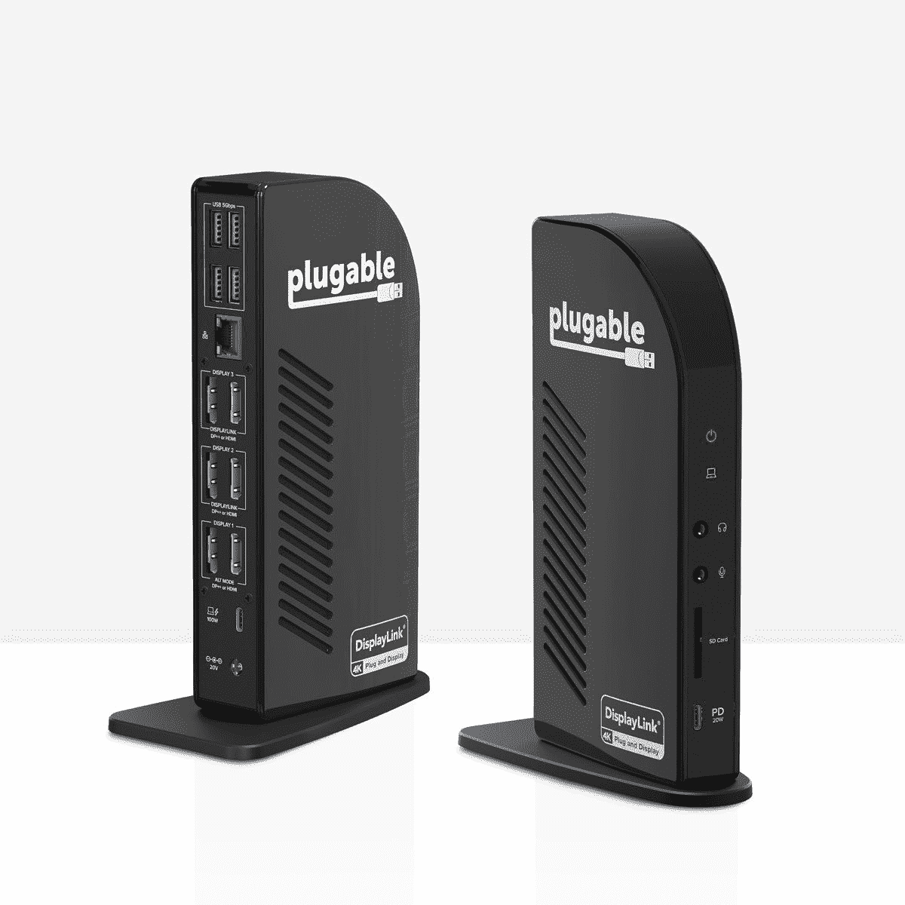
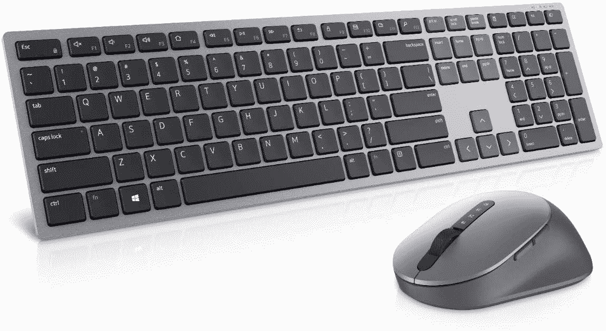
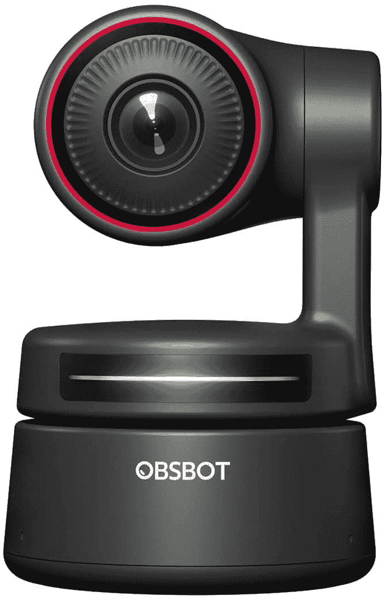
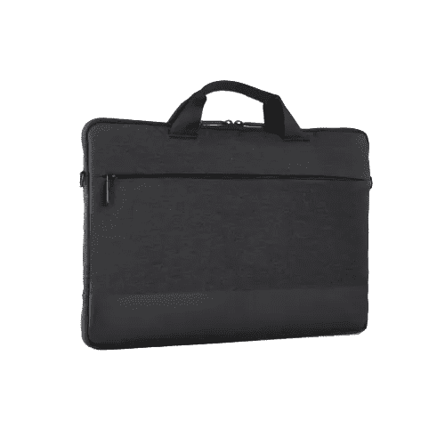
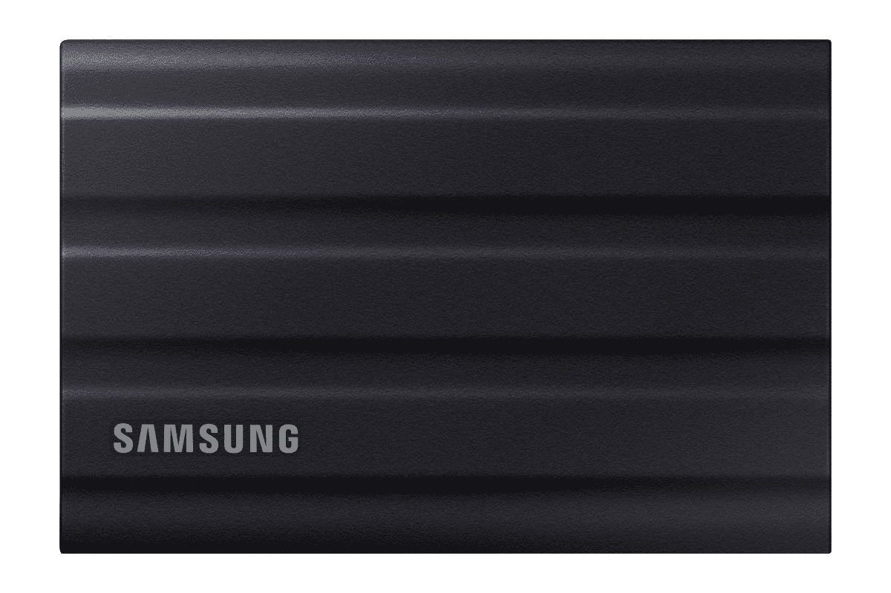
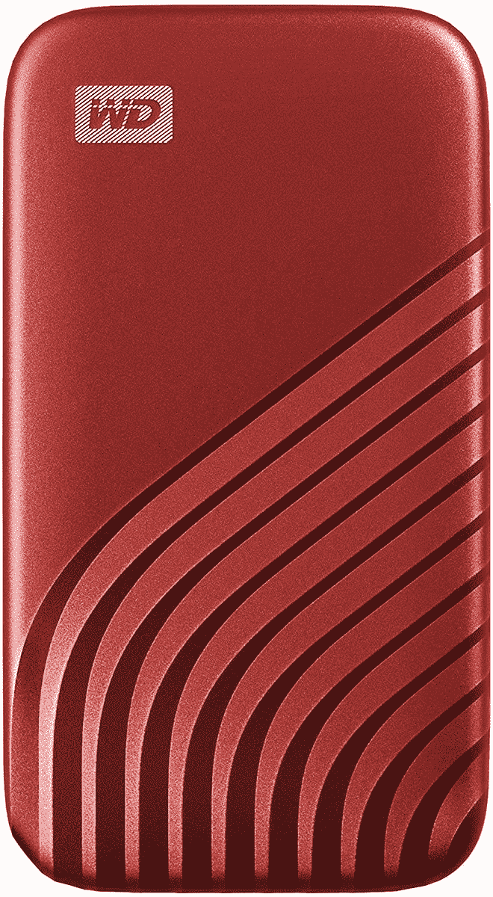
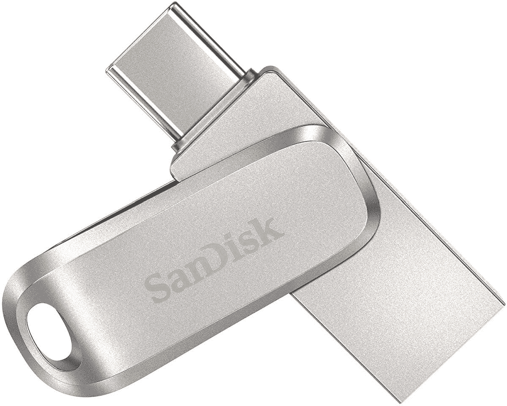
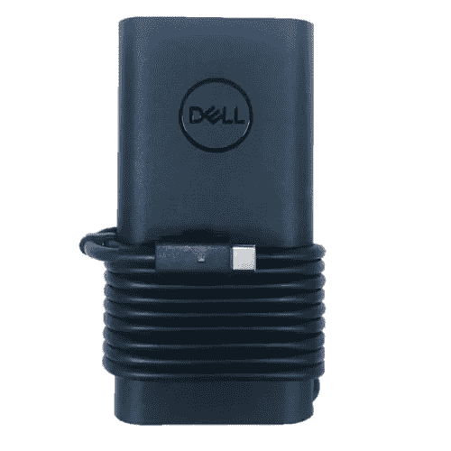
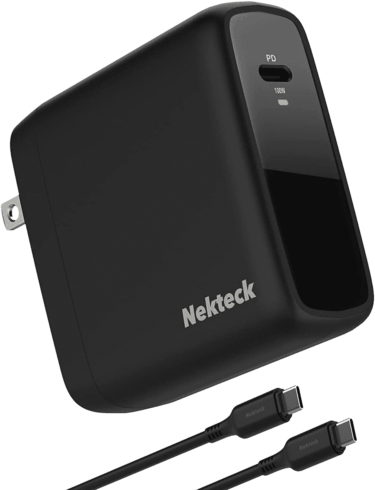

# 戴尔 XPS 13 的最佳附件(2022)

> 原文：<https://www.xda-developers.com/best-accessories-dell-xps-13-2022/>

长期以来，戴尔的 XPS 13 一直是你每年能买到的最好的笔记本电脑之一，2022 年，这一阵容得到了相当大的更新。 [2022 戴尔 XPS 13](https://www.xda-developers.com/dell-xps-13-2022-review/) 采用了全新的设计和颜色，此外它还配备了新的英特尔第 12 代处理器，有望在更小的封装中提供更高的性能。尽管笔记本电脑有多好，但总有办法让它变得更好。无论是添加更多显示屏、连接外围设备，还是更多其他功能，附件都可以让 Dell XPS 13 为您量身定制。

如果您正在寻找增强戴尔 XPS 13 (2022)体验的方法，那么您来对地方了。我们已经收集了您可以为这款笔记本电脑购买的所有配件，因此您可以找到解决特定问题或满足您可能需要的配件。我们已经将这些内容分成了几个类别，您可以在下面浏览它们，以便更容易地找到您想要的内容。事不宜迟，我们开始吧。

**浏览这篇文章:**

## Dell XPS 13 (2022)的外接显示器

对于注重工作效率的用户来说，外接显示器是您可以为 Dell XPS 13 或任何笔记本电脑购买的一些最重要的附件。额外的屏幕空间意味着您可以做更多的事情，而不必不断切换应用程序和失去焦点。有很多不同价位的显示器，但这里有一些我们最喜欢的。

*   <picture></picture>

    LG ultra wide 34wp 85 c-B

    ##### LG ultra wide 34wp 65 c-B

    没有显示器能像超宽屏幕一样提高你的工作效率，LG 34WP85C-B 正是如此。这是一个非常清晰的 3440 x 1440 分辨率的屏幕，这是一个完成工作的绝佳屏幕，有足够的空间并排打开所有应用程序。它还覆盖了 95%的 DCI-P3，它可以使用 USB-C 连接以 90W 的功率为您的笔记本电脑充电。

*   <picture></picture>

    三星智能显示器 M7

    ##### 三星智能显示器 M7

    如果你想要一台价格相对较低的 4K 显示器，三星智能显示器 M7 绝对值得一试。除了是一款夏普显示器，可以通过单根 USB-C 电缆甚至无线方式工作，它还拥有三星的智能电视软件。即使没有笔记本电脑，你也可以用它来观看网飞和其他服务，它甚至可以在云中运行微软 Office 应用程序。

*   <picture></picture>

    HP 24MH

    ##### HP 24MH FHD 显示器

    需要第二屏而不倾家荡产？惠普 24mh 是一个很好的选择，给你一个 24 英寸的面板，75Hz 的刷新率，加上内置扬声器，在这个价格上是罕见的。该显示器还提供了大量的可调节性，支持倾斜、高度和旋转，此外它还具有 HDMI、DisplayPort 和 VGA 输入。

*   <picture></picture>

    戴尔 S3222DGM 游戏显示器

    ##### 戴尔 S3222DGM 游戏显示器

    XPS 13 可能不是游戏的理想之选，但搭配外接 GPU，它一定可以成为一台强大的 PC。如果您想充分利用它，Dell SD3222DGM 是一款出色的游戏显示器，具有 QHD 分辨率和 165Hz 刷新率，价格合理，是您首选的游戏显示器。

*   <picture></picture>

    Arzopa 便携式显示器

    ##### Arzopa 便携式显示器

    如果你需要在任何地方都过双屏生活，Arzopa 便携式显示器就是完美的选择。它通过一根 USB-C 电缆轻松连接，并且它是一个 13.3 英寸的面板，与 XPS 13 具有相同的 16:10 纵横比，使其成为完美的配对。另外，它有非常清晰的 2560 x 1600 分辨率，所以看起来很棒。

如果你想看到更多的选项，也许可以看看一般的[最佳显示器](https://www.xda-developers.com/best-monitors/)，因为那里有一些非常棒的显示器。

## 外部 GPU 外壳

正如我们上面提到的，当想到游戏装备时，Dell XPS 13 不是您想到的第一台机器，但它肯定有潜力成为一台强大的机器。得益于 Thunderbolt 4 的强大功能，Dell XPS 13 支持多种附件，包括外部 GPU。是的，你可以把一个强大的 GPU 连接到你的小笔记本电脑上，然后把它变成一个游戏机。为此，你需要一个 GPU 外壳，所以这里有几个很好的:

*   <picture></picture>

    Mantiz Saturn Pro II

    ##### Mantiz MZ-03 Saturn Pro II

    Mantiz Saturn pre II 是外部 GPU 机箱的另一个绝佳选择。它可以为 GPU 提供高达 550 瓦的功率，为笔记本电脑提供 100 瓦的功率，甚至还有一个用于硬盘或固态硬盘的 SATA 插槽。此外，它有多个 USB 端口和以太网，可以扩展笔记本电脑的连接。

*   <picture></picture>

    Gigabyte Aorus 游戏盒

    ##### Gigabyte Aorus 游戏盒

    外置 GPU 机箱通常需要你单独购买 GPU，但这个包装中包含一个 NVIDIA GeForce RTX 3080。盘柜本身有一个 550 瓦的 PSU，并增加了三个 USB 端口和以太网。它最近降价了，这使它比以往任何时候都是更好的选择。

还有几个选项，如果您不喜欢，您可以在我们的[最佳外部 GPU 附件](https://www.xda-developers.com/best-external-gpus-for-your-laptop/)汇总中找到最佳选项。

## 戴尔 XPS 13 (2022)的坞站和适配器

近年来，戴尔的 XPS 13 在移除笔记本电脑端口方面一直处于领先地位，最新的版本更进一步。今年，你甚至没有在盒子里得到一个耳机插孔。如果您是 Dell XPS 13 用户，坞站比以往任何时候都更成为重要的附件，因此以下是您可能感兴趣的一些选项:

*   <picture></picture>

    布里奇石 C

    ##### 布里奇石 Pro TB4

    迅雷 4 坞站可能很贵，但布里奇石 Pro TB4 实际上以合理的价格提供了稳固的连接。你得到了三个 Thunderbolt 下游端口，USB 型端口，以太网，一个 SD 读卡器，以及更多在一个光滑的封装中，这是最便宜的 Thunderbolt 坞站之一。

*   <picture></picture>

    戴尔 Thunderbolt Dock wd22tb 4

    ##### 戴尔 Thunderbolt Dock wd22tb 4

    戴尔的官方 Thunderbolt 4 dock 定价高得令人难以置信，但它确实提供了 HDMI、DisplayPort 和 USB-C 显示输出，外加两个 Thunderbolt 下游端口、USB 和以太网。它采用模块化设计，支持高达 130 瓦的戴尔笔记本电脑充电功率。

*   <picture></picture>

    可插拔的 USB-C 三 4K 扩展坞

    ##### 可插拔的 USB-C 4K 三显示器扩展坞

    如果你承受不了 Thunderbolt 扩展坞的价格，将它降低到普通的 USB-C 是一个不错的选择。可插拔的 UD-ULTC4K 坞站可以让你一次连接多达三个 4K 60Hz 数字显示器，另外它还有 USB 和以太网端口，而所有这些都不到 300 美元。

*   <picture></picture>

    Anker 655 USB-C Hub

    ##### Anker 655 8 合 1 USB-C Hub

    如果你需要的只是一些额外的端口来弥补戴尔 XPS 13 乏善可陈的端口设置，这款 Hub 是一个很好的选择。它为你提供了不到 100 美元的 HDMI、USB、以太网、耳机插孔和 SD 读卡器。它还可以以高达 85 瓦的功率为你的笔记本电脑充电，不过这取决于你的电源适配器。

*   <picture></picture>

    Mokin USB-C Hub

    ##### Mokin 5 合 1 USB Hub

    如果您想要一个非常便宜的适配器，但仍有几个选项，这款 Mokin hub 包括一个 HDMI 端口、两个 USB-A 端口、一个 USB-C 端口和千兆以太网，所有这些都在一个紧凑的包装中，您可以它还支持高达 100W 的直通充电。

## 鼠标和键盘

令人钦佩的是，公司可以在笔记本电脑一样薄的机箱中复制传统的 PC 体验，为此必须做出牺牲。笔记本电脑有一个触摸板，而不是典型的鼠标，键盘不能像台式机键盘那样有相同的空间和按键行程。如果您想在办公桌前工作，合适的鼠标和键盘是重要的附件，可以让您与 Dell XPS 13 共度美好时光。以下是该领域的一些选项:

 <picture></picture> 

Dell Premier Wireless Keyboard and Mouse KM7321W

##### 戴尔 KM7321W 组合

为了简化操作并尽快启动和运行，戴尔的这款键盘和鼠标组合可能是最佳选择。它为您提供了在办公桌上使用笔记本电脑所需的一切，这两款产品都是高品质的产品，具有时尚的设计，无论放在哪里都很好看。

 <picture></picture> 

Razer Pro Type Ultra

##### Razer Pro Type Ultra

机械键盘通常是专业打字员的首选，如果你想要一个生产力键盘，Razer Pro Type Ultra 是一个很好的选择。它的白色设计看起来非常干净，它使用无声的线性开关，所以你仍然可以在办公室使用它。它还包括一个手腕休息。

 <picture></picture> 

Kensington Pro Fit Ergo

##### Kensington Pro Fit 符合人体工程学的无线键盘

人体工程学键盘乍一看可能很奇怪，但独特的形状有助于确保所有按键都触手可及，并使您的手和手腕保持自然的休息位置。如果你需要整天打字，这是一个很好的键盘，可以确保你在整个过程中舒适，并避免长期损伤。

*   <picture></picture>

    微软蓝牙人体工学鼠标

    ##### 微软蓝牙人体工学鼠标

    由于戴尔 XPS 13 有一些有趣的颜色，如果您想要更丰富多彩的东西，这款鼠标可以为您提供一些选择。它仍然有一个优质的人体工程学设计，所以你不会为了外观而牺牲可用性，而且它相对实惠。

*   <picture></picture>

    外星人有线游戏鼠标

    ##### 戴尔外星人 AW610M 鼠标

    如果你对游戏感兴趣，外星人 AW610M 是一款舒适时尚的鼠标，如果你想要更多的定制，它还具有 RGB 照明。它有一个 16K DPI 和 7 个可编程按钮，所以它是游戏的理想选择。

## 耳机和耳塞

戴尔 XPS 13 配有一组两个立体声扬声器，在大多数情况下，这应该足够好。当然，这只是在你独自一人的时候，因为当你周围有人时，从扬声器中发出你的声音可能并不理想。这就是耳机和耳塞进入框架的地方。这些配件可以提供更身临其境的音频体验，给你更多的隐私，防止你打扰他人。由于戴尔 XPS 13 上没有耳机插孔，我们在这里将重点讨论无线配件。

*   <picture></picture>

    苹果 AirPods Pro

    ##### 苹果 AirPods Pro

    苹果 ai rpods 是最典型的耳塞，而 AirPods Pro 是你现在能买到的最好的无线耳塞之一。Windows 11 正在进行一些 AirPods 特定的优化，因此通话质量更好，舒适的设计，顶级的音频和 ANC，你不能要求更多。

*   <picture></picture>

    Surface 耳塞

    ##### 微软 Surface 耳塞

    Surface 耳塞是微软的官方耳塞，这意味着它们很容易与 Windows PCs 配合使用，这得益于 Swift Pair 和 Surface app 等功能。此外，它们提供高品质的声音，并与微软 365 应用程序集成，而且它们有一个独特的设计，尽管它并不适合所有人。

*   <picture></picture>

    索尼 WH-1000XM5

    ##### 索尼 WH-1000XM5

    索尼制造了一些世界上最好的音频产品，WH-1000 xm5 耳机采用了新的、更时尚的设计，甚至更好的音频，改进的 ANC 有八个麦克风和两个处理器，以及 32 个麦克风它很贵，但它提供了一种奇妙的体验。

*   <picture></picture>

    Bose QuietComfort 45

    ##### Bose quiet comfort 45

    如果索尼耳机对你来说有点太陡了，Bose quiet comfort 45 是一对很棒的耳机，仍然可以提供顶级的音频质量和出色的 ANC 性能。一次充电可以使用长达 24 小时，这并不令人印象深刻，但对于较低的价格来说是有意义的。

*   <picture></picture>

    Soundcore Life Q30

    ##### Anker Soundcore Life Q30

    高级耳机可以获得相当高的价格，所以如果你想要更合理的东西，这副由 Soundcore 提供的耳机是一个可靠的选择。尽管价格低廉，但它仍然具有 ANC 等功能，并且在 ANC 开启的情况下充电可持续 40 小时(ANC 关闭时可持续 60 小时)。对于精打细算的人来说，这是一个很好的选择。

## 戴尔 XPS 13 的网络摄像头

尽管其他公司都在升级笔记本电脑的网络摄像头，但戴尔决定为 XPS 13 配备 720p 摄像头，这意味着它拥有市场上最令人失望的网络摄像头之一。如果你想弥补这一点，外部网络摄像头是一个不错的选择，谢天谢地，有一些很好的选择。

*   <picture></picture>

    OBS bot 微小的 4K

    ##### OBS bot 微小的 4K

    OBS bot 微小的 4K 网络摄像头是一个令人敬畏的人工智能驱动的摄像头，它不仅具有出色的图像质量(尽管它也确实如此)。它可以实时跟踪用户，并通过旋转和倾斜其底座来确保他们留在框架中。如果你想在通话中四处走动，这是最完美的。

*   <picture></picture>

    罗技 C920S 高清专业版

    ##### 罗技 C920S 专业版高清网络摄像头

    并不是每个人都需要一流的 4K 视频，任何外置网络摄像头都是对戴尔 XPS 13 内置摄像头的重大升级。罗技 C920S HD Pro 是最受欢迎的选择之一，它提供全高清视频、自动对焦和光线校正，另外它还有一个内置的隐私快门。

## 戴尔 XPS 13 的机箱

戴尔 XPS 13 是一款高端笔记本电脑，它有着相当独特的外观，至少在颜色方面是如此。因此，如果你问我们，这是值得投资一些保护，以保持它看起来尽可能原始，并确保您的投资得到保护几年。电脑包和手提袋是保护 Dell XPS 13 安全的重要配件，虽然市面上并不缺少这些配件，但这里有几个我们喜欢的:

*   <picture></picture>

    Tomtoc 笔记本电脑单肩包

    ##### Tomtoc 笔记本电脑单肩包

    这款 Tomtoc 包可以很好地保护您的笔记本电脑安全，具有额外的缓冲和加固的边角，但它也有额外的口袋用于放置附件，使其成为旅行的理想选择。此外，如果你喜欢这样携带，它还有一个肩带。

*   <picture></picture>

    戴尔 Pro Sleeve 13

    ##### 戴尔 Pro Sleeve 13

    想要基本款，但又好看的收纳你的戴尔 XPS 13？只需看看官方的戴尔专业袖套就够了，这是一款时尚的保护套，可以随身携带，也可以放在肩上。它没有什么特别的功能，但是它能完成任务，而且看起来很棒。

## 外部存储器

戴尔 XPS 13 可以配置高达 1TB 的固态硬盘存储，对于大多数用户来说应该绰绰有余。但是，如果您想要移动或备份某些文件，您可能需要一个外置驱动器。根据您的需求，以下是您可能喜欢的一些选项:

*   <picture></picture>

    可插拔的雷电 3 固态硬盘

    ##### 可插拔的雷电 3 外置固态硬盘

    如果你担心放错线缆，这款固态硬盘内置了它。它还支持 Thunderbolt，尽管速度只能达到 2400 MB/s 的读取和 1800 MB/s 的写入，这仍然比大多数速度都快。

*   <picture></picture>

    三星 T7 Shield

    ##### 三星 T7 便携式固态硬盘

    正在寻找能够在野外恶劣条件下生存的固态硬盘吗？三星 T7 盾可能适合你。它采用托尼包装，但仍然经过加固，可以承受跌落、水、灰尘等。

*   <picture></picture>

    WD 我的护照 SSD

    ##### WD 我的护照 SSD

    只是想要一个基础 SSD？WD My Passport 固态硬盘是一种随身携带文件的好方法，它有几种颜色可供选择，所以你也可以得到一些看起来不错的东西。

*   <picture></picture>

    希捷扩展硬盘

    ##### 希捷扩展硬盘

    如果您需要快速访问您的文件，固态硬盘存储是理想的选择，但如果您想要将您的数据备份数年，这款硬盘可以为您提供大量空间——高达 18TB——价格远低于更小的固态硬盘。

*   <picture></picture>

    SanDisk Ultra Dual Drive Luxe

    ##### SanDisk Ultra Dual Drive Luxe

    如果您需要存储，您可以放在口袋里，SanDisk Ultra Dual Drive Luxe 在一个小包装中为您提供高达 1TB 的存储空间。此外，通过 USB-C 和 USB-A，它可以轻松地与几乎任何设备配合使用。

## 电光队

戴尔 XPS 13(像大多数其他笔记本电脑一样)在包装盒中附带一个充电器，但有时会发生意外，充电器可能会损坏或消失。鉴于您确实需要一个充电器才能使用它，充电器是您可以为 Dell XPS 13 购买的最重要的附件之一。以下是一些选项:

*   <picture></picture>

    戴尔 90W 超薄电源适配器

    ##### 戴尔 90W 超薄电源适配器

    如果你比较心急，可以得到官方的 90W 充电器，让你的笔记本电脑更快地充电。比较贵，但是可能值得。

*   <picture></picture>

    内克 100W USB-C 充电器

    ##### 内克 100W GaN USB-C 充电器

    如果你想要最快的充电速度和更实惠的价格，内克 100W 充电器是一个很好的选择。便宜多了，但是更快。

## 多方面的

至此，我们已经介绍了您可能关心的大多数附件，但是您的 Dell XPS 13 可能会从其他一些东西中受益。以下是一些你可能会觉得有用的杂项:

*   <picture></picture>

    Xbox 无线手柄

    ##### 微软 Xbox 无线手柄

    PC 游戏有它的好处，但有些游戏只是用手柄玩起来更容易而已。Xbox 无线控制器是最好的控制器之一，而且它有多种颜色可供选择。这绝对是一个要得到的。

*   <picture></picture>

    屏幕妈妈屏幕清洁剂套件

    ##### 屏幕妈妈屏幕清洁剂

    这可能很平凡，但保持笔记本电脑的屏幕清洁可能是一个挑战，肮脏的屏幕可能很难使用，尤其是在明亮的光线下。这个工具包包括一个大喷雾瓶和布，这样你就可以长时间清洁你的笔记本电脑。

* * *

如果您有一台戴尔 XPS 13，我们认为您可能会对这些附件感兴趣。我们已经介绍了很多内容，无论您是想保护笔记本电脑的安全，还是想打造完美的办公环境，您一定会在这里找到一些有趣的东西。

如果你还没有，你可以购买下面的戴尔 XPS 13 (2022)。虽然它并不完美，但它是你今天可以买到的最好的戴尔笔记本电脑之一，如果你想要一台外观和性能都很棒的便携式电脑，它当然值得考虑。

 <picture></picture> 

Dell XPS 13 9315

##### 戴尔 XPS 13 9315

全新的戴尔 XPS 13 进行了彻底的重新设计，有天空色和棕色可选。它也是有史以来最薄最轻的 XPS 笔记本电脑。