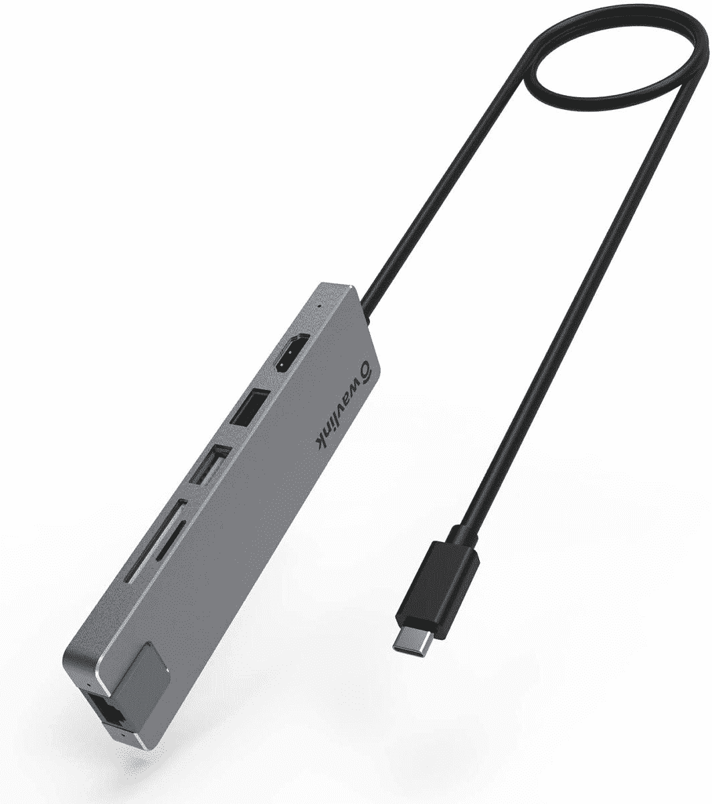
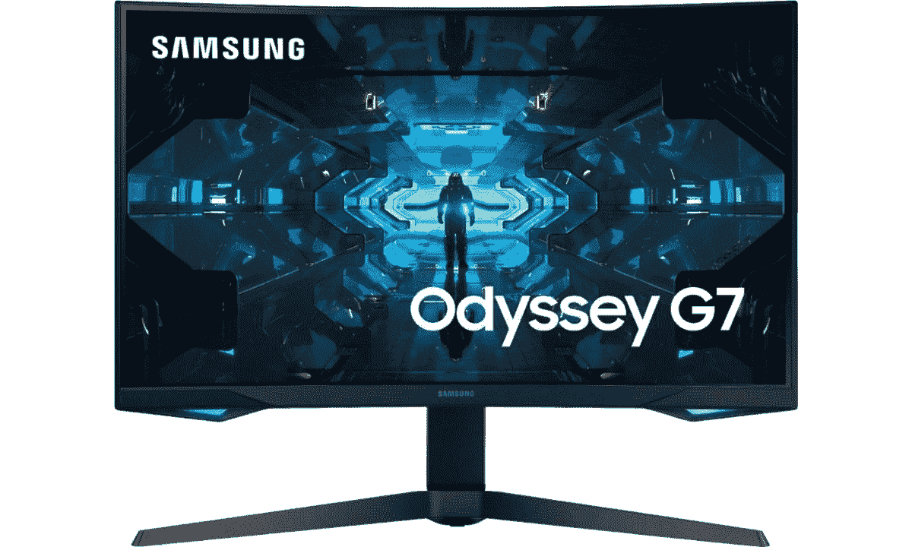
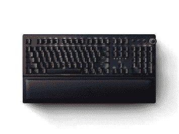
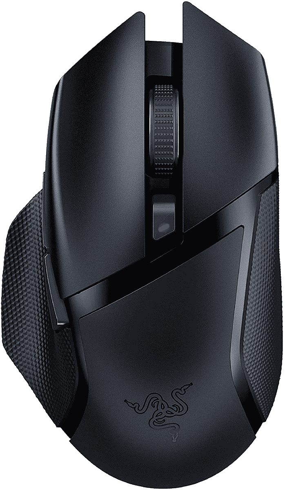
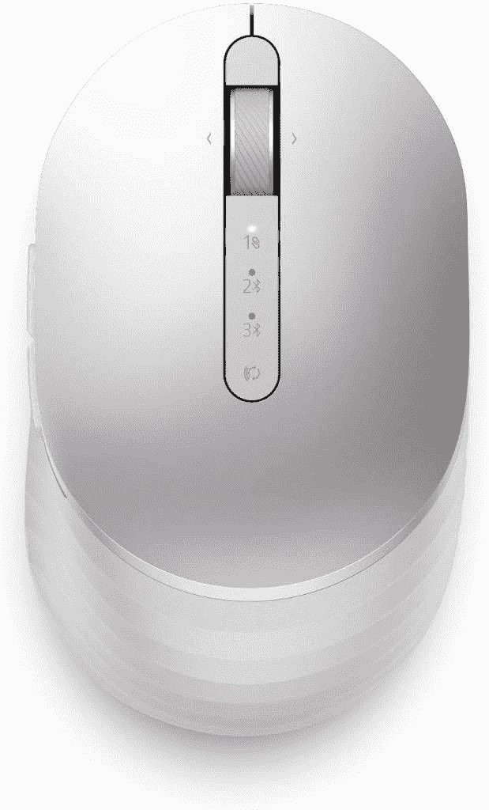
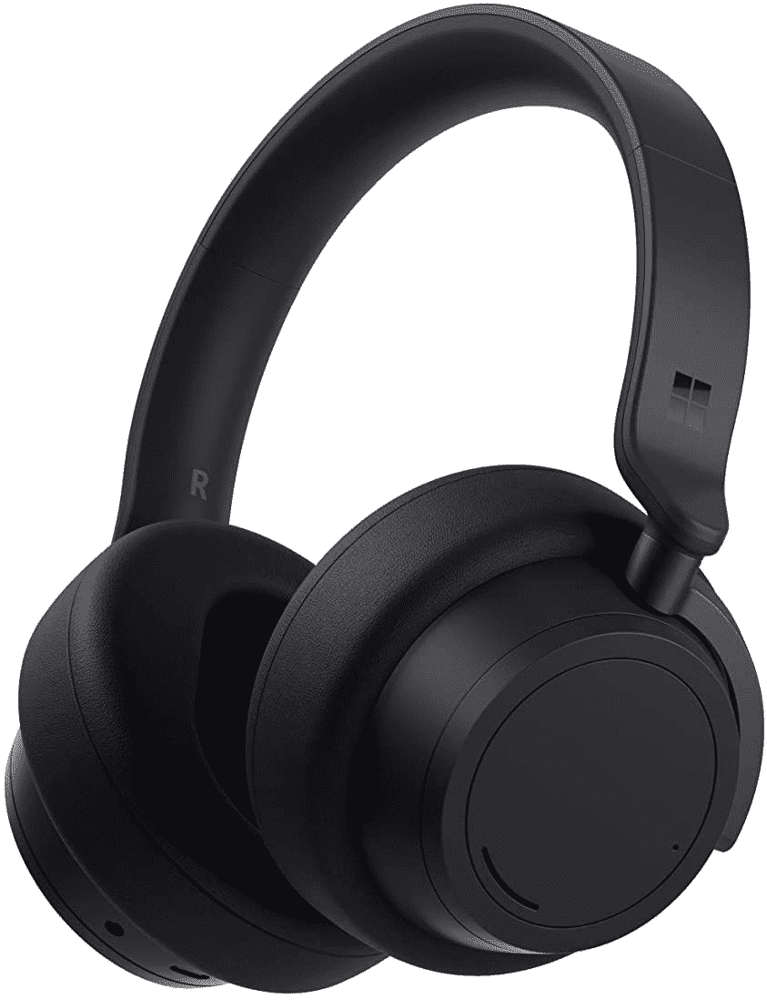
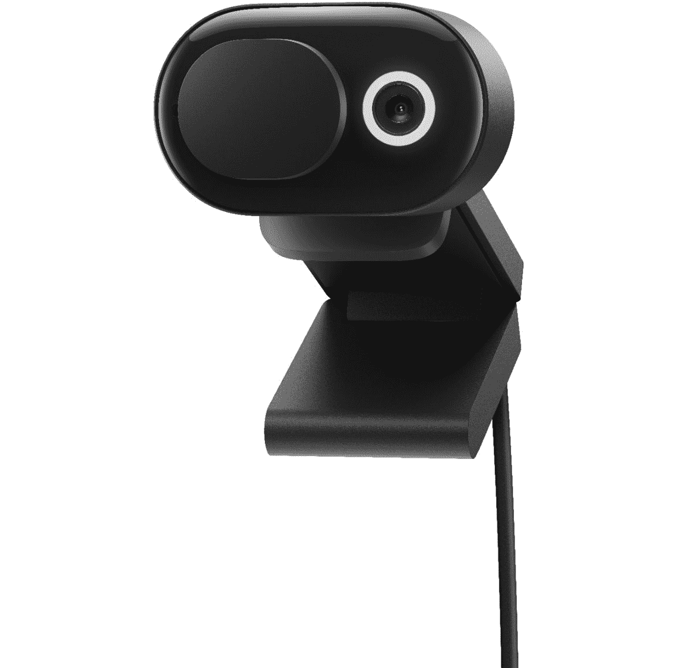

# 戴尔 XPS 13 Plus 的最佳附件

> 原文：<https://www.xda-developers.com/best-accessories-dell-xps-13-plus/>

戴尔 XPS 13 Plus 可能会成为 2022 年 T2 最好的笔记本电脑之一，说实话，它有很多优点。这是我们很长时间以来看到的最具未来感的笔记本电脑之一:触摸板是隐形的，融入了机箱，键盘延伸到底座的边缘，功能行都是基于触摸的，而不是使用硬件按钮。另外，这个设计看起来很简洁，你有一些很棒的展示选择。但是，尽管戴尔 XPS 13 Plus 很棒，但没有一台笔记本电脑好到不能通过一些配件来增强。

一些简单的东西，如保护它的盒子、鼠标或桌面设置的第二个屏幕。您很有可能正在寻找能够帮助您充分利用笔记本电脑的东西，而我们就是来帮助您的。我们收集了一些您可以为 Dell XPS 13 Plus 购买的最佳附件，并将其分为几个类别，以帮助您找到您需要的附件。让我们开始吧。

## 戴尔 XPS 13 Plus 坞站和适配器

为了实现紧凑轻巧的设计，Dell XPS 13 Plus 做出了一些牺牲，特别是在端口方面。它只包括内置的 Thunderbolt 端口，这意味着如果你想连接更多的外设，你必须寻找一些适配器或扩展坞。以下是一些最好的坞站和适配器，让您可以将更多附件连接到 Dell XPS 13 Plus。

*   <picture></picture>

    戴尔迅雷坞 wd 19 TBS

    ##### 戴尔迅雷坞 WD19TBS

    谁比戴尔本身更适合为 XPS 13 Plus 制作坞站？戴尔 WD19TBS 坞站具有多种显示输出，包括 HDMI 和 DisplayPort、USB 端口、以太网以及戴尔电脑上高达 130 瓦的功率输出。对于需要更大功率的大型笔记本电脑来说，这已经足够好了。

*   <picture></picture>

    肯辛顿 SD5600T

    ##### 肯辛顿 SD5600T 雷电 3 坞站

    如果您需要在您的设置中添加大量端口，肯辛顿 SD 5600t 是另一个很好的坞站，它采用了时尚的包装。它包括六个 USB Type-A 端口、一个 USB-C 端口、两个 HDMI 和 DisplayPort 端口以及以太网。它还能为您的笔记本电脑提供高达 100 瓦的功率。

*   <picture></picture>

    雷蛇迅雷 4 Dock

    ##### 雷蛇迅雷 4 Dock

    雷蛇的迅雷 Dock 与众不同的一点在于它采用了色度 RGB 照明。如果你想给你的桌子增添一些特色。这个坞站是一个很好的方式，它还为您提供了三个 Thunderbolt 4 端口、两个 USB Type-A 端口、以太网等等。

*   <picture></picture>

    Anker power expand 11-in-1

    ##### Anker power expand 11-in-1 USB-C Hub

    Thunderbolt 坞可能很贵，但使用普通的 USB-C 坞，你仍然可以在不倾家荡产的情况下多获得几个端口。这款包括 HDMI、DisplayPort、以太网和 USB 端口，因此您有很多选择。

*   <picture></picture>

    wav link USB-C Hub

    ##### wav link 12 合 1 USB-C Hub

    如果你想要一个真正便宜且便于随身携带的 Hub，这是你的最佳选择之一。它有 HDMI、USB、以太网和 SD 读卡器，所有这些都在一个非常紧凑的机箱中，可以轻松放入包中。它甚至支持电力输送，这是非常好的。

## 适用于 Dell XPS 13 Plus 的显示器

尽管 Dell XPS 13 Plus 的显示屏非常出色，但没有什么比第二块(或第三块)屏幕更能提高您的工作效率了。如果你想给你的笔记本电脑增加更多的工作空间，无论是在家里还是在路上，有几个不错的选择。以下是我们的建议:

*   ##### Dell UltraSharp U2723QE

    为了获得最清晰的图像质量，Dell UltraSharp u 2723 QE 配备了 4K 分辨率和 2000:1 对比度的全新 IPS 黑色面板。此外，它通过 USB-C 连接，甚至可以以高达 90W 的功率为您的笔记本电脑充电。否则可以用 DisplayPort 或者 HDMI。

*   <picture></picture>

    三星智能显示器 M7

    ##### 三星智能显示器 M7

    如果您的显示器不仅仅是连接到您的笔记本电脑，该怎么办？三星智能显示器 M7 具有类似智能电视的体验，因此您可以在没有笔记本电脑的情况下观看《网飞》等节目。它甚至可以在云端运行办公应用。此外，这是一个清晰的 4K 屏幕。

*   <picture></picture>

    LG ultra wide 34 wn 80 c-B

    ##### LG 34 wn 80 c-B

    多任务处理者经常对超宽显示器信誓旦旦，如果你想提高工作效率，这是一个很好的方法。这款 LG 显示器的分辨率为 3440 x 1440，通过一根 USB-C 电缆连接，另外它可以以 60W 的功率为您的笔记本电脑充电。

*   <picture></picture>

    三星奥德赛 G7

    ##### 三星奥德赛 G7

    想在你的戴尔 XPS 13 Plus 上玩游戏？这款三星 Odyssey Monitor G7 monitor 是您现在可以买到的最棒的显示器之一，具有四倍高清分辨率和 240Hz 刷新率，外加 QLED 面板和 HDR600 支持。你不能要求更多了。

*   <picture></picture>

    联想 Thinkvision M14

    ##### 联想 ThinkVision M14

    走到哪里都需要额外的生产力？便携式显示器可能是解决方案，联想 ThinkVision M14 是戴尔 XPS 13 Plus 的绝佳搭配。这是一个 14 英寸的全高清面板，使用 USB-C 电缆连接到您的笔记本电脑。

## 外部 GPU 外壳

如果看到上面的 Samsung Odyssey G7 让您想到“您为什么想要戴尔 XPS 13 Plus 的游戏显示器？”，请允许我们解释。Dell XPS 13 Plus 拥有的 Thunderbolt 端口允许您连接各种附件，包括外部 GPU。因为 Thunderbolt 还包括一个 PCIe 扩展，你可以连接一个 GPU，就像它在你的笔记本电脑里面一样。为此，你需要一个 GPU 外壳，有几个很棒的。

*   <picture></picture>

    曼蒂兹土星 Pro II

    ##### 曼蒂兹 MZ-03 土星 Pro II

    如果你想要一些不那么华而不实的东西，曼蒂兹土星 Pro II 是一个梦幻般的替代 eGPU 外壳。它有一个 750 瓦的 PSU，可以为 GPU 提供 550 瓦的功率，为笔记本电脑提供 100 瓦的功率，它有许多端口，包括 5 个 USB Type-A 端口、以太网、SD 读卡器，甚至还有一个 2.5 英寸 SATA 驱动器的插槽。

*   <picture></picture>

    技嘉 Aorus 游戏盒子

    ##### 技嘉 Aorus 游戏盒子

    懒得单独买个 GPU？千兆字节 Aorus 游戏盒是一个 eGPU 外壳，其中包括一个 GeForce RTX 3080 已经密封，所以你可以随时使用。它有一个 550 瓦的 PSU，三个 USB 端口和以太网。但是因为 GPU 短缺，很难找到现货。

## 鼠标和键盘

戴尔 XPS 13 Plus 看起来非常未来，但无缝触控板和零点阵键盘在功能方面可能是个问题。如果你想更舒适地使用笔记本电脑，购买外置鼠标和键盘会非常有帮助。以下是一些适用于戴尔 XPS 13 Plus 的此类出色附件:

*   <picture></picture>

    罗技 MX 键

    ##### 罗技 MX 键

    罗技做出了一些很棒的外设，MX 键是一个有趣的键盘。这些按键有着近乎典型的形状，但圆形的盘面使得在打字时更容易按下正确的键，而且它们更舒适。

*   <picture></picture>

    雷蛇黑寡妇 V3

    ##### 雷蛇黑寡妇 V3 Pro

    得到了外置 GPU 和游戏显示器？这个键盘可能是一个伟大的除了你的设置。凭借 Razer 机械开关、逐键 RGB 照明和舒适的腕托，这是游戏玩家的绝佳选择。它也有媒体控制。

*   <picture></picture>

    Kensington Pro Fit Ergo

    ##### Kensington Pro Fit 符合人体工程学的无线键盘

    当你整天都在电脑前工作时，确保你的舒适很重要，这款键盘可以帮你做到这一点。奇怪的形状使所有的键都很容易操作，而不必劳损手指，腕托也有助于这一点。

*   <picture></picture>

    Dell Premier 无线键盘和鼠标 km 7321 w

    ##### Dell Premier 多设备组合 KM7321W

    这款无线键盘和鼠标组合包为您提供了在办公桌上完成设置所需的一切。这两款产品看起来都很时尚，非常适合戴尔 XPS 13 Plus。

*   <picture></picture>

    罗技 MX Master 3S

    ##### 罗技 MX Master 3

    罗技的 MX Master 系列是最负盛名的电脑鼠标之一，而且理由充分。凭借 MagSpeed 金属滚轮、可编程按钮和符合人体工程学的设计，这是一款几乎适合任何用户的出色的优质鼠标。

*   <picture></picture>

    微软 Arc 鼠标

    ##### 微软 Arc 鼠标

    专为便携性而设计，如果你想要的东西可以带去任何地方，微软 Arc 鼠标是很棒的。它可以放入任何包中，弯曲使用起来更舒适。没有滚轮，但你可以滑动鼠标来滚动。

*   <picture></picture>

    雷蛇蛇怪 X 超高速

    ##### 雷蛇蛇怪 X 超高速

    对于游戏玩家来说，一款具有高 DPI 和可靠连接性的鼠标至关重要。Razer Basilisk X HyperSpeed 是一款带有 16K 传感器的无线鼠标，它支持蓝牙或 Razer 的 HyperSpeed 无线连接，具体取决于您的需求。

*   <picture></picture>

    戴尔 Premier 可充电无线鼠标

    ##### 戴尔 Premier 可充电无线鼠标

    说到完美搭配，您可能不会找到比这款戴尔鼠标更适合 XPS 13 Plus 的鼠标了。优质的设计与笔记本电脑非常相配，而且它可以无线连接，因此您不必担心端口问题。

## 耳机和耳塞

戴尔 XPS 13 Plus 拥有非常有前途的声音设置，四扬声器立体声系统有望提供出色的整体声音。但是当你在公共场合的时候，你可能不想让你周围的人听到这种声音。这就是耳塞和耳机等附件进入框架的原因，如果您想要在 Dell XPS 13 Plus 上获得更私密的音频体验，还有一些很好的选项。以下是我们推荐的几种:

*   <picture></picture>

    苹果 AirPods Pro

    ##### 苹果 AirPods Pro

    苹果 ai rpods 普及真无线耳塞，AirPods Pro 特别棒。它们有很好的音频质量和 ANC，它们很舒服，微软甚至在改进 Windows，所以 AirPods 有更好的麦克风质量来通话。

*   <picture></picture>

    森海塞尔气势真无线 2

    ##### 森海塞尔气势真无线 2

    森海塞尔做出了一些很棒的音频产品，气势真无线 2 也不例外。7 毫米驱动器提供出色的声音和 ANC，时尚的充电外壳，长达 28 小时的电池续航时间，这些都是很好的选择。

*   <picture></picture>

    Surface Headphones 2

    ##### 微软 Surface Headphones 2

    Surface Headphones 2 是一款非常棒的高级耳机，采用了现代设计，在耳罩中内置了用于调节音量和 ANC 的直观拨号控制，以及用于播放/暂停的触摸控制。此外，您可以使用 Surface 应用程序在 Windows 上轻松配置它们。

*   <picture></picture>

    索尼 WH-1000 xm4(121 美元起)

    ##### 索尼 WH-1000XM4

    索尼制造了一些世界上最受好评的音频产品，其最新耳机延续了这一传统。他们有 40 毫米的出色音频，他们有一个最著名的 ANC 实现。它们看起来也很棒。

*   <picture></picture>

    雷蛇梭鱼 X

    ##### 雷蛇梭鱼 X

    如果蓝牙连接对你来说不够可靠，那雷蛇梭鱼 X 就走一条不同的路线。他们使用 USB-C 加密狗来支持 Razer HyperSpeed，为您提供更低的延迟和更稳定的连接。另外，他们有一个可拆卸的麦克风。

## 戴尔 XPS 13 Plus 的网络摄像头

由于戴尔坚持在 Dell XPS 13 Plus 上安装 720p 网络摄像头，您最有可能寻找的附件之一就是网络摄像头。有一些很棒的网络摄像头，你可以在笔记本电脑上使用，这些摄像头来自不同的品牌，包括戴尔自己。它们通常通过 USB Type-A 连接，因此您可能需要包装盒中的适配器或上面列出的适配器之一。

*   <picture></picture>

    微软现代网络摄像头

    ##### 微软现代网络摄像头

    4K 网络摄像头很棒，但并不是每个人都需要那么厉害。微软现代网络摄像头是日常使用的另一个重要选择，支持 1080p HDR 视频，自动光线校正和隐私保护。不过，它没有 Windows Hello。

*   <picture></picture>

    罗技 Streamcam

    ##### 罗技 StreamCam

    罗技 stream cam 是为现代世界设计的。它有一个 USB-C 连接，所以你不需要适配器，它可以旋转，以轻松录制垂直或水平视频。另外，它可以以 1080p 和 60fps 的速度录制，并支持自动对焦。

## 戴尔 XPS 13 Plus 的机箱

没有一些保护您的 Dell XPS 13 Plus 的外壳，附件列表就不完整。我们已经为这款笔记本电脑准备了更大的[系列，但是如果你想要一些亮点，我们为你收集了一些。](https://www.xda-developers.com/dell-xps-13-plus-cases/)

*   <picture></picture>

    Kinmac 360 笔记本电脑保护套

    ##### Kinmac 360 保护套

    这款 Kinmac 保护套款式繁多(虽然有些只有大一点的尺寸)，所以你可以买到适合自己口味的东西。它还具有很好的全方位保护和一些配件空间。

*   <picture></picture>

    Nillkin 笔记本电脑套

    ##### nill kin 笔记本电脑套带支架

    这款 nill kin 套不仅仅是一个套，它还可以作为您笔记本电脑的支架，如果您有外部鼠标，闭合的翻盖还可以兼作鼠标垫。它有五种颜色，所以你可以买到适合你的。

## 外部存储器

您可以为 Dell XPS 13 Plus 配置高达 2TB 的内部存储，我们认为这对大多数人来说已经足够了。但这些高端配置可能会变得昂贵，有时您只是想要一种更简单的方式来共享和存储 PC 以外的文件。如果您需要更多空间，这里有一些您可能会感兴趣的存储设备:

*   <picture></picture>

    可插拔的雷电 3 固态硬盘

    ##### 可插拔的雷电 3 外置固态硬盘

    如果你不能相信自己不会丢失一根线缆(我们曾经遇到过)，这款可插拔的固态硬盘会永久连接线缆，因此不会发生这种情况。它为您提供高达 2400 MB/s 的超高速。

*   <picture></picture>

    三星 T7 Touch

    ##### 三星 T7 Touch 便携式固态硬盘

    这款固态硬盘内置指纹识别器来保护您的文件，让您的数据安全无虞它的容量高达 2TB，支持高达 1，050MB/s 的速度，这仍然是非常快的速度。

*   <picture></picture>

    SanDisk Extreme Pro SSD

    ##### SanDisk Extreme Pro 便携 SSD

    节省 290

    你经常带着你的 SSD 旅行吗？SanDisk Extreme PRO 固态硬盘可确保您的文件能够在恶劣条件下保存，因此您永远不会丢失重要数据。由于采用了 USB 3.2 Gen 2x2，速度也非常快，最高可达 2000 MB/s

*   <picture></picture>

    希捷扩展硬盘

    ##### 希捷扩展硬盘

    以现代标准来看，硬盘可能很慢，但它们仍然是获得海量存储的最实惠的方式，尤其是在家里。这款高达 18TB，价格合理。

*   <picture></picture>

    三星 DUO Plus 闪存盘

    ##### 三星 DUO 闪存盘

    想要储存你可以放在口袋里的手机旁边？这款三星闪存驱动器正是这样做的，并且由于内置的 USB-C 端口，不需要适配器就可以与戴尔 XPS 13 Plus 一起使用。速度相当快，高达 400 MB/s。

## 其他配件

我们相信，我们已经涵盖了您对笔记本电脑的大部分需求，但我们认为您可能还会对一些东西感兴趣。由于它们并不都属于一个类别，我们把它们放在下面。

*   <picture></picture>

    Moft Z 笔记本电脑支架

    ##### Moft Z invisible 笔记本电脑支架

    你的办公桌对你来说是不是太低了？MOFT Z 笔记本电脑支架可以为您的笔记本电脑提供额外的高度，使用起来更加舒适，而且它允许不同的位置和角度。它有几种不同的颜色，而且它很薄，你可以把它放进你的笔记本电脑包里，随时使用。

*   <picture></picture>

    Screen Mom 屏幕清洁套件

    ##### Screen Mom 屏幕清洁套件

    让你的设备始终保持整洁很难，但像这样的屏幕清洁套件可以提供很大的帮助。这个单元包括一个大瓶子，应该够你用很长时间，再加上一个大的超细纤维布。你应该可以在任何类型的电子设备上使用它，但是使用时要小心。

* * *

您可以为 Dell XPS 13 Plus 购买大量附件。如果你对笔记本电脑本身感兴趣，你可以在下面购买。否则，您可以查看目前可用的[最佳戴尔笔记本电脑](https://www.xda-developers.com/best-dell-laptops/)。

 <picture></picture> 

Dell XPS 13 Plus

##### 戴尔 XPS 13 Plus

Dell XPS 13 Plus 是一款功能强大的现代笔记本电脑，配备 28W 英特尔处理器。