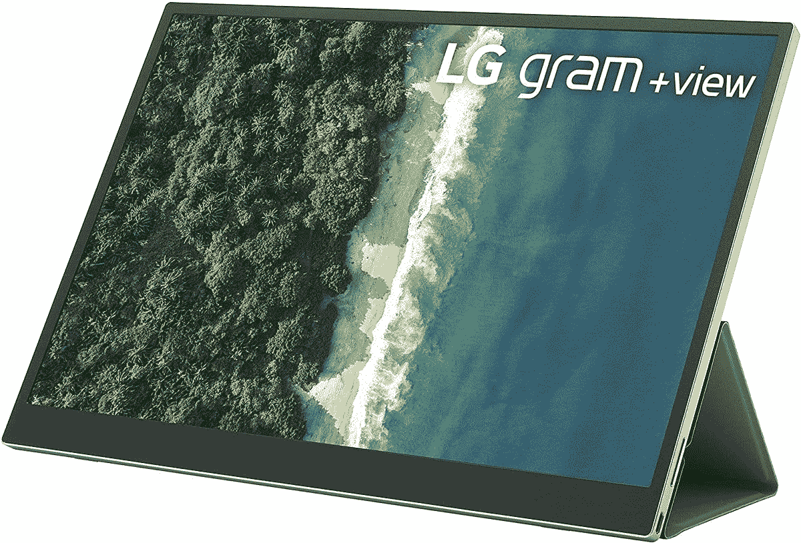
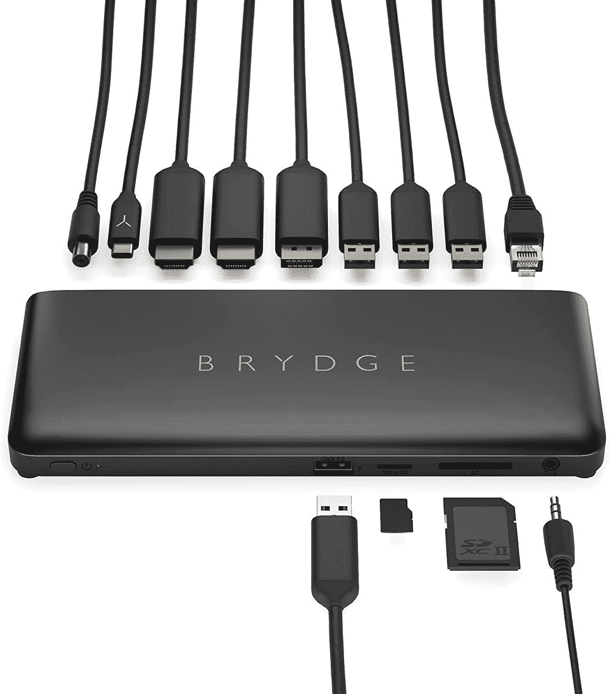
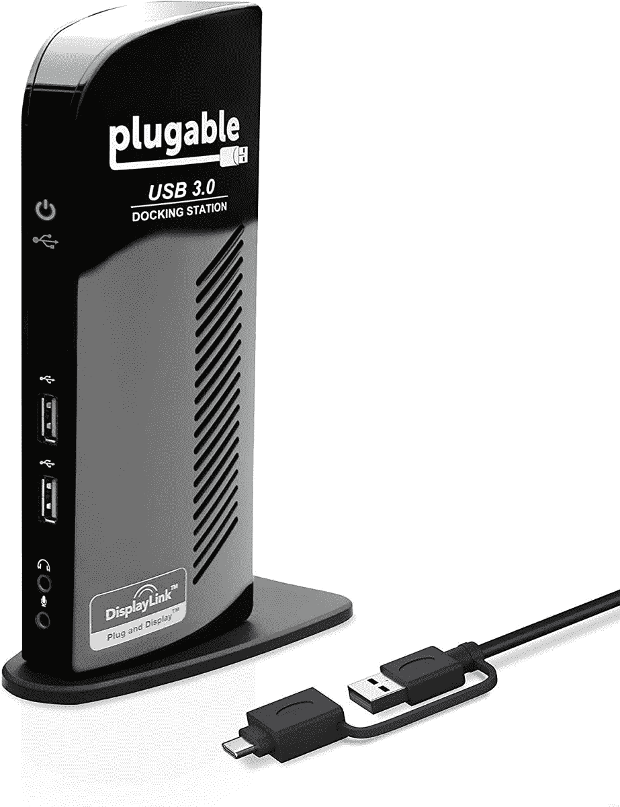
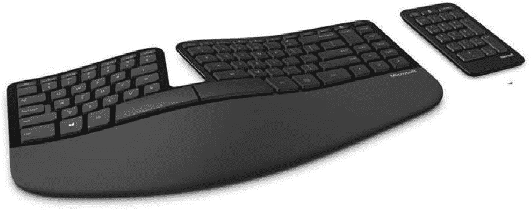
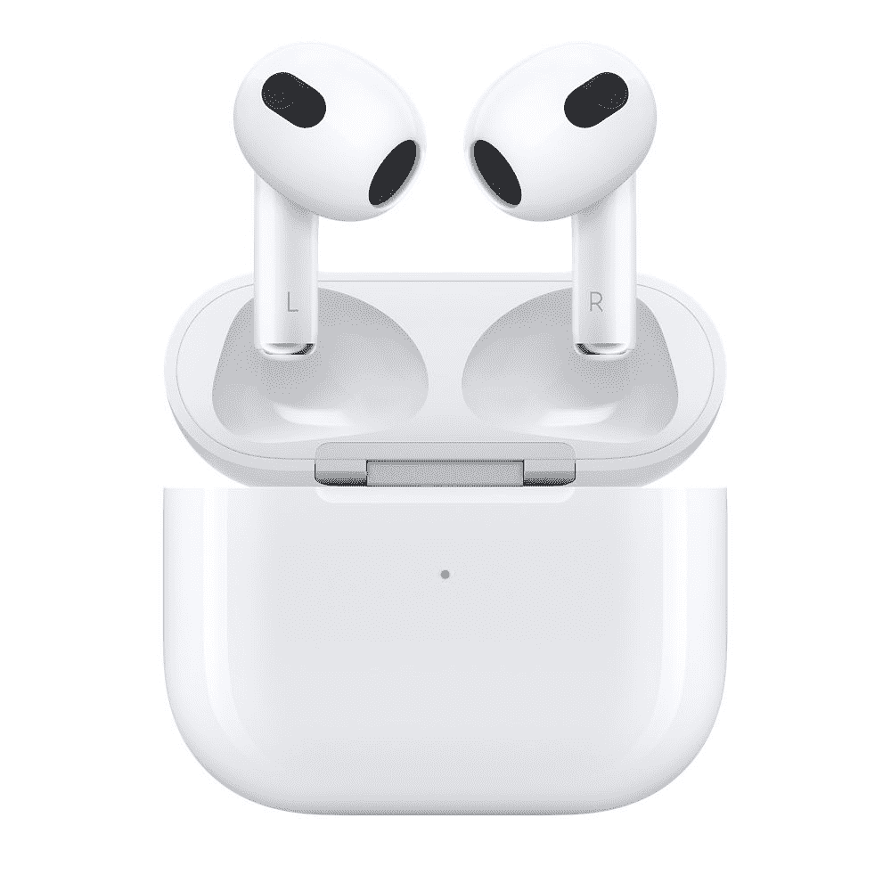
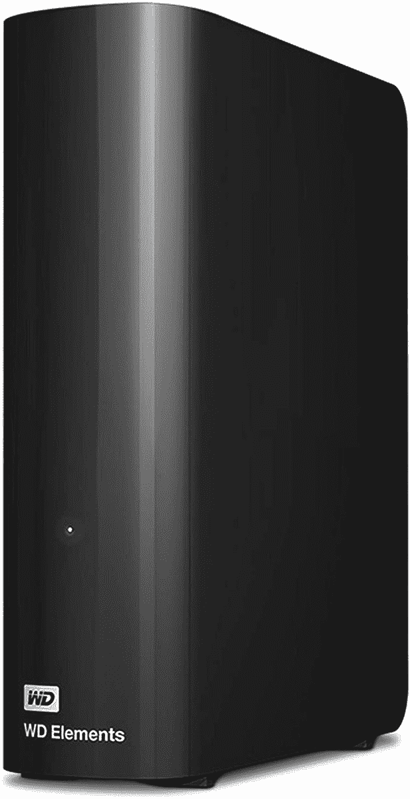
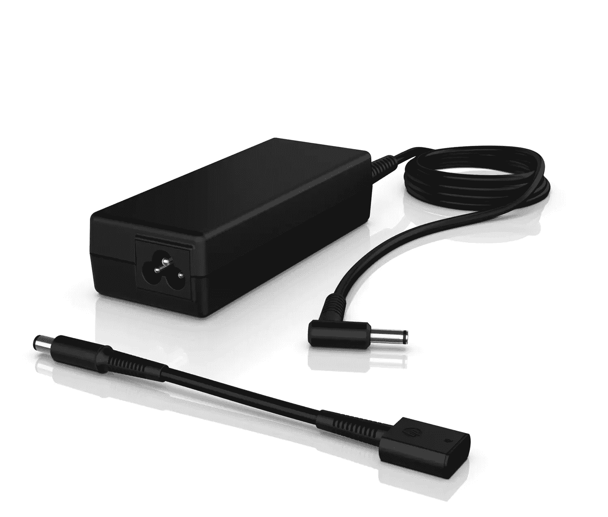

# 惠普 Spectre x360 的最佳配件(2022)

> 原文：<https://www.xda-developers.com/best-accessories-hp-spectre-x360-2022/>

惠普最近刚刚推出了面向 2022 年的 Spectre x360 型号，阵容比以前更加简化。今年，我们只有两种型号:x360 13.5 的[Spectre x360](https://www.xda-developers.com/hp-spectre-x360-13-5-review/)——x360 14 的后续——和更新的 [Spectre x360 16](https://www.xda-developers.com/hp-spectre-x360-16-review/) 。这是两款[超棒的笔记本电脑](https://www.xda-developers.com/best-laptops/)，面向稍有不同的受众，但它们拥有漂亮的高端设计、高端性能、超棒的显示屏，以及目前市场上最好的笔记本电脑摄像头。但即使是惠普 Spectre x360 也有其缺点，这就是配件的用武之地。

无论您是想打造完美的办公桌面，将笔记本电脑变成游戏机，还是让它在旅途中更加有用，我们都为您收集了大量有用的附件。这些涵盖了广泛的类别，你可以在下面找到它们，或者跳到你最感兴趣的部分。让我们开始吧。

**浏览本文:**

## 适用于 HP Spectre x360 (2022)的外部显示器

HP Spectre x360 的两种型号都提供了出色的显示选项，能够升级到两种尺寸的一些令人惊叹的有机发光二极管面板。但这并不总是关乎显示器的质量——有时，你只是需要更多的显示器。外部显示器对于多任务处理来说是非常重要的附件，我们为 HP Spectre x360 收集了一些很好的选项。

*   <picture></picture>

    三星 S65UA

    ##### 三星 S65UA Ultra WQHD 显示器

    超宽显示器因其更易于多任务处理而广受欢迎，因为您无需多台显示器即可同时运行更多应用程序。这款三星面板具有 21:9 的宽高比、清晰的 WQHD 分辨率和 HDR 支持。此外，它有 100 赫兹的刷新率，可以实现非常流畅的动画，并且它是弯曲的，可以给你更好的视角。

*   <picture></picture>

    HP 24MH

    ##### HP 24MH FHD 显示器

    想不用花很多钱就能染指双屏设置？这款惠普显示器可能是一个很好的方式，它为您提供了一个 75Hz 刷新率的全高清面板，加上内置扬声器，价格非常低。它不通过 USB-C 连接，所以你可能需要一个适配器来适应较小的 Spectre x360，但它确实具有倾斜、高度和枢轴调节等功能。对于这个价格，你不能要求更多。

*   <picture></picture>

    宏碁 Predator XB 283k

    ##### 宏碁 Predator XB273K 27 英寸 UHD 游戏显示器

    游戏是一个越来越受欢迎的爱好，尽管 Spectre x360 不是为此而造的，但你可以让它成为一个伟大的游戏平台，正如你将在下一节看到的那样。凭借 4K 分辨率、120Hz 刷新率和 HDMI 2.1，这款 Acer Predator 显示器将帮助您获得最佳游戏体验之一，即使使用最新的游戏机也是如此。

*   <picture></picture>

    LG Gram+View

    ##### LG Gram+View

    一旦习惯了双屏设置，就很难再回到只有一个屏幕的状态。幸运的是，您不必这样做-这款 16 英寸显示器具有 16:10 的宽高比，是您的 Spectre x360 16 的完美移动伴侣。它具有四倍高清分辨率，由一根线缆供电，因此设置方便简单。

*   <picture></picture>

    Arzopa 便携式显示器

    ##### Arzopa 便携式显示器

    对于体积较小的 Spectre x360 来说，Gram +View 有点太大，但如果你想要一个更小的便携式显示器，这也是一个现象级的选择。这是一个 13.3 英寸的面板，具有 Quad HD+分辨率和 16:10 的纵横比，因此它非常接近 Spectre x360 13.5 的大小。此外，它很锐利，可以像大多数便携式显示器一样通过 USB-C 工作。

如果您想了解更多选项，我们确实有一个关于[最佳显示器](https://www.xda-developers.com/best-monitors/)的汇总。

## 外部 GPU 外壳

正如我们上面提到的，Spectre x360 不完全是一个游戏装备，但这并不意味着你不能把它变成一个。体验 Thunderbolt 4 的强大功能，它支持通过这台笔记本电脑上的 USB Type-C 端口发送 PCIe 信号。这意味着您可以将外部 GPU 连接到您的笔记本电脑，为此，您需要一个 GPU 外壳。这些都是昂贵的配件，但如果你想用 HP Spectre x360 玩游戏，这是最好的方法。此外，随着时间的推移，您可以只升级 GPU 来获得更好的体验。以下是一些不错的选择:

*   <picture></picture>

    Cooler Master case eg 200

    ##### Cooler Master case eg 200

    Master case eg 200 是另一款坚固的外部 GPU，但除了 GPU 本身之外，它还可以容纳外部 SATA 驱动器，因此您可以获得额外的存储空间。它有一个 550 瓦的 PSU，可以提供 60 瓦的功率给你的笔记本电脑充电。它还可以作为存放笔记本电脑的支架。

*   <picture></picture>

    Gigabyte Aorus 游戏盒

    ##### Gigabyte Aorus 游戏盒

    外置 GPU 机箱通常需要你单独购买 GPU，但这个包装中包含一个 NVIDIA GeForce RTX 3080。盘柜本身有一个 550 瓦的 PSU，并增加了三个 USB 端口和以太网。在现货中可能很难找到它，但如果你不想自己购买和安装 GPU 的麻烦，这是一个很好的选择。

你可以在我们对[最佳外部 GPU 附件](https://www.xda-developers.com/best-external-gpus-for-your-laptop/)的总结中找到更多选项。

## HP Spectre x360 的坞站和适配器

如今，高端笔记本电脑的端口供应往往有限，尽管 HP Spectre x360 不是最差的，但它可能仍不足以满足所有配件的需求。13.5 寸的机型更是如此，连 HDMI 都没有。这就是坞站可以真正发挥作用的地方，谢天谢地，这些笔记本电脑支持 Thunderbolt 4，因此您可以获得一些非常棒的选项。以下是一些建议:

*   <picture></picture>

    HP 霹雳坞 120 w

    ##### HP 霹雳坞 120W

    HP 还自带坞，其实也挺不错的。它具有紧凑的设计和可靠的端口供应，包括双显示端口、USB-A、以太网和下游 Thunderbolt 连接。此外，它支持惠普笔记本电脑的 120W 充电，使其成为 Spectre x360 16 的理想选择。

*   <picture></picture>

    Anker Apex 12 合 1 Thunderbolt 4 坞站

    ##### Anker 777 Thunderbolt 坞站

    Anker 777 是另一款外观和感觉都很高级的 Thunderbolt 坞站。它有很多端口，包括四个 USB Type-A、下游 Thunderbolt、USB-C、以太网和两个 HDMI 输出，外加一个 SD 读卡器。和 CalDigit TS4 不是一个级别的，但是更便宜更小巧。

*   <picture></picture>

    布里奇石 C

    ##### 布里奇石 C

    霹雳虽大，但也贵。这个 Brydge 坞站使用标准的 USB-C 连接，但它仍然有大量的外围设备端口，包括三个显示输出，USB Type-A 和千兆以太网。另外，它看起来很光滑。

*   <picture></picture>

    可插拔扩展坞

    ##### 可插拔 USB 3.0 通用笔记本扩展坞

    如果你想要一个更便宜，但仍然多功能的选择，这可能是一个不错的解决方案。它有六个 USB 端口、以太网、HDMI 和 DVI 显示输出(加上一些适配器)。它不会给你的笔记本电脑充电，速度也没有那么快，但它仍然非常通用。

*   <picture></picture>

    Mokin USB-C Hub

    ##### Mokin 5 合 1 USB Hub

    如果你想要一个非常便宜的适配器，但仍有几个选项，这款 Mokin hub 包括一个 HDMI 端口、两个 USB-A 端口、一个 USB-C 和千兆以太网，所有这些都在一个紧凑的包装中，你可以使用还支持 100W 直通充电。

## 鼠标和键盘

为了便于携带，笔记本电脑必须有点薄，这意味着必须做出一些牺牲。例如，你有一个触摸板，而不是鼠标。类似地，键盘也需要较低的外形，与桌面键盘相比，在上面打字可能不太舒服。但是，如果您在办公桌上使用 HP Spectre x360，为什么不购买这些配件来让体验更加舒适，并帮助您提高工作效率呢？这里有一些你可能喜欢的很棒的鼠标和键盘:

 <picture></picture> 

HP Pavilion Wireless Keyboard and Mouse 800

##### 惠普 Pavilion 无线键盘和鼠标 800

想要一次完成全部设置吗？惠普套装包括全尺寸键盘和超薄鼠标，为您提供启动和运行所需的一切。键盘仍然有一个超薄的外形，可能不是每个人的理想选择，但它是一种经济实惠的方式来完成您的设置，同时保持它的现代感。

 <picture></picture> 

Microsoft Sculpt keyboard

##### 微软雕塑人体工程学键盘

普通键盘在短时间内是可以的，但是如果你整天都在打字，一个符合人体工程学的键盘会更加舒适和健康。这种形状可能看起来很奇怪，但它让所有的按键都触手可及，大的腕托让你的手腕保持在一个中立的位置，这样你就不会长时间扭伤它们。

 <picture></picture> 

Logitech MX Mechanical

##### 罗技 MX 机械

你可能已经听够了人们对机械键盘的赞美，但这是有充分理由的。按键的触觉和反应感觉使打字更加令人满意，并且它可以极大地帮助提高工作效率。这款带有您选择的机械开关，您也可以选择更紧凑的型号。

*   <picture></picture>

    HP Spectre 可充电鼠标

    ##### HP Spectre 可充电鼠标 700

    HP Spectre 鼠标是 Spectre 笔记本电脑的完美搭档，至少在视觉上是这样的。它采用了类似于笔记本电脑本身的双音设计，另外它可以连接多达四个设备，并且它有一个 1,200 DPI 的传感器，对于几乎任何表面都足够好。

*   <picture></picture>

    雷蛇蛇怪 V3

    ##### 雷蛇蛇怪 V3

    如果你打算用这款笔记本电脑玩游戏，雷蛇蛇怪 V3 是你现在能得到的最好的鼠标之一。它有一个 26K DPI 传感器，11 个可编程按钮和色度 RGB 照明。这是一个有线鼠标，所以你不必担心电池在游戏中耗尽。

## 耳机和耳塞

Spectre x360 的两个型号都有一组四声道立体声扬声器，应该可以提供开箱即用的可靠音频体验，但如果您与他人分享您的房间，并且如果您在公共场合观看内容，您将需要一些耳机或耳塞。大多数人都不想听你在火车上看的电影，所以这些是 HP Spectre x360 的重要配件。

*   <picture></picture>

    森海塞尔 Momentum 真无线 3

    ##### 森海塞尔 Momentum 真无线 3

    森海塞尔已经在音频游戏中摸爬滚打了几十年，其最新的无线耳塞自带 aptX 自适应支持、ANC 和透明模式的高品质音频，并配有长达 28 小时的续航时间。他们也有 IPX4 防溅，他们只是看起来很棒。

*   <picture></picture>

    苹果 AirPods 第三代

    ##### 苹果 AirPods 3

    苹果的 AirPods 轻松成为世界上最受欢迎的真无线耳塞，最新的迭代在设计上有一些大的改进。外壳、出色的音频和无线充电支持可为您提供长达 30 小时的电池续航时间。另外，Windows 11 一直在接受一些 AirPods 特定的优化，以改善声音。

*   <picture></picture>

    索尼 WH-1000XM5

    ##### 索尼 WH-1000XM5

    索尼制造了一些世界上最好的音频产品，WH-1000 xm5 耳机是其在高端音频领域的最新努力。它采用了新的更时尚的设计，更好的音频，改进的 ANC，八个麦克风和两个处理器，以及 30 小时的电池寿命。这是一个更昂贵的选择，但它是合理的。

*   <picture></picture>

    Surface 耳机 2

    ##### 微软 Surface 耳机 2

    Surface 耳机 2 是你能为一台 Windows PC 买到的最好的耳机之一除了出色的音频和 ANC，您还可以在耳罩上获得现代舒适的设计和超直观的拨号和触摸控制。此外，你可以通过电脑或手机的 Surface app 轻松配置它们。它们有白金或黑色可选。

*   <picture></picture>

    雷蛇梭鱼 X

    ##### 雷蛇梭鱼 X

    说到耳机，雷蛇梭鱼 X 是我个人的最爱。它使用 USB-C 加密狗来连接几乎任何设备，无论是你的电脑、手机还是其他任何东西。此外，它非常舒适，看起来很时尚，而且它有一个可拆卸的麦克风，因此您可以根据需要轻松地将其拆下。

## HP Spectre x360 的网络摄像头

老实说，没有太多理由让你为 HP Spectre x360 配备外置网络摄像头。开箱即用，它已经有一个很棒的 500 万像素网络摄像头和 1080p 视频，此外它还支持自动取景和背光校正等功能。对于大多数人来说，这已经足够好了。但是，在某些特定情况下，你可能还想要更多，所以我们这里有一些选项。

*   <picture></picture>

    戴尔 UltraSharp 4K 网络摄像头

    ##### 戴尔 UltraSharp 4K 网络摄像头

    如果你想要花钱就能买到的最好的网络摄像头，大概就是这个了。它有一个 4K 索尼 STARVIS 传感器，针对弱光进行了优化(尽管它在非常暗的房间里可能仍然会很难)，另外它支持 HDR，自动对焦等等。它甚至有一个 Windows Hello 摄像头，以防你的笔记本电脑的网络摄像头位置不佳。

*   <picture></picture>

    Anker PowerConf C302

    ##### Anker PowerConf C302 网络摄像头

    如果您正在使用笔记本电脑参加有许多人在摄像头前的会议，Anker PowerConf C302 是理想的解决方案。它有一个 2K 传感器和 115°的视野，所以它可以很容易地让每个人同时进入。此外，它提供了广泛的可调性，让您每次都能找到合适的位置。

## 惠普 Spectre x360 的机箱

惠普 Spectre x360 是一款昂贵的笔记本电脑，这种投资值得保护。当你把它带在身边时，你会想保护它免受碰撞和跌落，最好的办法是用一个盒子。我们已经在一篇关于[最佳 HP Spectre x360 机箱](https://www.xda-developers.com/best-cases-hp-spectre-x360-2022/)的专门文章中收集了一些选项，但这里有一些亮点。所有这些配件要么有不同的尺寸，要么设计成可容纳 HP Spectre x360 13.5 或 16。只要确保你为你的笔记本电脑选择了合适的尺寸。

*   <picture></picture>

    Tomtoc 笔记本电脑单肩包

    ##### Tomtoc 笔记本电脑单肩包

    这款包为您的笔记本电脑提供了强大的保护，非常柔软的内饰和加固的边角，以防您将其掉落。它还有几个隔层，可以帮助你整理文件和附件。

*   <picture></picture>

    HP 更新背包

    ##### HP 更新背包

    如果你需要随身携带很多东西或者你要进行一次更长时间的旅行，你可能需要一个背包。这款有很多隔层，可以整理你的东西，而且是用可回收材料制成的。

## 外部存储器

无论您选择 13.5 英寸还是 16 英寸型号的 HP Spectre x360，开箱后最多只能获得 2TB 的 SSD 存储，即使这样，升级也可能非常昂贵。如果您想要更多空间来存放文件，或者在没有互联网的情况下轻松移动文件，外置存储设备可能会派上用场。以下是一些选项:

*   <picture></picture>

    可插拔的雷电 3 固态硬盘

    ##### 可插拔的雷电 3 外置固态硬盘

    如果你担心放错线缆，这款固态硬盘内置了它。它还支持 Thunderbolt，尽管速度只能达到 2400 MB/s 的读取和 1800 MB/s 的写入，这仍然比大多数速度都快。

*   <picture></picture>

    SanDisk Extreme Pro 固态硬盘

    ##### SanDisk Extreme Pro 便携式固态硬盘

    【219.99 美元节省 290 美元

    如果您经常带着便携式存储设备旅行，这款坚固耐用它可以在恶劣的条件下生存，虽然它没有使用 Thunderbolt，但它仍然支持高达 2000 MB/s 的速度。

*   <picture></picture>

    三星 T7 Touch

    ##### 三星 T7 Touch 便携 SSD

    说到保护文件安全，有时候你可能想保护它不被人窥探。三星 T7 Touch 具有指纹识别器，可以轻松安全地访问您的数据。它支持高达 1，050MB/s 的速度，这还是相当不错的。

*   <picture></picture>

    WD Elements 台式机硬盘

    ##### WD Elements 外置硬盘

    快速 SSD 存储是日常使用的理想选择，但如果您只想保留所有数据的副本，拥有一个巨大的硬盘是一个便宜得多的选择。WD Elements 台式硬盘的容量高达 20TB，即使是最大的型号价格也不到 500 美元。

*   <picture></picture>

    金士顿微多 3C

    ##### 金士顿微多 3C

    这个微型闪存盘是在紧要关头分享文件最方便的方式，因为你可以轻松地将它放入口袋，放在其他东西旁边。它有 USB-A 和 USB-C 连接，所以它可以在电脑，平板电脑和大多数安卓手机上工作。

*   <picture></picture>

    惠普可充电 MPP 2.0 倾斜笔

    ##### 惠普可充电 MPP 倾斜笔

    如果你喜欢 Spectre x360 的原装笔体验，这是惠普官方的替代品，如果你想要一支可充电笔，这是一个很好的选择。它甚至包括额外的笔尖，如果它停止工作，你可以把它们换出来。

*   <picture></picture>

    Wacom 竹墨 Plus

    ##### Wacom 竹墨 Plus

    原装笔对大多数人来说不错，但 Wacom 竹墨 Plus 可能是你能买到的最好的笔了。它支持 4，096 级压力、倾斜度、MPP 和 AES 协议，甚至还支持蓝牙遥控。

*   <picture></picture>

    RENAISSER 中缝 520 Bt

    ##### RENAISSER 拉斐尔 520BT

    蓝牙支持可以让您快速启动应用程序或控制 PowerPoint 演示文稿，从而真正帮助您充分利用您的笔。这支笔包括，加上所有你期望的墨水功能，价格非常诱人。

## 电光队

像大多数笔记本电脑一样(谢天谢地)，HP Spectre x360 16 的包装盒中仍然带有充电器，但意外确实会发生，您可能会丢失它，或者它可能会停止工作。如果您需要为 Spectre x360 更换充电器，以下是一些选项:

*   <picture></picture>

    惠普 90W 智能交流适配器

    ##### 惠普 90W 智能交流适配器

    16 英寸型号的 Spectre x360 有点耗电，所以你需要一个更强大的适配器，比如惠普的这款 90W 适配器。不过，有点厚。

*   <picture></picture>

    Baseus 100 w GaN II 快速充电器

    ##### Baseus 100 w GaN II USB-C 充电器

    如果你想要一个最强大的充电器，你现在就可以购买，这也是一个很棒的选择。因为它的速度非常快，并且使用 USB-C，所以它可以与 Spectre x360 型号兼容。

## 多方面的

到目前为止，我们已经介绍了 HP Spectre x360 可能需要的大多数附件类型，但是还有一些东西值得强调。它们并不真正属于特定的类别，所以我们将它们留在下面:

*   <picture></picture>

    Xbox 无线手柄

    ##### 微软 Xbox 无线手柄

    上面我们已经推荐了一款游戏键盘，但是有些游戏只是用一个手柄效果更好而已。由于其符合人体工程学的设计和良好的控制，这无疑是最好的之一。此外，它还有一些有趣的颜色。

*   <picture></picture>

    嗖！屏幕清洁剂套装

    ##### 嗖！屏幕清洁剂套件

    让你的笔记本保持干净对很多人来说都是再熟悉不过的事情了，但是这款屏幕清洁剂可能会帮到你。包装包括清洁液和超细纤维布，这样你就有了你需要的所有东西，而且应该能用很长时间。

* * *

这些都是您可能有兴趣为 HP Spectre x360 购买的附件。我们在这里已经包括了很多，所以很有可能你对它们不感兴趣，但是没关系。大多数人不会需要或想要清单上的所有东西，但是你可能会发现至少有一件你感兴趣的东西。对我来说，如果我还没有第二块屏幕，那就是第二块。对你来说，可能是别的什么。

如果你还没有，你可以购买下面的惠普 Spectre x360 的任何尺寸。它们都是非凡的设备，也是惠普制造的一些最好的笔记本电脑，所以我们强烈建议去看看。

 <picture></picture> 

HP Spectre x360 13.5

##### 惠普 Spectre x360 13.5

2022 HP Spectre x360 13.5 采用 3:2 显示屏、第 12 代英特尔 U 系列处理器和高端设计。

 <picture></picture> 

HP Spectre x360 16

##### 惠普 Spectre x360 16 (2022)

HP Spectre x360 配备了 16:10 的大显示屏、第 12 代英特尔 H 系列处理器和其他强大的规格。