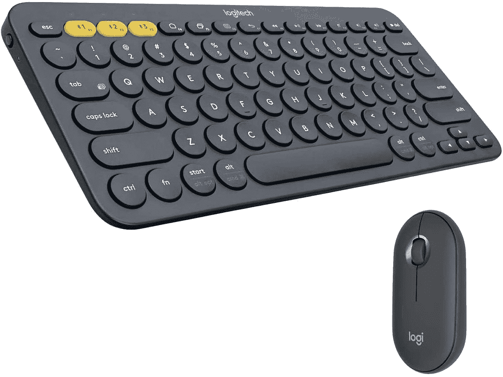
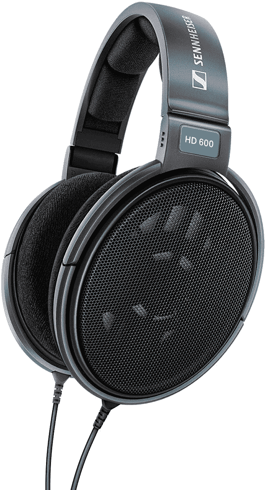
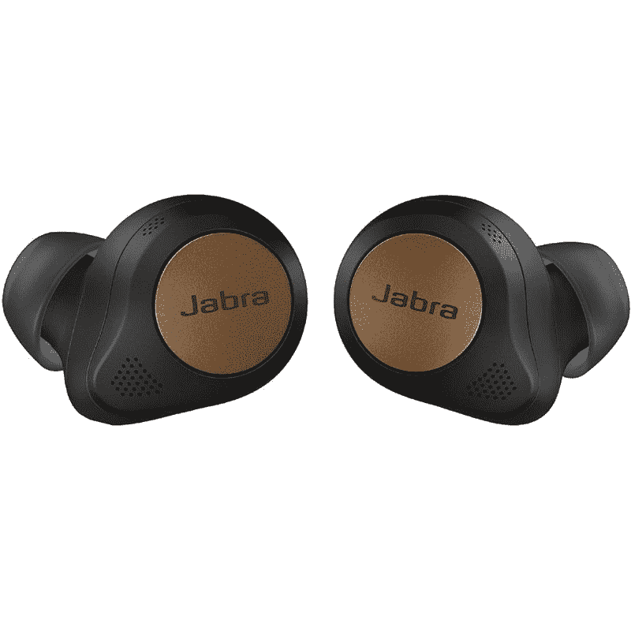
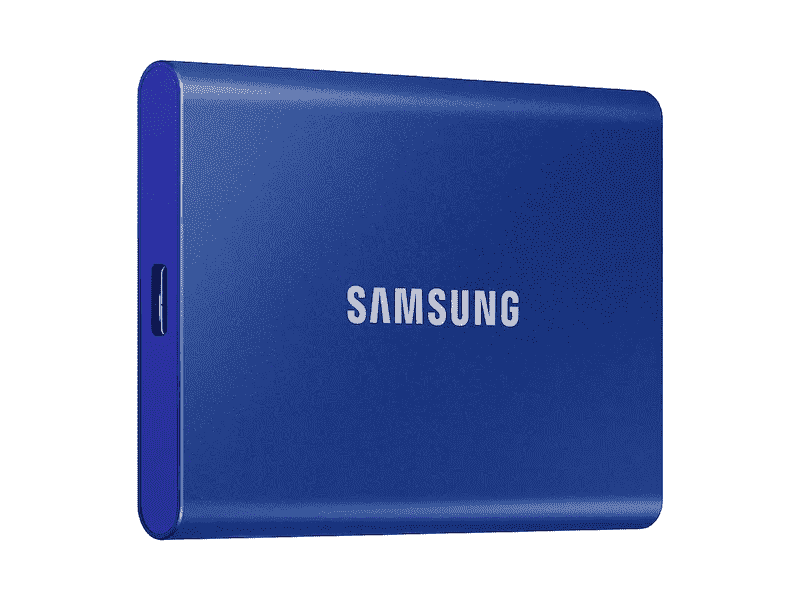

# Mac Studio 的最佳配件

> 原文：<https://www.xda-developers.com/best-accessories-mac-studio/>

苹果公司最近推出了最新的台式电脑 Mac Studio T1，搭载了全新的苹果 M1 超芯片组。就其紧凑的尺寸而言，这是一台令人难以置信的强大机器，甚至让 Mac Pro 也望尘莫及。虽然你从 1999 美元的起价中获得了很多回报，而且它看起来像是你能买到的[最好的 Mac](https://www.xda-developers.com/best-macs/)之一，但你仍然有办法让 Mac Studio 为你更好地工作。尤其是因为这个价格不包括 Mac Studio 的任何配件。

因此，我们收集了各种各样的附件，可以帮助您完成 Mac Studio 设置。无论是显示器，键盘，还是鼠标，这里都有很多选择。让我们开始吧。

**浏览这篇文章:**

## Mac Studio 的显示器

Mac Studio 是一台装在盒子里的台式电脑，这意味着它没有显示器。除非你已经有了自己的屏幕，否则你将需要购买一个屏幕，谢天谢地，这里并不缺少选择。我们有一个专门为 Mac Studio 准备的[最佳显示器综述，但下面也有一些很棒的选项:](https://www.xda-developers.com/best-monitors-mac-studio/)

*   <picture></picture>

    华硕 pro art PA279CV

    ##### 华硕 ProArt PA279CV 27 英寸 4K UHD 显示器

    如果您正在寻找一款价格实惠的夏普显示器，华硕 pa 279 cv 可能就是您的解决方案。它的特点是 4K 分辨率，色彩精度达到 Delta E < 2，100%的 sRGB 和 Rec。709，它用一根 USB Type-C 电缆连接。

*   <picture></picture>

    宏碁 sb 220 q

    ##### 宏碁 SB220Q

    如果你把所有的钱都花在了 Mac Studio 上，并且可以用一个负担得起的显示器，宏碁的这款可能就行了。它具有全高清分辨率和 75Hz 的刷新率，但它只能通过 HDMI 连接，所以你只能使用开箱即用的设备。

*   <picture></picture>

    明基 SW 270 c PhotoVue

    ##### 明基 SW270C PhotoVue 27 英寸 QHD 显示器

    如果您想要一台出色的显示器来进行照片和视频编辑，这款明基面板可能适合您。它具有清晰的 Quad HD 分辨率，覆盖 99%的 Adobe RGB，并具有 16 位 3D LUT，以获得额外的色彩准确度和精确度，它还包括一个遮光罩来阻挡外部光线。

*   <picture></picture>

    LG 超宽 34wn 80 c-B

    ##### LG 34wn 80 c-B

    超宽显示器在多任务用户中非常受欢迎，这是一个很好的选择。它的分辨率高达 3440 x 1440，这意味着它的长宽比为 21:9，非常适合同时使用多个应用程序。它还通过 USB Type-C 连接，因此很容易设置。

*   <picture></picture>

    Apple Pro Display XDR

    ##### Apple Pro Display XDR

    如果你不惜任何代价想要最好的显示器中的最好的，Apple Pro Display XDR 可能适合你。mini-LED 面板最高可达 1600 尼特的峰值亮度、全阵列局部调光、supersharp 6K 分辨率和 P3 宽色域支持。

## 鼠标和键盘

Mac Studio 的价格也不包括鼠标和键盘，所以这两个配件你可能也想买，尤其是如果你身边没有的话。当然，最容易推荐的是苹果官方配件，但也有其他选择。以下是我们的发现:

*   <picture></picture>

    罗技 MX 键

    ##### 罗技 MX 键

    罗技做出了一些很棒的外设，MX 键是一个有趣的键盘。这些按键有着近乎典型的形状，但圆形的盘面使得在打字时更容易按下正确的键，而且它们更舒适。

*   <picture></picture>

    Razer Pro Type Ultra

    ##### Razer Pro Type Ultra

    你通常不会看到为 Mac 推荐的 Razer 键盘，但 Pro Type Ultra 拥有干净的设计，与 Mac Studio 完美契合。它有一个铝建设，安静的机械开关，和一个超级干净的外观白色背光。

*   <picture></picture>

    Macally Mergokey

    ##### Macally mergo key

    如果你想要更舒适的打字体验，并确保你有正确的姿势，Macally mergo key 是一个很好的选择。它拥有你所期望的所有按键，一个漂亮的弧形腕托，以及看起来很棒的酷双色设计。有无线和有线两种版本。

*   <picture></picture>

    罗技 K380+M350

    ##### 罗技 K380 + M350

    想要不会占很多空间的东西。这对 Logitech 附件让您可以使用完美匹配的紧凑型键盘和鼠标来完成 Mac Studio 设置。此外，圆形设计打造出非常独特的外观。

*   <picture></picture>

    苹果魔鼠

    ##### 苹果魔鼠

    苹果魔鼠因其糟糕的充电端口而受到一些抨击，但圆滑的设计和它与 Mac Studio 完美配对的事实给了它一个通行证。在你需要充电之前，电池应该可以用一个月左右，所以应该不成问题。

*   <picture></picture>

    罗技 MX Master 3S

    ##### 罗技 MX Master 3

    罗技的 MX Master 系列是最负盛名的电脑鼠标之一，而且理由充分。凭借 MagSpeed 金属滚轮、可编程按钮和符合人体工程学的设计，这是一款几乎适合任何用户的出色的优质鼠标。

*   <picture></picture>

    魔力触控板

    ##### 苹果魔力触控板

    如果你更喜欢用触控板控制鼠标，苹果魔力触控板提供了你在任何地方都能获得的最佳体验之一。它支持多点触摸和强制触摸手势，大表面有助于它更加舒适。

*   <picture></picture>

    微软蓝牙人体工学鼠标

    ##### 微软蓝牙人体工学鼠标

    微软蓝牙人体工学鼠标采用舒适现代的设计，与 Mac Studio 完美搭配。它有四种不同的颜色，它有两个侧按钮，而且它相对便宜。

## Mac Studio 扩展坞和适配器

尽管 Mac Studio 体积小巧，但它确实提供了充足的端口。你有大量的 Thunderbolt 端口、10Gbps 以太网和 HDMI。然而，它只有两个 USB Type-A 端口，所以你可能想增加一些。如果是这样的话，你能得到的最好的配件之一就是一个用于你的 Mac 工作室的基座或者 USB-C 适配器。如果你有兴趣的话，这里有一些不错的选择。

*   <picture></picture>

    肯辛顿 SD5600T

    ##### 肯辛顿 SD5600T 雷电 3 坞站

    如果您需要在您的设置中添加大量端口，肯辛顿 SD 5600t 是另一个很好的坞站，它采用了时尚的包装。它包括六个 USB Type-A 端口、一个 USB-C 端口、两个 HDMI 和 DisplayPort 端口以及以太网。你可以垂直或水平使用它。

*   <picture></picture>

    CalDigit TS3 Plus

    ##### CalDigit TS3 Plus 雷电 3 Dock

    如果你想要一个感觉像你的 Mac Studio 一样高端的 Dock，这款来自 CalDigit 的是它拥有看起来坚固而时尚的全金属构造。它还为您提供了大量的连接，有五个 USB-A 端口、USB-C、以太网、Thunderbolt 菊花链，甚至还有 S/PDIF 光学音频，这是一个相当罕见的功能..

*   <picture></picture>

    Belkin Thunderbolt 4 Dock Pro

    ##### Belkin Connect Pro Thunderbolt 4 Dock

    Belkin Connect Pro 是一款高端 Thunderbolt 4 Dock，配有多个 USB 端口、两个 HDMI 输出、千兆以太网、Thunderbolt 菊花链等等。它很贵，但是非常通用。

*   <picture></picture>

    Baseus USB-C 扩展坞

    ##### Baseus USB-C 扩展坞

    这款来自 Baseus 的 USB 扩展坞比 Thunderbolt dock 便宜很多，但还是很有能力的。它有大量的 USB Type-A 和 Type-C 端口、SD 读卡器、以太网和三个 HDMI 端口。请记住，显示输出将在 macOS 上镜像。

*   <picture></picture>

    Anker power expand 11-in-1

    ##### Anker power expand 11-in-1 USB-C Hub

    如果你想要一个更紧凑的对接解决方案，Anker PowerExpand USB-C hub 是一个很好的选择。它适合 11 个端口，包括三个 USB Type-A 端口、USB-C、以太网和 SD 读卡器，以及显示输出。

## 耳机和耳塞

Mac Studio 内置扬声器，可用于基本用途，但如果你想要更身临其境的音频体验，一副好的耳机或耳塞是必不可少的配件。当然，许多显示器也有自己的扬声器，这可能很好，但这和有耳机不是一回事。以下是一些不错的选择:

*   <picture></picture>

    苹果 AirPods Max

    ##### 苹果 AirPods Max

    如果你有闲钱，ai rpods Max 提供你在 macOS 上能得到的最好的音频体验之一。结合了时尚的高级设计、带有头部跟踪的空间音频和 ANC，这些是 Mac 用户的绝佳耳机。它们有四种颜色。

*   <picture></picture>

    森海塞尔 HD 600

    ##### 森海塞尔 HD 600

    Mac Studio 自带一个耳机插孔，支持高阻抗耳机，所以这些耳机让你好好利用。森海塞尔 HD 600 是流行的开放式耳机，提供清晰自然的声音。

*   <picture></picture>

    Soundcore Life Q30

    ##### Anker Soundcore Life Q30

    如果你想要便宜的主动噪音消除，Soundcore Life Q30 是一个很棒的选择。它们有三种噪音消除模式，另外它们支持高分辨率音频，在 ANC 开启的情况下充电可持续 40 小时。

*   <picture></picture>

    苹果 AirPods Pro

    ##### 苹果 AirPods Pro

    苹果 ai rpods 普及真无线耳塞，AirPods Pro 是目前最好的一款。它们有很好的音质和 ANC，它们很舒适，因为它们是由苹果公司制造的，所以它们可以与 Mac Studio 无缝合作。

*   <picture></picture>

    Jabra Elite 85t

    ##### Jabra Elite 85t

    如果你想要高级无线耳塞，Jabra 是比较受欢迎的名字之一。Elite 85t 提供了先进的 ANC，这是一种半开放式设计，它们拥有 12 毫米的大驱动器，在一个小包装中提供出色的声音。

## Mac Studio 网络摄像头

虽然有些显示器，如苹果的 Studio Display，有很好的内置摄像头，但如果你有不同的显示器，你很可能需要一个摄像头。在远程工作的时代，网络摄像头已经成为无价的配件，以下是 Mac Studio 的一些最佳选择:

*   <picture></picture>

    戴尔 UltraSharp 4K 网络摄像头

    ##### 戴尔 UltraSharp 4K 网络摄像头

    戴尔 UltraSharp 4K 网络摄像头可能是目前最好的网络摄像头。它的缺点是没有专用的 Mac 软件，但它有一个索尼 STARVIS 传感器，在弱光下表现出色，整体图像质量良好。它连接 USB Type-A.

*   <picture></picture>

    Razer Kiyo

    ##### Razer Kiyo

    如果你打算在线观看流媒体，Razer Kiyo 是一款内置环形灯的出色网络摄像头，是你在黑暗房间中的理想选择 Razer 的 Synapse 软件只能在 Windows 上运行，但你可以将网络摄像头设置保存到网络摄像头中，并在 Mac Studio 上使用。

## 外部存储器

Mac Studio 可提供高达 8TB 的内部存储，这确实已经超过了大多数人的需求。但是升级到 8TB 型号也要花费 2400 美元，所以也许你想通过使用较低的配置和依赖外部存储来节省一些钱。不必担心，如果您想要可以随身携带的快速外部存储，有一些很好的解决方案。

*   <picture></picture>

    LaCie 加固型固态硬盘

    ##### LaCie 加固型固态硬盘 Pro

    这款 LaCie 固态硬盘的加固设计具有防尘、防水、防摔和防震功能，因此您可以将它带到任何地方。但它在紧凑的外形中仍具有高达 2，400MB/s 的速度，因此如果您需要共享文件，它很容易随身携带。

*   <picture></picture>

    三星 T7

    ##### 三星 T7 便携式 SSD

    如果你只是想要一个坚固的 SSD，并且能够选择自己喜欢的颜色，三星 T7 非常棒。它有高达 2TB 的容量和三种颜色可供选择，而且它不太贵，速度高达 1050 MB/s。

*   <picture></picture>

    SanDisk Extreme Pro 固态硬盘

    ##### SanDisk Extreme Pro 便携式固态硬盘

    【219.99 美元节省 290 美元

    如果您它不支持 Thunderbolt，但使用 USB 3.2 Gen 2x2，仍然拥有高达 2000 MB/s 的速度，因此在性能上并不缺乏。

*   <picture></picture>

    WD My Book Duo

    ##### WD My Book Duo 外置硬盘

    以今天的标准来看，典型的硬盘存储可能会非常慢，但如果你想要海量存储而不花费数千美元，这就对了。这款 WD 硬盘配有高达 36TB 的存储空间，用于备份您可能不常使用的数据。

*   <picture></picture>

    金士顿微多 3C

    ##### 金士顿微多 3C

    需要把你的文件揣在口袋里轻松分享给别人？金士顿微多 3C 闪存盘有一个 USB 类型-C 和类型-A 端口，所以它可以与任何 PC(和大多数手机)一起工作，另外你可以获得高达 128GB 的容量。

* * *

这些是我们认为你能为 Mac Studio 得到的最好和最重要的配件。对于它做对的每一件事，你肯定有办法让它变得更好——或者在某些情况下，更有用。请记住，官方价格不包括显示器、鼠标或键盘，因此您可能需要全部购买。

如果这还不能阻止你，你可以购买下面的 Mac Studio。如果你是苹果电脑世界的新手，你可能想看看你需要知道的关于苹果电脑的一切，再加上苹果电脑的 T2 最佳应用，比如苹果工作室。这些应用程序针对苹果 M1 Max 和 M1 Ultra 处理器进行了优化，因此它们将以完全的本机性能运行。

 <picture></picture> 

Mac Studio

##### 苹果 Mac 工作室

新的 Mac Studio 配备了高达苹果 M1 超芯片组，128GB 的统一内存和 8TB 的存储空间。不过，盒子里没有附件。