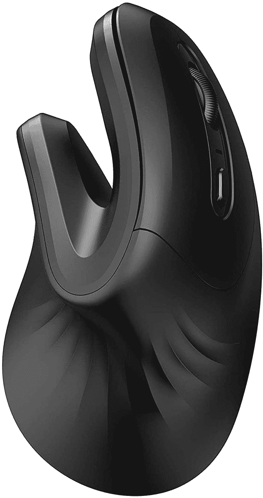
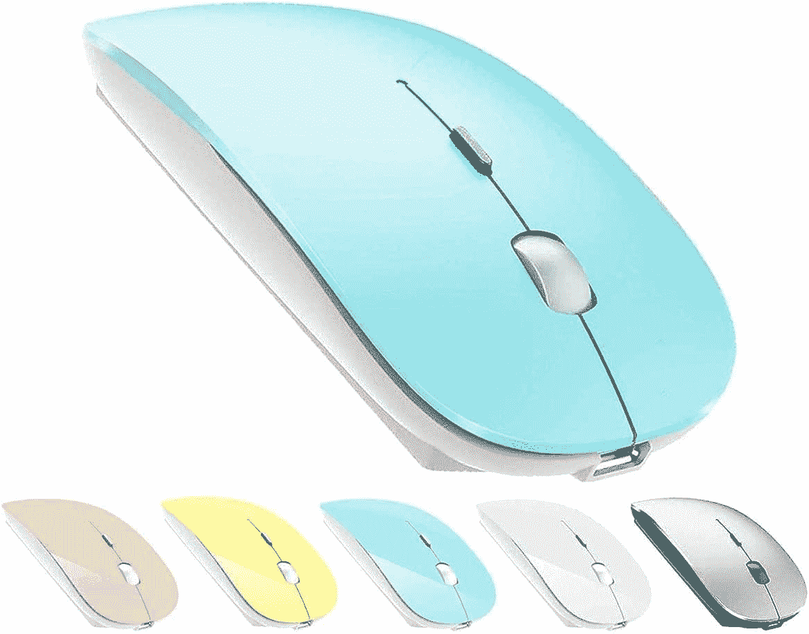
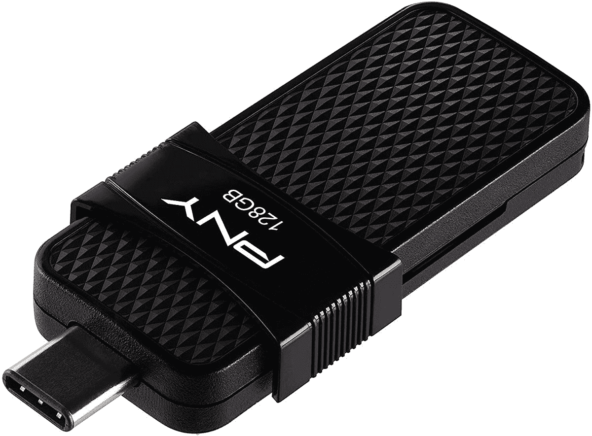

# 13 英寸 MacBook Pro 的最佳配件(2022 年)

> 原文：<https://www.xda-developers.com/best-accessories-macbook-pro-13-2022/>

苹果最近用全新的[苹果 M2 处理器](https://www.xda-developers.com/apple-m2-launch/)升级了 [MacBook Pro 13 英寸](https://www.xda-developers.com/apple-macbook-pro-13-inch-m2-2022-review/)，为已经是市场上最快的 13 英寸笔记本电脑之一带来了更高的性能。除此之外，没有太多变化，但公平地说，这已经是[最好的笔记本电脑](https://www.xda-developers.com/best-laptops/)之一。尽管如此，尽管 2022 款 MacBook Pro 13 很好，但你总能通过一些配件让你的体验更好。

附件可以给你的笔记本电脑增加各种功能，比如，你可能想要一个额外的屏幕，更多的端口，或者一个更大的鼠标和键盘。也有保护你的笔记本电脑安全的箱子，或者如果你想要更身临其境的音频体验的耳机。无论你的用例是什么，我们都为 MacBook Pro 13 收集了一些很棒的配件，虽然我们专注于 2022 年的型号，但这些配件在之前的版本中也同样适用。

## MacBook Pro 13 (2022)的外部显示器

如果您以前尝试过使用多台显示器，您会知道在工作效率方面没有什么比这更好的了。拥有两个屏幕只是为你的应用程序提供了更多的空间，所以你可以并排放置更多的东西，而不必经常在应用程序之间切换。这些是 MacBook Pro 13 英寸最有用的一些配件，所以这里是我们的一些建议。我们主要关注通过 USB-C 连接的显示器，因为没有 USB-C 的显示器需要一个适配器。

*   ##### Dell UltraSharp U3223QE

    如果您想要更大的东西，Dell UltraSharp u 3223 QE 非常合适，它具有 4K 分辨率的 32 英寸面板。它是首批采用 IPS 黑屏技术的显示器之一，因此具有更高的对比度，而且它覆盖了 98%的 DCI-P3。它还支持 USB-C 连接，并为您的笔记本电脑提供 90W 的功率。

    T13T15
*   <picture></picture>

    三星 S65UA

    ##### 三星 S65UA Ultra WQHD 显示器

    多屏 aew 不错，但如果一个屏幕就能搞定一切呢？三星 S65UA 是一款超宽显示器，具有清晰的 WQHD 分辨率，非常适合多任务处理。您可以在一个视图中显示更多的应用程序，从而更容易同时关注更多的事情，而无需在多个显示器上花费太多。

*   <picture></picture>

    苹果工作室显示器

    ##### 苹果工作室显示器

    如果你是苹果迷，苹果工作室显示器是 MacBook Pro 的理想搭配。这是一个非常清晰的屏幕，配有内置的 1200 万像素网络摄像头。它的亮度高达 600 尼特，支持 P3 宽彩色，它与 Thunderbolt 电缆连接，也可以以高达 96W 的功率为您的笔记本电脑充电。

*   <picture></picture>

    宏碁 sb 220 q

    ##### 宏碁 SB220Q

    想要一块不花太多钱的第二屏？宏碁 SB220Q 是一款基本的全高清显示器，刷新率高达 75Hz，对于基本使用来说已经足够好了。你需要一个适配器来使用 HDMI 端口，它没有扬声器，但这是一种获得更多工作空间的廉价方式。

*   <picture></picture>

    Arzopa 便携式显示器

    ##### Arzopa 便携式显示器

    如果您无论走到哪里都需要两个屏幕，Arzopa 便携式显示器就是完美的选择。它通过一根 USB-C 电缆连接，它是一个 13.3 英寸的面板，与 MacBok Pro 13 具有相同的 16:10 纵横比，甚至具有相同的 2560 x 1600 分辨率。这是在旅途中提高工作效率的理想选择。

想看看其他选择吗？请访问我们对[最佳显示器](https://www.xda-developers.com/best-monitors/)的综合报道。

## MacBook Pro 13 (2022)的基座和适配器

MacBook Pro 13(和其他 MacBook)臭名昭著的一个原因是端口供应不足，这使得连接配件更加困难。不过，你可以使用 Thunderbolt 和 USB-C 坞站来扩大端口的选择，这里有一些很好的选项。然而，我们应该提到的是，MacBook Pro 仅通过 Thunderbolt 或 DisplayPort Alt 模式支持一个外部显示器。解决这个问题的一个方法是使用基于 DisplayLink 的 docks，所以我们也有下面的一些方法。

*   <picture></picture>

    Anker 577 Thunderbolt dock

    ##### Anker 577 Thunderbolt dock

    如果你想要一个稍微更合理的坞站，Anker 577 是另一个伟大的选择，它拥有全金属高级构造和大量端口。比之前的型号便宜很多，但它仍然有 HDMI，一个 Thunderbolt 下游端口，以太网，85W 充电支持，等等。

*   <picture></picture>

    可插拔的 USB-C 三显示器 4K 坞站

    ##### 可插拔的 USB-C 三显示器坞站

    可插拔的 UD-ULTC4K 可能不是 Thunderbolt 坞站，但它是让您在 M2 MacBook Pro 上使用多显示器的少数选项之一。它使用 DisplayLink 技术，允许您在添加 USB 端口、以太网等的基础上，同时连接多达三台外部显示器。

*   <picture></picture>

    mediaGear 坞站

    ##### mediaGear 坞站

    这是另一个基于 DisplayLink 的坞站，是一种将多个显示器连接到 MacBook Pro 的更便宜的方法。除了支持两个显示器之外，它还为您提供了以太网、多个 USB 端口和高达 60W 的功率，足以为您的笔记本电脑充电。

*   <picture></picture>

    苹果 USB-C AV 多端口适配器

    ##### 苹果 USB-C AV 多端口适配器

    苹果的 USB-C 数字 AV 多端口适配器是为你的 MacBook Pro 增加几个端口的相对便宜的方式。它在一个细长且相对实惠的封装中为您提供 USB Type-A、HDMI 和直通充电，因此如果您经常在移动中，它是理想的选择。

*   <picture></picture>

    Mokin USB-C 集线器

    ##### Mokin 5 合 1 USB 集线器

    如果您想要一个非常便宜的适配器，但仍能提供可靠的连接范围，这款 Mokin 集线器包括一个 HDMI 端口、两个 USB-A 端口、一个 USB-C 端口和千兆以太网，此外它还支持高达这是给你的笔记本电脑增加很多端口的最便宜的方法之一。

## 鼠标和键盘

尽管 MacBook Pro 13 因其相对较小的尺寸而变得强大，但与台式机相比，笔记本电脑总是要做出一些牺牲，因为它们的尺寸。鼠标和键盘是显著的例子。笔记本电脑的键盘没有按键之间那么大的行程或空间，你得到的不是普通的鼠标，而是触摸板(即使 MacBook Pro 有最好的触摸板之一)。不过，如果你在办公桌上使用 13 英寸的 MacBook Pro，购买这些配件可以大大提高你一天的工作效率和舒适度。以下是我们喜欢的几个选项:

*   <picture></picture>

    罗技 MX Mechanical

    ##### 罗技 MX Mechanical

    典型的薄膜键盘对大多数人来说工作正常，但精通打字的人喜欢机械键盘，而罗技 MX Mechanical 是一个很棒的选择。它专为提高工作效率而设计，并附带您选择的开关，因此您可以随心所欲。也是全尺寸布局。

*   <picture></picture>

    微软 Surface 键盘

    ##### 微软 Surface 键盘

    如果你想要一个纤薄的键盘，另一个绝佳的选择就是微软的 Surface 键盘。它看起来时尚而现代，铂金配色使它非常适合 MacBook Pro，即使它是由苹果的竞争对手制造的。不过，您必须习惯一些带有 Windows 标签的系统键。

*   <picture></picture>

    Perixx Periboard-612

    ##### Perixx peri board-612

    它看起来可能有点不合常规，但 peri board-612 是一款符合人体工程学的键盘，它的设计比传统键盘更舒适。分离式设计和斜坡使所有按键触手可及，无需太多移动，腕托使您的手保持在自然的位置，以避免紧张。

*   <picture></picture>

    I clever GK08

    ##### I clever GK08

    如果你想要一个鼠标和键盘都在一个包装里而又不花太多钱，这款可能适合你。iClever GK08 鼠标和键盘组合包括一个时尚的键盘和鼠标，足以满足您的所有日常需求，而且非常便宜。键盘很纤薄，但却是全尺寸布局。

*   <picture></picture>

    罗技 MX Master 3S

    ##### 罗技 MX Master 3S

    罗技的 MX Master 系列一直是我们对鼠标的顶级推荐，MX Master 3S 是迄今为止最好的一款。除了优质和符合人体工程学的设计和金属 MagSpeed 滚轮，最新型号还配备了 90%的静音开关，此外它还有一个更精确的 8K DPI 传感器，因此它可以在更多表面上工作。

*   <picture></picture>

    苹果魔鼠

    ##### 苹果魔鼠

    如果你想留在品牌上，拥有苹果的一切，魔鼠就是你的不二之选。这是一款外观时尚的鼠标，与 MacBook Pro 的简洁设计完美搭配。这是一个可充电的鼠标，但它不能在使用时充电，很遗憾。

*   <picture></picture>

    Mojo 垂直鼠标

    ##### Mojo 垂直鼠标

    类似于人体工程学键盘，这款鼠标可能看起来不传统，但这种垂直设计非常适合持久的舒适性，因为它允许您的手以更自然的位置休息。除此之外，它拥有你对鼠标所期望的一切。

*   <picture></picture>

    ZERU 蓝牙鼠标

    ##### ZERU 蓝牙鼠标

    如果你想要一个便宜的鼠标这可能是不需要适配器的更好的选择之一。这是一个相对简单的鼠标，但它有几种颜色，所以如果你想要更有个性的东西，它是一个可靠的选择。

## 耳机和耳塞

MacBook Pro 13 英寸配备了与以前型号相同的立体声扬声器设置，虽然它足够坚固，可以在家里使用，但有时你想在公共场合听音乐或看电影。当你周围有人的时候，你可能不想向每个人大声播放你的音频，所以你可能需要一些耳机或耳塞。除此之外，这些配件可以给你带来比 MacBook Pro 13 本身更身临其境的音频体验。以下是我们喜欢的一些选项:

*   <picture></picture>

    索尼 WF-1000XM4

    ##### 索尼 WF-1000XM4

    如果你正在寻找一种出色的音频体验，但你宁愿不要 AirPods，索尼 WF-1000 xm4 是一些最好的耳塞。它们具有更紧凑的设计，以及出色的电池寿命、音频质量和 ANC。然而，它们比 AirPods Pro 贵一点。

*   <picture></picture>

    AirPods(第三代)

    ##### 苹果 AirPods 3

    如果你想要苹果花不了太多钱的花哨功能，第三代 ai rpods 也是一个很好的选择。它们与苹果设备无缝集成，并支持带有头部跟踪的空间音频，尽管设计并不舒适，也没有 ANC。但是它们比 AirPods Pro 便宜。

*   <picture></picture>

    森海塞尔 HD 650

    ##### 森海塞尔 HD 650

    2022 款 MacBook Pro 13 带有对高阻抗耳机的支持，如果你想利用这一点，森海塞尔 HD 650 是一个很棒的选择。它们具有 300 欧姆的阻抗和非常窄的容差，能够提供平衡的开放式音频，一定能满足您所有的发烧友需求。

*   <picture></picture>

    AirPods Max

    ##### 苹果 AirPods Max

    当然，我们也不得不提 ai rpods Max。这些是苹果最高端的耳机，具有出色的音质，ANC，空间音频支持，以及独特的高级设计，有几种不同的颜色。这些都很贵，但是如果你想要最好的无线音频体验，大概就是这个了。

*   <picture></picture>

    Surface 耳机 2

    ##### 微软 Surface 耳机 2

    它们可能是由苹果的竞争对手制造的，但 Surface 耳机 2 是一对非常引人注目的耳机。除了高端音频，它们的标志性特征是耳罩上的旋转转盘，使音量控制和 ANC 调节比以往任何时候都更容易。此外，它们看起来时尚而现代，所以你可以穿着它们去任何地方。

## 13 英寸 MacBook Pro 的网络摄像头

虽然苹果已经将最近一些笔记本电脑的网络摄像头升级到 1080p，但 13 英寸的 MacBook Pro 却被排除在外，这意味着它仍然使用 720p 摄像头。在混合工作的时代，这并不令人惊讶(尽管 MacBook Pro 确实有一个更好的 720p 网络摄像头)，所以你可能需要一个外部网络摄像头来让在线会议和通话变得更好。有许多很好的选择，但这里是我们的一些建议:

*   <picture></picture>

    罗技 Streamcam

    ##### 罗技 StreamCam

    罗技 Streamcam 不像其他一些选项那样高端，但它确实支持 60fps 的 1080p 视频，而且它的设计很现代。事实上，它甚至可以通过 USB-C 连接，这使得用 MacBook Pro 进行设置非常容易。它还具有自动对焦和自动取景功能，并且可以旋转以拍摄垂直视频。

*   <picture></picture>

    微软现代网络摄像头

    ##### 微软现代网络摄像头

    如果你想要更实惠的东西，微软现代网络摄像头是一个可靠的选择。它支持 1080p 视频，以及 HDR 视频、光线校正和自动对焦，因此视频质量非常稳定。它还有一个内置的隐私快门，整体设计非常紧凑，所以应该很容易安装。

## MacBook Pro 13 的外壳

正如你可能对苹果公司的期望一样，MacBook Pro 13 英寸是一款相当昂贵的笔记本电脑，尽管它并不像你从它那里得到的钱不值得。尽管如此，这种投资值得保护，如果你想让你的新 MacBook Pro 13 安全，外壳或袖子是非常重要的配件。市场上充斥着各种可供选择的案例，但如果你想要一些建议，请查看以下内容:

*   <picture></picture>

    MOSISO MacBook Pro 外壳

    ##### MOSISO 硬壳 MacBook Pro 外壳

    如果你想要一个更便宜的卡扣式外壳，MOSISO 的这款是另一个可靠的选择。除了覆盖外部，还有一个键盘盖，它有一大堆颜色，所以你可以为一个无聊的设计添加一些天赋。盒子里还有一个屏幕保护器。

*   <picture></picture>

    Tomtoc 360 保护套

    ##### Tomtoc 360 保护套笔记本电脑单肩包

    如果你宁愿有一个套可以塞进你的笔记本电脑，这也是一个很棒的选择。它有很多填充物和加固的角落，还能给你空间放置额外的配件。它也有四种颜色可供选择，所以你可以选择更适合你风格的。

## 外部存储器

MacBook Pro 13 英寸可以配置高达 2TB 的 SSD 存储，就像以前的型号一样。对于大多数用户来说，这是足够的存储空间，但一直增加到 2TB 会让你付出相当大的代价，所以如果你想节省一些钱，你可以选择较低的存储层，以后再购买外部存储。外置固态硬盘是扩展 13 英寸 MacBook Pro 存储空间的绝佳配件，尽管也有经典硬盘或闪存驱动器的使用案例。

*   <picture></picture>

    Fantom Drives Extreme

    ##### Fantom Drives Extreme

    如果你不需要 G-Drive Pro 的超坚固耐用性，Fantom Drives 的这款固态硬盘同样快速，读取速度为 2，800MB/s，写入速度为 2，400MB/s，但更加简化它也稍微便宜，所以这是你可能更喜欢它而不是 SanDisk 产品的另一个原因。

*   <picture></picture>

    三星 T7 Touch

    ##### 三星 T7 Touch 便携式固态硬盘

    有许多方法可以将文件安全地保存在外部驱动器上，但三星 T7 Touch 固态硬盘通过内置的指纹读取器来解锁数据，使访问文件比以往任何时候都更容易。此外，它的速度高达 1，050MB/s，所以它仍然很快，但比 Thunderbolt 固态硬盘便宜。

*   <picture></picture>

    WD My Passport SSD

    ##### WD My Passport SSD

    如果你不需要这份名单上其他 SSD 的花里胡哨，WD My Passport SSD 也是一个靠谱的选择。它是一个普通的固态硬盘，速度高达 1，050MB/s，有几种颜色可供选择。

*   <picture></picture>

    希捷扩展硬盘

    ##### 希捷扩展硬盘

    如果你需要快速访问你的文件，固态硬盘存储是理想的选择，但如果你想创建一个长期备份，像这样的硬盘仍然是一个不错的选择。它为您提供高达 18TB 的存储空间，价格比体积小得多的固态硬盘还要低。

*   <picture></picture>

    PNY Duo Link

    ##### PNY Duo Link

    有时候，你只需要一个非常便携的设备，就可以在房间里四处传递文件，或者把它们带在口袋里。这个闪存盘正是这样，它有 USB-A 和 USB-C 连接器。

## 电光队

虽然苹果是首批从包装盒中取出 iPhone 充电器的公司之一，但 MacBook Pro 13 英寸(以及所有其他 MacBook)仍配有充电器，所以你不太可能需要充电器。尽管如此，意外还是会发生，充电器可能会损坏或丢失，所以你可能需要更换。充电器可以说是 MacBook Pro 13(或任何其他笔记本电脑)最重要的配件，所以这里有几个选项:

*   <picture></picture>

    内克 100W USB-C 充电器

    ##### 内克 100W GaN USB-C 充电器

    如果你想要最快的充电速度和更实惠的价格，内克 100W 充电器是一个很好的选择。比苹果的充电器便宜，但速度更快。

*   <picture></picture>

    Baseus 100W 4 端口充电器

    ##### Baseus 100 w 4 端口 GaN II 快速充电站

    如果你想在 MacBook Pro 旁边给手机、平板电脑或其他设备充电，这款 100 w 充电器有四个端口可以让你做到这一点，同时还很小巧。

## 多方面的

到目前为止，你可能已经找到了你想要的 2022 年 MacBook Pro 13 英寸的所有配件，但还有一些你可能喜欢的东西不一定属于特定的类别。我们把它们聚集在下面，这样你就可以查看它们了。

*   <picture></picture>

    Xbox 无线手柄

    ##### 微软 Xbox 无线手柄

    在 Mac 上玩游戏曾经很难，但随着云游戏的出现，这一切都有了可能。Xbox 控制器是最好的控制器之一，如果你对 Xbox Game Pass Ultimate 感兴趣，它几乎是必不可少的。

*   <picture></picture>

    Eveo 屏幕清洁套装

    ##### Eveo 屏幕清洁套装

    看似平淡无奇，但使用一段时间后可能很难让笔记本电脑的屏幕保持干净。该套件包括喷雾和超细纤维布，可以帮助您让 MacBook Pro 看起来像新的一样。

* * *

这就是我们建议购买的配件，以补充和增强 MacBook Pro 13 英寸。这里每个人都有一点点东西，但不是每个人都需要所有东西，甚至是清单上的大部分东西。这一切都与您的需求有关，我们在这里已经涵盖了相当多的需求。

如果你还没有，你可以使用下面的链接购买 2022 MacBook pro 13 英寸。就像去年一样，它的起价为 1299 美元，但现在它配备了苹果 M2 处理器，所以速度更快。在苹果的网站上，还可以配置最高 24GB 的统一内存。如果你需要更多的功能，看看你现在能买到的最好的苹果电脑，因为那里有一些很棒的选择。

 <picture></picture> 

Apple MacBook Pro M2

##### 苹果 MacBook Pro 13 英寸(2022)

MacBook 13 (2022)配备了苹果 M2 芯片，承诺提供更高的 CPU 和 GPU 性能，与之前的设计相同。它现在支持耳机插孔的高阻抗耳机。